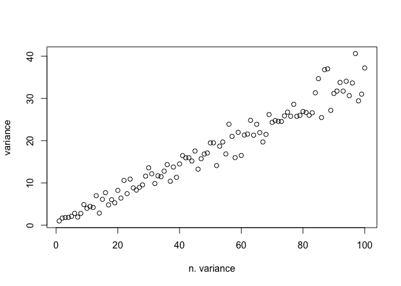
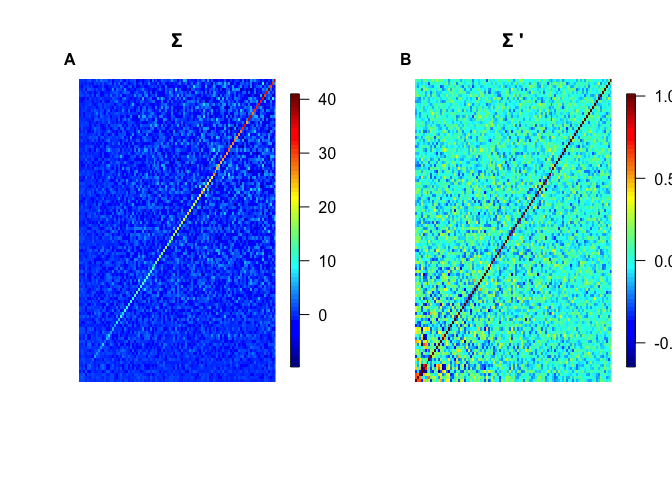
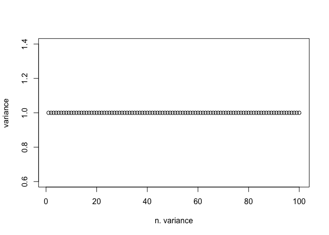
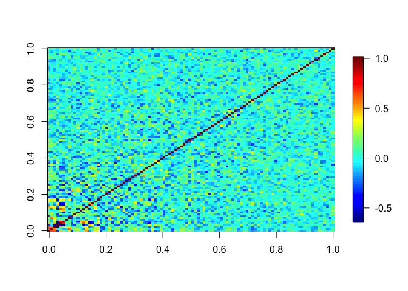
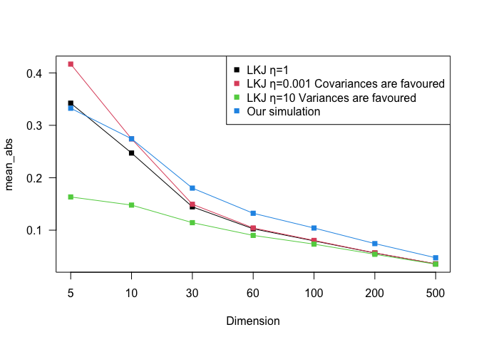

## Our simulation

```r
# Our simulation
sample_cov = function(n) {
  cov = diag(0, n)
  cov[lower.tri(cov)] = runif(n*(n-1)/2, -1,1)
  diag(cov) = 1
  cov = cov %*% t(cov)
  return(cov)
}
```

Problem - variances are accumulating:

```r
set.seed(42)
cov = sample_cov(100)
plot(y=diag(cov),x=1:100, xlab = "n. variance", ylab = "variance")
```

<!-- -->

```r
par(mfrow = c(1,2))
fields::image.plot(cov, axes=FALSE, main  = "\U03A3")
text(-0.05, 1.07, xpd = NA, labels = "A", font = 2)
fields::image.plot(cov2cor(cov), axes=FALSE, main  = "\U03A3 '")
text(-0.05, 1.07, xpd = NA, labels = "B", font = 2)
```

<!-- -->


```r
par(mfrow = c(1,1))
mean(sapply(1:1000, function(i) mean(cov2cor(sample_cov(100))[lower.tri(diag(100), diag = FALSE)]  )))
```

```
## [1] -6.426132e-05
```


But we are working with the normalized covariance matrices, variances will be scaled to 1:

```r
corr = cov2cor(cov)
plot(y=diag(corr),x=1:100, xlab = "n. variance", ylab = "variance")
```

<!-- -->


```r
fields::image.plot(corr)
```

<!-- -->

## Problem of covariance matrices:
We will use the LKJ distribution to sample correlation matrices. The LKJ distribution is useful since it allows to change the weighting between covariances to the variances (see https://distribution-explorer.github.io/multivariate_continuous/lkj.html):

* eta == 1 the density is uniform over all entries of the correlation matrix
* eta < 1 diagonal is weak and correlations are favoured
* eta > 1 diagonal is favoured


```r
mean_abs = function(S) mean(abs(S[lower.tri(S, diag = FALSE)]))

n = 5
mean(apply(trialr::rlkjcorr(1000,K = n, eta = 1.0 ), 1, mean_abs))
```

```
## [1] 0.3383647
```

```r
mean(apply(trialr::rlkjcorr(1000,K = n, eta = 0.001 ), 1, mean_abs))
```

```
## [1] 0.4214647
```

```r
mean(apply(trialr::rlkjcorr(1000,K = n, eta = 10 ), 1, mean_abs))
```

```
## [1] 0.1639963
```

As a function of n:

```r
set.seed(42)
results = 
  sapply(c(5, 10, 30, 60, 100, 200, 500), function(n) {
    return(c(
      mean(apply(trialr::rlkjcorr(500,K = n, eta = 1.0 ), 1, mean_abs)),
      mean(apply(trialr::rlkjcorr(500,K = n, eta = 0.001 ), 1, mean_abs)),
      mean(apply(trialr::rlkjcorr(500,K = n, eta = 10 ), 1, mean_abs)),
      mean(sapply(5:100, function(i) mean_abs(cov2cor(sample_cov(n)))))
    )
    )
  })

matplot(t(results), type = "o", xaxt="n", col = 1:4, xlab = "Dimension", ylab = "mean_abs", lty = 1, pch = 15, las = 1)
axis(1,at = 1:7, labels = c(5, 10, 30, 60, 100, 200, 500))
legend("topright", legend = c("LKJ \U03B7=1", "LKJ \U03B7=0.001 Covariances are favoured", "LKJ \U03B7=10 Variances are favoured", "Our simulation"), col = 1:4, pch = 15)
```

<!-- -->
