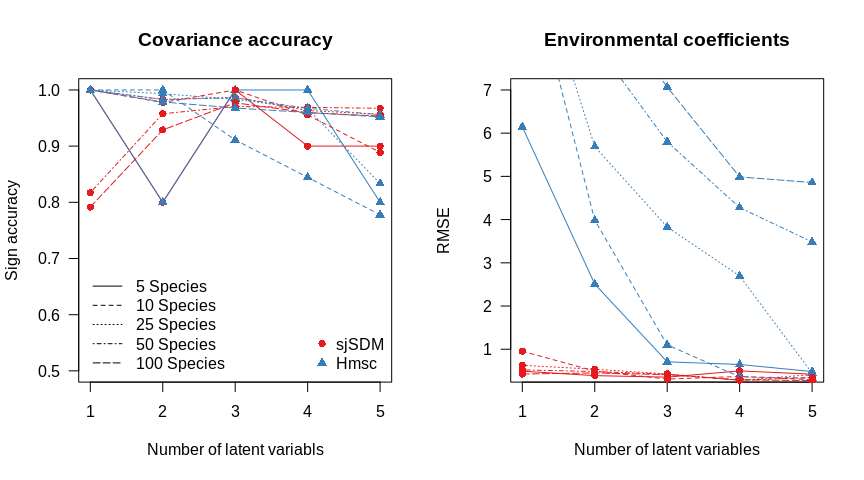

## Simulation based on LVM

```r
set.seed(42)
library(sjSDM)
library(Hmsc)
```

```
## Loading required package: coda
```

```r
library(snow)

create = function(env = 5L, n = 100L, sp = 50L, l = 5L) {
  E = matrix(runif(env*n,-1,1), n, env) # environment
  SPW = matrix(rnorm(sp*env), env, sp) # species weights
  
  L = matrix(rnorm(l*n), n, l) # latent variables
  SPL = matrix(rnorm(l*sp), l, sp) # Factor loadings
  
  Y = E %*% SPW + L %*% SPL
  Occ = ifelse(Y > 0, 1, 0)
  
  sigma =  t(SPL) %*% SPL
  
  corr_acc = function(cor) {
    ind = lower.tri(sigma)
    true = sigma[ind]
    pred = cor[ind]
    d = sum((true < 0) == (pred < 0))
    return(d/sum(lower.tri(sigma)))
  }
  return(list(Y=Occ, X = E, L = L, SPL = SPL, SPW = SPW, sigma =  sigma, corr_acc = corr_acc))
}
```


## 1. Test: 5 species, 3 env covariates, 500 sites, 1 - 5 latent variables

```r
data = lapply(1:5, function(l) create(env = 3L, n = 500L, sp = 5L, l = l))
results_1 = matrix(NA, 5, 5) # for acc/rmse/acc/rmse/n_latent
for(i in 1:5) {
  sjSDM = sjSDM(data[[i]]$X, data[[i]]$Y, formula = ~0+., step_size = 20L, iter = 100L, device = 0L, sampling = 500L, learning_rate = 0.005)
  sp_sjSDM = getCov(sjSDM)
  results_1[i,1] = data[[i]]$corr_acc(sp_sjSDM)
  results_1[i,2] = sqrt(mean(as.vector(coef(sjSDM)[[1]] - data[[i]]$SPW)^2))
}


cl = snow::makeCluster(5L)
snow::clusterExport(cl, list("data"))
snow::clusterEvalQ(cl, {
  library(Hmsc)
  OpenMPController::omp_set_num_threads(6L)
  RhpcBLASctl::omp_set_num_threads(6L)
  RhpcBLASctl::blas_set_num_threads(6L)
  })
```

```
## [[1]]
## NULL
## 
## [[2]]
## NULL
## 
## [[3]]
## NULL
## 
## [[4]]
## NULL
## 
## [[5]]
## NULL
```

```r
hmsc_res = 
  snow::parLapply(cl, 1:5, function(i) {
  
    hmsc = list()
    studyDesign = data.frame(sample = as.factor(1:nrow(data[[i]]$Y)))
    rL = HmscRandomLevel(units = studyDesign$sample)
    model = Hmsc(Y = data[[i]]$Y, XData = data.frame(data[[i]]$X), XFormula = ~0 + .,
                 studyDesign = studyDesign, ranLevels = list(sample = rL), distr = "probit")
    model = sampleMcmc(model, thin = 50, samples = 500, transient = 100,verbose = 5000,
                       nChains = 1L) # 50,000 iterations
    correlation = computeAssociations(model)[[1]]$mean
    beta = Hmsc::getPostEstimate(model, "Beta")$mean
    return(c(data[[i]]$corr_acc(correlation),sqrt(mean(as.vector(beta - data[[i]]$SPW)^2)) ,dim(Hmsc::getPostEstimate(model, "Lambda")$mean)[1]))

})

snow::stopCluster(cl)
results_1[,3:5] = abind::abind(hmsc_res, along = 0L)
```


## 2. Test: 10 species, 3 env covariates, 500 sites, 1 - 5 latent variables

```r
data = lapply(1:5, function(l) create(env = 3L, n = 500L, sp = 10L, l = l))
results_2 = matrix(NA, 5, 5) # for acc/rmse/acc/rmse/n_latent
for(i in 1:5) {
  sjSDM = sjSDM(data[[i]]$X, data[[i]]$Y, formula = ~0+., step_size = 20L, iter = 100L, device = 0L, sampling = 500L, learning_rate = 0.005)
  sp_sjSDM = getCov(sjSDM)
  results_2[i,1] = data[[i]]$corr_acc(sp_sjSDM)
  results_2[i,2] = sqrt(mean(as.vector(coef(sjSDM)[[1]] - data[[i]]$SPW)^2))
}

cl = snow::makeCluster(5L)
snow::clusterExport(cl, list("data"))
snow::clusterEvalQ(cl, {
  library(Hmsc)
  OpenMPController::omp_set_num_threads(6L)
  RhpcBLASctl::omp_set_num_threads(6L)
  RhpcBLASctl::blas_set_num_threads(6L)
  })
```

```
## [[1]]
## NULL
## 
## [[2]]
## NULL
## 
## [[3]]
## NULL
## 
## [[4]]
## NULL
## 
## [[5]]
## NULL
```

```r
hmsc_res = 
  snow::parLapply(cl, 1:5, function(i) {
  
    hmsc = list()
    studyDesign = data.frame(sample = as.factor(1:nrow(data[[i]]$Y)))
    rL = HmscRandomLevel(units = studyDesign$sample)
    model = Hmsc(Y = data[[i]]$Y, XData = data.frame(data[[i]]$X), XFormula = ~0 + .,
                 studyDesign = studyDesign, ranLevels = list(sample = rL), distr = "probit")
    model = sampleMcmc(model, thin = 50, samples = 500, transient = 100,verbose = 5000,
                       nChains = 1L) # 50,000 iterations
    correlation = computeAssociations(model)[[1]]$mean
    beta = Hmsc::getPostEstimate(model, "Beta")$mean
    return(c(data[[i]]$corr_acc(correlation),sqrt(mean(as.vector(beta - data[[i]]$SPW)^2)) ,dim(Hmsc::getPostEstimate(model, "Lambda")$mean)[1]))

})
snow::stopCluster(cl)
results_2[,3:5] = abind::abind(hmsc_res, along = 0L)
```


## 3. Test: 25 species, 3 env covariates, 500 sites, 1 - 5 latent variables

```r
data = lapply(1:5, function(l) create(env = 3L, n = 500L, sp = 25L, l = l))
results_3 = matrix(NA, 5, 5) # for acc/rmse/acc/rmse/n_latent
for(i in 1:5) {
  sjSDM = sjSDM(data[[i]]$X, data[[i]]$Y, formula = ~0+., step_size = 20L, iter = 100L, device = 0L, sampling = 500L, learning_rate = 0.005)
  sp_sjSDM = getCov(sjSDM)
  results_3[i,1] = data[[i]]$corr_acc(sp_sjSDM)
  results_3[i,2] = sqrt(mean(as.vector(coef(sjSDM)[[1]] - data[[i]]$SPW)^2))
}


cl = snow::makeCluster(5L)
snow::clusterExport(cl, list("data"))
snow::clusterEvalQ(cl, {
  library(Hmsc)
  OpenMPController::omp_set_num_threads(6L)
  RhpcBLASctl::omp_set_num_threads(6L)
  RhpcBLASctl::blas_set_num_threads(6L)
  })
```

```
## [[1]]
## NULL
## 
## [[2]]
## NULL
## 
## [[3]]
## NULL
## 
## [[4]]
## NULL
## 
## [[5]]
## NULL
```

```r
hmsc_res = 
  snow::parLapply(cl, 1:5, function(i) {
  
    hmsc = list()
    studyDesign = data.frame(sample = as.factor(1:nrow(data[[i]]$Y)))
    rL = HmscRandomLevel(units = studyDesign$sample)
    model = Hmsc(Y = data[[i]]$Y, XData = data.frame(data[[i]]$X), XFormula = ~0 + .,
                 studyDesign = studyDesign, ranLevels = list(sample = rL), distr = "probit")
    model = sampleMcmc(model, thin = 50, samples = 500, transient = 100,verbose = 5000,
                       nChains = 1L) # 50,000 iterations
    correlation = computeAssociations(model)[[1]]$mean
    beta = Hmsc::getPostEstimate(model, "Beta")$mean
    return(c(data[[i]]$corr_acc(correlation),sqrt(mean(as.vector(beta - data[[i]]$SPW)^2)) ,dim(Hmsc::getPostEstimate(model, "Lambda")$mean)[1]))

})
snow::stopCluster(cl)
results_3[,3:5] = abind::abind(hmsc_res, along = 0L)
```


## 4. Test: 50 species, 3 env covariates, 500 sites, 1 - 5 latent variables

```r
data = lapply(1:5, function(l) create(env = 3L, n = 500L, sp = 50L, l = l))
results_4 = matrix(NA, 5, 5) # for acc/rmse/acc/rmse/n_latent
for(i in 1:5) {
  sjSDM = sjSDM(data[[i]]$X, data[[i]]$Y, formula = ~0+., step_size = 20L, iter = 100L, device = 0L, sampling = 500L, learning_rate = 0.005)
  sp_sjSDM = getCov(sjSDM)
  results_4[i,1] = data[[i]]$corr_acc(sp_sjSDM)
  results_4[i,2] = sqrt(mean(as.vector(coef(sjSDM)[[1]] - data[[i]]$SPW)^2))
}


cl = snow::makeCluster(5L)
snow::clusterExport(cl, list("data"))
snow::clusterEvalQ(cl, {
  library(Hmsc)
  OpenMPController::omp_set_num_threads(6L)
  RhpcBLASctl::omp_set_num_threads(6L)
  RhpcBLASctl::blas_set_num_threads(6L)
  })
```

```
## [[1]]
## NULL
## 
## [[2]]
## NULL
## 
## [[3]]
## NULL
## 
## [[4]]
## NULL
## 
## [[5]]
## NULL
```

```r
hmsc_res = 
  snow::parLapply(cl, 1:5, function(i) {
  
    hmsc = list()
    studyDesign = data.frame(sample = as.factor(1:nrow(data[[i]]$Y)))
    rL = HmscRandomLevel(units = studyDesign$sample)
    model = Hmsc(Y = data[[i]]$Y, XData = data.frame(data[[i]]$X), XFormula = ~0 + .,
                 studyDesign = studyDesign, ranLevels = list(sample = rL), distr = "probit")
    model = sampleMcmc(model, thin = 50, samples = 500, transient = 100,verbose = 5000,
                       nChains = 1L) # 50,000 iterations
    correlation = computeAssociations(model)[[1]]$mean
    beta = Hmsc::getPostEstimate(model, "Beta")$mean
    return(c(data[[i]]$corr_acc(correlation),sqrt(mean(as.vector(beta - data[[i]]$SPW)^2)) ,dim(Hmsc::getPostEstimate(model, "Lambda")$mean)[1]))

})
snow::stopCluster(cl)
results_4[,3:5] = abind::abind(hmsc_res, along = 0L)
```


## 5. Test: 100 species, 3 env covariates, 500 sites, 1 - 5 latent variables

```r
data = lapply(1:5, function(l) create(env = 3L, n = 500L, sp = 100L, l = l))
results_5 = matrix(NA, 5, 5) # for acc/rmse/acc/rmse/n_latent
for(i in 1:5) {
  sjSDM = sjSDM(data[[i]]$X, data[[i]]$Y, formula = ~0+., step_size = 20L, iter = 100L, device = 0L, sampling = 500L, learning_rate = 0.005)
  sp_sjSDM = getCov(sjSDM)
  results_5[i,1] = data[[i]]$corr_acc(sp_sjSDM)
  results_5[i,2] = sqrt(mean(as.vector(coef(sjSDM)[[1]] - data[[i]]$SPW)^2))
}


cl = snow::makeCluster(5L)
snow::clusterExport(cl, list("data"))
snow::clusterEvalQ(cl, {
  library(Hmsc)
  OpenMPController::omp_set_num_threads(6L)
  RhpcBLASctl::omp_set_num_threads(6L)
  RhpcBLASctl::blas_set_num_threads(6L)
  })
```

```
## [[1]]
## NULL
## 
## [[2]]
## NULL
## 
## [[3]]
## NULL
## 
## [[4]]
## NULL
## 
## [[5]]
## NULL
```

```r
hmsc_res = 
  snow::parLapply(cl, 1:5, function(i) {
  
    hmsc = list()
    studyDesign = data.frame(sample = as.factor(1:nrow(data[[i]]$Y)))
    rL = HmscRandomLevel(units = studyDesign$sample)
    model = Hmsc(Y = data[[i]]$Y, XData = data.frame(data[[i]]$X), XFormula = ~0 + .,
                 studyDesign = studyDesign, ranLevels = list(sample = rL), distr = "probit")
    model = sampleMcmc(model, thin = 50, samples = 500, transient = 100,verbose = 5000,
                       nChains = 1L) # 50,000 iterations
    correlation = computeAssociations(model)[[1]]$mean
    beta = Hmsc::getPostEstimate(model, "Beta")$mean
    return(c(data[[i]]$corr_acc(correlation),sqrt(mean(as.vector(beta - data[[i]]$SPW)^2)) ,dim(Hmsc::getPostEstimate(model, "Lambda")$mean)[1]))

})
snow::stopCluster(cl)
results_5[,3:5] = abind::abind(hmsc_res, along = 0L)
```


## Results

```r
par(mfrow = c(1,2))
cols = RColorBrewer::brewer.pal(3, "Set1")[1:2]
plot(NULL, NULL, xlim = c(1, 5), ylim = c(0.5, 1.0), 
     las = 1, xlab = "Number of latent variabls", ylab = "Sign accuracy",
     main = "Covariance accuracy")
matpoints(1:5, results_1[,c(1, 3)], type = "o", lty = 1, pch = c(16, 17), col = cols)
matpoints(1:5, results_2[,c(1, 3)], type = "o", lty = 2, pch = c(16, 17), col = cols)
matpoints(1:5, results_3[,c(1, 3)], type = "o", lty = 3, pch = c(16, 17), col = cols)
matpoints(1:5, results_4[,c(1, 3)], type = "o", lty = 4, pch = c(16, 17), col = cols)
matpoints(1:5, results_5[,c(1, 3)], type = "o", lty = 5, pch = c(16, 17), col = cols)
legend("bottomright", legend = c("sjSDM", "Hmsc"), col = cols, pch = c(16,17), bty = "n")
legend("bottomleft", legend = paste0(c(5, 10, 25, 50, 100), " Species"), lty = 1:5, bty = "n")


plot(NULL, NULL, xlim = c(1, 5), ylim = c(0.5, 7.0), 
     las = 1, xlab = "Number of latent variables", ylab = "RMSE", 
     main = "Environmental coefficients")
matpoints(1:5, results_1[,c(2, 4)], type = "o", lty = 1, pch = c(16, 17), col = cols)
matpoints(1:5, results_2[,c(2, 4)], type = "o", lty = 2, pch = c(16, 17), col = cols)
matpoints(1:5, results_3[,c(2, 4)], type = "o", lty = 3, pch = c(16, 17), col = cols)
matpoints(1:5, results_4[,c(2, 4)], type = "o", lty = 4, pch = c(16, 17), col = cols)
matpoints(1:5, results_5[,c(2, 4)], type = "o", lty = 5, pch = c(16, 17), col = cols)
```

<!-- -->

```r
#legend("bottomright", legend = c("sjSDM", "Hmsc"), col = cols, pch = c(16,17), bty = "n")
#legend("bottomleft", legend = paste0(c(5, 10, 25, 50, 100), " Species"), lty = 1:5, bty = "n")
```


