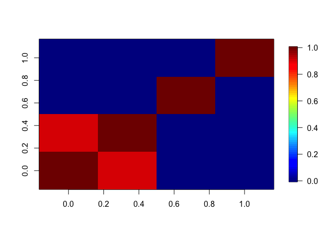
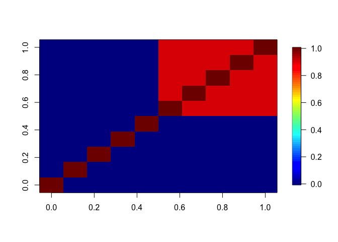

# Internal structure simulations

- [<span class="toc-section-number">1</span> Internal community stucture
  simulations](#internal-community-stucture-simulations)
- [<span class="toc-section-number">2</span> No effects, simple
  Sigma](#no-effects-simple-sigma)
- [<span class="toc-section-number">3</span> With environmental effects
  and more covariance
  structure](#with-environmental-effects-and-more-covariance-structure)
- [<span class="toc-section-number">4</span> With environmental and
  spatial effects and complex covariance
  structure](#with-environmental-and-spatial-effects-and-complex-covariance-structure)
- [<span class="toc-section-number">5</span> Compare spatial DNN with
  spatial LM](#compare-spatial-dnn-with-spatial-lm)

## Internal community stucture simulations

``` r
library(sjSDM)
set.seed(42)
```

## No effects, simple Sigma

``` r
set.seed(42)
SP = 4
Sigma = diag(1.0, SP)
diag(Sigma) = 1.0
Sigma[2,1] = Sigma[1,2] = 0.9
beta = c(rep(0, 4))
Env = rnorm(1000)
Y = 1*((Env %*% t(beta) + mvtnorm::rmvnorm(1000, sigma = Sigma))>0)
XY = matrix(rnorm(2000), 1000, 2)

fields::image.plot(Sigma)
```



``` r
model = sjSDM(Y = Y, 
              env = linear(matrix(Env, ncol = 1L)), 
              spatial = linear(XY, ~0+X1:X2),
              iter = 50L)
an = anova(model)
p = plot(an, internal = TRUE, suppress_plotting = TRUE)
p_shared = plot(an, internal = TRUE, add_shared = TRUE, suppress_plotting = TRUE)
```


<div id="tbl-Table_1">

| env | spa |    codist |        r2 |
|----:|----:|----------:|----------:|
|   0 |   0 | 0.1761695 | 0.0448254 |
|   0 |   0 | 0.1753114 | 0.0444161 |
|   0 |   0 | 0.0004914 | 0.0000176 |
|   0 |   0 | 0.0013014 | 0.0005889 |

**Table ** 1: Without shared components

</div>

<div id="tbl-Table_2">

|       env |       spa |    codist |        r2 |
|----------:|----------:|----------:|----------:|
| 0.0008834 | 0.0021586 | 0.1762598 | 0.0448254 |
| 0.0007792 | 0.0015102 | 0.1753751 | 0.0444161 |
| 0.0000000 | 0.0000000 | 0.0015168 | 0.0000176 |
| 0.0000000 | 0.0000000 | 0.0027183 | 0.0005889 |

**Table ** 2: With shared components

</div>

## With environmental effects and more covariance structure

First five species only affected by environment, last 5 species with
weak environment and strong biotic components.

``` r
SP = 10
Sigma = diag(1.0, SP)
Sigma[] = 0.9
Sigma[1:5,] = Sigma[,1:5] = 0.0
diag(Sigma) = 1.0
fields::image.plot(Sigma)
beta = c(rep(1.5, 5), rep(0.3, 5))
Env = rnorm(500)
XY = matrix(rnorm(1000), 500, 2)
betaSP = rep(0.0, SP)
Y = 1*((Env %*% t(beta) + (XY[,1,drop=FALSE]*XY[,2,drop=FALSE]) %*% t(betaSP) +  mvtnorm::rmvnorm(500, sigma = Sigma))>0)
```



``` r
model = sjSDM(Y = Y, 
              env = linear(matrix(Env, ncol = 1L)), 
              spatial = linear(XY, ~0+X1:X2),
              iter = 100L)
an = anova(model)
p = plot(an, internal = TRUE, suppress_plotting = TRUE)
p_shared = plot(an, internal = TRUE, add_shared = TRUE, suppress_plotting = TRUE)
```


<div id="tbl-Table_3">

|       env | spa |    codist |        r2 |
|----------:|----:|----------:|----------:|
| 0.4665686 |   0 | 0.1791394 | 0.0342308 |
| 0.3877278 |   0 | 0.1521604 | 0.0297147 |
| 0.5096397 |   0 | 0.2124076 | 0.0366134 |
| 0.4495894 |   0 | 0.1691498 | 0.0336973 |
| 0.4653261 |   0 | 0.1622529 | 0.0353322 |
| 0.0000000 |   0 | 0.4434393 | 0.0518054 |
| 0.0000000 |   0 | 0.3700527 | 0.0446451 |
| 0.0000000 |   0 | 0.4117453 | 0.0488475 |
| 0.0000000 |   0 | 0.4588468 | 0.0533456 |
| 0.0000000 |   0 | 0.3807095 | 0.0457305 |

**Table ** 3: Without shared components

</div>

<div id="tbl-Table_4">

|       env |       spa |    codist |        r2 |
|----------:|----------:|----------:|----------:|
| 0.3232671 | 0.0000000 | 0.0214747 | 0.0342308 |
| 0.2946771 | 0.0000000 | 0.0061794 | 0.0297147 |
| 0.3330089 | 0.0085972 | 0.0245278 | 0.0366134 |
| 0.3286406 | 0.0055311 | 0.0028015 | 0.0336973 |
| 0.3526370 | 0.0064582 | 0.0000000 | 0.0353322 |
| 0.0562483 | 0.0037781 | 0.4580275 | 0.0518054 |
| 0.0641689 | 0.0000000 | 0.3872695 | 0.0446451 |
| 0.0592633 | 0.0025998 | 0.4266114 | 0.0488475 |
| 0.0633973 | 0.0000000 | 0.4781277 | 0.0533456 |
| 0.0597806 | 0.0024759 | 0.3950483 | 0.0457305 |

**Table ** 4: With shared components

</div>

Separation is better with shared components?

## With environmental and spatial effects and complex covariance structure

First five species only affected by environment, last 5 species with
weak environment and strong biotic components. Species are alternately
affected by space:

``` r
SP = 10
Sigma = diag(1.0, SP)
Sigma[] = 0.9
Sigma[1:5,] = Sigma[,1:5] = 0.0
diag(Sigma) = 1.0
fields::image.plot(Sigma)
beta = c(rep(1.5, 5), rep(0.3, 5))
Env = rnorm(500)
XY = matrix(rnorm(1000), 500, 2)
betaSP = rep(c(0.1, 1.0), SP/2)
Y = 1*((Env %*% t(beta) + (XY[,1,drop=FALSE]*XY[,2,drop=FALSE]) %*% t(betaSP) +  mvtnorm::rmvnorm(500, sigma = Sigma))>0)
```


``` r
model = sjSDM(Y = Y, 
              env = linear(matrix(Env, ncol = 1L)), 
              spatial = linear(XY, ~0+X1:X2),
              iter = 100L)
an = anova(model)
p = plot(an, internal = TRUE, suppress_plotting = TRUE)
p_shared = plot(an, internal = TRUE, add_shared = TRUE, suppress_plotting = TRUE)
```


<div id="tbl-Table_5">

|       env |       spa |    codist |        r2 |
|----------:|----------:|----------:|----------:|
| 0.5227611 | 0.0000000 | 0.1988358 | 0.0392807 |
| 0.4091551 | 0.1411080 | 0.2120520 | 0.0437116 |
| 0.4540337 | 0.0000000 | 0.1869507 | 0.0316424 |
| 0.3390960 | 0.1909112 | 0.1732007 | 0.0390814 |
| 0.5492124 | 0.0000000 | 0.1953696 | 0.0400878 |
| 0.0000000 | 0.4120416 | 0.3807391 | 0.0523718 |
| 0.0000000 | 0.0000000 | 0.2992488 | 0.0421489 |
| 0.0000000 | 0.4746443 | 0.3916816 | 0.0549159 |
| 0.0000000 | 0.0000000 | 0.3075931 | 0.0449504 |
| 0.0000000 | 0.4497175 | 0.3977108 | 0.0546825 |

**Table ** 5: Without shared components

</div>

<div id="tbl-Table_6">

|       env |       spa |    codist |        r2 |
|----------:|----------:|----------:|----------:|
| 0.4395647 | 0.0000000 | 0.0000000 | 0.0392807 |
| 0.3075167 | 0.1190831 | 0.0105166 | 0.0437116 |
| 0.3276045 | 0.0000000 | 0.0000000 | 0.0316424 |
| 0.2649583 | 0.1372533 | 0.0000000 | 0.0390814 |
| 0.4383763 | 0.0000000 | 0.0000000 | 0.0400878 |
| 0.0532423 | 0.1084836 | 0.3619917 | 0.0523718 |
| 0.0474019 | 0.0250121 | 0.3490753 | 0.0421489 |
| 0.0477960 | 0.1431122 | 0.3582512 | 0.0549159 |
| 0.0501953 | 0.0461073 | 0.3532019 | 0.0449504 |
| 0.0497297 | 0.1179067 | 0.3791888 | 0.0546825 |

**Table ** 6: With shared components

</div>

Again it seems that the shared components improve the separation!

## Compare spatial DNN with spatial LM

First five species only affected by environment, last 5 species with
weak environment and strong biotic components. Species are alternately
affected by space.

Space is modelled by DNN:

``` r
SP = 10
Sigma = diag(1.0, SP)
Sigma[] = 0.9
Sigma[1:5,] = Sigma[,1:5] = 0.0
diag(Sigma) = 1.0
fields::image.plot(Sigma)
beta = c(rep(1.5, 5), rep(0.3, 5))
Env = rnorm(500)
XY = matrix(rnorm(1000), 500, 2)
betaSP = rep(c(0.1, 1.0), SP/2)
Y = 1*((Env %*% t(beta) + (XY[,1,drop=FALSE]*XY[,2,drop=FALSE]) %*% t(betaSP) +  mvtnorm::rmvnorm(500, sigma = Sigma))>0)
```


``` r
model1 = sjSDM(Y = Y, 
              env = linear(matrix(Env, ncol = 1L)), 
              spatial = linear(XY, ~0+X1:X2),
              iter = 100L)
model2 = sjSDM(Y = Y, 
              env = linear(matrix(Env, ncol = 1L)), 
              spatial = DNN(XY, ~0+.),
              iter = 100L)
an1 = anova(model1)
an2 = anova(model2)
p_shared1 = plot(an1, internal = TRUE, add_shared = TRUE, suppress_plotting = TRUE)
p_shared2 = plot(an2, internal = TRUE, add_shared = TRUE, suppress_plotting = TRUE)
```


<div id="tbl-Table_7">

|       env |       spa |    codist |        r2 |
|----------:|----------:|----------:|----------:|
| 0.4372748 | 0.0247636 | 0.0000000 | 0.0417753 |
| 0.3362860 | 0.0988199 | 0.0072826 | 0.0442389 |
| 0.4132229 | 0.0289465 | 0.0000000 | 0.0401990 |
| 0.2664355 | 0.0897801 | 0.0388852 | 0.0395101 |
| 0.3952494 | 0.0235980 | 0.0000000 | 0.0403231 |
| 0.0629600 | 0.0546735 | 0.4232841 | 0.0540918 |
| 0.0652208 | 0.0646138 | 0.4090561 | 0.0538891 |
| 0.0674062 | 0.0424071 | 0.4842902 | 0.0594104 |
| 0.0693549 | 0.0777532 | 0.3765868 | 0.0523695 |
| 0.0634808 | 0.0451195 | 0.4548383 | 0.0563439 |

**Table ** 7: Spatial LM (with shared components)

</div>

<div id="tbl-Table_8">

|       env |       spa |    codist |        r2 |
|----------:|----------:|----------:|----------:|
| 0.4105571 | 0.0641607 | 0.0000000 | 0.0433522 |
| 0.3197047 | 0.1217521 | 0.0036632 | 0.0445120 |
| 0.3780574 | 0.0592489 | 0.0000000 | 0.0408626 |
| 0.2651454 | 0.1133723 | 0.0334874 | 0.0412005 |
| 0.3553742 | 0.0569782 | 0.0000000 | 0.0409608 |
| 0.0639390 | 0.0321170 | 0.4494286 | 0.0545485 |
| 0.0766552 | 0.1012314 | 0.3867603 | 0.0564647 |
| 0.0717839 | 0.0321308 | 0.4992239 | 0.0603139 |
| 0.0662334 | 0.1060074 | 0.3679576 | 0.0540198 |
| 0.0728825 | 0.0335921 | 0.4793308 | 0.0585805 |

**Table ** 8: Spatial DNN (with shared components)

</div>

Almost identical! Which is good.
