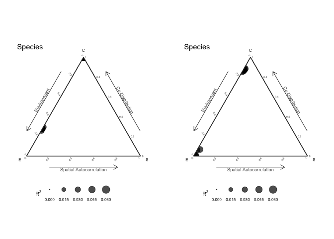
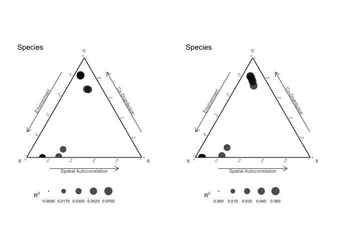

# Internal structure simulations

- [<span class="toc-section-number">0.1</span> Internal community
  stucture simulations](#internal-community-stucture-simulations)
- [<span class="toc-section-number">0.2</span> No effects, simple
  Sigma](#no-effects-simple-sigma)
- [<span class="toc-section-number">1</span> With environmental effects
  and more covariance
  structure](#with-environmental-effects-and-more-covariance-structure)
- [<span class="toc-section-number">2</span> With environmental and
  spatial effects and complex covariance
  structure](#with-environmental-and-spatial-effects-and-complex-covariance-structure)
  - [<span class="toc-section-number">2.1</span> Compare spatial DNN
    with spatial LM](#compare-spatial-dnn-with-spatial-lm)

## Internal community stucture simulations

``` r
library(sjSDM)
set.seed(42)
```

## No effects, simple Sigma

``` r
set.seed(42)
SP = 4
Sigma = diag(1.0, SP)
diag(Sigma) = 1.0
Sigma[2,1] = Sigma[1,2] = 0.9
beta = c(rep(0, 4))
Env = rnorm(1000)
Y = 1*((Env %*% t(beta) + mvtnorm::rmvnorm(1000, sigma = Sigma))>0)
XY = matrix(rnorm(2000), 1000, 2)

fields::image.plot(Sigma)
```


``` r
model = sjSDM(Y = Y, 
              env = linear(matrix(Env, ncol = 1L)), 
              spatial = linear(XY, ~0+X1:X2),
              iter = 50L)
an = anova(model)
p = plot(an, internal = TRUE, suppress_plotting = TRUE)
p_shared = plot(an, internal = TRUE, add_shared = TRUE, suppress_plotting = TRUE)
```


<div id="tbl-Table_1">

| env | spa |    codist |        r2 |
|----:|----:|----------:|----------:|
|   0 |   0 | 0.1753416 | 0.0447588 |
|   0 |   0 | 0.1748078 | 0.0447549 |
|   0 |   0 | 0.0000000 | 0.0000000 |
|   0 |   0 | 0.0000000 | 0.0000000 |

**Table ** 1: Without shared components

</div>

<div id="tbl-Table_2">

|       env |       spa |    codist |        r2 |
|----------:|----------:|----------:|----------:|
| 0.0000572 | 0.0035874 | 0.1753907 | 0.0447588 |
| 0.0012862 | 0.0028264 | 0.1749068 | 0.0447549 |
| 0.0000000 | 0.0000000 | 0.0000000 | 0.0000000 |
| 0.0000000 | 0.0000000 | 0.0000000 | 0.0000000 |

**Table ** 2: With shared components

</div>

# With environmental effects and more covariance structure

First five species only affected by environment, last 5 species with
weak environment and strong biotic components.

``` r
SP = 10
Sigma = diag(1.0, SP)
Sigma[] = 0.9
Sigma[1:5,] = Sigma[,1:5] = 0.0
diag(Sigma) = 1.0
fields::image.plot(Sigma)
```


``` r
beta = c(rep(1.5, 5), rep(0.3, 5))
Env = rnorm(500)
XY = matrix(rnorm(1000), 500, 2)
betaSP = rep(0.0, SP)
Y = 1*((Env %*% t(beta) + (XY[,1,drop=FALSE]*XY[,2,drop=FALSE]) %*% t(betaSP) +  mvtnorm::rmvnorm(500, sigma = Sigma))>0)
```

``` r
model = sjSDM(Y = Y, 
              env = linear(matrix(Env, ncol = 1L)), 
              spatial = linear(XY, ~0+X1:X2),
              iter = 100L)
an = anova(model)
p = plot(an, internal = TRUE, suppress_plotting = TRUE)
p_shared = plot(an, internal = TRUE, add_shared = TRUE, suppress_plotting = TRUE)
```



<div id="tbl-Table_3">

|       env | spa |    codist |        r2 |
|----------:|----:|----------:|----------:|
| 0.4733254 |   0 | 0.1886995 | 0.0337322 |
| 0.4066332 |   0 | 0.1565060 | 0.0297853 |
| 0.5170326 |   0 | 0.2190061 | 0.0360090 |
| 0.4452065 |   0 | 0.1795242 | 0.0331569 |
| 0.4734460 |   0 | 0.1839748 | 0.0349082 |
| 0.0000000 |   0 | 0.4318212 | 0.0517073 |
| 0.0000000 |   0 | 0.3708140 | 0.0445981 |
| 0.0000000 |   0 | 0.4078725 | 0.0488270 |
| 0.0000000 |   0 | 0.4460542 | 0.0538597 |
| 0.0000000 |   0 | 0.3801816 | 0.0460630 |

**Table ** 3: Without shared components

</div>

<div id="tbl-Table_4">

|       env |       spa |    codist |        r2 |
|----------:|----------:|----------:|----------:|
| 0.3245268 | 0.0000000 | 0.0173865 | 0.0337322 |
| 0.2881469 | 0.0036424 | 0.0060641 | 0.0297853 |
| 0.3225137 | 0.0041937 | 0.0333830 | 0.0360090 |
| 0.3330253 | 0.0015053 | 0.0000000 | 0.0331569 |
| 0.3412522 | 0.0000000 | 0.0121657 | 0.0349082 |
| 0.0635773 | 0.0060655 | 0.4474303 | 0.0517073 |
| 0.0630824 | 0.0000000 | 0.3865950 | 0.0445981 |
| 0.0613902 | 0.0011197 | 0.4257604 | 0.0488270 |
| 0.0767704 | 0.0000000 | 0.4654351 | 0.0538597 |
| 0.0588319 | 0.0056812 | 0.3961171 | 0.0460630 |

**Table ** 4: With shared components

</div>

Separation is better with shared components?

# With environmental and spatial effects and complex covariance structure

First five species only affected by environment, last 5 species with
weak environment and strong biotic components. Species are alternately
affected by space:

``` r
SP = 10
Sigma = diag(1.0, SP)
Sigma[] = 0.9
Sigma[1:5,] = Sigma[,1:5] = 0.0
diag(Sigma) = 1.0
fields::image.plot(Sigma)
```


``` r
beta = c(rep(1.5, 5), rep(0.3, 5))
Env = rnorm(500)
XY = matrix(rnorm(1000), 500, 2)
betaSP = rep(c(0.1, 1.0), SP/2)
Y = 1*((Env %*% t(beta) + (XY[,1,drop=FALSE]*XY[,2,drop=FALSE]) %*% t(betaSP) +  mvtnorm::rmvnorm(500, sigma = Sigma))>0)
```

``` r
model = sjSDM(Y = Y, 
              env = linear(matrix(Env, ncol = 1L)), 
              spatial = linear(XY, ~0+X1:X2),
              iter = 100L)
an = anova(model)
p = plot(an, internal = TRUE, suppress_plotting = TRUE)
p_shared = plot(an, internal = TRUE, add_shared = TRUE, suppress_plotting = TRUE)
```


<div id="tbl-Table_5">

|       env |       spa |    codist |        r2 |
|----------:|----------:|----------:|----------:|
| 0.6377084 | 0.1318126 | 0.2057177 | 0.0390723 |
| 0.4742563 | 0.0255669 | 0.2219989 | 0.0431509 |
| 0.5060734 | 0.1215719 | 0.1966045 | 0.0325156 |
| 0.3761549 | 0.0284531 | 0.1656890 | 0.0387106 |
| 0.6778774 | 0.1264650 | 0.1983724 | 0.0406517 |
| 0.0000000 | 0.0000000 | 0.3788255 | 0.0515104 |
| 0.0000000 | 0.1110295 | 0.2972299 | 0.0423107 |
| 0.0000000 | 0.0000000 | 0.3806033 | 0.0544251 |
| 0.0000000 | 0.1271844 | 0.3007050 | 0.0451246 |
| 0.0000000 | 0.0000000 | 0.4080994 | 0.0556562 |

**Table ** 5: Without shared components

</div>

<div id="tbl-Table_6">

|       env |       spa |    codist |        r2 |
|----------:|----------:|----------:|----------:|
| 0.4906053 | 0.0000000 | 0.0000000 | 0.0390723 |
| 0.3385063 | 0.0706747 | 0.0223275 | 0.0431509 |
| 0.3252466 | 0.0211786 | 0.0000000 | 0.0325156 |
| 0.3059577 | 0.0750721 | 0.0060763 | 0.0387106 |
| 0.5026699 | 0.0018165 | 0.0000000 | 0.0406517 |
| 0.0484478 | 0.0510691 | 0.4155876 | 0.0515104 |
| 0.0406714 | 0.0667112 | 0.3157242 | 0.0423107 |
| 0.0504593 | 0.0688154 | 0.4249766 | 0.0544251 |
| 0.0370693 | 0.0951580 | 0.3190185 | 0.0451246 |
| 0.0457583 | 0.0598593 | 0.4509444 | 0.0556562 |

**Table ** 6: With shared components

</div>

Again it seems that the shared components improve the separation!

## Compare spatial DNN with spatial LM

First five species only affected by environment, last 5 species with
weak environment and strong biotic components. Species are alternately
affected by space.

Space is modelled by DNN:

``` r
SP = 10
Sigma = diag(1.0, SP)
Sigma[] = 0.9
Sigma[1:5,] = Sigma[,1:5] = 0.0
diag(Sigma) = 1.0
fields::image.plot(Sigma)
```


``` r
beta = c(rep(1.5, 5), rep(0.3, 5))
Env = rnorm(500)
XY = matrix(rnorm(1000), 500, 2)
betaSP = rep(c(0.1, 1.0), SP/2)
Y = 1*((Env %*% t(beta) + (XY[,1,drop=FALSE]*XY[,2,drop=FALSE]) %*% t(betaSP) +  mvtnorm::rmvnorm(500, sigma = Sigma))>0)
```

``` r
model1 = sjSDM(Y = Y, 
              env = linear(matrix(Env, ncol = 1L)), 
              spatial = linear(XY, ~0+X1:X2),
              iter = 100L)
model2 = sjSDM(Y = Y, 
              env = linear(matrix(Env, ncol = 1L)), 
              spatial = DNN(XY, ~0+.),
              iter = 100L)
an1 = anova(model1)
an2 = anova(model2)
p_shared1 = plot(an1, internal = TRUE, add_shared = TRUE, suppress_plotting = TRUE)
p_shared2 = plot(an2, internal = TRUE, add_shared = TRUE, suppress_plotting = TRUE)
```



<div id="tbl-Table_7">

|       env |       spa |    codist |        r2 |
|----------:|----------:|----------:|----------:|
| 0.4164076 | 0.0341363 | 0.0000000 | 0.0412707 |
| 0.3167307 | 0.1078550 | 0.0152850 | 0.0439871 |
| 0.3959756 | 0.0319888 | 0.0000000 | 0.0401876 |
| 0.2611597 | 0.0953014 | 0.0397721 | 0.0396233 |
| 0.3769088 | 0.0325229 | 0.0000000 | 0.0401504 |
| 0.0727719 | 0.0416558 | 0.4274674 | 0.0541895 |
| 0.0648574 | 0.0725499 | 0.3987120 | 0.0536119 |
| 0.0741943 | 0.0385433 | 0.4805535 | 0.0593291 |
| 0.0734892 | 0.0824945 | 0.3698992 | 0.0525883 |
| 0.0696143 | 0.0392499 | 0.4577378 | 0.0566602 |

**Table ** 7: Spatial LM (with shared components)

</div>

<div id="tbl-Table_8">

|       env |       spa |    codist |        r2 |
|----------:|----------:|----------:|----------:|
| 0.4724190 | 0.0000000 | 0.0000000 | 0.0419324 |
| 0.3543430 | 0.0881189 | 0.0051575 | 0.0447619 |
| 0.4635433 | 0.0000000 | 0.0000000 | 0.0406817 |
| 0.2565732 | 0.1363117 | 0.0213827 | 0.0414268 |
| 0.4502434 | 0.0000000 | 0.0000000 | 0.0415093 |
| 0.0426363 | 0.1487123 | 0.3595519 | 0.0550900 |
| 0.0671892 | 0.0547652 | 0.4323795 | 0.0554334 |
| 0.0530194 | 0.1152398 | 0.4326049 | 0.0600864 |
| 0.0693376 | 0.0463056 | 0.4204075 | 0.0536051 |
| 0.0416527 | 0.1443847 | 0.3977297 | 0.0583767 |

**Table ** 8: Spatial DNN (with shared components)

</div>

Almost identical! Which is good.
