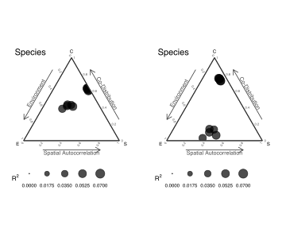

Internal structure simulations
================

- <a href="#internal-community-stucture-simulations"
  id="toc-internal-community-stucture-simulations"><span
  class="toc-section-number">1</span> Internal community stucture
  simulations</a>
- <a href="#no-effects-simple-sigma"
  id="toc-no-effects-simple-sigma"><span
  class="toc-section-number">2</span> No effects, simple Sigma</a>
- <a href="#with-environmental-effects-and-more-species"
  id="toc-with-environmental-effects-and-more-species"><span
  class="toc-section-number">3</span> With environmental effects and more
  species</a>
- <a href="#with-environmental-and-spatial-effects-and-more-species"
  id="toc-with-environmental-and-spatial-effects-and-more-species"><span
  class="toc-section-number">4</span> With environmental and spatial
  effects and more species</a>
- <a href="#compare-spatial-dnn-with-spatial-lm"
  id="toc-compare-spatial-dnn-with-spatial-lm"><span
  class="toc-section-number">5</span> Compare spatial DNN with spatial
  LM</a>

## Internal community stucture simulations

``` r
library(sjSDM)
set.seed(42)
```

## No effects, simple Sigma

No environmental effects, first two species are highly correlated

``` r
set.seed(42)
SP = 4
Sigma = diag(1.0, SP)
diag(Sigma) = 1.0
Sigma[2,1] = Sigma[1,2] = 0.9
beta = c(rep(0, 4))
Env = rnorm(1000)
Y = 1*((Env %*% t(beta) + mvtnorm::rmvnorm(1000, sigma = Sigma))>0)
XY = matrix(rnorm(2000), 1000, 2)

fields::image.plot(Sigma)
```

<figure>

<figcaption aria-hidden="true"><strong>Figure </strong> 1: Covariance
matrix</figcaption>
</figure>

``` r
model = sjSDM(Y = Y,
              env = linear(matrix(Env, ncol = 1L)),
              spatial = linear(XY, ~0+X1:X2),
              iter = 50L)
an = anova(model)
p = plot(an, internal = TRUE, suppress_plotting = TRUE)
p_shared = plot(an, internal = TRUE, add_shared = TRUE, suppress_plotting = TRUE)
```

<figure>

<figcaption aria-hidden="true"><strong>Figure </strong> 2: Internal
structure. Left figure without shared components. Right figure with
shared components.</figcaption>
</figure>

<div id="tbl-Table_1">

|      env |       spa |    codist |        r2 |
|---------:|----------:|----------:|----------:|
| 0.00e+00 | 0.0000000 | 0.1762181 | 0.0448366 |
| 2.34e-03 | 0.0000000 | 0.1764677 | 0.0444008 |
| 4.23e-05 | 0.0000000 | 0.0000000 | 0.0003880 |
| 0.00e+00 | 0.0093771 | 0.0008436 | 0.0008563 |

**Table ** 1: Without shared components

</div>

<div id="tbl-Table_2">

|       env |       spa |    codist |        r2 |
|----------:|----------:|----------:|----------:|
| 0.0006771 | 0.0023979 | 0.1762713 | 0.0448366 |
| 0.0000000 | 0.0016551 | 0.1764910 | 0.0444008 |
| 0.0006508 | 0.0013223 | 0.0000000 | 0.0003880 |
| 0.0000000 | 0.0077164 | 0.0000000 | 0.0008563 |

**Table ** 2: With shared components

</div>

## With environmental effects and more species

First five species only affected by environment, last 5 species with
weak environment and strong biotic components.

``` r
SP = 10
Sigma = diag(1.0, SP)
Sigma[] = 0.9
Sigma[1:5,] = Sigma[,1:5] = 0.0
diag(Sigma) = 1.0
fields::image.plot(Sigma)
beta = c(rep(1.5, 5), rep(0.3, 5))
Env = rnorm(500)
XY = matrix(rnorm(1000), 500, 2)
betaSP = rep(0.0, SP)
Y = 1*((Env %*% t(beta) + (XY[,1,drop=FALSE]*XY[,2,drop=FALSE]) %*% t(betaSP) +  mvtnorm::rmvnorm(500, sigma = Sigma))>0)
```

<figure>

<figcaption aria-hidden="true"><strong>Figure </strong> 3: Covariance
matrix</figcaption>
</figure>

``` r
model = sjSDM(Y = Y,
              env = linear(matrix(Env, ncol = 1L)),
              spatial = linear(XY, ~0+X1:X2),
              iter = 100L)
an = anova(model)
p = plot(an, internal = TRUE, suppress_plotting = TRUE)
p_shared = plot(an, internal = TRUE, add_shared = TRUE, suppress_plotting = TRUE)
```

<figure>

<figcaption aria-hidden="true"><strong>Figure </strong> 4: Internal
structure. Left figure without shared components. Right figure with
shared components</figcaption>
</figure>

<div id="tbl-Table_3">

|       env |       spa |    codist |        r2 |
|----------:|----------:|----------:|----------:|
| 0.4091902 | 0.0012871 | 0.1992261 | 0.0346883 |
| 0.3521009 | 0.0032588 | 0.1755586 | 0.0304682 |
| 0.4298136 | 0.0008585 | 0.2279680 | 0.0369610 |
| 0.3844876 | 0.0032712 | 0.1895637 | 0.0336836 |
| 0.3998046 | 0.0028266 | 0.1888076 | 0.0355083 |
| 0.0295241 | 0.0036935 | 0.4220679 | 0.0512387 |
| 0.0291890 | 0.0060592 | 0.3700608 | 0.0447065 |
| 0.0237874 | 0.0060895 | 0.4071737 | 0.0489548 |
| 0.0182911 | 0.0000000 | 0.4431524 | 0.0535810 |
| 0.0293766 | 0.0030207 | 0.3835960 | 0.0459129 |

**Table ** 3: Without shared components

</div>

<div id="tbl-Table_4">

|       env |       spa |    codist |        r2 |
|----------:|----------:|----------:|----------:|
| 0.3287355 | 0.0005027 | 0.0176449 | 0.0346883 |
| 0.2887040 | 0.0035746 | 0.0124032 | 0.0304682 |
| 0.3310679 | 0.0064452 | 0.0320969 | 0.0369610 |
| 0.3195504 | 0.0028512 | 0.0144339 | 0.0336836 |
| 0.3430697 | 0.0064023 | 0.0056106 | 0.0355083 |
| 0.0810911 | 0.0000000 | 0.4314176 | 0.0512387 |
| 0.0721702 | 0.0000000 | 0.3774374 | 0.0447065 |
| 0.0734614 | 0.0000000 | 0.4163238 | 0.0489548 |
| 0.0834764 | 0.0000000 | 0.4547854 | 0.0535810 |
| 0.0690339 | 0.0000000 | 0.3904386 | 0.0459129 |

**Table ** 4: With shared components

</div>

Separation is better with shared components?

## With environmental and spatial effects and more species

First five species only affected by environment, last 5 species with
weak environment and strong biotic components. Species are affected
equally by space:

``` r
SP = 10
Sigma = diag(1.0, SP)
Sigma[] = 0.9
Sigma[1:5,] = Sigma[,1:5] = 0.0
diag(Sigma) = 1.0
fields::image.plot(Sigma)
beta = c(rep(1.5, 5), rep(0.3, 5))
Env = rnorm(500)
XY = matrix(rnorm(1000), 500, 2)
betaSP = rep(1.5, SP)
Y = 1*((Env %*% t(beta) + (XY[,1,drop=FALSE]*XY[,2,drop=FALSE]) %*% t(betaSP) +  mvtnorm::rmvnorm(500, sigma = Sigma))>0)
```

<figure>

<figcaption aria-hidden="true"><strong>Figure </strong> 5: Covariance
matrix</figcaption>
</figure>

``` r
model = sjSDM(Y = Y,
              env = linear(matrix(Env, ncol = 1L)),
              spatial = linear(XY, ~0+X1:X2),
              iter = 100L)
an = anova(model)
p = plot(an, internal = TRUE, suppress_plotting = TRUE)
p_shared = plot(an, internal = TRUE, add_shared = TRUE, suppress_plotting = TRUE)
```

<figure>

<figcaption aria-hidden="true"><strong>Figure </strong> 6: Internal
structure. Left figure without shared components. Right figure with
shared components</figcaption>
</figure>

<div id="tbl-Table_5">

|       env |       spa |    codist |        r2 |
|----------:|----------:|----------:|----------:|
| 0.2520021 | 0.1870157 | 0.3363519 | 0.0503085 |
| 0.2591818 | 0.1866205 | 0.3202141 | 0.0478779 |
| 0.2108813 | 0.2061759 | 0.3157476 | 0.0448162 |
| 0.2758595 | 0.1443805 | 0.2627216 | 0.0458495 |
| 0.2219575 | 0.2447801 | 0.3273050 | 0.0538058 |
| 0.0138290 | 0.2548678 | 0.4643587 | 0.0577116 |
| 0.0031794 | 0.2562352 | 0.4556926 | 0.0569794 |
| 0.0174306 | 0.2997930 | 0.4820926 | 0.0606500 |
| 0.0178533 | 0.2862716 | 0.5083699 | 0.0626061 |
| 0.0112289 | 0.2919055 | 0.4795373 | 0.0601339 |

**Table ** 5: Without shared components

</div>

<div id="tbl-Table_6">

|       env |       spa |    codist |        r2 |
|----------:|----------:|----------:|----------:|
| 0.2535919 | 0.1989289 | 0.0505644 | 0.0503085 |
| 0.2310573 | 0.1804271 | 0.0672950 | 0.0478779 |
| 0.1964291 | 0.1915684 | 0.0601649 | 0.0448162 |
| 0.2786812 | 0.1652974 | 0.0145166 | 0.0458495 |
| 0.2422899 | 0.2607761 | 0.0349917 | 0.0538058 |
| 0.0469506 | 0.0969576 | 0.4332075 | 0.0577116 |
| 0.0432411 | 0.1015217 | 0.4250310 | 0.0569794 |
| 0.0461617 | 0.1207046 | 0.4396333 | 0.0606500 |
| 0.0473036 | 0.1114814 | 0.4672759 | 0.0626061 |
| 0.0451889 | 0.1230371 | 0.4331130 | 0.0601339 |

**Table ** 6: With shared components

</div>

Again it seems that the shared components improve the separation!

## Compare spatial DNN with spatial LM

First five species only affected by environment, last 5 species with
weak environment and strong biotic components. Species are alternately
affected by space.

Space is modelled by DNN:

``` r
SP = 10
Sigma = diag(1.0, SP)
Sigma[] = 0.9
Sigma[1:5,] = Sigma[,1:5] = 0.0
diag(Sigma) = 1.0
fields::image.plot(Sigma)
beta = c(rep(1.5, 5), rep(0.3, 5))
Env = rnorm(500)
XY = matrix(rnorm(1000), 500, 2)
betaSP = rep(0.3, SP)
Y = 1*((Env %*% t(beta) + (XY[,1,drop=FALSE]*XY[,2,drop=FALSE]) %*% t(betaSP) +  mvtnorm::rmvnorm(500, sigma = Sigma))>0)
```

<figure>

<figcaption aria-hidden="true"><strong>Figure </strong> 7: Covariance
matrix</figcaption>
</figure>

``` r
model1 = sjSDM(Y = Y,
              env = linear(matrix(Env, ncol = 1L)),
              spatial = linear(XY, ~0+X1:X2),
              iter = 100L)
model2 = sjSDM(Y = Y,
              env = linear(matrix(Env, ncol = 1L)),
              spatial = DNN(XY, ~0+., hidden = rep(20L, 2)),
              iter = 100L)
an1 = anova(model1)
an2 = anova(model2)
p_shared1 = plot(an1, internal = TRUE, add_shared = TRUE, suppress_plotting = TRUE)
p_shared2 = plot(an2, internal = TRUE, add_shared = TRUE, suppress_plotting = TRUE)
```

<figure>

<figcaption aria-hidden="true"><strong>Figure </strong> 8: Internal
structure. Left figure with spatial LM. Right figure with spatial
DNN</figcaption>
</figure>

<div id="tbl-Table_7">

|       env |       spa |    codist |        r2 |
|----------:|----------:|----------:|----------:|
| 0.3403021 | 0.0225521 | 0.0400528 | 0.0402907 |
| 0.3622477 | 0.0152802 | 0.0000000 | 0.0376527 |
| 0.3541168 | 0.0143240 | 0.0463433 | 0.0414784 |
| 0.3248917 | 0.0221026 | 0.0150047 | 0.0361999 |
| 0.3730609 | 0.0107059 | 0.0212952 | 0.0405062 |
| 0.0804308 | 0.0078612 | 0.4492008 | 0.0537493 |
| 0.0855364 | 0.0081850 | 0.4847668 | 0.0578488 |
| 0.0806548 | 0.0098731 | 0.4690821 | 0.0559610 |
| 0.0860252 | 0.0125061 | 0.4541507 | 0.0552682 |
| 0.0801161 | 0.0079829 | 0.4477836 | 0.0535883 |

**Table ** 7: Spatial LM (with shared components)

</div>

<div id="tbl-Table_8">

|       env |       spa |    codist |        r2 |
|----------:|----------:|----------:|----------:|
| 0.3606584 | 0.0185088 | 0.0240854 | 0.0403253 |
| 0.3570880 | 0.0183406 | 0.0027406 | 0.0378169 |
| 0.3664768 | 0.0188075 | 0.0317963 | 0.0417081 |
| 0.3433315 | 0.0201911 | 0.0040471 | 0.0367570 |
| 0.3730694 | 0.0116599 | 0.0209005 | 0.0405630 |
| 0.0788750 | 0.0220478 | 0.4540824 | 0.0555005 |
| 0.0865589 | 0.0256463 | 0.4814911 | 0.0593696 |
| 0.0817554 | 0.0186833 | 0.4695723 | 0.0570011 |
| 0.0832478 | 0.0188258 | 0.4588219 | 0.0560895 |
| 0.0806251 | 0.0109911 | 0.4495279 | 0.0541144 |

**Table ** 8: Spatial DNN (with shared components)

</div>

Almost identical! Which is good.
