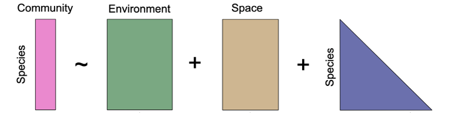

<!-- README.md is generated from README.Rmd. Please edit that file -->
```{r setup, include=FALSE}
knitr::opts_chunk$set(echo = TRUE)
```

[](http://www.repostatus.org/#active) [](https://www.gnu.org/licenses/gpl-3.0) [](https://cran.r-project.org/package=sjSDM)  [](https://www.doi.org/10.1111/2041-210X.13687)

# s-jSDM - Fast and accurate Joint Species Distribution Modeling

## About sjSDM

The sjSDM package is an R package for estimating joint species distribution models. A jSDM is a GLMM that models a multivariate (i.e. a many-species) response to the environment, space and a covariance term that models conditional (on the other terms) correlations between the outputs (i.e. species). 



A big challenge in jSDM implementation is computational speed. The goal of the sjSDM (which stands for "scalable joint species distribution models") is to make jSDM computations fast and scalable. Unlike many other packages, which use a latent-variable approximation to make estimating jSDMs faster, sjSDM fits a full covariance matrix in the likelihood, which is, however, numerically approximated via simulations. The method is described in Pichler & Hartig (2021) A new joint species distribution model for faster and more accurate inference of species associations from big community data, https://www.doi.org/10.1111/2041-210X.13687. 

The core code of sjSDM is implemented in Python / PyTorch, which is then wrapped into an R package. In principle, you can also use it stand-alone under Python (see instructions below). Note: for both the R and the python package, python \>= 3.7 and pytorch must be installed (more details below). However, for most users, it will be more convenient to use sjSDM via the sjSDM R package, which also provides a large number of downstream functionalities. 

To get citation info for sjSDM when you use it for your reseach, type  

```{r,eval=FALSE}
citation("sjSDM")
```

## Installing the R package

sjSDM is distributed via [CRAN](https://cran.rstudio.com/web/packages/sjSDM/index.html). For most users, it will be best to install the package from CRAN

```{r,eval=FALSE}
install.packages("sjSDM")
```

Depencies for the package can be installed before or after installing the package. Detailed explanations of the dependencies are provided in vignette("Dependencies", package = "sjSDM"), source code [here](https://github.com/TheoreticalEcology/s-jSDM/blob/master/sjSDM/vignettes/Dependencies.Rmd). Very briefly, the dependencies can be automatically installed from within R:

```{r,eval=FALSE}
sjSDM::install_sjSDM(version = "gpu") # or
sjSDM::install_sjSDM(version = "cpu")
```

For advanced users: if you want to install the current (development) version from this repository, run

```{r,eval=FALSE}
devtools::install_github("https://github.com/TheoreticalEcology/s-jSDM", subdir = "sjSDM", ref = "master")
```

dependencies should be installed as above. If the installation fails, check out the help of ?install_sjSDM, ?installation_help, and vignette("Dependencies", package = "sjSDM").

1.  Try install_sjSDM()
2.  New session, if no 'PyTorch not found' appears it should work, otherwise see ?installation_help
3.  If do not get the pkg to run, create an issue [issue tracker](https://github.com/TheoreticalEcology/s-jSDM/issues) or write an email to maximilian.pichler at ur.de

## Basic Workflow

Load the package

```{r, message = F}
library(sjSDM)
```

Simulate some community data 

```{r}
set.seed(42)
community <- simulate_SDM(sites = 100, species = 10, env = 3, se = TRUE)
Env <- community$env_weights
Occ <- community$response
SP <- matrix(rnorm(200, 0, 0.3), 100, 2) # spatial coordinates (no effect on species occurences)
```

This fits the standard SDM with environmental, spatial and covariance terms 

```{r, results='hide'}
model <- sjSDM(Y = Occ, env = linear(data = Env, formula = ~X1+X2+X3), spatial = linear(data = SP, formula = ~0+X1:X2), se = TRUE, family=binomial("probit"), sampling = 100L, verbose = FALSE)
```

```{r}
summary(model)
```


Plot the niche estimates, i.e the estimates in the environmental component:

```{r, results='hide'}
plot(model)
```

Visualize the species-species association matrix

```{r}
image(getCor(model))
```


## Anova / Variation partitioning

### Global ANOVA

As in other models, it can be interesting to analyze how much variation is explained by which parts of hte model. 

{{width=70%}}
For the Env, Spatial, Covariance terms, this is implemented in 

```{r, results='hide'}
an = anova(model, verbose = FALSE)
```


```{r,fig.height=7, fig.width=6.3}
summary(an)
plot(an)
```

The anova shows the relative changes in the R^2^ of the groups and their intersections.

### Internal metacommunity structure

Following [Leibold et al., 2022](https://doi.org/10.1111/oik.08618) we can calculate and visualize the internal metacommunity structure (=partitioning of the three components for species and sites). The internal structure is already calculated by the ANOVA and we can visualize it with the plot method:

```{r,fig.height=7, fig.width=8, warning=FALSE}
results = internalStructure(an) # or plot(an, internal = TRUE)
```

The plot function returns the results for the internal metacommunity structure:

```{r,fig.height=7, fig.width=12}
plot(results)
```

Which can be regressed against covariates to analyse assembly processes:

```{r}
plotAssemblyEffects(results)
```


## Python Package

If you want to use sjSDM from python (as said, not encouraged because all help and downstream functions are in R), install via 

```{bash,eval=FALSE}
pip install sjSDM_py
```

Python example

```{python,eval=FALSE}
import sjSDM_py as fa
import numpy as np
import torch
Env = np.random.randn(100, 5)
Occ = np.random.binomial(1, 0.5, [100, 10])

model = fa.Model_sjSDM(device=torch.device("cpu"), dtype=torch.float32)
model.add_env(5, 10)
model.build(5, optimizer=fa.optimizer_adamax(0.001),scheduler=False)
model.fit(Env, Occ, batch_size = 20, epochs = 10)
# print(model.weights)
# print(model.covariance)
```

Calculate Importance:

```{python, eval=FALSE}
Beta = np.transpose(model.env_weights[0])
Sigma = ( model.sigma @ model.sigma.t() + torch.diag(torch.ones([1])) ).data.cpu().numpy()
covX = fa.covariance( torch.tensor(Env).t() ).data.cpu().numpy()

fa.importance(beta=Beta, covX=covX, sigma=Sigma)
```
