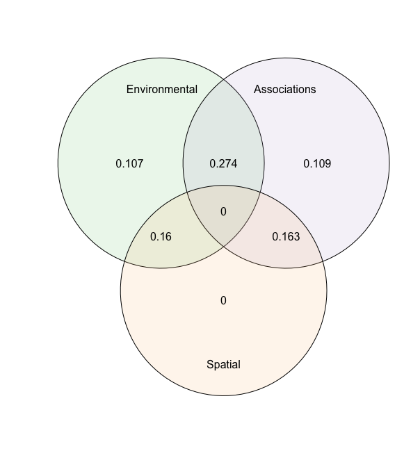

[](http://www.repostatus.org/#active)
[](https://www.gnu.org/licenses/gpl-3.0)
[](https://cran.r-project.org/package=sjSDM)

[](https://besjournals.onlinelibrary.wiley.com/doi/abs/10.1111/2041-210X.13687)

# s-jSDM - Fast and accurate Joint Species Distribution Modeling

## About the method

The method is described in Pichler & Hartig (2021) A new joint species
distribution model for faster and more accurate inference of species
associations from big community data,
https://doi.org/10.1111/2041-210X.13687. The code for producing the
results in this paper is available under the subfolder publications in
this repo.

The method itself is wrapped into an R package, available under
subfolder sjSDM. You can also use it stand-alone under Python (see
instructions below). Note: for both the R and the python package, python
\>= 3.6 and pytorch must be installed (more details below).

## Installing the R / Python package

### R-package

Install the package via

``` r
install.packages("sjSDM")
```

Depencies for the package can be installed before or after installing
the package. Detailed explanations of the dependencies are provided in
vignette(“Dependencies”, package = “sjSDM”), source code
[here](https://github.com/TheoreticalEcology/s-jSDM/blob/master/sjSDM/vignettes/Dependencies.Rmd).
Very briefly, the dependencies can be automatically installed from
within R:

``` r
sjSDM::install_sjSDM(version = "gpu") # or
sjSDM::install_sjSDM(version = "cpu")
```

To cite sjSDM, please use the following citation:

``` r
citation("sjSDM")
```

### Development

If you want to install the current (development) version from this
repository, run

``` r
devtools::install_github("https://github.com/TheoreticalEcology/s-jSDM", subdir = "sjSDM", ref = "master")
```

Once the dependencies are installed, the following code should run:

Simulate a community and fit model:

``` r
library(sjSDM)
```

    ── Attaching sjSDM ──────────────────────────────────────────────────── 1.0.4 ──

    ✔ torch <environment> 
    ✔ torch_optimizer  
    ✔ pyro  
    ✔ madgrad  

``` r
set.seed(42)
community <- simulate_SDM(sites = 100, species = 10, env = 3, se = TRUE)
Env <- community$env_weights
Occ <- community$response
SP <- matrix(rnorm(200, 0, 0.3), 100, 2) # spatial coordinates (no effect on species occurences)

model <- sjSDM(Y = Occ, env = linear(data = Env, formula = ~X1+X2+X3), spatial = linear(data = SP, formula = ~0+X1:X2), se = TRUE, family=binomial("probit"), sampling = 100L)
summary(model)
```

    Family:  binomial 

    LogLik:  -512.0424 
    Regularization loss:  0 

    Species-species correlation matrix: 

        sp1  1.0000                                 
        sp2 -0.3340  1.0000                             
        sp3 -0.2360 -0.4200  1.0000                         
        sp4 -0.2060 -0.3910  0.8350  1.0000                     
        sp5  0.6910 -0.3800 -0.1600 -0.1290  1.0000                 
        sp6 -0.3230  0.4640  0.2020  0.2180 -0.1440  1.0000             
        sp7  0.5700 -0.1090  0.1130  0.1430  0.5340  0.2570  1.0000         
        sp8  0.3020  0.2240 -0.5180 -0.4940  0.2530 -0.0570  0.1470  1.0000     
        sp9 -0.0690 -0.0530  0.0970  0.0810 -0.4000 -0.3390 -0.2320 -0.1440  1.0000 
        sp10     0.2370  0.4770 -0.7240 -0.6730  0.2670  0.1080  0.1240  0.4860 -0.3020  1.0000


    Spatial: 
               sp1       sp2      sp3       sp4      sp5      sp6      sp7      sp8
    X1:X2 1.950896 -4.098373 3.672378 0.4072987 2.529035 1.046807 3.203495 1.979727
               sp9     sp10
    X1:X2 1.080712 1.222111

                     Estimate  Std.Err Z value Pr(>|z|)    
    sp1 (Intercept)  -0.06705  0.28335   -0.24  0.81293    
    sp1 X1            1.40067  0.53212    2.63  0.00848 ** 
    sp1 X2           -2.39622  0.52058   -4.60  4.2e-06 ***
    sp1 X3           -0.25403  0.47146   -0.54  0.59002    
    sp2 (Intercept)   0.06804  0.26273    0.26  0.79564    
    sp2 X1            1.25875  0.50413    2.50  0.01253 *  
    sp2 X2            0.29660  0.46758    0.63  0.52586    
    sp2 X3            0.65431  0.44161    1.48  0.13844    
    sp3 (Intercept)  -0.59684  0.26890   -2.22  0.02645 *  
    sp3 X1            1.43660  0.49050    2.93  0.00340 ** 
    sp3 X2           -0.54475  0.49312   -1.10  0.26929    
    sp3 X3           -1.10835  0.45580   -2.43  0.01503 *  
    sp4 (Intercept)  -0.11334  0.24012   -0.47  0.63693    
    sp4 X1           -1.50757  0.46841   -3.22  0.00129 ** 
    sp4 X2           -1.93316  0.46615   -4.15  3.4e-05 ***
    sp4 X3           -0.41405  0.39057   -1.06  0.28909    
    sp5 (Intercept)  -0.21691  0.24118   -0.90  0.36845    
    sp5 X1            0.73762  0.49185    1.50  0.13370    
    sp5 X2            0.60290  0.44415    1.36  0.17464    
    sp5 X3           -0.65851  0.40524   -1.62  0.10417    
    sp6 (Intercept)   0.30829  0.27287    1.13  0.25856    
    sp6 X1            2.54312  0.58380    4.36  1.3e-05 ***
    sp6 X2           -1.08782  0.55933   -1.94  0.05179 .  
    sp6 X3            0.15055  0.45171    0.33  0.73892    
    sp7 (Intercept)  -0.03763  0.26654   -0.14  0.88773    
    sp7 X1           -0.33671  0.51307   -0.66  0.51166    
    sp7 X2            0.36621  0.47852    0.77  0.44409    
    sp7 X3           -1.61068  0.49603   -3.25  0.00117 ** 
    sp8 (Intercept)   0.14926  0.15449    0.97  0.33399    
    sp8 X1            0.33604  0.29535    1.14  0.25521    
    sp8 X2            0.30268  0.28921    1.05  0.29530    
    sp8 X3           -1.12972  0.27340   -4.13  3.6e-05 ***
    sp9 (Intercept)   0.00742  0.20408    0.04  0.97100    
    sp9 X1            1.40798  0.40648    3.46  0.00053 ***
    sp9 X2           -1.11318  0.38972   -2.86  0.00429 ** 
    sp9 X3            0.77364  0.34167    2.26  0.02355 *  
    sp10 (Intercept) -0.05616  0.20264   -0.28  0.78166    
    sp10 X1          -0.46904  0.36732   -1.28  0.20163    
    sp10 X2          -1.20715  0.36755   -3.28  0.00102 ** 
    sp10 X3          -0.52093  0.34415   -1.51  0.13011    
    ---
    Signif. codes:  0 '***' 0.001 '**' 0.01 '*' 0.05 '.' 0.1 ' ' 1

``` r
plot(model)
```

    Family:  binomial 

    LogLik:  -512.0424 
    Regularization loss:  0 

    Species-species correlation matrix: 

        sp1  1.0000                                 
        sp2 -0.3340  1.0000                             
        sp3 -0.2360 -0.4200  1.0000                         
        sp4 -0.2060 -0.3910  0.8350  1.0000                     
        sp5  0.6910 -0.3800 -0.1600 -0.1290  1.0000                 
        sp6 -0.3230  0.4640  0.2020  0.2180 -0.1440  1.0000             
        sp7  0.5700 -0.1090  0.1130  0.1430  0.5340  0.2570  1.0000         
        sp8  0.3020  0.2240 -0.5180 -0.4940  0.2530 -0.0570  0.1470  1.0000     
        sp9 -0.0690 -0.0530  0.0970  0.0810 -0.4000 -0.3390 -0.2320 -0.1440  1.0000 
        sp10     0.2370  0.4770 -0.7240 -0.6730  0.2670  0.1080  0.1240  0.4860 -0.3020  1.0000


    Spatial: 
               sp1       sp2      sp3       sp4      sp5      sp6      sp7      sp8
    X1:X2 1.950896 -4.098373 3.672378 0.4072987 2.529035 1.046807 3.203495 1.979727
               sp9     sp10
    X1:X2 1.080712 1.222111

                     Estimate  Std.Err Z value Pr(>|z|)    
    sp1 (Intercept)  -0.06705  0.28335   -0.24  0.81293    
    sp1 X1            1.40067  0.53212    2.63  0.00848 ** 
    sp1 X2           -2.39622  0.52058   -4.60  4.2e-06 ***
    sp1 X3           -0.25403  0.47146   -0.54  0.59002    
    sp2 (Intercept)   0.06804  0.26273    0.26  0.79564    
    sp2 X1            1.25875  0.50413    2.50  0.01253 *  
    sp2 X2            0.29660  0.46758    0.63  0.52586    
    sp2 X3            0.65431  0.44161    1.48  0.13844    
    sp3 (Intercept)  -0.59684  0.26890   -2.22  0.02645 *  
    sp3 X1            1.43660  0.49050    2.93  0.00340 ** 
    sp3 X2           -0.54475  0.49312   -1.10  0.26929    
    sp3 X3           -1.10835  0.45580   -2.43  0.01503 *  
    sp4 (Intercept)  -0.11334  0.24012   -0.47  0.63693    
    sp4 X1           -1.50757  0.46841   -3.22  0.00129 ** 
    sp4 X2           -1.93316  0.46615   -4.15  3.4e-05 ***
    sp4 X3           -0.41405  0.39057   -1.06  0.28909    
    sp5 (Intercept)  -0.21691  0.24118   -0.90  0.36845    
    sp5 X1            0.73762  0.49185    1.50  0.13370    
    sp5 X2            0.60290  0.44415    1.36  0.17464    
    sp5 X3           -0.65851  0.40524   -1.62  0.10417    
    sp6 (Intercept)   0.30829  0.27287    1.13  0.25856    
    sp6 X1            2.54312  0.58380    4.36  1.3e-05 ***
    sp6 X2           -1.08782  0.55933   -1.94  0.05179 .  
    sp6 X3            0.15055  0.45171    0.33  0.73892    
    sp7 (Intercept)  -0.03763  0.26654   -0.14  0.88773    
    sp7 X1           -0.33671  0.51307   -0.66  0.51166    
    sp7 X2            0.36621  0.47852    0.77  0.44409    
    sp7 X3           -1.61068  0.49603   -3.25  0.00117 ** 
    sp8 (Intercept)   0.14926  0.15449    0.97  0.33399    
    sp8 X1            0.33604  0.29535    1.14  0.25521    
    sp8 X2            0.30268  0.28921    1.05  0.29530    
    sp8 X3           -1.12972  0.27340   -4.13  3.6e-05 ***
    sp9 (Intercept)   0.00742  0.20408    0.04  0.97100    
    sp9 X1            1.40798  0.40648    3.46  0.00053 ***
    sp9 X2           -1.11318  0.38972   -2.86  0.00429 ** 
    sp9 X3            0.77364  0.34167    2.26  0.02355 *  
    sp10 (Intercept) -0.05616  0.20264   -0.28  0.78166    
    sp10 X1          -0.46904  0.36732   -1.28  0.20163    
    sp10 X2          -1.20715  0.36755   -3.28  0.00102 ** 
    sp10 X3          -0.52093  0.34415   -1.51  0.13011    
    ---
    Signif. codes:  0 '***' 0.001 '**' 0.01 '*' 0.05 '.' 0.1 ' ' 1


We also support other response families: Count data:

``` r
model <- sjSDM(Y = Occ, env = linear(data = Env, formula = ~X1+X2+X3), spatial = linear(data = SP, formula = ~0+X1:X2), se = TRUE, family=poisson("log"))
```

Gaussian (normal):

``` r
model <- sjSDM(Y = Occ, env = linear(data = Env, formula = ~X1+X2+X3), spatial = linear(data = SP, formula = ~0+X1:X2), se = TRUE, family=gaussian("identity"))
```

Let’s do an ANOVA to partition the three components (abiotic, biotic,
and spatial):

Let’s have a look on community level how the three groups contribute to
the overall explained variance

``` r
an = anova(model)
print(an)
```

    Analysis of Deviance Table

    Terms added sequentially:

               Deviance Residual deviance R2 Nagelkerke R2 McFadden
    Abiotic  147.702154       1187.518810      0.771683      0.1065
    Biotic   151.737618       1183.483346      0.780713      0.1095
    Spatial   -6.397420       1341.618384     -0.066065     -0.0046
    Full     373.740544        961.480420      0.976184      0.2696

``` r
plot(an)
```



The anova shows the relative changes in the R<sup>2</sup> of the groups
and their intersections.

We can also visualize the individual contributions to species and site
$$R^2$$:

``` r
plot(an, internal=TRUE)
```

    Registered S3 methods overwritten by 'ggtern':
      method           from   
      grid.draw.ggplot ggplot2
      plot.ggplot      ggplot2
      print.ggplot     ggplot2


If it fails, check out the help of ?install_sjSDM, ?installation_help,
and vignette(“Dependencies”, package = “sjSDM”).

#### Installation workflow:

1.  Try install_sjSDM()
2.  New session, if no ‘PyTorch not found’ appears it should work,
    otherwise see ?installation_help
3.  If do not get the pkg to run, create an issue [issue
    tracker](https://github.com/TheoreticalEcology/s-jSDM/issues) or
    write an email to maximilian.pichler at ur.de

### Python Package

``` bash
pip install sjSDM_py
```

Python example

``` python
import sjSDM_py as fa
import numpy as np
import torch
Env = np.random.randn(100, 5)
Occ = np.random.binomial(1, 0.5, [100, 10])

model = fa.Model_sjSDM(device=torch.device("cpu"), dtype=torch.float32)
model.add_env(5, 10)
model.build(5, optimizer=fa.optimizer_adamax(0.001),scheduler=False)
model.fit(Env, Occ, batch_size = 20, epochs = 10)
# print(model.weights)
# print(model.covariance)
```


    Iter: 0/10   0%|          | [00:00, ?it/s]
    Iter: 0/10   0%|          | [00:00, ?it/s, loss=7.369]
    Iter: 1/10  10%|#         | [00:00,  3.57it/s, loss=7.369]
    Iter: 1/10  10%|#         | [00:00,  3.57it/s, loss=7.365]
    Iter: 1/10  10%|#         | [00:00,  3.57it/s, loss=7.345]
    Iter: 1/10  10%|#         | [00:00,  3.57it/s, loss=7.335]
    Iter: 1/10  10%|#         | [00:00,  3.57it/s, loss=7.335]
    Iter: 1/10  10%|#         | [00:00,  3.57it/s, loss=7.337]
    Iter: 1/10  10%|#         | [00:00,  3.57it/s, loss=7.35] 
    Iter: 1/10  10%|#         | [00:00,  3.57it/s, loss=7.316]
    Iter: 1/10  10%|#         | [00:00,  3.57it/s, loss=7.332]
    Iter: 9/10  90%|######### | [00:00, 28.53it/s, loss=7.332]
    Iter: 9/10  90%|######### | [00:00, 28.53it/s, loss=7.307]
    Iter: 10/10 100%|##########| [00:00, 24.84it/s, loss=7.307]

Calculate Importance:

``` python
Beta = np.transpose(model.env_weights[0])
Sigma = ( model.sigma @ model.sigma.t() + torch.diag(torch.ones([1])) ).data.cpu().numpy()
covX = fa.covariance( torch.tensor(Env).t() ).data.cpu().numpy()

fa.importance(beta=Beta, covX=covX, sigma=Sigma)
```

    {'env': array([[ 1.5692263e-03,  7.0788241e-03,  4.9172235e-03,  2.1886549e-04,
             3.7856041e-03],
           [ 3.9136652e-03,  3.6097916e-03,  9.3236798e-03,  2.1898279e-03,
             9.7862538e-03],
           [ 1.7491488e-02,  5.3843190e-03,  2.0642926e-04,  1.2522935e-02,
             1.2532198e-03],
           [ 5.7648766e-05,  1.3834174e-02,  5.5022898e-05,  2.1638966e-03,
             7.4176228e-04],
           [ 4.2569041e-03,  1.5294321e-02,  2.1356309e-03,  9.2832632e-03,
             9.0804556e-03],
           [ 2.3176185e-04,  1.6912347e-02,  3.9488766e-03,  5.0239451e-03,
            -3.4174871e-06],
           [ 4.1262992e-03,  6.9192506e-04,  1.8184915e-02,  2.7356739e-03,
             6.9059730e-03],
           [-2.0454363e-04,  1.1238606e-02,  1.9644968e-02,  1.3346016e-02,
             1.3046235e-02],
           [ 2.4419620e-03,  3.1686432e-04,  1.0288134e-02,  4.2265505e-03,
             7.1511097e-04],
           [ 8.2756970e-03,  1.1173112e-02,  5.0409110e-03, -1.0285851e-04,
             3.6544530e-03]], dtype=float32), 'biotic': array([0.9824303 , 0.9711768 , 0.9631416 , 0.9831475 , 0.9599494 ,
           0.97388655, 0.96735525, 0.9429287 , 0.9820113 , 0.9719587 ],
          dtype=float32)}
