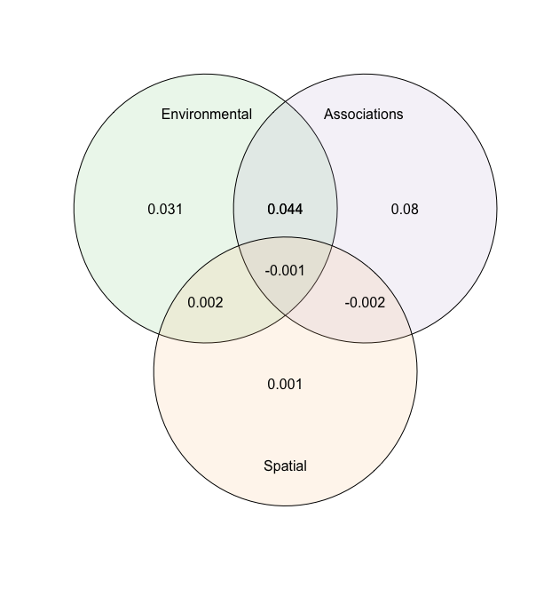

[](http://www.repostatus.org/#active)
[](https://www.gnu.org/licenses/gpl-3.0)

[](https://besjournals.onlinelibrary.wiley.com/doi/abs/10.1111/2041-210X.13687)


# s-jSDM - Fast and accurate Joint Species Distribution Modeling

## About the method

The method is described in Pichler & Hartig (2021) A new joint species distribution model for faster and more accurate inference of species associations from big community data, https://doi.org/10.1111/2041-210X.13687. The code for producing the results in this paper is available under the subfolder publications in this repo.

The method itself is wrapped into an R package, available under subfolder sjSDM. You can also use it stand-alone under Python (see instructions below). Note: for both the R and the python package, python >= 3.6 and pytorch must be installed (more details below).

## Installing the R / Python package

### R-package

Install the package via


```r
devtools::install_github("https://github.com/TheoreticalEcology/s-jSDM", subdir = "sjSDM")
```

Depencies for the package can be installed before or after installing the package. Detailed explanations of the dependencies are provided in vignette("Dependencies", package = "sjSDM"), source code [here](https://github.com/TheoreticalEcology/s-jSDM/blob/master/sjSDM/vignettes/Dependencies.Rmd). Very briefly, the dependencies can be automatically installed from within R:


```r
sjSDM::install_sjSDM(version = "gpu") # or
sjSDM::install_sjSDM(version = "cpu")
```


To cite sjSDM, please use the following citation:

```r
citation("sjSDM")
```


Once the dependencies are installed, the following code should run:

Simulate a community and fit model:

```r
library(sjSDM)
```

```
## ── Attaching sjSDM ──────────────────────────────────────────────────── 0.1.8 ──
```

```
## ✓ torch 1.9.0 
## ✓ torch_optimizer  
## ✓ pyro  
## ✓ madgrad
```

```r
set.seed(42)
community <- simulate_SDM(sites = 100, species = 10, env = 3, se = TRUE)
Env <- community$env_weights
Occ <- community$response
SP <- matrix(rnorm(200, 0, 0.3), 100, 2) # spatial coordinates (no effect on species occurences)

model <- sjSDM(Y = Occ, env = linear(data = Env, formula = ~X1+X2+X3), spatial = linear(data = SP, formula = ~0+X1:X2), se = TRUE, family=binomial("probit"), sampling = 100L)
summary(model)
```

```
## LogLik:  -521.6559 
## Deviance:  1043.312 
## 
## Regularization loss:  0 
## 
## Species-species correlation matrix: 
## 
## 	sp1	 1.0000									
## 	sp2	-0.3550	 1.0000								
## 	sp3	-0.1370	-0.3560	 1.0000							
## 	sp4	-0.1490	-0.3190	 0.6960	 1.0000						
## 	sp5	 0.5980	-0.3380	-0.0930	-0.0980	 1.0000					
## 	sp6	-0.2140	 0.3800	 0.1480	 0.1320	-0.0620	 1.0000				
## 	sp7	 0.4640	-0.1500	 0.1330	 0.1140	 0.5180	 0.2360	 1.0000			
## 	sp8	 0.2880	 0.1210	-0.4110	-0.4260	 0.2170	-0.0310	 0.1270	 1.0000		
## 	sp9	-0.0960	-0.0590	 0.0620	 0.0650	-0.3180	-0.2570	-0.2460	-0.0910	 1.0000	
## 	sp10	 0.1910	 0.3840	-0.6080	-0.5700	 0.2390	 0.1010	 0.1240	 0.3890	-0.2280	 1.0000
## 
## 
## 
## Spatial: 
##             sp1        sp2       sp3         sp4       sp5      sp6       sp7
## X1:X2 0.2116772 -0.5360333 0.5232622 0.008332695 0.3565705 0.180108 0.4192475
##            sp8       sp9      sp10
## X1:X2 0.473037 0.2719108 0.2562078
## 
## 
## 
##                  Estimate  Std.Err Z value Pr(>|z|)    
## sp1 (Intercept)  -0.03177  0.20968   -0.15  0.87955    
## sp1 X1            0.81680  0.40515    2.02  0.04379 *  
## sp1 X2           -1.62852  0.37989   -4.29  1.8e-05 ***
## sp1 X3           -0.12715  0.34814   -0.37  0.71494    
## sp2 (Intercept)  -0.02736  0.21477   -0.13  0.89864    
## sp2 X1            0.88439  0.40578    2.18  0.02929 *  
## sp2 X2            0.18309  0.39785    0.46  0.64538    
## sp2 X3            0.42769  0.35764    1.20  0.23174    
## sp3 (Intercept)  -0.34305  0.22798   -1.50  0.13240    
## sp3 X1            1.03899  0.42114    2.47  0.01362 *  
## sp3 X2           -0.26187  0.40653   -0.64  0.51948    
## sp3 X3           -0.68567  0.39507   -1.74  0.08264 .  
## sp4 (Intercept)  -0.05341  0.20209   -0.26  0.79157    
## sp4 X1           -0.99991  0.38088   -2.63  0.00866 ** 
## sp4 X2           -1.30519  0.38755   -3.37  0.00076 ***
## sp4 X3           -0.29711  0.33797   -0.88  0.37936    
## sp5 (Intercept)  -0.16683  0.20947   -0.80  0.42577    
## sp5 X1            0.48812  0.40224    1.21  0.22494    
## sp5 X2            0.43646  0.37802    1.15  0.24826    
## sp5 X3           -0.43820  0.35445   -1.24  0.21635    
## sp6 (Intercept)   0.20027  0.20509    0.98  0.32883    
## sp6 X1            1.66526  0.42341    3.93  8.4e-05 ***
## sp6 X2           -0.68414  0.39862   -1.72  0.08611 .  
## sp6 X3            0.18311  0.34733    0.53  0.59805    
## sp7 (Intercept)  -0.00229  0.20182   -0.01  0.99093    
## sp7 X1           -0.26273  0.37531   -0.70  0.48389    
## sp7 X2            0.27684  0.35667    0.78  0.43764    
## sp7 X3           -1.03507  0.34031   -3.04  0.00235 ** 
## sp8 (Intercept)   0.15549  0.16257    0.96  0.33884    
## sp8 X1            0.24234  0.31080    0.78  0.43556    
## sp8 X2            0.29605  0.30469    0.97  0.33122    
## sp8 X3           -1.10672  0.28354   -3.90  9.5e-05 ***
## sp9 (Intercept)   0.03493  0.16276    0.21  0.83008    
## sp9 X1            1.07005  0.31712    3.37  0.00074 ***
## sp9 X2           -0.78384  0.30910   -2.54  0.01122 *  
## sp9 X3            0.59471  0.27136    2.19  0.02841 *  
## sp10 (Intercept) -0.09433  0.18507   -0.51  0.61027    
## sp10 X1          -0.45735  0.33925   -1.35  0.17762    
## sp10 X2          -0.96954  0.33834   -2.87  0.00416 ** 
## sp10 X3          -0.38647  0.31582   -1.22  0.22106    
## ---
## Signif. codes:  0 '***' 0.001 '**' 0.01 '*' 0.05 '.' 0.1 ' ' 1
```

```r
plot(model)
```

```
## LogLik:  -521.6559 
## Deviance:  1043.312 
## 
## Regularization loss:  0 
## 
## Species-species correlation matrix: 
## 
## 	sp1	 1.0000									
## 	sp2	-0.3550	 1.0000								
## 	sp3	-0.1370	-0.3560	 1.0000							
## 	sp4	-0.1490	-0.3190	 0.6960	 1.0000						
## 	sp5	 0.5980	-0.3380	-0.0930	-0.0980	 1.0000					
## 	sp6	-0.2140	 0.3800	 0.1480	 0.1320	-0.0620	 1.0000				
## 	sp7	 0.4640	-0.1500	 0.1330	 0.1140	 0.5180	 0.2360	 1.0000			
## 	sp8	 0.2880	 0.1210	-0.4110	-0.4260	 0.2170	-0.0310	 0.1270	 1.0000		
## 	sp9	-0.0960	-0.0590	 0.0620	 0.0650	-0.3180	-0.2570	-0.2460	-0.0910	 1.0000	
## 	sp10	 0.1910	 0.3840	-0.6080	-0.5700	 0.2390	 0.1010	 0.1240	 0.3890	-0.2280	 1.0000
## 
## 
## 
## Spatial: 
##             sp1        sp2       sp3         sp4       sp5      sp6       sp7
## X1:X2 0.2116772 -0.5360333 0.5232622 0.008332695 0.3565705 0.180108 0.4192475
##            sp8       sp9      sp10
## X1:X2 0.473037 0.2719108 0.2562078
## 
## 
## 
##                  Estimate  Std.Err Z value Pr(>|z|)    
## sp1 (Intercept)  -0.03177  0.20968   -0.15  0.87955    
## sp1 X1            0.81680  0.40515    2.02  0.04379 *  
## sp1 X2           -1.62852  0.37989   -4.29  1.8e-05 ***
## sp1 X3           -0.12715  0.34814   -0.37  0.71494    
## sp2 (Intercept)  -0.02736  0.21477   -0.13  0.89864    
## sp2 X1            0.88439  0.40578    2.18  0.02929 *  
## sp2 X2            0.18309  0.39785    0.46  0.64538    
## sp2 X3            0.42769  0.35764    1.20  0.23174    
## sp3 (Intercept)  -0.34305  0.22798   -1.50  0.13240    
## sp3 X1            1.03899  0.42114    2.47  0.01362 *  
## sp3 X2           -0.26187  0.40653   -0.64  0.51948    
## sp3 X3           -0.68567  0.39507   -1.74  0.08264 .  
## sp4 (Intercept)  -0.05341  0.20209   -0.26  0.79157    
## sp4 X1           -0.99991  0.38088   -2.63  0.00866 ** 
## sp4 X2           -1.30519  0.38755   -3.37  0.00076 ***
## sp4 X3           -0.29711  0.33797   -0.88  0.37936    
## sp5 (Intercept)  -0.16683  0.20947   -0.80  0.42577    
## sp5 X1            0.48812  0.40224    1.21  0.22494    
## sp5 X2            0.43646  0.37802    1.15  0.24826    
## sp5 X3           -0.43820  0.35445   -1.24  0.21635    
## sp6 (Intercept)   0.20027  0.20509    0.98  0.32883    
## sp6 X1            1.66526  0.42341    3.93  8.4e-05 ***
## sp6 X2           -0.68414  0.39862   -1.72  0.08611 .  
## sp6 X3            0.18311  0.34733    0.53  0.59805    
## sp7 (Intercept)  -0.00229  0.20182   -0.01  0.99093    
## sp7 X1           -0.26273  0.37531   -0.70  0.48389    
## sp7 X2            0.27684  0.35667    0.78  0.43764    
## sp7 X3           -1.03507  0.34031   -3.04  0.00235 ** 
## sp8 (Intercept)   0.15549  0.16257    0.96  0.33884    
## sp8 X1            0.24234  0.31080    0.78  0.43556    
## sp8 X2            0.29605  0.30469    0.97  0.33122    
## sp8 X3           -1.10672  0.28354   -3.90  9.5e-05 ***
## sp9 (Intercept)   0.03493  0.16276    0.21  0.83008    
## sp9 X1            1.07005  0.31712    3.37  0.00074 ***
## sp9 X2           -0.78384  0.30910   -2.54  0.01122 *  
## sp9 X3            0.59471  0.27136    2.19  0.02841 *  
## sp10 (Intercept) -0.09433  0.18507   -0.51  0.61027    
## sp10 X1          -0.45735  0.33925   -1.35  0.17762    
## sp10 X2          -0.96954  0.33834   -2.87  0.00416 ** 
## sp10 X3          -0.38647  0.31582   -1.22  0.22106    
## ---
## Signif. codes:  0 '***' 0.001 '**' 0.01 '*' 0.05 '.' 0.1 ' ' 1
```

<!-- -->

We also support also other response families:
Count data:

```r
model <- sjSDM(Y = Occ, env = linear(data = Env, formula = ~X1+X2+X3), spatial = linear(data = SP, formula = ~0+X1:X2), se = TRUE, family=poisson("log"))
```

Gaussian (normal):

```r
model <- sjSDM(Y = Occ, env = linear(data = Env, formula = ~X1+X2+X3), spatial = linear(data = SP, formula = ~0+X1:X2), se = TRUE, family=gaussian("identity"))
```


Let's have a look at the importance of the three groups (environment, associations, and space) on the occurences:

```r
imp = importance(model)
print(imp)
```

```
##    sp       env      spatial     biotic
## 1   1 0.8512507 3.235598e-04 0.14842576
## 2   2 0.5535324 3.788728e-03 0.44267890
## 3   3 0.7185561 3.539847e-03 0.27790397
## 4   4 0.8885156 5.296470e-07 0.11148381
## 5   5 0.4769188 2.544400e-03 0.52053678
## 6   6 0.8595052 2.418374e-04 0.14025287
## 7   7 0.5184419 1.667692e-03 0.47989047
## 8   8 0.9243904 3.566132e-03 0.07204356
## 9   9 0.7220337 6.654685e-04 0.27730072
## 10 10 0.9641129 1.151201e-03 0.03473605
```

```r
plot(imp)
```

<!-- -->


As expected, space has no effect on occurences.

Let's have a look on community level how the three groups contribute to the overall explained variance 

```r
an = anova(model)
print(an)
```

```
## Changes relative to empty model (without modules):
## 
##  Modules       LogLik            R2   marginal R2          R2ll
##        _  693.1472015  0.000000e+00  0.000000e+00  0.0000000000
##        A  -21.2049255  2.576520e-02  1.682891e-02  0.0305922400
##        B  -55.2553113  9.658548e-06  4.844455e-06  0.0797165612
##        S   -0.4988708  3.544428e-04  2.202305e-04  0.0007197185
##      A+B  -30.3583012 -1.836237e-03 -9.200357e-03  0.0437977693
##      A+S   -1.4909744 -5.084443e-05  8.346787e-06  0.0021510213
##      B+S    1.2818292 -3.086277e-04 -2.047642e-04 -0.0018492886
##    A+B+S    0.9275459  1.017823e-04  9.642144e-05 -0.0013381659
##     Full -106.5990082  2.403537e-02  7.753627e-03  0.1537898558
```

```r
plot(an)
```

<!-- -->

The anova shows the relative changes in the logLik of the groups and their intersections.


If it fails, check out the help of ?install_sjSDM, ?installation_help, and vignette("Dependencies", package = "sjSDM"). 

#### Installation workflow:
1. Try install_sjSDM()
2. New session, if no 'PyTorch not found' appears it should work, otherwise see ?installation_help
3. If do not get the pkg to run, create an issue [issue tracker](https://github.com/TheoreticalEcology/s-jSDM/issues) or write an email to maximilian.pichler at ur.de


### Python Package

```bash
pip install sjSDM_py
```
Python example


```python
import sjSDM_py as fa
import numpy as np
import torch
Env = np.random.randn(100, 5)
Occ = np.random.binomial(1, 0.5, [100, 10])

model = fa.Model_sjSDM(device=torch.device("cpu"), dtype=torch.float32)
model.add_env(5, 10)
model.build(5, optimizer=fa.optimizer_adamax(0.001),scheduler=False)
model.fit(Env, Occ, batch_size = 20, epochs = 10)
# print(model.weights)
# print(model.covariance)
```

```
## 
Iter: 0/10   0%|          | [00:00, ?it/s]
Iter: 0/10   0%|          | [00:00, ?it/s, loss=7.18]
Iter: 0/10   0%|          | [00:00, ?it/s, loss=7.178]
Iter: 0/10   0%|          | [00:00, ?it/s, loss=7.163]
Iter: 0/10   0%|          | [00:00, ?it/s, loss=7.183]
Iter: 0/10   0%|          | [00:00, ?it/s, loss=7.172]
Iter: 0/10   0%|          | [00:00, ?it/s, loss=7.175]
Iter: 0/10   0%|          | [00:00, ?it/s, loss=7.155]
Iter: 0/10   0%|          | [00:00, ?it/s, loss=7.137]
Iter: 0/10   0%|          | [00:00, ?it/s, loss=7.165]
Iter: 9/10  90%|######### | [00:00, 87.36it/s, loss=7.165]
Iter: 9/10  90%|######### | [00:00, 87.36it/s, loss=7.141]
Iter: 10/10 100%|##########| [00:00, 90.60it/s, loss=7.141]
```

Calculate Importance:

```python
Beta = np.transpose(model.env_weights[0])
Sigma = ( model.sigma @ model.sigma.t() + torch.diag(torch.ones([1])) ).data.cpu().numpy()
covX = fa.covariance( torch.tensor(Env).t() ).data.cpu().numpy()

fa.importance(beta=Beta, covX=covX, sigma=Sigma)
```

```
## {'env': array([[ 4.1893846e-03,  5.5393800e-03,  1.3987868e-02,  5.1057325e-03,
##          3.2040334e-04],
##        [ 4.8073977e-03,  2.1980505e-04,  5.5616826e-04,  2.2618828e-04,
##          1.4837000e-02],
##        [ 9.5910449e-03, -2.6523434e-05,  8.9576719e-03,  1.4117245e-02,
##          2.6826796e-04],
##        [ 1.5072384e-02,  6.0981540e-03,  8.1819193e-03,  1.1266603e-03,
##          1.3036386e-02],
##        [ 1.2810972e-02,  4.9146665e-03,  7.0648100e-03,  6.1532706e-03,
##         -6.2168780e-04],
##        [ 3.5765194e-04,  1.5423226e-03,  9.0936786e-03,  1.5325662e-02,
##          2.8687348e-03],
##        [-2.5524709e-05,  8.9721283e-04,  1.2243549e-02,  1.3080860e-02,
##          1.8863674e-03],
##        [ 2.7550785e-05,  1.3295179e-03,  1.2515844e-02,  3.7936254e-03,
##          2.0696187e-02],
##        [ 3.4044436e-03,  2.0984237e-03,  2.9508309e-03,  2.3899646e-03,
##          1.5562433e-03],
##        [ 3.7611238e-04,  6.6016875e-03,  1.4190309e-04,  1.0578999e-02,
##          5.1813303e-03]], dtype=float32), 'biotic': array([0.97085726, 0.9793535 , 0.9670923 , 0.95648456, 0.969678  ,
##        0.97081196, 0.9719175 , 0.96163726, 0.98760015, 0.97712   ],
##       dtype=float32)}
```

