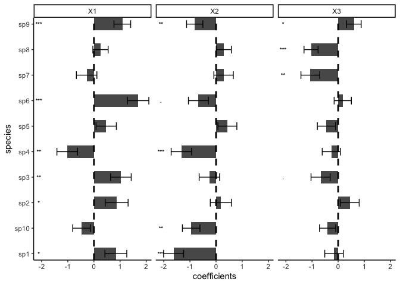
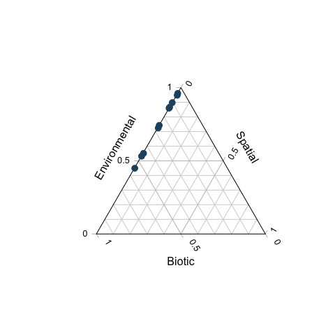
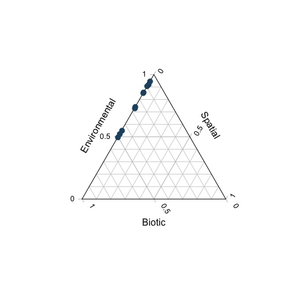

<!-- README.md is generated from README.Rmd. Please edit that file -->

[](http://www.repostatus.org/#active)
[](https://www.gnu.org/licenses/gpl-3.0)

[](https://besjournals.onlinelibrary.wiley.com/doi/abs/10.1111/2041-210X.13687)

# s-jSDM - Fast and accurate Joint Species Distribution Modeling

## About the method

The method is described in Pichler & Hartig (2021) A new joint species
distribution model for faster and more accurate inference of species
associations from big community data,
<https://doi.org/10.1111/2041-210X.13687>. The code for producing the
results in this paper is available under the subfolder publications in
this repo.

The method itself is wrapped into an R package, available under
subfolder sjSDM. You can also use it stand-alone under Python (see
instructions below). Note: for both the R and the python package, python
\>= 3.6 and pytorch must be installed (more details below).

## Installing the R / Python package

### R-package

Install the package via

``` r
devtools::install_github("https://github.com/TheoreticalEcology/s-jSDM", subdir = "sjSDM")
```

Depencies for the package can be installed before or after installing
the package. Detailed explanations of the dependencies are provided in
vignette(“Dependencies”, package = “sjSDM”), source code
[here](https://github.com/TheoreticalEcology/s-jSDM/blob/master/sjSDM/vignettes/Dependencies.Rmd).
Very briefly, the dependencies can be automatically installed from
within R:

``` r
sjSDM::install_sjSDM(version = "gpu") # or
sjSDM::install_sjSDM(version = "cpu")
```

To cite sjSDM, please use the following citation:

``` r
citation("sjSDM")
```

Once the dependencies are installed, the following code should run:

Simulate a community and fit model:

``` r
library(sjSDM)
```

    ## ── Attaching sjSDM ──────────────────────────────────────────────────── 0.1.9 ──

    ## ✓ torch <environment> 
    ## ✓ torch_optimizer  
    ## ✓ pyro  
    ## ✓ madgrad

``` r
set.seed(42)
community <- simulate_SDM(sites = 100, species = 10, env = 3, se = TRUE)
Env <- community$env_weights
Occ <- community$response
SP <- matrix(rnorm(200, 0, 0.3), 100, 2) # spatial coordinates (no effect on species occurences)

model <- sjSDM(Y = Occ, env = linear(data = Env, formula = ~X1+X2+X3), spatial = linear(data = SP, formula = ~0+X1:X2), se = TRUE, family=binomial("probit"), sampling = 100L)
summary(model)
```

    ## LogLik:  -519.8163 
    ## Regularization loss:  0 
    ## 
    ## Species-species correlation matrix: 
    ## 
    ##  sp1  1.0000                                 
    ##  sp2 -0.3550  1.0000                             
    ##  sp3 -0.1510 -0.3470  1.0000                         
    ##  sp4 -0.1480 -0.3310  0.6990  1.0000                     
    ##  sp5  0.6040 -0.3410 -0.1090 -0.1000  1.0000                 
    ##  sp6 -0.2230  0.3840  0.1500  0.1360 -0.0580  1.0000             
    ##  sp7  0.4750 -0.1500  0.1310  0.1190  0.5030  0.2330  1.0000         
    ##  sp8  0.2790  0.1390 -0.4310 -0.4230  0.2430 -0.0510  0.1300  1.0000     
    ##  sp9 -0.0870 -0.0390  0.0780  0.0720 -0.3040 -0.2450 -0.2010 -0.1020  1.0000 
    ##  sp10     0.1910  0.3930 -0.6080 -0.5730  0.2340  0.1140  0.1180  0.4120 -0.2270  1.0000
    ## 
    ## 
    ## 
    ## Spatial: 
    ##             sp1        sp2       sp3         sp4       sp5       sp6       sp7
    ## X1:X2 0.2142437 -0.5476772 0.5437201 0.002491096 0.3480671 0.1982483 0.4338585
    ##             sp8       sp9      sp10
    ## X1:X2 0.4867004 0.2601053 0.2501999
    ## 
    ## 
    ## 
    ##                  Estimate  Std.Err Z value Pr(>|z|)    
    ## sp1 (Intercept)  -0.01163  0.20988   -0.06  0.95581    
    ## sp1 X1            0.83841  0.41912    2.00  0.04546 *  
    ## sp1 X2           -1.62395  0.38268   -4.24  2.2e-05 ***
    ## sp1 X3           -0.15777  0.35500   -0.44  0.65675    
    ## sp2 (Intercept)   0.00235  0.22054    0.01  0.99149    
    ## sp2 X1            0.86883  0.43860    1.98  0.04760 *  
    ## sp2 X2            0.18605  0.40632    0.46  0.64702    
    ## sp2 X3            0.44304  0.36211    1.22  0.22114    
    ## sp3 (Intercept)  -0.39657  0.21566   -1.84  0.06593 .  
    ## sp3 X1            1.03265  0.39402    2.62  0.00877 ** 
    ## sp3 X2           -0.25486  0.39149   -0.65  0.51504    
    ## sp3 X3           -0.67251  0.36580   -1.84  0.06599 .  
    ## sp4 (Intercept)  -0.09546  0.20690   -0.46  0.64453    
    ## sp4 X1           -1.02157  0.39517   -2.59  0.00973 ** 
    ## sp4 X2           -1.32603  0.39183   -3.38  0.00071 ***
    ## sp4 X3           -0.26311  0.34662   -0.76  0.44781    
    ## sp5 (Intercept)  -0.14047  0.20111   -0.70  0.48490    
    ## sp5 X1            0.46950  0.38842    1.21  0.22676    
    ## sp5 X2            0.43398  0.36234    1.20  0.23102    
    ## sp5 X3           -0.44771  0.34862   -1.28  0.19906    
    ## sp6 (Intercept)   0.19213  0.20023    0.96  0.33730    
    ## sp6 X1            1.69016  0.41060    4.12  3.9e-05 ***
    ## sp6 X2           -0.67460  0.38242   -1.76  0.07773 .  
    ## sp6 X3            0.17613  0.32990    0.53  0.59342    
    ## sp7 (Intercept)  -0.00412  0.20962   -0.02  0.98432    
    ## sp7 X1           -0.27936  0.39252   -0.71  0.47666    
    ## sp7 X2            0.28909  0.37268    0.78  0.43792    
    ## sp7 X3           -1.06336  0.36108   -2.94  0.00323 ** 
    ## sp8 (Intercept)   0.15611  0.15379    1.02  0.31007    
    ## sp8 X1            0.25123  0.29255    0.86  0.39047    
    ## sp8 X2            0.29725  0.28860    1.03  0.30302    
    ## sp8 X3           -1.03698  0.26935   -3.85  0.00012 ***
    ## sp9 (Intercept)   0.03160  0.16450    0.19  0.84767    
    ## sp9 X1            1.08679  0.31940    3.40  0.00067 ***
    ## sp9 X2           -0.81630  0.31191   -2.62  0.00887 ** 
    ## sp9 X3            0.60194  0.27875    2.16  0.03082 *  
    ## sp10 (Intercept) -0.06137  0.18320   -0.34  0.73762    
    ## sp10 X1          -0.47306  0.33833   -1.40  0.16205    
    ## sp10 X2          -0.95175  0.33596   -2.83  0.00461 ** 
    ## sp10 X3          -0.40204  0.31031   -1.30  0.19512    
    ## ---
    ## Signif. codes:  0 '***' 0.001 '**' 0.01 '*' 0.05 '.' 0.1 ' ' 1

``` r
plot(model)
```

    ## LogLik:  -519.8163 
    ## Regularization loss:  0 
    ## 
    ## Species-species correlation matrix: 
    ## 
    ##  sp1  1.0000                                 
    ##  sp2 -0.3550  1.0000                             
    ##  sp3 -0.1510 -0.3470  1.0000                         
    ##  sp4 -0.1480 -0.3310  0.6990  1.0000                     
    ##  sp5  0.6040 -0.3410 -0.1090 -0.1000  1.0000                 
    ##  sp6 -0.2230  0.3840  0.1500  0.1360 -0.0580  1.0000             
    ##  sp7  0.4750 -0.1500  0.1310  0.1190  0.5030  0.2330  1.0000         
    ##  sp8  0.2790  0.1390 -0.4310 -0.4230  0.2430 -0.0510  0.1300  1.0000     
    ##  sp9 -0.0870 -0.0390  0.0780  0.0720 -0.3040 -0.2450 -0.2010 -0.1020  1.0000 
    ##  sp10     0.1910  0.3930 -0.6080 -0.5730  0.2340  0.1140  0.1180  0.4120 -0.2270  1.0000
    ## 
    ## 
    ## 
    ## Spatial: 
    ##             sp1        sp2       sp3         sp4       sp5       sp6       sp7
    ## X1:X2 0.2142437 -0.5476772 0.5437201 0.002491096 0.3480671 0.1982483 0.4338585
    ##             sp8       sp9      sp10
    ## X1:X2 0.4867004 0.2601053 0.2501999
    ## 
    ## 
    ## 
    ##                  Estimate  Std.Err Z value Pr(>|z|)    
    ## sp1 (Intercept)  -0.01163  0.20988   -0.06  0.95581    
    ## sp1 X1            0.83841  0.41912    2.00  0.04546 *  
    ## sp1 X2           -1.62395  0.38268   -4.24  2.2e-05 ***
    ## sp1 X3           -0.15777  0.35500   -0.44  0.65675    
    ## sp2 (Intercept)   0.00235  0.22054    0.01  0.99149    
    ## sp2 X1            0.86883  0.43860    1.98  0.04760 *  
    ## sp2 X2            0.18605  0.40632    0.46  0.64702    
    ## sp2 X3            0.44304  0.36211    1.22  0.22114    
    ## sp3 (Intercept)  -0.39657  0.21566   -1.84  0.06593 .  
    ## sp3 X1            1.03265  0.39402    2.62  0.00877 ** 
    ## sp3 X2           -0.25486  0.39149   -0.65  0.51504    
    ## sp3 X3           -0.67251  0.36580   -1.84  0.06599 .  
    ## sp4 (Intercept)  -0.09546  0.20690   -0.46  0.64453    
    ## sp4 X1           -1.02157  0.39517   -2.59  0.00973 ** 
    ## sp4 X2           -1.32603  0.39183   -3.38  0.00071 ***
    ## sp4 X3           -0.26311  0.34662   -0.76  0.44781    
    ## sp5 (Intercept)  -0.14047  0.20111   -0.70  0.48490    
    ## sp5 X1            0.46950  0.38842    1.21  0.22676    
    ## sp5 X2            0.43398  0.36234    1.20  0.23102    
    ## sp5 X3           -0.44771  0.34862   -1.28  0.19906    
    ## sp6 (Intercept)   0.19213  0.20023    0.96  0.33730    
    ## sp6 X1            1.69016  0.41060    4.12  3.9e-05 ***
    ## sp6 X2           -0.67460  0.38242   -1.76  0.07773 .  
    ## sp6 X3            0.17613  0.32990    0.53  0.59342    
    ## sp7 (Intercept)  -0.00412  0.20962   -0.02  0.98432    
    ## sp7 X1           -0.27936  0.39252   -0.71  0.47666    
    ## sp7 X2            0.28909  0.37268    0.78  0.43792    
    ## sp7 X3           -1.06336  0.36108   -2.94  0.00323 ** 
    ## sp8 (Intercept)   0.15611  0.15379    1.02  0.31007    
    ## sp8 X1            0.25123  0.29255    0.86  0.39047    
    ## sp8 X2            0.29725  0.28860    1.03  0.30302    
    ## sp8 X3           -1.03698  0.26935   -3.85  0.00012 ***
    ## sp9 (Intercept)   0.03160  0.16450    0.19  0.84767    
    ## sp9 X1            1.08679  0.31940    3.40  0.00067 ***
    ## sp9 X2           -0.81630  0.31191   -2.62  0.00887 ** 
    ## sp9 X3            0.60194  0.27875    2.16  0.03082 *  
    ## sp10 (Intercept) -0.06137  0.18320   -0.34  0.73762    
    ## sp10 X1          -0.47306  0.33833   -1.40  0.16205    
    ## sp10 X2          -0.95175  0.33596   -2.83  0.00461 ** 
    ## sp10 X3          -0.40204  0.31031   -1.30  0.19512    
    ## ---
    ## Signif. codes:  0 '***' 0.001 '**' 0.01 '*' 0.05 '.' 0.1 ' ' 1

<!-- -->

We also support also other response families: Count data:

``` r
model <- sjSDM(Y = Occ, env = linear(data = Env, formula = ~X1+X2+X3), spatial = linear(data = SP, formula = ~0+X1:X2), se = TRUE, family=poisson("log"))
```

Gaussian (normal):

``` r
model <- sjSDM(Y = Occ, env = linear(data = Env, formula = ~X1+X2+X3), spatial = linear(data = SP, formula = ~0+X1:X2), se = TRUE, family=gaussian("identity"))
```

Let’s have a look at the importance of the three groups (environment,
associations, and space) on the occurences:

``` r
imp = importance(model)
print(imp)
```

    ##    sp       env      spatial     biotic
    ## 1   1 0.8613918 3.332460e-04 0.13827495
    ## 2   2 0.5592634 4.024107e-03 0.43671250
    ## 3   3 0.7120238 3.872615e-03 0.28410360
    ## 4   4 0.8904814 4.630398e-08 0.10951868
    ## 5   5 0.4853966 2.508080e-03 0.51209527
    ## 6   6 0.8550296 2.856218e-04 0.14468490
    ## 7   7 0.5291853 1.717124e-03 0.46909758
    ## 8   8 0.9103805 4.177628e-03 0.08544178
    ## 9   9 0.7522822 6.079319e-04 0.24710977
    ## 10 10 0.9754393 1.112162e-03 0.02344848

``` r
plot(imp)
```

<!-- -->

As expected, space has no effect on occurences.

Let’s have a look on community level how the three groups contribute to
the overall explained variance

``` r
an = anova(model)
print(an)
```

    ## Analysis of Deviance Table
    ## 
    ## Terms added sequentially:
    ## 
    ##          Deviance Residual deviance R2 Nagelkerke R2 McFadden
    ## Biotic  156.48193         515.99884       0.79087      0.1132
    ## Abiotic 172.37183         343.62701       0.96269      0.2379
    ## Spatial  13.97729         329.64972       0.96756      0.2480

``` r
plot(an)
```

<!-- -->

The anova shows the relative changes in the deviance of the groups and
their intersections.

If it fails, check out the help of ?install_sjSDM, ?installation_help,
and vignette(“Dependencies”, package = “sjSDM”).

#### Installation workflow:

1.  Try install_sjSDM()
2.  New session, if no ‘PyTorch not found’ appears it should work,
    otherwise see ?installation_help
3.  If do not get the pkg to run, create an issue [issue
    tracker](https://github.com/TheoreticalEcology/s-jSDM/issues) or
    write an email to maximilian.pichler at ur.de

### Python Package

``` bash
pip install sjSDM_py
```

Python example

``` python
import sjSDM_py as fa
import numpy as np
import torch
Env = np.random.randn(100, 5)
Occ = np.random.binomial(1, 0.5, [100, 10])

model = fa.Model_sjSDM(device=torch.device("cpu"), dtype=torch.float32)
model.add_env(5, 10)
model.build(5, optimizer=fa.optimizer_adamax(0.001),scheduler=False)
model.fit(Env, Occ, batch_size = 20, epochs = 10)
# print(model.weights)
# print(model.covariance)
```

    ## Iter: 0/10   0%|          | [00:00, ?it/s]Iter: 0/10   0%|          | [00:00, ?it/s, loss=7.226]Iter: 1/10  10%|#         | [00:00,  5.77it/s, loss=7.226]Iter: 1/10  10%|#         | [00:00,  5.77it/s, loss=7.237]Iter: 1/10  10%|#         | [00:00,  5.77it/s, loss=7.231]Iter: 1/10  10%|#         | [00:00,  5.77it/s, loss=7.254]Iter: 1/10  10%|#         | [00:00,  5.77it/s, loss=7.222]Iter: 1/10  10%|#         | [00:00,  5.77it/s, loss=7.213]Iter: 1/10  10%|#         | [00:00,  5.77it/s, loss=7.213]Iter: 7/10  70%|#######   | [00:00, 29.96it/s, loss=7.213]Iter: 7/10  70%|#######   | [00:00, 29.96it/s, loss=7.211]Iter: 7/10  70%|#######   | [00:00, 29.96it/s, loss=7.231]Iter: 7/10  70%|#######   | [00:00, 29.96it/s, loss=7.201]Iter: 10/10 100%|##########| [00:00, 30.39it/s, loss=7.201]

Calculate Importance:

``` python
Beta = np.transpose(model.env_weights[0])
Sigma = ( model.sigma @ model.sigma.t() + torch.diag(torch.ones([1])) ).data.cpu().numpy()
covX = fa.covariance( torch.tensor(Env).t() ).data.cpu().numpy()

fa.importance(beta=Beta, covX=covX, sigma=Sigma)
```

    ## {'env': array([[ 2.38658884e-03,  2.33276398e-03,  8.66574410e-05,
    ##          3.59020615e-03,  1.17936805e-02],
    ##        [ 1.26053428e-03,  3.90947284e-03,  1.43610043e-02,
    ##          1.66442655e-02,  4.86387825e-03],
    ##        [ 3.67451721e-04,  1.93770081e-02,  4.62013390e-03,
    ##          7.03087449e-03, -2.45641364e-04],
    ##        [ 3.78302590e-04,  7.70199997e-03,  3.79969226e-03,
    ##          1.90878427e-03,  7.78316474e-03],
    ##        [-3.36568119e-05,  1.48856193e-02,  8.28362827e-05,
    ##          7.90147856e-03,  1.44283113e-03],
    ##        [ 2.35467160e-05,  1.85834360e-03,  2.65803654e-03,
    ##          6.93821697e-04,  1.56040723e-03],
    ##        [ 1.20119955e-02,  4.54227789e-04,  4.49610781e-03,
    ##          1.70819985e-04,  7.15113478e-03],
    ##        [ 1.88462622e-02,  1.56420525e-02,  2.18130555e-03,
    ##          7.79829780e-03,  7.54316454e-04],
    ##        [ 1.95460692e-02,  2.35415604e-02,  1.90228559e-02,
    ##          1.81235757e-03,  1.79336704e-02],
    ##        [ 1.32896658e-02,  5.67754870e-03,  1.95635785e-03,
    ##          1.09617296e-03,  4.17500007e-04]], dtype=float32), 'biotic': array([0.97981006, 0.95896083, 0.9688502 , 0.97842807, 0.9757209 ,
    ##        0.99320585, 0.97571576, 0.9547777 , 0.91814345, 0.9775628 ],
    ##       dtype=float32)}
