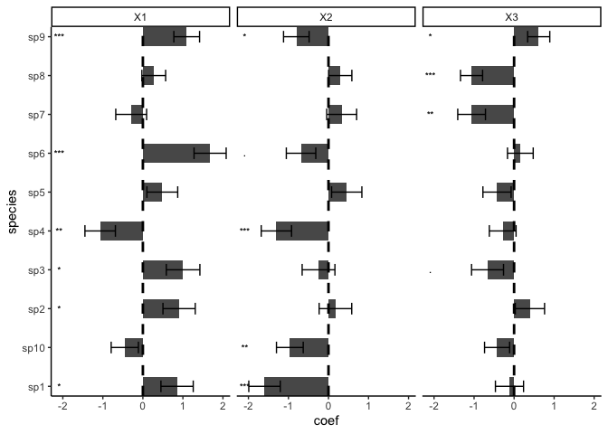
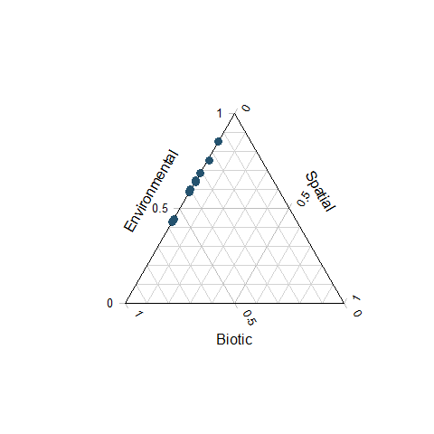
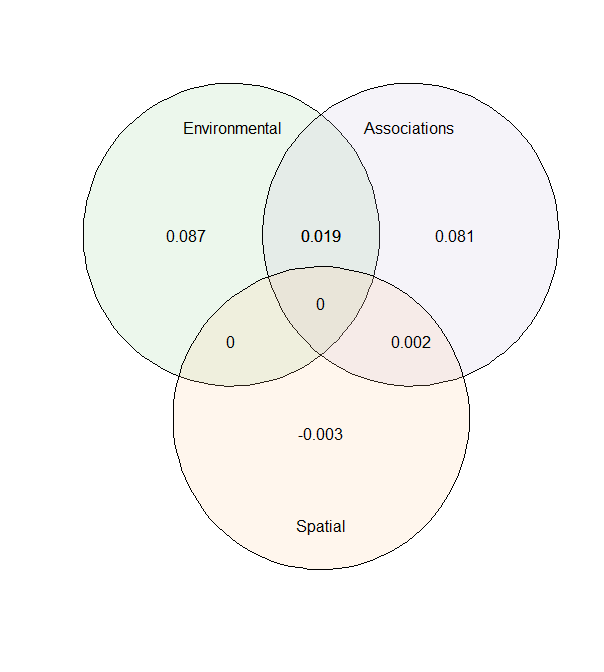

[](http://www.repostatus.org/#active)
[](https://www.gnu.org/licenses/gpl-3.0)

[](https://arxiv.org/abs/2003.05331)


# s-jSDM - Fast and accurate Joint Species Distribution Modeling

## About the method

The method is described in the preprint Pichler & Hartig (2020) A new method for faster and more accurate inference of species associations from novel community data, https://arxiv.org/abs/2003.05331. The code for producing the results in this paper is available under the subfolder publications in this repo.

The method itself is wrapped into an R package, available under subfolder sjSDM. You can also use it stand-alone under Python (see instructions below). Note: for both the R and the python package, python >= 3.6 and pytorch must be installed (more details below).

## Installing the R / Python package

### R-package

Install the package via


```r
devtools::install_github("https://github.com/TheoreticalEcology/s-jSDM", subdir = "sjSDM")
```

Depencies for the package can be installed before or after installing the package. Detailed explanations of the dependencies are provided in vignette("Dependencies", package = "sjSDM"), source code [here](https://github.com/TheoreticalEcology/s-jSDM/blob/master/sjSDM/vignettes/Dependencies.Rmd). Very briefly, the dependencies can be automatically installed from within R:


```r
sjSDM::install_sjSDM(version = "gpu") # or
sjSDM::install_sjSDM(version = "cpu")
```
Once the dependencies are installed, the following code should run:

Simulate a community and fit model:

```r
library(sjSDM)
```

```
## ── Attaching sjSDM ──────────────────────────────────────────────────── 0.1.8 ──
```

```
## ✓ torch 1.8.1 
## ✓ torch_optimizer  
## ✓ pyro  
## ✓ madgrad
```

```r
set.seed(42)
community <- simulate_SDM(sites = 100, species = 10, env = 3, se = TRUE)
Env <- community$env_weights
Occ <- community$response
SP <- matrix(rnorm(200, 0, 0.3), 100, 2) # spatial coordinates (no effect on species occurences)

model <- sjSDM(Y = Occ, env = linear(data = Env, formula = ~X1+X2+X3), spatial = linear(data = SP, formula = ~0+X1:X2), se = TRUE, family=binomial("probit"), sampling = 100L)
summary(model)
```

```
## LogLik:  -519.2663 
## Deviance:  1038.533 
## 
## Regularization loss:  0 
## 
## Species-species correlation matrix: 
## 
## 	sp1	 1.0000									
## 	sp2	-0.3470	 1.0000								
## 	sp3	-0.1490	-0.3480	 1.0000							
## 	sp4	-0.1330	-0.3150	 0.6940	 1.0000						
## 	sp5	 0.6020	-0.3350	-0.1080	-0.0830	 1.0000					
## 	sp6	-0.2070	 0.3720	 0.1590	 0.1540	-0.0520	 1.0000				
## 	sp7	 0.4690	-0.1390	 0.1260	 0.1380	 0.5060	 0.2440	 1.0000			
## 	sp8	 0.2620	 0.1260	-0.4260	-0.4230	 0.2350	-0.0420	 0.1140	 1.0000		
## 	sp9	-0.1230	-0.0330	 0.0730	 0.0690	-0.3270	-0.2540	-0.2360	-0.1400	 1.0000	
## 	sp10	 0.1940	 0.3830	-0.6030	-0.5490	 0.2490	 0.1080	 0.1280	 0.3980	-0.2450	 1.0000
## 
## 
## 
## Spatial: 
##             sp1        sp2       sp3        sp4       sp5       sp6       sp7
## X1:X2 0.2017385 -0.5219378 0.5007782 0.01025732 0.3357338 0.1805123 0.4433239
##             sp8       sp9      sp10
## X1:X2 0.4767243 0.2786916 0.2662722
## 
## 
## 
##                  Estimate  Std.Err Z value Pr(>|z|)    
## sp1 (Intercept)  -0.04668  0.21007   -0.22  0.82417    
## sp1 X1            0.85433  0.40349    2.12  0.03423 *  
## sp1 X2           -1.59775  0.39325   -4.06  4.8e-05 ***
## sp1 X3           -0.11534  0.35143   -0.33  0.74277    
## sp2 (Intercept)   0.00567  0.21830    0.03  0.97929    
## sp2 X1            0.90488  0.40328    2.24  0.02485 *  
## sp2 X2            0.17365  0.40714    0.43  0.66973    
## sp2 X3            0.39542  0.36572    1.08  0.27961    
## sp3 (Intercept)  -0.33710  0.23012   -1.46  0.14296    
## sp3 X1            1.00504  0.41926    2.40  0.01652 *  
## sp3 X2           -0.24865  0.40938   -0.61  0.54360    
## sp3 X3           -0.66338  0.39934   -1.66  0.09667 .  
## sp4 (Intercept)  -0.04491  0.19909   -0.23  0.82154    
## sp4 X1           -1.06715  0.38066   -2.80  0.00506 ** 
## sp4 X2           -1.30149  0.37881   -3.44  0.00059 ***
## sp4 X3           -0.28496  0.33398   -0.85  0.39354    
## sp5 (Intercept)  -0.16210  0.20355   -0.80  0.42580    
## sp5 X1            0.48549  0.38458    1.26  0.20680    
## sp5 X2            0.45590  0.37801    1.21  0.22780    
## sp5 X3           -0.42688  0.35208   -1.21  0.22535    
## sp6 (Intercept)   0.21479  0.19309    1.11  0.26597    
## sp6 X1            1.67947  0.40126    4.19  2.8e-05 ***
## sp6 X2           -0.68568  0.36798   -1.86  0.06241 .  
## sp6 X3            0.15612  0.32109    0.49  0.62682    
## sp7 (Intercept)   0.00268  0.20463    0.01  0.98956    
## sp7 X1           -0.29212  0.38520   -0.76  0.44824    
## sp7 X2            0.32947  0.37345    0.88  0.37765    
## sp7 X3           -1.06148  0.34616   -3.07  0.00217 ** 
## sp8 (Intercept)   0.12420  0.15614    0.80  0.42634    
## sp8 X1            0.27185  0.29669    0.92  0.35952    
## sp8 X2            0.29377  0.29016    1.01  0.31134    
## sp8 X3           -1.06289  0.27591   -3.85  0.00012 ***
## sp9 (Intercept)   0.04957  0.16780    0.30  0.76767    
## sp9 X1            1.09500  0.32137    3.41  0.00066 ***
## sp9 X2           -0.80343  0.31928   -2.52  0.01186 *  
## sp9 X3            0.61498  0.27669    2.22  0.02624 *  
## sp10 (Intercept) -0.09767  0.18515   -0.53  0.59783    
## sp10 X1          -0.45201  0.34024   -1.33  0.18401    
## sp10 X2          -0.96552  0.33418   -2.89  0.00386 ** 
## sp10 X3          -0.42500  0.31293   -1.36  0.17442    
## ---
## Signif. codes:  0 '***' 0.001 '**' 0.01 '*' 0.05 '.' 0.1 ' ' 1
```

```r
plot(model)
```

```
## LogLik:  -519.2663 
## Deviance:  1038.533 
## 
## Regularization loss:  0 
## 
## Species-species correlation matrix: 
## 
## 	sp1	 1.0000									
## 	sp2	-0.3470	 1.0000								
## 	sp3	-0.1490	-0.3480	 1.0000							
## 	sp4	-0.1330	-0.3150	 0.6940	 1.0000						
## 	sp5	 0.6020	-0.3350	-0.1080	-0.0830	 1.0000					
## 	sp6	-0.2070	 0.3720	 0.1590	 0.1540	-0.0520	 1.0000				
## 	sp7	 0.4690	-0.1390	 0.1260	 0.1380	 0.5060	 0.2440	 1.0000			
## 	sp8	 0.2620	 0.1260	-0.4260	-0.4230	 0.2350	-0.0420	 0.1140	 1.0000		
## 	sp9	-0.1230	-0.0330	 0.0730	 0.0690	-0.3270	-0.2540	-0.2360	-0.1400	 1.0000	
## 	sp10	 0.1940	 0.3830	-0.6030	-0.5490	 0.2490	 0.1080	 0.1280	 0.3980	-0.2450	 1.0000
## 
## 
## 
## Spatial: 
##             sp1        sp2       sp3        sp4       sp5       sp6       sp7
## X1:X2 0.2017385 -0.5219378 0.5007782 0.01025732 0.3357338 0.1805123 0.4433239
##             sp8       sp9      sp10
## X1:X2 0.4767243 0.2786916 0.2662722
## 
## 
## 
##                  Estimate  Std.Err Z value Pr(>|z|)    
## sp1 (Intercept)  -0.04668  0.21007   -0.22  0.82417    
## sp1 X1            0.85433  0.40349    2.12  0.03423 *  
## sp1 X2           -1.59775  0.39325   -4.06  4.8e-05 ***
## sp1 X3           -0.11534  0.35143   -0.33  0.74277    
## sp2 (Intercept)   0.00567  0.21830    0.03  0.97929    
## sp2 X1            0.90488  0.40328    2.24  0.02485 *  
## sp2 X2            0.17365  0.40714    0.43  0.66973    
## sp2 X3            0.39542  0.36572    1.08  0.27961    
## sp3 (Intercept)  -0.33710  0.23012   -1.46  0.14296    
## sp3 X1            1.00504  0.41926    2.40  0.01652 *  
## sp3 X2           -0.24865  0.40938   -0.61  0.54360    
## sp3 X3           -0.66338  0.39934   -1.66  0.09667 .  
## sp4 (Intercept)  -0.04491  0.19909   -0.23  0.82154    
## sp4 X1           -1.06715  0.38066   -2.80  0.00506 ** 
## sp4 X2           -1.30149  0.37881   -3.44  0.00059 ***
## sp4 X3           -0.28496  0.33398   -0.85  0.39354    
## sp5 (Intercept)  -0.16210  0.20355   -0.80  0.42580    
## sp5 X1            0.48549  0.38458    1.26  0.20680    
## sp5 X2            0.45590  0.37801    1.21  0.22780    
## sp5 X3           -0.42688  0.35208   -1.21  0.22535    
## sp6 (Intercept)   0.21479  0.19309    1.11  0.26597    
## sp6 X1            1.67947  0.40126    4.19  2.8e-05 ***
## sp6 X2           -0.68568  0.36798   -1.86  0.06241 .  
## sp6 X3            0.15612  0.32109    0.49  0.62682    
## sp7 (Intercept)   0.00268  0.20463    0.01  0.98956    
## sp7 X1           -0.29212  0.38520   -0.76  0.44824    
## sp7 X2            0.32947  0.37345    0.88  0.37765    
## sp7 X3           -1.06148  0.34616   -3.07  0.00217 ** 
## sp8 (Intercept)   0.12420  0.15614    0.80  0.42634    
## sp8 X1            0.27185  0.29669    0.92  0.35952    
## sp8 X2            0.29377  0.29016    1.01  0.31134    
## sp8 X3           -1.06289  0.27591   -3.85  0.00012 ***
## sp9 (Intercept)   0.04957  0.16780    0.30  0.76767    
## sp9 X1            1.09500  0.32137    3.41  0.00066 ***
## sp9 X2           -0.80343  0.31928   -2.52  0.01186 *  
## sp9 X3            0.61498  0.27669    2.22  0.02624 *  
## sp10 (Intercept) -0.09767  0.18515   -0.53  0.59783    
## sp10 X1          -0.45201  0.34024   -1.33  0.18401    
## sp10 X2          -0.96552  0.33418   -2.89  0.00386 ** 
## sp10 X3          -0.42500  0.31293   -1.36  0.17442    
## ---
## Signif. codes:  0 '***' 0.001 '**' 0.01 '*' 0.05 '.' 0.1 ' ' 1
```

<!-- -->

We also support also other response families:
Count data:

```r
model <- sjSDM(Y = Occ, env = linear(data = Env, formula = ~X1+X2+X3), spatial = linear(data = SP, formula = ~0+X1:X2), se = TRUE, family=poisson("log"))
```

Gaussian (normal):

```r
model <- sjSDM(Y = Occ, env = linear(data = Env, formula = ~X1+X2+X3), spatial = linear(data = SP, formula = ~0+X1:X2), se = TRUE, family=gaussian("identity"))
```


Let's have a look at the importance of the three groups (environment, associations, and space) on the occurences:

```r
imp = importance(model)
print(imp)
```

```
##    sp       env      spatial     biotic
## 1   1 0.8589315 3.013031e-04 0.14076720
## 2   2 0.5675128 3.699945e-03 0.42878732
## 3   3 0.7044504 3.400754e-03 0.29214883
## 4   4 0.9217997 7.990108e-07 0.07819952
## 5   5 0.4835313 2.264684e-03 0.51420414
## 6   6 0.8453201 2.368618e-04 0.15444306
## 7   7 0.5326438 1.774149e-03 0.46558201
## 8   8 0.9527548 3.998073e-03 0.04324713
## 9   9 0.7257190 6.672530e-04 0.27361366
## 10 10 0.9838505 1.245033e-03 0.01490446
```

```r
plot(imp)
```

<!-- -->


As expected, space has no effect on occurences.

Let's have a look on community level how the three groups contribute to the overall explained variance 

```r
an = anova(model)
print(an)
```

```
## Changes relative to empty model (without modules):
## 
##  Modules       LogLik            R2   marginal R2          R2ll
##        _  693.1472015  0.000000e+00  0.000000e+00  0.0000000000
##        A  -20.9406891  2.575189e-02  1.681852e-02  0.0302110274
##        B  -54.8976865  9.979542e-06  5.495647e-06  0.0792006176
##        S   -0.5050354  3.548230e-04  2.204540e-04  0.0007286120
##      A+B  -31.1016162 -1.813255e-03 -9.171146e-03  0.0448701461
##      A+S   -1.7000351 -8.537337e-05 -2.859601e-06  0.0024526321
##      B+S    0.5230101 -3.085427e-04 -2.074197e-04 -0.0007545441
##    A+B+S    2.0057018  7.642009e-05  4.288995e-05 -0.0028936159
##     Full -106.6163504  2.398594e-02  7.705938e-03  0.1538148753
```

```r
plot(an)
```

<!-- -->

The anova shows the relative changes in the logLik of the groups and their intersections.


If it fails, check out the help of ?install_sjSDM, ?installation_help, and vignette("Dependencies", package = "sjSDM"). 

#### Installation workflow:
1. Try install_sjSDM()
2. New session, if no 'PyTorch not found' appears it should work, otherwise see ?installation_help
3. If do not get the pkg to run, create an issue [issue tracker](https://github.com/TheoreticalEcology/s-jSDM/issues) or write an email to maximilian.pichler at ur.de


### Python Package

```bash
pip install sjSDM_py
```
Python example


```python
import sjSDM_py as fa
import numpy as np
import torch
Env = np.random.randn(100, 5)
Occ = np.random.binomial(1, 0.5, [100, 10])

model = fa.Model_sjSDM(device=torch.device("cpu"), dtype=torch.float32)
model.add_env(5, 10)
model.build(5, optimizer=fa.optimizer_adamax(0.001),scheduler=False)
model.fit(Env, Occ, batch_size = 20, epochs = 10)
# print(model.weights)
# print(model.covariance)
```

```
## 
Iter: 0/10   0%|          | [00:00, ?it/s]
Iter: 0/10   0%|          | [00:00, ?it/s, loss=7.346]
Iter: 0/10   0%|          | [00:00, ?it/s, loss=7.338]
Iter: 0/10   0%|          | [00:00, ?it/s, loss=7.32] 
Iter: 0/10   0%|          | [00:00, ?it/s, loss=7.355]
Iter: 0/10   0%|          | [00:00, ?it/s, loss=7.346]
Iter: 5/10  50%|#####     | [00:00, 45.41it/s, loss=7.346]
Iter: 5/10  50%|#####     | [00:00, 45.41it/s, loss=7.321]
Iter: 5/10  50%|#####     | [00:00, 45.41it/s, loss=7.342]
Iter: 5/10  50%|#####     | [00:00, 45.41it/s, loss=7.342]
Iter: 5/10  50%|#####     | [00:00, 45.41it/s, loss=7.293]
Iter: 5/10  50%|#####     | [00:00, 45.41it/s, loss=7.276]
Iter: 10/10 100%|##########| [00:00, 61.46it/s, loss=7.276]
```

Calculate Importance:

```python
Beta = np.transpose(model.env_weights[0])
Sigma = ( model.sigma @ model.sigma.t() + torch.diag(torch.ones([1])) ).data.cpu().numpy()
covX = fa.covariance( torch.tensor(Env).t() ).data.cpu().numpy()

fa.importance(beta=Beta, covX=covX, sigma=Sigma)
```

```
## {'env': array([[ 3.2407741e-04,  1.3276799e-02,  1.2425970e-06,  2.2610070e-04,
##          1.6272038e-02],
##        [ 6.1590006e-03,  1.1455329e-02,  7.5134016e-03,  3.0374834e-03,
##         -1.4110039e-05],
##        [ 3.7877087e-03,  7.9892538e-03,  1.1440719e-02,  1.2686077e-02,
##          8.8577205e-03],
##        [ 1.9791010e-03,  8.0312798e-03,  1.0438912e-02,  1.6460974e-02,
##          1.1275447e-04],
##        [ 1.3896627e-03,  4.0165647e-03,  1.2688404e-02,  1.3326498e-02,
##          4.3242457e-03],
##        [ 2.3300922e-03,  6.8507027e-03,  1.1002149e-02,  2.0594701e-02,
##          1.8424306e-02],
##        [-4.2955635e-05,  7.6487828e-03,  3.2863754e-03,  1.4759637e-02,
##          7.5021405e-03],
##        [ 4.6092714e-03,  5.0991686e-04,  9.3450835e-03,  1.4725971e-03,
##          5.9200292e-03],
##        [ 9.7127240e-03,  2.0431537e-04,  4.1876725e-04,  1.3396728e-03,
##          4.4111852e-04],
##        [ 5.8187786e-03,  1.5798494e-02,  1.2067342e-04,  5.7817604e-03,
##          3.6846734e-05]], dtype=float32), 'biotic': array([0.9698998 , 0.9718489 , 0.9552385 , 0.96297693, 0.9642547 ,
##        0.94079804, 0.96684605, 0.97814316, 0.98788345, 0.97244346],
##       dtype=float32)}
```

