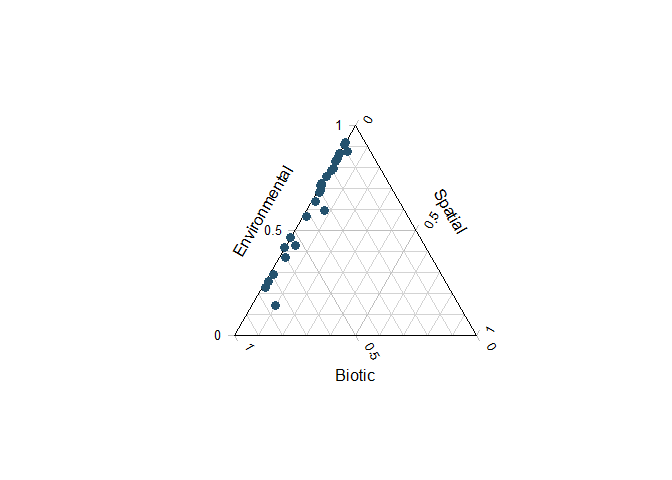

s-jSDM - Fast and accurate Joint Species Distribution Modeling
==============================================================

About the method
----------------

The method is described in the preprint Pichler & Hartig (2020) A new
method for faster and more accurate inference of species associations
from novel community data,
<a href="https://arxiv.org/abs/2003.05331" class="uri">https://arxiv.org/abs/2003.05331</a>.
The code for producing the results in this paper is available under the
subfolder publications in this repo.

The method itself is wrapped into an R package, available under
subfolder sjSDM. You can also use it stand-alone under Python (see
instructions below). Note: for both the R and the python package, python
&gt;= 3.6 and pytorch must be installed (more details below).

Installing the R / Python package
---------------------------------

### R-package

Install the package via

    devtools::install_github("https://github.com/TheoreticalEcology/s-jSDM", subdir = "sjSDM")

Depencies for the package can be installed before or after installing
the package. Detailed explanations of the dependencies are provided in
vignette(“Dependencies”, package = “sjSDM”), source code
[here](https://github.com/TheoreticalEcology/s-jSDM/blob/master/sjSDM/vignettes/Dependencies.Rmd).
Very briefly, the dependencies can be automatically installed from
within R:

    sjSDM::install_sjSDM(version = "gpu") # or
    sjSDM::install_sjSDM(version = "cpu")

Once the dependencies are installed, the following code should run:

Simulate a community and fit model:

    library(sjSDM)
    community <- simulate_SDM(sites = 400, species = 25, env = 5)
    Env <- community$env_weights
    Occ <- community$response
    SP <- matrix(rnorm(800), 400, 2) # spatial coordinates (no effect on species occurences)

    model <- sjSDM(Y = Occ, env = linear(data = Env, formula = ~0+X1*X2 + X3 + X4), spatial = linear(data = SP, formula = ~0+X1:X2), se = TRUE)
    summary(model)

    ## LogLik:  -5114.066 
    ## Deviance:  10228.13 
    ## 
    ## Regularization loss:  0 
    ## 
    ## Spatial: 
    ##               sp1       sp2      sp3         sp4       sp5         sp6
    ## X1:X2 0.003479636 0.0721169 0.120539 -0.07126164 0.1076812 -0.09856751
    ##             sp7        sp8        sp9        sp10        sp11      sp12
    ## X1:X2 0.1422359 -0.1790029 -0.1582193 -0.08041596 0.003509233 0.1824516
    ##              sp13       sp14        sp15       sp16       sp17        sp18
    ## X1:X2 -0.04547155 0.01902215 -0.08267748 0.01849904 0.02278391 -0.01140462
    ##             sp19        sp20       sp21        sp22        sp23       sp24
    ## X1:X2 -0.2056561 -0.04466659 0.07685047 -0.03643236 -0.02437863 0.01644401
    ##              sp25
    ## X1:X2 -0.07344739
    ## 
    ## 
    ## 
    ##            Estimate  Std.Err Z value Pr(>|z|)    
    ## sp1 X1     -0.54322  0.09593   -5.66  1.5e-08 ***
    ## sp1 X2     -0.58290  0.09119   -6.39  1.6e-10 ***
    ## sp1 X3      0.18673  0.09326    2.00  0.04525 *  
    ## sp1 X4      0.90990  0.10026    9.08  < 2e-16 ***
    ## sp1 X1:X2  -0.22376  0.15422   -1.45  0.14679    
    ## sp2 X1     -0.15109  0.08905   -1.70  0.08975 .  
    ## sp2 X2      0.20450  0.08417    2.43  0.01512 *  
    ## sp2 X3     -0.32659  0.09040   -3.61  0.00030 ***
    ## sp2 X4     -0.12189  0.09002   -1.35  0.17574    
    ## sp2 X1:X2  -0.16042  0.14424   -1.11  0.26606    
    ## sp3 X1     -0.68750  0.11117   -6.18  6.2e-10 ***
    ## sp3 X2     -0.89342  0.10566   -8.46  < 2e-16 ***
    ## sp3 X3     -0.29710  0.10467   -2.84  0.00453 ** 
    ## sp3 X4      0.14747  0.10850    1.36  0.17412    
    ## sp3 X1:X2  -0.03311  0.18725   -0.18  0.85965    
    ## sp4 X1     -0.61382  0.08690   -7.06  1.6e-12 ***
    ## sp4 X2      0.35000  0.07965    4.39  1.1e-05 ***
    ## sp4 X3      0.17911  0.08437    2.12  0.03377 *  
    ## sp4 X4     -0.47956  0.08742   -5.49  4.1e-08 ***
    ## sp4 X1:X2  -0.14909  0.13695   -1.09  0.27632    
    ## sp5 X1      0.42479  0.09501    4.47  7.8e-06 ***
    ## sp5 X2      0.62577  0.09260    6.76  1.4e-11 ***
    ## sp5 X3      0.15067  0.09480    1.59  0.11200    
    ## sp5 X4      0.60870  0.10078    6.04  1.5e-09 ***
    ## sp5 X1:X2   0.04878  0.15397    0.32  0.75136    
    ## sp6 X1     -0.78068  0.11218   -6.96  3.4e-12 ***
    ## sp6 X2     -0.72964  0.10354   -7.05  1.8e-12 ***
    ## sp6 X3     -0.46569  0.10811   -4.31  1.7e-05 ***
    ## sp6 X4     -0.25100  0.10890   -2.30  0.02118 *  
    ## sp6 X1:X2   0.31761  0.17585    1.81  0.07091 .  
    ## sp7 X1      0.46734  0.10154    4.60  4.2e-06 ***
    ## sp7 X2      0.35595  0.09651    3.69  0.00023 ***
    ## sp7 X3      0.05398  0.10082    0.54  0.59237    
    ## sp7 X4      0.58544  0.10616    5.51  3.5e-08 ***
    ## sp7 X1:X2  -0.36459  0.16359   -2.23  0.02583 *  
    ## sp8 X1     -0.21450  0.08522   -2.52  0.01184 *  
    ## sp8 X2      0.09692  0.08198    1.18  0.23714    
    ## sp8 X3      0.09350  0.08669    1.08  0.28079    
    ## sp8 X4     -0.23732  0.08778   -2.70  0.00686 ** 
    ## sp8 X1:X2   0.04008  0.13919    0.29  0.77339    
    ## sp9 X1      0.29782  0.11980    2.49  0.01292 *  
    ## sp9 X2      0.88960  0.11601    7.67  1.7e-14 ***
    ## sp9 X3     -0.34292  0.12075   -2.84  0.00451 ** 
    ## sp9 X4     -0.10253  0.12264   -0.84  0.40314    
    ## sp9 X1:X2   0.04177  0.19301    0.22  0.82868    
    ## sp10 X1     0.10676  0.07322    1.46  0.14481    
    ## sp10 X2    -0.54165  0.07122   -7.61  2.8e-14 ***
    ## sp10 X3     0.18227  0.07247    2.52  0.01189 *  
    ## sp10 X4    -0.34606  0.07470   -4.63  3.6e-06 ***
    ## sp10 X1:X2  0.17336  0.12190    1.42  0.15499    
    ## sp11 X1     0.20918  0.08959    2.33  0.01955 *  
    ## sp11 X2    -0.56449  0.08714   -6.48  9.3e-11 ***
    ## sp11 X3     0.13601  0.08816    1.54  0.12291    
    ## sp11 X4    -0.24721  0.09058   -2.73  0.00635 ** 
    ## sp11 X1:X2  0.16487  0.14677    1.12  0.26131    
    ## sp12 X1    -0.11188  0.09759   -1.15  0.25159    
    ## sp12 X2     0.70384  0.09637    7.30  2.8e-13 ***
    ## sp12 X3    -0.43060  0.09695   -4.44  8.9e-06 ***
    ## sp12 X4    -0.42028  0.09868   -4.26  2.1e-05 ***
    ## sp12 X1:X2 -0.21424  0.16356   -1.31  0.19025    
    ## sp13 X1    -0.15990  0.08220   -1.95  0.05174 .  
    ## sp13 X2    -0.20956  0.07915   -2.65  0.00810 ** 
    ## sp13 X3     0.84220  0.08891    9.47  < 2e-16 ***
    ## sp13 X4    -0.45308  0.08434   -5.37  7.8e-08 ***
    ## sp13 X1:X2  0.15891  0.13308    1.19  0.23243    
    ## sp14 X1    -0.51593  0.08686   -5.94  2.9e-09 ***
    ## sp14 X2    -0.15555  0.07866   -1.98  0.04800 *  
    ## sp14 X3    -0.21261  0.08334   -2.55  0.01073 *  
    ## sp14 X4    -0.66018  0.08836   -7.47  7.9e-14 ***
    ## sp14 X1:X2 -0.16686  0.13638   -1.22  0.22115    
    ## sp15 X1    -0.29271  0.10020   -2.92  0.00349 ** 
    ## sp15 X2     0.17813  0.09518    1.87  0.06129 .  
    ## sp15 X3    -0.38392  0.09909   -3.87  0.00011 ***
    ## sp15 X4    -0.18671  0.09811   -1.90  0.05703 .  
    ## sp15 X1:X2  0.25537  0.16366    1.56  0.11866    
    ## sp16 X1     0.40396  0.08782    4.60  4.2e-06 ***
    ## sp16 X2    -0.05835  0.08308   -0.70  0.48245    
    ## sp16 X3    -0.62324  0.08955   -6.96  3.4e-12 ***
    ## sp16 X4     0.19495  0.09020    2.16  0.03068 *  
    ## sp16 X1:X2  0.16649  0.14103    1.18  0.23778    
    ## sp17 X1    -0.13542  0.08433   -1.61  0.10831    
    ## sp17 X2     0.61726  0.08676    7.11  1.1e-12 ***
    ## sp17 X3    -0.62850  0.08931   -7.04  2.0e-12 ***
    ## sp17 X4     0.73275  0.09169    7.99  1.3e-15 ***
    ## sp17 X1:X2  0.18329  0.14013    1.31  0.19088    
    ## sp18 X1     0.50315  0.08250    6.10  1.1e-09 ***
    ## sp18 X2     0.56925  0.07789    7.31  2.7e-13 ***
    ## sp18 X3    -0.63752  0.08403   -7.59  3.3e-14 ***
    ## sp18 X4    -0.43145  0.08226   -5.25  1.6e-07 ***
    ## sp18 X1:X2  0.26826  0.13004    2.06  0.03912 *  
    ## sp19 X1     0.25887  0.09289    2.79  0.00533 ** 
    ## sp19 X2     0.31130  0.08742    3.56  0.00037 ***
    ## sp19 X3    -0.77248  0.09601   -8.05  8.6e-16 ***
    ## sp19 X4    -0.32201  0.09257   -3.48  0.00050 ***
    ## sp19 X1:X2 -0.13707  0.14775   -0.93  0.35353    
    ## sp20 X1     0.63666  0.08675    7.34  2.2e-13 ***
    ## sp20 X2    -0.41674  0.07936   -5.25  1.5e-07 ***
    ## sp20 X3    -0.65065  0.08569   -7.59  3.1e-14 ***
    ## sp20 X4     0.02842  0.08236    0.35  0.73001    
    ## sp20 X1:X2  0.19637  0.13977    1.40  0.16003    
    ## sp21 X1     0.62023  0.09043    6.86  6.9e-12 ***
    ## sp21 X2    -0.12222  0.08199   -1.49  0.13605    
    ## sp21 X3     0.59029  0.09104    6.48  8.9e-11 ***
    ## sp21 X4    -0.49647  0.08920   -5.57  2.6e-08 ***
    ## sp21 X1:X2 -0.14246  0.14378   -0.99  0.32177    
    ## sp22 X1     0.54740  0.07873    6.95  3.6e-12 ***
    ## sp22 X2     0.09590  0.07188    1.33  0.18219    
    ## sp22 X3     0.00573  0.07656    0.07  0.94037    
    ## sp22 X4    -0.31689  0.07881   -4.02  5.8e-05 ***
    ## sp22 X1:X2 -0.05483  0.12822   -0.43  0.66891    
    ## sp23 X1    -0.34377  0.08357   -4.11  3.9e-05 ***
    ## sp23 X2     0.42439  0.08116    5.23  1.7e-07 ***
    ## sp23 X3    -0.65364  0.08714   -7.50  6.3e-14 ***
    ## sp23 X4     0.22335  0.08307    2.69  0.00717 ** 
    ## sp23 X1:X2 -0.01655  0.13628   -0.12  0.90337    
    ## sp24 X1    -0.49923  0.08161   -6.12  9.5e-10 ***
    ## sp24 X2    -0.66130  0.08038   -8.23  < 2e-16 ***
    ## sp24 X3     0.28630  0.08170    3.50  0.00046 ***
    ## sp24 X4     0.55137  0.08395    6.57  5.1e-11 ***
    ## sp24 X1:X2 -0.09173  0.13131   -0.70  0.48482    
    ## sp25 X1     0.23987  0.08806    2.72  0.00645 ** 
    ## sp25 X2    -0.45711  0.08215   -5.56  2.6e-08 ***
    ## sp25 X3    -0.49836  0.08766   -5.68  1.3e-08 ***
    ## sp25 X4    -0.65332  0.08986   -7.27  3.6e-13 ***
    ## sp25 X1:X2  0.12900  0.14381    0.90  0.36970    
    ## ---
    ## Signif. codes:  0 '***' 0.001 '**' 0.01 '*' 0.05 '.' 0.1 ' ' 1

Let’s have a look at the importance of the three groups (environment,
associations, and space) on the occurences:

    imp = importance(model)
    print(imp)

    ##    sp       env      spatial     biotic
    ## 1   1 0.7118329 1.479108e-05 0.28815233
    ## 2   2 0.2255937 1.604411e-02 0.75836216
    ## 3   3 0.6396350 1.637759e-02 0.34398740
    ## 4   4 0.6906261 1.194881e-02 0.29742512
    ## 5   5 0.5651781 1.693082e-02 0.41789106
    ## 6   6 0.6795581 1.121821e-02 0.30922366
    ## 7   7 0.3698499 2.638809e-02 0.60376205
    ## 8   8 0.1428300 1.000338e-01 0.75713622
    ## 9   9 0.2920185 1.787696e-02 0.69010453
    ## 10 10 0.8756125 2.983491e-02 0.09455255
    ## 11 11 0.4171337 2.762328e-05 0.58283864
    ## 12 12 0.4281426 4.135236e-02 0.53050508
    ## 13 13 0.8412343 4.662698e-03 0.15410302
    ## 14 14 0.7231985 8.960682e-04 0.27590547
    ## 15 15 0.2554013 1.418794e-02 0.73041078
    ## 16 16 0.4649841 6.862910e-04 0.53432957
    ## 17 17 0.9082680 9.038071e-04 0.09082824
    ## 18 18 0.9214150 2.614407e-04 0.07832354
    ## 19 19 0.5939922 7.566350e-02 0.33034429
    ## 20 20 0.8292375 4.024144e-03 0.16673833
    ## 21 21 0.7949772 1.222159e-02 0.19280120
    ## 22 22 0.7130206 5.952958e-03 0.28102646
    ## 23 23 0.7575963 1.522978e-03 0.24088074
    ## 24 24 0.8679945 5.586881e-04 0.13144686
    ## 25 25 0.7856514 1.091906e-02 0.20342951

    plot(imp)

As expected, space has no effect on occurences.

Let’s have a look on community level how the three groups contribute to
the overall explained variance

    an = anova(model, cv = FALSE)
    print(an)

    ## Changes relative to empty model (without modules):
    ## 
    ##  Modules       LogLik            R2   marginal R2
    ##        _  6931.473633  0.000000e+00  0.000000e+00
    ##        A -1161.379395  4.078948e-02  4.936097e-02
    ##        B  -791.149707  6.856765e-06  1.269704e-05
    ##        S   -13.117676  5.123877e-04  6.413545e-04
    ##      A+B   126.204219 -4.174345e-03 -1.779265e-02
    ##      A+S    -4.564941 -3.319266e-05 -8.162152e-05
    ##      B+S    11.710635 -1.424590e-05 -2.084960e-04
    ##    A+B+S     3.055244  5.405944e-04  2.270261e-04
    ##     Full -1829.241621  3.762754e-02  3.215929e-02

    plot(an)

 The anova
shows the relative changes in the logLik of the groups and their
intersections:

Space has a high positive value which means that space does not increase
the model fit.

If it fails, check out the help of ?install\_sjSDM, ?installation\_help,
and vignette(“Dependencies”, package = “sjSDM”).

#### Installation workflow:

1.  Try install\_sjSDM()
2.  New session, if no ‘PyTorch not found’ appears it should work,
    otherwise see ?installation\_help
3.  If do not get the pkg to run, create an issue [issue
    tracker](https://github.com/TheoreticalEcology/s-jSDM/issues) or
    write an email to maximilian.pichler at ur.de

### Python Package

    pip install sjSDM_py

Python example

    import sjSDM_py as fa
    import numpy as np
    Env = np.random.randn(100, 5)
    Occ = np.random.binomial(1, 0.5, [100, 10])

    model = fa.Model_base(5)
    model.add_layer(fa.layers.Layer_dense(10))
    model.build(df=5, optimizer=fa.optimizer_adamax(0.1))
    model.fit(X = Env, Y = Occ)
    print(model.weights_numpy)
    print(model.get_cov())
