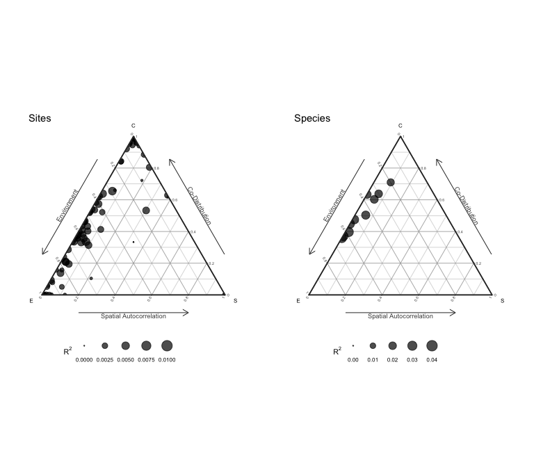

<!-- README.md is generated from README.Rmd. Please edit that file -->

[](http://www.repostatus.org/#active)
[](https://www.gnu.org/licenses/gpl-3.0)
[](https://cran.r-project.org/package=sjSDM)

[](https://besjournals.onlinelibrary.wiley.com/doi/abs/10.1111/2041-210X.13687)

# s-jSDM - Fast and accurate Joint Species Distribution Modeling

## About the method

The method is described in Pichler & Hartig (2021) A new joint species
distribution model for faster and more accurate inference of species
associations from big community data,
<https://doi.org/10.1111/2041-210X.13687>. The code for producing the
results in this paper is available under the subfolder publications in
this repo.

The method itself is wrapped into an R package, available under
subfolder sjSDM. You can also use it stand-alone under Python (see
instructions below). Note: for both the R and the python package, python
\>= 3.7 and pytorch must be installed (more details below).

## Installing the R / Python package

### R-package

Install the package via

``` r
install.packages("sjSDM")
```

Depencies for the package can be installed before or after installing
the package. Detailed explanations of the dependencies are provided in
vignette(“Dependencies”, package = “sjSDM”), source code
[here](https://github.com/TheoreticalEcology/s-jSDM/blob/master/sjSDM/vignettes/Dependencies.Rmd).
Very briefly, the dependencies can be automatically installed from
within R:

``` r
sjSDM::install_sjSDM(version = "gpu") # or
sjSDM::install_sjSDM(version = "cpu")
```

To cite sjSDM, please use the following citation:

``` r
citation("sjSDM")
```

### Development

If you want to install the current (development) version from this
repository, run

``` r
devtools::install_github("https://github.com/TheoreticalEcology/s-jSDM", subdir = "sjSDM", ref = "master")
```

Once the dependencies are installed, the following code should run:

## Workflow

Simulate a community and fit a sjSDM model:

``` r
library(sjSDM)
```

    ## ── Attaching sjSDM ──────────────────────────────────────────────────── 1.0.4 ──

    ## ✔ torch <environment> 
    ## ✔ torch_optimizer  
    ## ✔ pyro  
    ## ✔ madgrad

``` r
set.seed(42)
community <- simulate_SDM(sites = 100, species = 10, env = 3, se = TRUE)
Env <- community$env_weights
Occ <- community$response
SP <- matrix(rnorm(200, 0, 0.3), 100, 2) # spatial coordinates (no effect on species occurences)

model <- sjSDM(Y = Occ, env = linear(data = Env, formula = ~X1+X2+X3), spatial = linear(data = SP, formula = ~0+X1:X2), se = TRUE, family=binomial("probit"), sampling = 100L)
summary(model)
```

    ## Family:  binomial 
    ## 
    ## LogLik:  -510.9816 
    ## Regularization loss:  0 
    ## 
    ## Species-species correlation matrix: 
    ## 
    ##  sp1  1.0000                                 
    ##  sp2 -0.3780  1.0000                             
    ##  sp3 -0.2050 -0.4070  1.0000                         
    ##  sp4 -0.1850 -0.3860  0.8220  1.0000                     
    ##  sp5  0.6820 -0.4090 -0.1240 -0.0730  1.0000                 
    ##  sp6 -0.3050  0.4870  0.1630  0.1510 -0.1220  1.0000             
    ##  sp7  0.5830 -0.1190  0.0960  0.1200  0.5520  0.2450  1.0000         
    ##  sp8  0.3140  0.1690 -0.5280 -0.5460  0.2330 -0.0480  0.1300  1.0000     
    ##  sp9 -0.0620 -0.0250  0.0840  0.0640 -0.4010 -0.3430 -0.2060 -0.1380  1.0000 
    ##  sp10     0.2080  0.4750 -0.7140 -0.6490  0.2540  0.1410  0.1480  0.4560 -0.2850  1.0000
    ## 
    ## 
    ## 
    ## Spatial: 
    ##            sp1       sp2      sp3       sp4      sp5      sp6      sp7      sp8
    ## X1:X2 2.103188 -4.041381 3.452883 0.2332844 2.681165 1.325118 3.126471 1.928931
    ##             sp9     sp10
    ## X1:X2 0.9001696 1.262238
    ## 
    ## 
    ## 
    ##                  Estimate Std.Err Z value Pr(>|z|)    
    ## sp1 (Intercept)   -0.0847  0.2671   -0.32  0.75124    
    ## sp1 X1             1.3854  0.5241    2.64  0.00820 ** 
    ## sp1 X2            -2.4736  0.4839   -5.11  3.2e-07 ***
    ## sp1 X3            -0.2583  0.4362   -0.59  0.55385    
    ## sp2 (Intercept)   -0.0145  0.2601   -0.06  0.95560    
    ## sp2 X1             1.2578  0.5233    2.40  0.01625 *  
    ## sp2 X2             0.2357  0.4909    0.48  0.63112    
    ## sp2 X3             0.6825  0.4302    1.59  0.11266    
    ## sp3 (Intercept)   -0.5653  0.2861   -1.98  0.04819 *  
    ## sp3 X1             1.4285  0.5099    2.80  0.00509 ** 
    ## sp3 X2            -0.4155  0.5096   -0.82  0.41489    
    ## sp3 X3            -1.1364  0.4898   -2.32  0.02034 *  
    ## sp4 (Intercept)   -0.1156  0.2580   -0.45  0.65406    
    ## sp4 X1            -1.5792  0.4921   -3.21  0.00133 ** 
    ## sp4 X2            -1.9313  0.5088   -3.80  0.00015 ***
    ## sp4 X3            -0.4306  0.4314   -1.00  0.31822    
    ## sp5 (Intercept)   -0.2109  0.2526   -0.83  0.40378    
    ## sp5 X1             0.7425  0.4843    1.53  0.12525    
    ## sp5 X2             0.5624  0.4582    1.23  0.21969    
    ## sp5 X3            -0.7171  0.4154   -1.73  0.08433 .  
    ## sp6 (Intercept)    0.2184  0.2707    0.81  0.41973    
    ## sp6 X1             2.6087  0.5552    4.70  2.6e-06 ***
    ## sp6 X2            -1.1176  0.5271   -2.12  0.03400 *  
    ## sp6 X3             0.2021  0.4461    0.45  0.65049    
    ## sp7 (Intercept)   -0.0719  0.2448   -0.29  0.76903    
    ## sp7 X1            -0.3372  0.4899   -0.69  0.49132    
    ## sp7 X2             0.3403  0.4328    0.79  0.43175    
    ## sp7 X3            -1.4822  0.4269   -3.47  0.00052 ***
    ## sp8 (Intercept)    0.1574  0.1625    0.97  0.33270    
    ## sp8 X1             0.3657  0.3158    1.16  0.24688    
    ## sp8 X2             0.3236  0.3102    1.04  0.29688    
    ## sp8 X3            -1.2363  0.2850   -4.34  1.4e-05 ***
    ## sp9 (Intercept)    0.0235  0.2003    0.12  0.90667    
    ## sp9 X1             1.4160  0.3943    3.59  0.00033 ***
    ## sp9 X2            -1.0606  0.3755   -2.82  0.00473 ** 
    ## sp9 X3             0.7943  0.3444    2.31  0.02111 *  
    ## sp10 (Intercept)  -0.0825  0.2076   -0.40  0.69104    
    ## sp10 X1           -0.5510  0.3781   -1.46  0.14505    
    ## sp10 X2           -1.3145  0.3777   -3.48  0.00050 ***
    ## sp10 X3           -0.5257  0.3590   -1.46  0.14310    
    ## ---
    ## Signif. codes:  0 '***' 0.001 '**' 0.01 '*' 0.05 '.' 0.1 ' ' 1

``` r
plot(model)
```

    ## Family:  binomial 
    ## 
    ## LogLik:  -510.9816 
    ## Regularization loss:  0 
    ## 
    ## Species-species correlation matrix: 
    ## 
    ##  sp1  1.0000                                 
    ##  sp2 -0.3780  1.0000                             
    ##  sp3 -0.2050 -0.4070  1.0000                         
    ##  sp4 -0.1850 -0.3860  0.8220  1.0000                     
    ##  sp5  0.6820 -0.4090 -0.1240 -0.0730  1.0000                 
    ##  sp6 -0.3050  0.4870  0.1630  0.1510 -0.1220  1.0000             
    ##  sp7  0.5830 -0.1190  0.0960  0.1200  0.5520  0.2450  1.0000         
    ##  sp8  0.3140  0.1690 -0.5280 -0.5460  0.2330 -0.0480  0.1300  1.0000     
    ##  sp9 -0.0620 -0.0250  0.0840  0.0640 -0.4010 -0.3430 -0.2060 -0.1380  1.0000 
    ##  sp10     0.2080  0.4750 -0.7140 -0.6490  0.2540  0.1410  0.1480  0.4560 -0.2850  1.0000
    ## 
    ## 
    ## 
    ## Spatial: 
    ##            sp1       sp2      sp3       sp4      sp5      sp6      sp7      sp8
    ## X1:X2 2.103188 -4.041381 3.452883 0.2332844 2.681165 1.325118 3.126471 1.928931
    ##             sp9     sp10
    ## X1:X2 0.9001696 1.262238
    ## 
    ## 
    ## 
    ##                  Estimate Std.Err Z value Pr(>|z|)    
    ## sp1 (Intercept)   -0.0847  0.2671   -0.32  0.75124    
    ## sp1 X1             1.3854  0.5241    2.64  0.00820 ** 
    ## sp1 X2            -2.4736  0.4839   -5.11  3.2e-07 ***
    ## sp1 X3            -0.2583  0.4362   -0.59  0.55385    
    ## sp2 (Intercept)   -0.0145  0.2601   -0.06  0.95560    
    ## sp2 X1             1.2578  0.5233    2.40  0.01625 *  
    ## sp2 X2             0.2357  0.4909    0.48  0.63112    
    ## sp2 X3             0.6825  0.4302    1.59  0.11266    
    ## sp3 (Intercept)   -0.5653  0.2861   -1.98  0.04819 *  
    ## sp3 X1             1.4285  0.5099    2.80  0.00509 ** 
    ## sp3 X2            -0.4155  0.5096   -0.82  0.41489    
    ## sp3 X3            -1.1364  0.4898   -2.32  0.02034 *  
    ## sp4 (Intercept)   -0.1156  0.2580   -0.45  0.65406    
    ## sp4 X1            -1.5792  0.4921   -3.21  0.00133 ** 
    ## sp4 X2            -1.9313  0.5088   -3.80  0.00015 ***
    ## sp4 X3            -0.4306  0.4314   -1.00  0.31822    
    ## sp5 (Intercept)   -0.2109  0.2526   -0.83  0.40378    
    ## sp5 X1             0.7425  0.4843    1.53  0.12525    
    ## sp5 X2             0.5624  0.4582    1.23  0.21969    
    ## sp5 X3            -0.7171  0.4154   -1.73  0.08433 .  
    ## sp6 (Intercept)    0.2184  0.2707    0.81  0.41973    
    ## sp6 X1             2.6087  0.5552    4.70  2.6e-06 ***
    ## sp6 X2            -1.1176  0.5271   -2.12  0.03400 *  
    ## sp6 X3             0.2021  0.4461    0.45  0.65049    
    ## sp7 (Intercept)   -0.0719  0.2448   -0.29  0.76903    
    ## sp7 X1            -0.3372  0.4899   -0.69  0.49132    
    ## sp7 X2             0.3403  0.4328    0.79  0.43175    
    ## sp7 X3            -1.4822  0.4269   -3.47  0.00052 ***
    ## sp8 (Intercept)    0.1574  0.1625    0.97  0.33270    
    ## sp8 X1             0.3657  0.3158    1.16  0.24688    
    ## sp8 X2             0.3236  0.3102    1.04  0.29688    
    ## sp8 X3            -1.2363  0.2850   -4.34  1.4e-05 ***
    ## sp9 (Intercept)    0.0235  0.2003    0.12  0.90667    
    ## sp9 X1             1.4160  0.3943    3.59  0.00033 ***
    ## sp9 X2            -1.0606  0.3755   -2.82  0.00473 ** 
    ## sp9 X3             0.7943  0.3444    2.31  0.02111 *  
    ## sp10 (Intercept)  -0.0825  0.2076   -0.40  0.69104    
    ## sp10 X1           -0.5510  0.3781   -1.46  0.14505    
    ## sp10 X2           -1.3145  0.3777   -3.48  0.00050 ***
    ## sp10 X3           -0.5257  0.3590   -1.46  0.14310    
    ## ---
    ## Signif. codes:  0 '***' 0.001 '**' 0.01 '*' 0.05 '.' 0.1 ' ' 1

<!-- -->

We support other distributions:

- Count data with Poisson:

``` r
model <- sjSDM(Y = Occ, env = linear(data = Env, formula = ~X1+X2+X3), spatial = linear(data = SP, formula = ~0+X1:X2), se = TRUE, family=poisson("log"))
```

- Count data with negative Binomial (which is still experimental, if you
  run into errors/problems, please let us know):

``` r
model <- sjSDM(Y = Occ, env = linear(data = Env, formula = ~X1+X2+X3), spatial = linear(data = SP, formula = ~0+X1:X2), se = TR, family="nbinom")
```

- Gaussian (normal):

``` r
model <- sjSDM(Y = Occ, env = linear(data = Env, formula = ~X1+X2+X3), spatial = linear(data = SP, formula = ~0+X1:X2), se = TR, family=gaussian("identity"))
```

### Anova

ANOVA can be used to partition the three components (abiotic, biotic,
and spatial):

``` r
an = anova(model)
print(an)
```

    ## Analysis of Deviance Table
    ## 
    ## Terms added sequentially:
    ## 
    ##           Deviance Residual deviance R2 Nagelkerke R2 McFadden
    ## Abiotic  157.95722        1177.48500       0.79394      0.1139
    ## Biotic   175.41278        1160.02944       0.82694      0.1265
    ## Spatial   17.38643        1318.05579       0.15959      0.0125
    ## Full     385.98836         949.45386       0.97893      0.2784

``` r
plot(an)
```

<!-- -->

The anova shows the relative changes in the R<sup>2</sup> of the groups
and their intersections.

### Internal metacommunity structure

Following [Leibold et al., 2022](https://doi.org/10.1111/oik.08618) we
can calculate and visualize the internal metacommunity structure
(=partitioning of the three components for species and sites). The
internal structure is already calculated by the ANOVA and we can
visualize it with the plot method:

``` r
results = plotInternalStructure(an) # or plot(an, internal = TRUE)
```

    ## Registered S3 methods overwritten by 'ggtern':
    ##   method           from   
    ##   grid.draw.ggplot ggplot2
    ##   plot.ggplot      ggplot2
    ##   print.ggplot     ggplot2

<!-- -->

The plot function returns the results for the internal metacommunity
structure:

``` r
print(results$data$Species)
```

    ##           env         spa     codist         r2
    ## 1  0.17677667 0.000000000 0.16810146 0.03375475
    ## 2  0.08724636 0.026656011 0.18072040 0.02946228
    ## 3  0.12613742 0.004529856 0.21004115 0.03407084
    ## 4  0.16648179 0.000000000 0.15890110 0.03241345
    ## 5  0.08585343 0.005811074 0.16168802 0.02533525
    ## 6  0.18787936 0.012341719 0.11489709 0.03151182
    ## 7  0.10765006 0.012898782 0.13292549 0.02534743
    ## 8  0.12445149 0.015040332 0.06188116 0.02013730
    ## 9  0.17762242 0.000000000 0.04357315 0.02196159
    ## 10 0.08805858 0.017406001 0.13890574 0.02443703

## Installation trouble shooting

If the installation fails, check out the help of ?install_sjSDM,
?installation_help, and vignette(“Dependencies”, package = “sjSDM”).

1.  Try install_sjSDM()
2.  New session, if no ‘PyTorch not found’ appears it should work,
    otherwise see ?installation_help
3.  If do not get the pkg to run, create an issue [issue
    tracker](https://github.com/TheoreticalEcology/s-jSDM/issues) or
    write an email to maximilian.pichler at ur.de

### Python Package

``` bash
pip install sjSDM_py
```

Python example

``` python
import sjSDM_py as fa
import numpy as np
import torch
Env = np.random.randn(100, 5)
Occ = np.random.binomial(1, 0.5, [100, 10])

model = fa.Model_sjSDM(device=torch.device("cpu"), dtype=torch.float32)
model.add_env(5, 10)
model.build(5, optimizer=fa.optimizer_adamax(0.001),scheduler=False)
model.fit(Env, Occ, batch_size = 20, epochs = 10)
# print(model.weights)
# print(model.covariance)
```

    ## Iter: 0/10   0%|          | [00:00, ?it/s]Iter: 0/10   0%|          | [00:00, ?it/s, loss=7.17]Iter: 1/10  10%|#         | [00:00,  3.88it/s, loss=7.17]Iter: 1/10  10%|#         | [00:00,  3.88it/s, loss=7.158]Iter: 1/10  10%|#         | [00:00,  3.88it/s, loss=7.149]Iter: 1/10  10%|#         | [00:00,  3.88it/s, loss=7.142]Iter: 1/10  10%|#         | [00:00,  3.88it/s, loss=7.124]Iter: 1/10  10%|#         | [00:00,  3.88it/s, loss=7.118]Iter: 1/10  10%|#         | [00:00,  3.88it/s, loss=7.112]Iter: 1/10  10%|#         | [00:00,  3.88it/s, loss=7.108]Iter: 1/10  10%|#         | [00:00,  3.88it/s, loss=7.118]Iter: 9/10  90%|######### | [00:00, 30.63it/s, loss=7.118]Iter: 9/10  90%|######### | [00:00, 30.63it/s, loss=7.144]Iter: 10/10 100%|##########| [00:00, 26.74it/s, loss=7.144]

Calculate Importance:

``` python
Beta = np.transpose(model.env_weights[0])
Sigma = ( model.sigma @ model.sigma.t() + torch.diag(torch.ones([1])) ).data.cpu().numpy()
covX = fa.covariance( torch.tensor(Env).t() ).data.cpu().numpy()

fa.importance(beta=Beta, covX=covX, sigma=Sigma)
```

    ## {'env': array([[ 1.2717709e-02,  7.8437300e-03,  6.6514793e-03, -3.3015787e-04,
    ##          2.3806898e-04],
    ##        [ 9.9158729e-05, -1.8891758e-06,  1.0537009e-03,  4.0511694e-04,
    ##          1.1120385e-02],
    ##        [ 6.1564189e-03,  5.9850062e-03,  9.2307013e-03,  5.4843356e-03,
    ##         -3.3683516e-04],
    ##        [ 1.3349474e-02,  4.3294221e-04,  1.8103119e-03,  1.4068705e-02,
    ##          6.6316797e-04],
    ##        [ 3.3953122e-05,  3.1304134e-03,  2.6658648e-03, -3.6165391e-05,
    ##          7.3677581e-03],
    ##        [ 2.7722977e-03,  1.9519718e-03,  4.8086399e-04,  3.0876237e-03,
    ##          1.7828522e-04],
    ##        [ 7.9284189e-03,  5.7881157e-04,  7.5722663e-03,  2.1802005e-06,
    ##          4.2433664e-03],
    ##        [-5.1329907e-06,  6.0144444e-03,  2.1059261e-05,  7.5954124e-03,
    ##          1.5537007e-03],
    ##        [ 7.7161851e-04,  1.7209088e-02,  4.8407568e-03,  1.8020724e-03,
    ##          5.6920521e-04],
    ##        [ 1.7108561e-02,  7.2742125e-04,  9.4651995e-04,  6.8342132e-03,
    ##          1.1830850e-02]], dtype=float32), 'biotic': array([0.9728792 , 0.9873236 , 0.9734804 , 0.9696754 , 0.9868381 ,
    ##        0.9915289 , 0.97967494, 0.9848205 , 0.9748072 , 0.9625524 ],
    ##       dtype=float32)}
