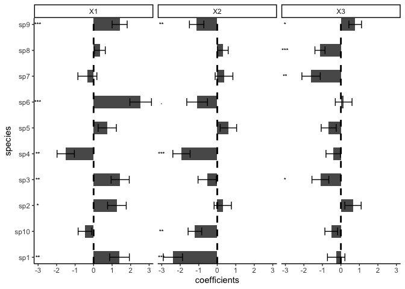
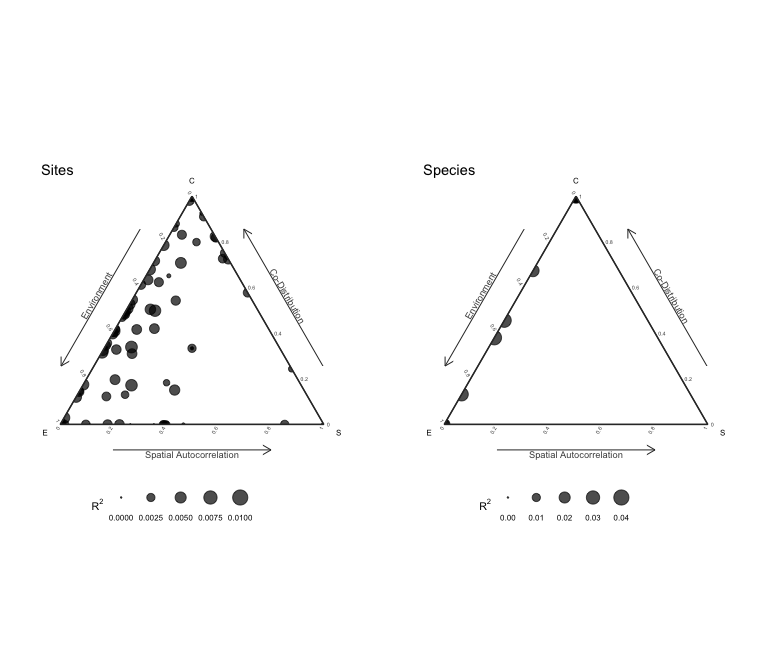
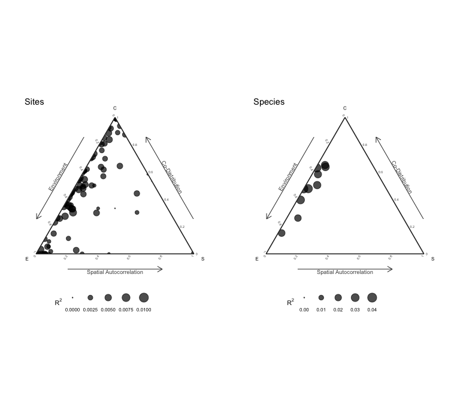

[](http://www.repostatus.org/#active)
[](https://www.gnu.org/licenses/gpl-3.0)
[](https://cran.r-project.org/package=sjSDM)

[](https://besjournals.onlinelibrary.wiley.com/doi/abs/10.1111/2041-210X.13687)

# s-jSDM - Fast and accurate Joint Species Distribution Modeling

## About the method

The method is described in Pichler & Hartig (2021) A new joint species
distribution model for faster and more accurate inference of species
associations from big community data,
https://doi.org/10.1111/2041-210X.13687. The code for producing the
results in this paper is available under the subfolder publications in
this repo.

The method itself is wrapped into an R package, available under
subfolder sjSDM. You can also use it stand-alone under Python (see
instructions below). Note: for both the R and the python package, python
\>= 3.7 and pytorch must be installed (more details below).

## Installing the R / Python package

### R-package

Install the package via

``` r
install.packages("sjSDM")
```

Depencies for the package can be installed before or after installing
the package. Detailed explanations of the dependencies are provided in
vignette(“Dependencies”, package = “sjSDM”), source code
[here](https://github.com/TheoreticalEcology/s-jSDM/blob/master/sjSDM/vignettes/Dependencies.Rmd).
Very briefly, the dependencies can be automatically installed from
within R:

``` r
sjSDM::install_sjSDM(version = "gpu") # or
sjSDM::install_sjSDM(version = "cpu")
```

To cite sjSDM, please use the following citation:

``` r
citation("sjSDM")
```

### Development

If you want to install the current (development) version from this
repository, run

``` r
devtools::install_github("https://github.com/TheoreticalEcology/s-jSDM", subdir = "sjSDM", ref = "master")
```

Once the dependencies are installed, the following code should run:

## Workflow

Simulate a community and fit a sjSDM model:

``` r
library(sjSDM)
```

    ── Attaching sjSDM ──────────────────────────────────────────────────── 1.0.4 ──

    ✔ torch <environment> 
    ✔ torch_optimizer  
    ✔ pyro  
    ✔ madgrad  

``` r
set.seed(42)
community <- simulate_SDM(sites = 100, species = 10, env = 3, se = TRUE)
Env <- community$env_weights
Occ <- community$response
SP <- matrix(rnorm(200, 0, 0.3), 100, 2) # spatial coordinates (no effect on species occurences)

model <- sjSDM(Y = Occ, env = linear(data = Env, formula = ~X1+X2+X3), spatial = linear(data = SP, formula = ~0+X1:X2), se = TRUE, family=binomial("probit"), sampling = 100L)
summary(model)
```

    Family:  binomial 

    LogLik:  -505.4728 
    Regularization loss:  0 

    Species-species correlation matrix: 

        sp1  1.0000                                 
        sp2 -0.3860  1.0000                             
        sp3 -0.2000 -0.4260  1.0000                         
        sp4 -0.1890 -0.3920  0.8240  1.0000                     
        sp5  0.6760 -0.3840 -0.1470 -0.1110  1.0000                 
        sp6 -0.2790  0.4500  0.1830  0.1810 -0.0900  1.0000             
        sp7  0.5860 -0.1360  0.0950  0.1320  0.5530  0.2570  1.0000         
        sp8  0.3320  0.1810 -0.4990 -0.5350  0.2180 -0.0310  0.1380  1.0000     
        sp9 -0.0800 -0.0480  0.0740  0.0760 -0.4170 -0.3670 -0.2230 -0.1340  1.0000 
        sp10     0.1950  0.4840 -0.7210 -0.6690  0.2890  0.1400  0.1390  0.4450 -0.3140  1.0000


    Spatial: 
               sp1       sp2      sp3       sp4      sp5       sp6      sp7
    X1:X2 2.072418 -4.446602 3.329855 0.4583002 3.072381 0.9594264 3.306698
               sp8      sp9     sp10
    X1:X2 2.048391 1.096549 1.401054

                     Estimate Std.Err Z value Pr(>|z|)    
    sp1 (Intercept)   -0.0622  0.2739   -0.23  0.82045    
    sp1 X1             1.4272  0.5240    2.72  0.00646 ** 
    sp1 X2            -2.3785  0.5068   -4.69  2.7e-06 ***
    sp1 X3            -0.2517  0.4591   -0.55  0.58348    
    sp2 (Intercept)    0.0132  0.2692    0.05  0.96092    
    sp2 X1             1.2904  0.5006    2.58  0.00994 ** 
    sp2 X2             0.3020  0.5156    0.59  0.55809    
    sp2 X3             0.7117  0.4542    1.57  0.11711    
    sp3 (Intercept)   -0.5467  0.2650   -2.06  0.03910 *  
    sp3 X1             1.4889  0.5028    2.96  0.00307 ** 
    sp3 X2            -0.5022  0.4720   -1.06  0.28727    
    sp3 X3            -1.0824  0.4618   -2.34  0.01909 *  
    sp4 (Intercept)   -0.0955  0.2521   -0.38  0.70488    
    sp4 X1            -1.5032  0.5146   -2.92  0.00349 ** 
    sp4 X2            -1.9947  0.4927   -4.05  5.1e-05 ***
    sp4 X3            -0.3683  0.4136   -0.89  0.37324    
    sp5 (Intercept)   -0.2253  0.2762   -0.82  0.41482    
    sp5 X1             0.7955  0.5272    1.51  0.13133    
    sp5 X2             0.6688  0.4897    1.37  0.17202    
    sp5 X3            -0.6759  0.4678   -1.44  0.14847    
    sp6 (Intercept)    0.2906  0.2667    1.09  0.27589    
    sp6 X1             2.6234  0.5784    4.54  5.7e-06 ***
    sp6 X2            -1.1700  0.5203   -2.25  0.02454 *  
    sp6 X3             0.1767  0.4268    0.41  0.67881    
    sp7 (Intercept)   -0.0217  0.2603   -0.08  0.93355    
    sp7 X1            -0.2533  0.4840   -0.52  0.60071    
    sp7 X2             0.3528  0.4621    0.76  0.44513    
    sp7 X3            -1.5303  0.4298   -3.56  0.00037 ***
    sp8 (Intercept)    0.1448  0.1697    0.85  0.39345    
    sp8 X1             0.3352  0.3282    1.02  0.30708    
    sp8 X2             0.3396  0.3196    1.06  0.28791    
    sp8 X3            -1.2771  0.3019   -4.23  2.3e-05 ***
    sp9 (Intercept)    0.0454  0.1953    0.23  0.81625    
    sp9 X1             1.3937  0.3717    3.75  0.00018 ***
    sp9 X2            -1.0830  0.3628   -2.98  0.00284 ** 
    sp9 X3             0.7769  0.3365    2.31  0.02097 *  
    sp10 (Intercept)  -0.0763  0.2159   -0.35  0.72357    
    sp10 X1           -0.5482  0.3957   -1.39  0.16586    
    sp10 X2           -1.2830  0.3802   -3.37  0.00074 ***
    sp10 X3           -0.5758  0.3747   -1.54  0.12436    
    ---
    Signif. codes:  0 '***' 0.001 '**' 0.01 '*' 0.05 '.' 0.1 ' ' 1

``` r
plot(model)
```

    Family:  binomial 

    LogLik:  -505.4728 
    Regularization loss:  0 

    Species-species correlation matrix: 

        sp1  1.0000                                 
        sp2 -0.3860  1.0000                             
        sp3 -0.2000 -0.4260  1.0000                         
        sp4 -0.1890 -0.3920  0.8240  1.0000                     
        sp5  0.6760 -0.3840 -0.1470 -0.1110  1.0000                 
        sp6 -0.2790  0.4500  0.1830  0.1810 -0.0900  1.0000             
        sp7  0.5860 -0.1360  0.0950  0.1320  0.5530  0.2570  1.0000         
        sp8  0.3320  0.1810 -0.4990 -0.5350  0.2180 -0.0310  0.1380  1.0000     
        sp9 -0.0800 -0.0480  0.0740  0.0760 -0.4170 -0.3670 -0.2230 -0.1340  1.0000 
        sp10     0.1950  0.4840 -0.7210 -0.6690  0.2890  0.1400  0.1390  0.4450 -0.3140  1.0000


    Spatial: 
               sp1       sp2      sp3       sp4      sp5       sp6      sp7
    X1:X2 2.072418 -4.446602 3.329855 0.4583002 3.072381 0.9594264 3.306698
               sp8      sp9     sp10
    X1:X2 2.048391 1.096549 1.401054

                     Estimate Std.Err Z value Pr(>|z|)    
    sp1 (Intercept)   -0.0622  0.2739   -0.23  0.82045    
    sp1 X1             1.4272  0.5240    2.72  0.00646 ** 
    sp1 X2            -2.3785  0.5068   -4.69  2.7e-06 ***
    sp1 X3            -0.2517  0.4591   -0.55  0.58348    
    sp2 (Intercept)    0.0132  0.2692    0.05  0.96092    
    sp2 X1             1.2904  0.5006    2.58  0.00994 ** 
    sp2 X2             0.3020  0.5156    0.59  0.55809    
    sp2 X3             0.7117  0.4542    1.57  0.11711    
    sp3 (Intercept)   -0.5467  0.2650   -2.06  0.03910 *  
    sp3 X1             1.4889  0.5028    2.96  0.00307 ** 
    sp3 X2            -0.5022  0.4720   -1.06  0.28727    
    sp3 X3            -1.0824  0.4618   -2.34  0.01909 *  
    sp4 (Intercept)   -0.0955  0.2521   -0.38  0.70488    
    sp4 X1            -1.5032  0.5146   -2.92  0.00349 ** 
    sp4 X2            -1.9947  0.4927   -4.05  5.1e-05 ***
    sp4 X3            -0.3683  0.4136   -0.89  0.37324    
    sp5 (Intercept)   -0.2253  0.2762   -0.82  0.41482    
    sp5 X1             0.7955  0.5272    1.51  0.13133    
    sp5 X2             0.6688  0.4897    1.37  0.17202    
    sp5 X3            -0.6759  0.4678   -1.44  0.14847    
    sp6 (Intercept)    0.2906  0.2667    1.09  0.27589    
    sp6 X1             2.6234  0.5784    4.54  5.7e-06 ***
    sp6 X2            -1.1700  0.5203   -2.25  0.02454 *  
    sp6 X3             0.1767  0.4268    0.41  0.67881    
    sp7 (Intercept)   -0.0217  0.2603   -0.08  0.93355    
    sp7 X1            -0.2533  0.4840   -0.52  0.60071    
    sp7 X2             0.3528  0.4621    0.76  0.44513    
    sp7 X3            -1.5303  0.4298   -3.56  0.00037 ***
    sp8 (Intercept)    0.1448  0.1697    0.85  0.39345    
    sp8 X1             0.3352  0.3282    1.02  0.30708    
    sp8 X2             0.3396  0.3196    1.06  0.28791    
    sp8 X3            -1.2771  0.3019   -4.23  2.3e-05 ***
    sp9 (Intercept)    0.0454  0.1953    0.23  0.81625    
    sp9 X1             1.3937  0.3717    3.75  0.00018 ***
    sp9 X2            -1.0830  0.3628   -2.98  0.00284 ** 
    sp9 X3             0.7769  0.3365    2.31  0.02097 *  
    sp10 (Intercept)  -0.0763  0.2159   -0.35  0.72357    
    sp10 X1           -0.5482  0.3957   -1.39  0.16586    
    sp10 X2           -1.2830  0.3802   -3.37  0.00074 ***
    sp10 X3           -0.5758  0.3747   -1.54  0.12436    
    ---
    Signif. codes:  0 '***' 0.001 '**' 0.01 '*' 0.05 '.' 0.1 ' ' 1



We support other distributions:

- Count data with Poisson:

  ``` r
  model <- sjSDM(Y = Occ, env = linear(data = Env, formula = ~X1+X2+X3), spatial = linear(data = SP, formula = ~0+X1:X2), se = TRUE, family=poisson("log"))
  ```

- Count data with negative Binomial (which is still experimental, if you
  run into errors/problems, please let us know):

  ``` r
  model <- sjSDM(Y = Occ, env = linear(data = Env, formula = ~X1+X2+X3), spatial = linear(data = SP, formula = ~0+X1:X2), se = TRUE, family="nbinom")
  ```

- Gaussian (normal):

  ``` r
  model <- sjSDM(Y = Occ, env = linear(data = Env, formula = ~X1+X2+X3), spatial = linear(data = SP, formula = ~0+X1:X2), se = TRUE, family=gaussian("identity"))
  ```

### Anova

ANOVA can be used to partition the three components (abiotic, biotic,
and spatial):

``` r
an = anova(model)
print(an)
```

    Analysis of Deviance Table

    Terms added sequentially:

              Deviance Residual deviance R2 Nagelkerke R2 McFadden
    Abiotic  157.09641        1178.57816       0.79216      0.1133
    Biotic   176.07245        1159.60211       0.82808      0.1270
    Spatial   17.92756        1317.74700       0.16412      0.0129
    Full     387.65425         948.02032       0.97928      0.2796

``` r
plot(an)
```



The anova shows the relative changes in the R<sup>2</sup> of the groups
and their intersections.

### Internal metacommunity structure

Following [Leibold et al., 2022](https://doi.org/10.1111/oik.08618) we
can calculate and visualize the internal metacommunity structure
(=partitioning of the three components for species and sites). The
internal structure is already calculated by the ANOVA and we can
visualize it with the plot method:

``` r
results = plotInternalStructure(an) # or plot(an, internal = TRUE)
```

    Registered S3 methods overwritten by 'ggtern':
      method           from   
      grid.draw.ggplot ggplot2
      plot.ggplot      ggplot2
      print.ggplot     ggplot2



The plot function returns the results for the internal metacommunity
structure:

``` r
print(results$data$Species)
```

              env         spa     codist         r2
    1  0.18044361 0.000000000 0.16435798 0.03417893
    2  0.08719579 0.016469569 0.18206998 0.02857353
    3  0.12042610 0.002071967 0.20873875 0.03312368
    4  0.16382266 0.009388911 0.15847578 0.03316874
    5  0.07743164 0.012330531 0.16735626 0.02571184
    6  0.17986330 0.006288437 0.12168938 0.03078411
    7  0.11204025 0.018965544 0.13302088 0.02640267
    8  0.13813093 0.014607854 0.05428744 0.02070262
    9  0.18089914 0.004841620 0.03345477 0.02191955
    10 0.09522767 0.009294500 0.14615532 0.02506775

## Installation trouble shooting

If the installation fails, check out the help of ?install_sjSDM,
?installation_help, and vignette(“Dependencies”, package = “sjSDM”).

1.  Try install_sjSDM()
2.  New session, if no ‘PyTorch not found’ appears it should work,
    otherwise see ?installation_help
3.  If do not get the pkg to run, create an issue [issue
    tracker](https://github.com/TheoreticalEcology/s-jSDM/issues) or
    write an email to maximilian.pichler at ur.de

### Python Package

``` bash
pip install sjSDM_py
```

Python example

``` python
import sjSDM_py as fa
import numpy as np
import torch
Env = np.random.randn(100, 5)
Occ = np.random.binomial(1, 0.5, [100, 10])

model = fa.Model_sjSDM(device=torch.device("cpu"), dtype=torch.float32)
model.add_env(5, 10)
model.build(5, optimizer=fa.optimizer_adamax(0.001),scheduler=False)
model.fit(Env, Occ, batch_size = 20, epochs = 10)
# print(model.weights)
# print(model.covariance)
```


    Iter: 0/10   0%|          | [00:00, ?it/s]
    Iter: 0/10   0%|          | [00:00, ?it/s, loss=7.357]
    Iter: 1/10  10%|#         | [00:00,  4.01it/s, loss=7.357]
    Iter: 1/10  10%|#         | [00:00,  4.01it/s, loss=7.341]
    Iter: 1/10  10%|#         | [00:00,  4.01it/s, loss=7.347]
    Iter: 1/10  10%|#         | [00:00,  4.01it/s, loss=7.353]
    Iter: 1/10  10%|#         | [00:00,  4.01it/s, loss=7.313]
    Iter: 1/10  10%|#         | [00:00,  4.01it/s, loss=7.309]
    Iter: 1/10  10%|#         | [00:00,  4.01it/s, loss=7.316]
    Iter: 1/10  10%|#         | [00:00,  4.01it/s, loss=7.319]
    Iter: 1/10  10%|#         | [00:00,  4.01it/s, loss=7.316]
    Iter: 1/10  10%|#         | [00:00,  4.01it/s, loss=7.32] 
    Iter: 10/10 100%|##########| [00:00, 34.13it/s, loss=7.32]
    Iter: 10/10 100%|##########| [00:00, 27.85it/s, loss=7.32]

Calculate Importance:

``` python
Beta = np.transpose(model.env_weights[0])
Sigma = ( model.sigma @ model.sigma.t() + torch.diag(torch.ones([1])) ).data.cpu().numpy()
covX = fa.covariance( torch.tensor(Env).t() ).data.cpu().numpy()

fa.importance(beta=Beta, covX=covX, sigma=Sigma)
```

    {'env': array([[ 7.91621045e-04,  2.73457682e-03,  8.13796578e-05,
             3.28520255e-04,  6.76586584e-04],
           [ 9.81307356e-04,  7.71426084e-03,  7.20865210e-04,
             6.98816776e-03,  1.64027493e-02],
           [ 9.11176357e-06,  8.12465325e-03,  6.06306538e-04,
             1.56030729e-02,  1.01182806e-04],
           [ 4.62467177e-03,  9.46054328e-03,  4.53362707e-03,
             7.92606175e-03,  6.28307927e-04],
           [ 2.00829563e-05,  1.66980200e-04,  4.81968047e-03,
             1.47662833e-02,  9.66464356e-03],
           [ 9.41456854e-03,  1.17422221e-03,  3.53952893e-03,
             8.32484011e-03,  2.64310814e-03],
           [ 5.40931663e-03,  7.72774778e-03, -1.47714882e-05,
             8.14044673e-04,  1.71801820e-02],
           [ 4.01776144e-03,  3.89928138e-03,  2.18636706e-03,
             1.33121293e-02,  1.40029727e-03],
           [ 1.50742463e-03,  6.19599537e-04,  1.58856541e-03,
             1.40989739e-02,  1.38304406e-03],
           [ 9.93767660e-03,  1.74253043e-02,  1.26034971e-02,
             6.42377092e-03,  4.11150586e-06]], dtype=float32), 'biotic': array([0.9953873 , 0.96719265, 0.97555566, 0.97282684, 0.97056234,
           0.97490376, 0.9688835 , 0.97518414, 0.98080236, 0.95360565],
          dtype=float32)}
