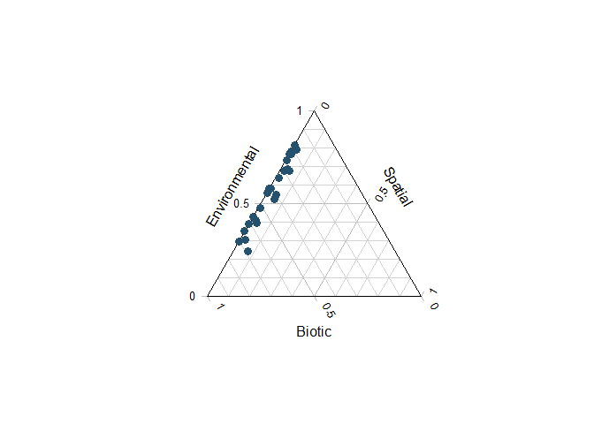
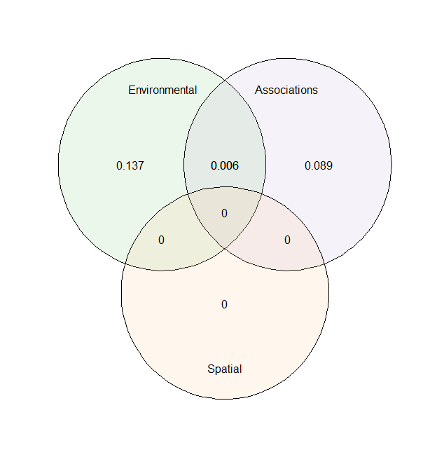

[](http://www.repostatus.org/#active)
[](https://www.gnu.org/licenses/gpl-3.0)


# s-jSDM - Fast and accurate Joint Species Distribution Modeling

## About the method

The method is described in the preprint Pichler & Hartig (2020) A new method for faster and more accurate inference of species associations from novel community data, https://arxiv.org/abs/2003.05331. The code for producing the results in this paper is available under the subfolder publications in this repo.

The method itself is wrapped into an R package, available under subfolder sjSDM. You can also use it stand-alone under Python (see instructions below). Note: for both the R and the python package, python >= 3.6 and pytorch must be installed (more details below).

## Installing the R / Python package

### R-package

Install the package via


```r
devtools::install_github("https://github.com/TheoreticalEcology/s-jSDM", subdir = "sjSDM")
```

Depencies for the package can be installed before or after installing the package. Detailed explanations of the dependencies are provided in vignette("Dependencies", package = "sjSDM"), source code [here](https://github.com/TheoreticalEcology/s-jSDM/blob/master/sjSDM/vignettes/Dependencies.Rmd). Very briefly,  the dependencies can be automatically installed from within R:


```r
sjSDM::install_sjSDM(version = "gpu") # or
sjSDM::install_sjSDM(version = "cpu")
```
Once the dependencies are installed, the following code should run:

Simulate a community and fit model:

```r
library(sjSDM)
community <- simulate_SDM(sites = 400, species = 10, env = 2)
Env <- community$env_weights
Occ <- community$response
SP <- matrix(rnorm(800), 400, 2) # spatial coordinates (no effect on species occurences)

model <- sjSDM(Y = Occ, env = linear(data = Env, formula = ~0+X1:X2 + X1), spatial = linear(data = SP, formula = ~0+X1:X2), se = TRUE)
summary(model)
```

```
## LogLik:  -2303.121 
## Deviance:  4606.243 
## 
## Regularization loss:  0 
## 
## Species-species correlation matrix: 
## 
##         sp1    sp2    sp3    sp4    sp5    sp6    sp7    sp8   sp9 sp10
## sp1   1.000  0.000  0.000  0.000  0.000  0.000  0.000  0.000 0.000    0
## sp2  -0.590  1.000  0.000  0.000  0.000  0.000  0.000  0.000 0.000    0
## sp3  -0.734  0.658  1.000  0.000  0.000  0.000  0.000  0.000 0.000    0
## sp4   0.475 -0.456 -0.068  1.000  0.000  0.000  0.000  0.000 0.000    0
## sp5   0.044 -0.206 -0.667 -0.635  1.000  0.000  0.000  0.000 0.000    0
## sp6  -0.327  0.026  0.115  0.384 -0.149  1.000  0.000  0.000 0.000    0
## sp7   0.459 -0.495 -0.772  0.333  0.460  0.386  1.000  0.000 0.000    0
## sp8  -0.486  0.905  0.631 -0.077 -0.407  0.345 -0.261  1.000 0.000    0
## sp9   0.632  0.098 -0.565 -0.030  0.298 -0.332  0.463  0.113 1.000    0
## sp10  0.875 -0.490 -0.722  0.522  0.102 -0.144  0.722 -0.299 0.746    1
## 
## 
## 
## Spatial: 
##              sp1         sp2          sp3         sp4        sp5
## X1:X2 0.04172784 -0.03748593 -0.003196387 -0.02421722 0.04541986
##               sp6        sp7         sp8        sp9        sp10
## X1:X2 -0.03897323 -0.1084603 -0.06171201 -0.1237265 -0.03013931
## 
## 
## 
##            Estimate  Std.Err Z value Pr(>|z|)    
## sp1 X1      0.54641  0.09759    5.60  2.2e-08 ***
## sp1 X1:X2   0.00430  0.16889    0.03  0.97969    
## sp2 X1      0.61109  0.12160    5.03  5.0e-07 ***
## sp2 X1:X2   0.23661  0.21182    1.12  0.26398    
## sp3 X1      0.35508  0.09260    3.83  0.00013 ***
## sp3 X1:X2   0.00338  0.16423    0.02  0.98358    
## sp4 X1      0.73897  0.10981    6.73  1.7e-11 ***
## sp4 X1:X2   0.07944  0.19931    0.40  0.69022    
## sp5 X1      0.23208  0.10901    2.13  0.03326 *  
## sp5 X1:X2   0.01558  0.19105    0.08  0.93499    
## sp6 X1     -0.26398  0.11107   -2.38  0.01747 *  
## sp6 X1:X2   0.01526  0.19124    0.08  0.93638    
## sp7 X1      0.04671  0.11979    0.39  0.69657    
## sp7 X1:X2   0.15927  0.20666    0.77  0.44087    
## sp8 X1     -0.74006  0.10851   -6.82  9.1e-12 ***
## sp8 X1:X2   0.03249  0.19416    0.17  0.86712    
## sp9 X1      0.16880  0.12701    1.33  0.18384    
## sp9 X1:X2  -0.10451  0.22224   -0.47  0.63818    
## sp10 X1     0.77960  0.10316    7.56  4.1e-14 ***
## sp10 X1:X2 -0.11070  0.17893   -0.62  0.53615    
## ---
## Signif. codes:  0 '***' 0.001 '**' 0.01 '*' 0.05 '.' 0.1 ' ' 1
```
Let's have a look at the importance of the three groups (environment, associations, and space) on the occurences:

```r
imp = importance(model)
print(imp)
```

```
##    sp         env      spatial    biotic
## 1   1 0.164892614 3.629039e-03 0.8314783
## 2   2 0.100757324 1.374609e-03 0.8978681
## 3   3 0.057199431 1.749198e-05 0.9427831
## 4   4 0.296497625 1.199542e-03 0.7023028
## 5   5 0.030687065 4.434368e-03 0.9648786
## 6   6 0.064542713 5.296802e-03 0.9301605
## 7   7 0.002637052 1.148528e-02 0.9858777
## 8   8 0.241351109 6.323100e-03 0.7523258
## 9   9 0.008368536 1.494557e-02 0.9766859
## 10 10 0.241235866 1.348026e-03 0.7574161
```

```r
plot(imp)
```

<!-- -->


As expected, space has no effect on occurences.

Let's have a look on community level how the three groups contribute to the overall explained variance 

```r
an = anova(model, cv = FALSE)
print(an)
```

```
## Changes relative to empty model (without modules):
## 
##  Modules       LogLik            R2   marginal R2
##        _ 2772.5876465  0.000000e+00  0.000000e+00
##        A -129.7111816  1.183925e-02  1.470575e-02
##        B -340.8393115  9.735275e-06  1.275616e-05
##        S   -6.0974121  5.967944e-04  7.493116e-04
##      A+B    0.8184277 -1.003278e-03 -7.177860e-03
##      A+S    1.0566406  1.093270e-04  1.153038e-04
##      B+S    3.0106299 -2.834033e-04 -5.484598e-04
##    A+B+S    7.4906006 -1.730009e-03 -1.464056e-03
##     Full -464.2716064  9.538412e-03  6.392745e-03
```

```r
plot(an)
```

<!-- -->
The anova shows the relative changes in the logLik of the groups and their intersections:

Space has a high positive value which means that space does not increase the model fit.


If it fails, check out the help of ?install_sjSDM, ?installation_help, and vignette("Dependencies", package = "sjSDM"). 

#### Installation workflow:
1. Try install_sjSDM()
2. New session, if no 'PyTorch not found' appears it should work, otherwise see ?installation_help
3. If do not get the pkg to run, create an issue [issue tracker](https://github.com/TheoreticalEcology/s-jSDM/issues) or write an email to maximilian.pichler at ur.de


### Python Package

```bash
pip install sjSDM_py
```
Python example


```python
import sjSDM_py as fa
import numpy as np
Env = np.random.randn(100, 5)
Occ = np.random.binomial(1, 0.5, [100, 10])

model = fa.Model_base(5)
model.add_layer(fa.layers.Layer_dense(10))
model.build(df=5, optimizer=fa.optimizer_adamax(0.1))
model.fit(X = Env, Y = Occ)
print(model.weights_numpy)
print(model.get_cov())
```

