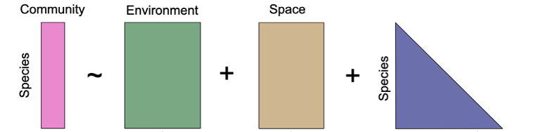
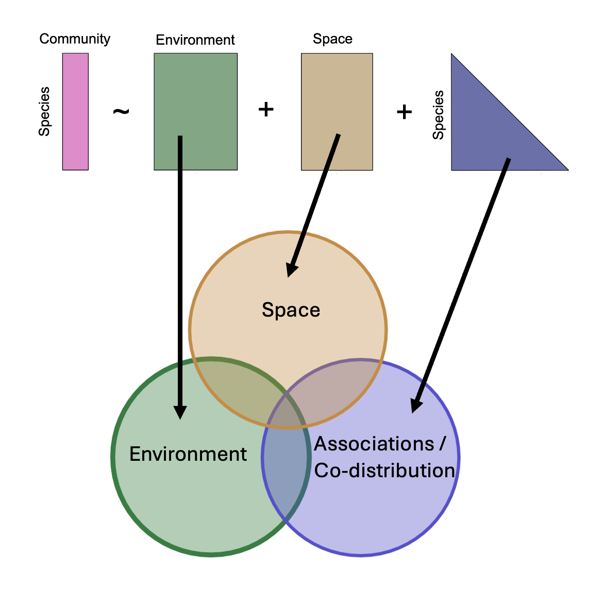

<!-- README.md is generated from README.Rmd. Please edit that file -->


[](http://www.repostatus.org/#active) [](https://www.gnu.org/licenses/gpl-3.0) [](https://cran.r-project.org/package=sjSDM)  [](https://www.doi.org/10.1111/2041-210X.13687)

# s-jSDM - Fast and accurate Joint Species Distribution Modeling

## About sjSDM

The sjSDM package is an R package for estimating joint species distribution models. A jSDM is a GLMM that models a multivariate (i.e. a many-species) response to the environment, space and a covariance term that models conditional (on the other terms) correlations between the outputs (i.e. species). 



A big challenge in jSDM implementation is computational speed. The goal of the sjSDM (which stands for "scalable joint species distribution models") is to make jSDM computations fast and scalable. Unlike many other packages, which use a latent-variable approximation to make estimating jSDMs faster, sjSDM fits a full covariance matrix in the likelihood, which is, however, numerically approximated via simulations. The method is described in Pichler & Hartig (2021) A new joint species distribution model for faster and more accurate inference of species associations from big community data, https://www.doi.org/10.1111/2041-210X.13687. 

Since version 1.1.0 the core code of sjSDM is implemented in R on top of [torch](https://torch.mlverse.org/) (libtorch). Earlier versions wrapped a Python / PyTorch backend through reticulate; that is gone, and with it the need for python, conda and a separate PyTorch installation. Models and results are unchanged apart from Monte-Carlo noise, see `news(package = "sjSDM")`.

To get citation info for sjSDM when you use it for your reseach, type  


``` r
citation("sjSDM")
```

## Installing the R package

sjSDM is distributed via [CRAN](https://cran.rstudio.com/web/packages/sjSDM/index.html). For most users, it will be best to install the package from CRAN


``` r
install.packages("sjSDM")
```

The only dependency that is not an ordinary R package is the libtorch binary, which `torch` downloads on first use. If that has not happened yet, run


``` r
sjSDM::install_sjSDM()   # wrapper around torch::install_torch()
```

There is no separate CPU and GPU build any more: whether the GPU can be used follows from the `torch` installation (`torch::cuda_is_available()`, or `torch::backends_mps_is_available()` on Apple silicon). Pass `device = "gpu"` or `device = "mps"` to `sjSDM()` to use it.

For advanced users: if you want to install the current (development) version from this repository, run


``` r
devtools::install_github("https://github.com/TheoreticalEcology/s-jSDM", subdir = "sjSDM", ref = "master")
```

If the installation fails, check out the help of ?install_sjSDM and ?installation_help.

1.  Run `sjSDM::install_diagnostic()` and check whether libtorch is installed
2.  If not, run `torch::install_torch()` and restart R
3.  If you still do not get the pkg to run, create an issue on the [issue tracker](https://github.com/TheoreticalEcology/s-jSDM/issues) or write an email to maximilian.pichler at ur.de

## Basic Workflow

Load the package


``` r
library(sjSDM)
```

Simulate some community data 


``` r
set.seed(42)
community <- simulate_SDM(sites = 100, species = 10, env = 3, se = TRUE)
Env <- community$env_weights
Occ <- community$response
SP <- matrix(rnorm(200, 0, 0.3), 100, 2) # spatial coordinates (no effect on species occurences)
```

This fits the standard SDM with environmental, spatial and covariance terms 


``` r
model <- sjSDM(Y = Occ, env = linear(data = Env, formula = ~X1+X2+X3), spatial = linear(data = SP, formula = ~0+X1:X2), se = TRUE, family=binomial("probit"), sampling = 100L, verbose = FALSE)
```


``` r
summary(model)
```

```
## Family:  binomial 
## 
## LogLik:  -514.9206 
## Regularization loss:  0 
## 
## Species-species correlation matrix: 
## 
## 	sp1	 1.0000									
## 	sp2	-0.3710	 1.0000								
## 	sp3	-0.2180	-0.4100	 1.0000							
## 	sp4	-0.1810	-0.3740	 0.8240	 1.0000						
## 	sp5	 0.6960	-0.3900	-0.1280	-0.1090	 1.0000					
## 	sp6	-0.2750	 0.4660	 0.1910	 0.1960	-0.0860	 1.0000				
## 	sp7	 0.5830	-0.1380	 0.1150	 0.1610	 0.5630	 0.2680	 1.0000			
## 	sp8	 0.2800	 0.1840	-0.5030	-0.4980	 0.2350	-0.0490	 0.0990	 1.0000		
## 	sp9	-0.0910	-0.0290	 0.0580	 0.0790	-0.4070	-0.3530	-0.2260	-0.1520	 1.0000	
## 	sp10	 0.2360	 0.4710	-0.7020	-0.6590	 0.2470	 0.1360	 0.1430	 0.4660	-0.2630	 1.0000
## 
## 
## 
## Spatial: 
##            sp1       sp2      sp3       sp4      sp5       sp6     sp7      sp8
## X1:X2 2.153955 -4.065927 3.500159 0.5233294 2.678006 0.9705645 3.31708 1.998911
##           sp9     sp10
## X1:X2 1.13139 1.176026
## 
## 
## 
##                  Estimate  Std.Err Z value Pr(>|z|)    
## sp1 (Intercept)  -0.05875  0.26816   -0.22  0.82657    
## sp1 X1            1.30180  0.54706    2.38  0.01733 *  
## sp1 X2           -2.40154  0.50340   -4.77  1.8e-06 ***
## sp1 X3           -0.27994  0.44926   -0.62  0.53320    
## sp2 (Intercept)   0.02927  0.28259    0.10  0.91750    
## sp2 X1            1.32486  0.56283    2.35  0.01858 *  
## sp2 X2            0.32761  0.51692    0.63  0.52624    
## sp2 X3            0.70121  0.45077    1.56  0.11981    
## sp3 (Intercept)  -0.54281  0.28458   -1.91  0.05646 .  
## sp3 X1            1.48066  0.51128    2.90  0.00378 ** 
## sp3 X2           -0.55188  0.51585   -1.07  0.28469    
## sp3 X3           -1.06656  0.48672   -2.19  0.02843 *  
## sp4 (Intercept)  -0.08513  0.24883   -0.34  0.73225    
## sp4 X1           -1.50670  0.48573   -3.10  0.00192 ** 
## sp4 X2           -1.96249  0.48857   -4.02  5.9e-05 ***
## sp4 X3           -0.37505  0.42523   -0.88  0.37778    
## sp5 (Intercept)  -0.23074  0.23558   -0.98  0.32737    
## sp5 X1            0.68794  0.45333    1.52  0.12913    
## sp5 X2            0.48579  0.43869    1.11  0.26814    
## sp5 X3           -0.75367  0.39148   -1.93  0.05421 .  
## sp6 (Intercept)   0.29987  0.26297    1.14  0.25415    
## sp6 X1            2.54713  0.56393    4.52  6.3e-06 ***
## sp6 X2           -1.16900  0.50577   -2.31  0.02081 *  
## sp6 X3            0.16984  0.42994    0.40  0.69282    
## sp7 (Intercept)   0.00224  0.24752    0.01  0.99279    
## sp7 X1           -0.32273  0.48296   -0.67  0.50398    
## sp7 X2            0.25888  0.43074    0.60  0.54784    
## sp7 X3           -1.54624  0.43242   -3.58  0.00035 ***
## sp8 (Intercept)   0.14380  0.15566    0.92  0.35557    
## sp8 X1            0.33322  0.30278    1.10  0.27109    
## sp8 X2            0.29317  0.29048    1.01  0.31285    
## sp8 X3           -1.17270  0.27738   -4.23  2.4e-05 ***
## sp9 (Intercept)   0.01755  0.20135    0.09  0.93056    
## sp9 X1            1.44863  0.38775    3.74  0.00019 ***
## sp9 X2           -1.03983  0.38659   -2.69  0.00715 ** 
## sp9 X3            0.82597  0.34002    2.43  0.01513 *  
## sp10 (Intercept) -0.08068  0.20337   -0.40  0.69157    
## sp10 X1          -0.51740  0.36949   -1.40  0.16142    
## sp10 X2          -1.23208  0.38094   -3.23  0.00122 ** 
## sp10 X3          -0.55100  0.34995   -1.57  0.11537    
## ---
## Signif. codes:  0 '***' 0.001 '**' 0.01 '*' 0.05 '.' 0.1 ' ' 1
```


Plot the niche estimates, i.e the estimates in the environmental component:


``` r
plot(model)
```

```
## Warning: Using `size` aesthetic for lines was deprecated in ggplot2 3.4.0.
## i Please use `linewidth` instead.
## i The deprecated feature was likely used in the sjSDM package.
##   Please report the issue at
##   <https://github.com/TheoreticalEcology/s-jSDM/issues>.
## This warning is displayed once per session.
## Call `lifecycle::last_lifecycle_warnings()` to see where this warning was
## generated.
```


Visualize the species-species association matrix


``` r
image(getCor(model))
```


## Anova / Variation partitioning

### Global ANOVA

As in other models, it can be interesting to analyze how much variation is explained by which parts of hte model. 

{{width=70%}}
For the Env, Spatial, Covariance terms, this is implemented in 


``` r
an = anova(model, verbose = FALSE)
```


``` r
summary(an)
```

```
## Analysis of Deviance Table
## 
##               Deviance Residual deviance R2 Nagelkerke R2 McFadden
## Abiotic      156.54059        1176.13023       0.79100      0.1132
## Assocations  209.44934        1123.22148       0.87687      0.1514
## Spatial       15.64127        1317.02956       0.14479      0.0113
## Full         381.63120         951.03962       0.97799      0.2759
```

``` r
plot(an)
```


The anova shows the relative changes in the R^2^ of the groups and their intersections.

### Internal metacommunity structure

Following [Leibold et al., 2022](https://doi.org/10.1111/oik.08618) we can calculate and visualize the internal metacommunity structure (=partitioning of the three components for species and sites). The internal structure is already calculated by the ANOVA and we can visualize it with the plot method:


``` r
results = internalStructure(an) # or plot(an, internal = TRUE)
```

The plot function returns the results for the internal metacommunity structure:


``` r
plot(results)
```


Which can be regressed against covariates to analyse assembly processes:


``` r
plotAssemblyEffects(results)
```


