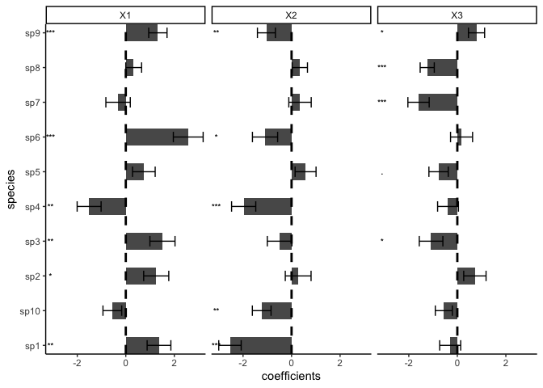

<!-- README.md is generated from README.Rmd. Please edit that file -->

[](http://www.repostatus.org/#active)
[](https://www.gnu.org/licenses/gpl-3.0)
[](https://cran.r-project.org/package=sjSDM)

[](https://besjournals.onlinelibrary.wiley.com/doi/abs/10.1111/2041-210X.13687)

# s-jSDM - Fast and accurate Joint Species Distribution Modeling

## About the method

The method is described in Pichler & Hartig (2021) A new joint species
distribution model for faster and more accurate inference of species
associations from big community data,
<https://doi.org/10.1111/2041-210X.13687>. The code for producing the
results in this paper is available under the subfolder publications in
this repo.

The method itself is wrapped into an R package, available under
subfolder sjSDM. You can also use it stand-alone under Python (see
instructions below). Note: for both the R and the python package, python
\>= 3.6 and pytorch must be installed (more details below).

## Installing the R / Python package

### R-package

Install the package via

``` r
install.packages("sjSDM")
```

Depencies for the package can be installed before or after installing
the package. Detailed explanations of the dependencies are provided in
vignette(“Dependencies”, package = “sjSDM”), source code
[here](https://github.com/TheoreticalEcology/s-jSDM/blob/master/sjSDM/vignettes/Dependencies.Rmd).
Very briefly, the dependencies can be automatically installed from
within R:

``` r
sjSDM::install_sjSDM(version = "gpu") # or
sjSDM::install_sjSDM(version = "cpu")
```

To cite sjSDM, please use the following citation:

``` r
citation("sjSDM")
```

### Development

If you want to install the current (development) version from this
repository, run

``` r
devtools::install_github("https://github.com/TheoreticalEcology/s-jSDM", subdir = "sjSDM", ref = "devel")
```

Once the dependencies are installed, the following code should run:

Simulate a community and fit model:

``` r
library(sjSDM)
```

    ## ── Attaching sjSDM ──────────────────────────────────────────────────── 1.0.0 ──

    ## ✓ torch <environment> 
    ## ✓ torch_optimizer  
    ## ✓ pyro  
    ## ✓ madgrad

``` r
set.seed(42)
community <- simulate_SDM(sites = 100, species = 10, env = 3, se = TRUE)
Env <- community$env_weights
Occ <- community$response
SP <- matrix(rnorm(200, 0, 0.3), 100, 2) # spatial coordinates (no effect on species occurences)

model <- sjSDM(Y = Occ, env = linear(data = Env, formula = ~X1+X2+X3), spatial = linear(data = SP, formula = ~0+X1:X2), se = TRUE, family=binomial("probit"), sampling = 100L)
summary(model)
```

    ## LogLik:  -523.0463 
    ## Regularization loss:  0 
    ## 
    ## Species-species correlation matrix: 
    ## 
    ##  sp1  1.0000                                 
    ##  sp2 -0.3370  1.0000                             
    ##  sp3 -0.1490 -0.3520  1.0000                         
    ##  sp4 -0.1690 -0.3120  0.6950  1.0000                     
    ##  sp5  0.6020 -0.3360 -0.0950 -0.1020  1.0000                 
    ##  sp6 -0.2250  0.3830  0.1630  0.1670 -0.0940  1.0000             
    ##  sp7  0.4590 -0.1390  0.1470  0.1230  0.4940  0.2370  1.0000         
    ##  sp8  0.2910  0.1520 -0.4220 -0.4120  0.2240 -0.0590  0.1370  1.0000     
    ##  sp9 -0.0990 -0.0580  0.0720  0.0620 -0.3110 -0.2330 -0.2330 -0.0850  1.0000 
    ##  sp10     0.2280  0.3710 -0.6010 -0.5630  0.2410  0.0750  0.1310  0.4160 -0.2220  1.0000
    ## 
    ## 
    ## 
    ## Spatial: 
    ##             sp1        sp2       sp3         sp4       sp5       sp6      sp7
    ## X1:X2 0.2097643 -0.5288849 0.5181209 0.009623682 0.3563328 0.1980719 0.423929
    ##             sp8       sp9     sp10
    ## X1:X2 0.4698656 0.2615229 0.257226
    ## 
    ## 
    ## 
    ##                  Estimate  Std.Err Z value Pr(>|z|)    
    ## sp1 (Intercept)  -0.03977  0.21206   -0.19  0.85124    
    ## sp1 X1            0.82571  0.41443    1.99  0.04633 *  
    ## sp1 X2           -1.62219  0.40169   -4.04  5.4e-05 ***
    ## sp1 X3           -0.13454  0.35189   -0.38  0.70221    
    ## sp2 (Intercept)  -0.01476  0.21101   -0.07  0.94422    
    ## sp2 X1            0.89789  0.40524    2.22  0.02671 *  
    ## sp2 X2            0.19296  0.38875    0.50  0.61965    
    ## sp2 X3            0.46829  0.35138    1.33  0.18263    
    ## sp3 (Intercept)  -0.36290  0.22196   -1.64  0.10204    
    ## sp3 X1            1.01730  0.40704    2.50  0.01245 *  
    ## sp3 X2           -0.26439  0.40040   -0.66  0.50905    
    ## sp3 X3           -0.72271  0.38358   -1.88  0.05955 .  
    ## sp4 (Intercept)  -0.05324  0.20073   -0.27  0.79082    
    ## sp4 X1           -1.02942  0.38118   -2.70  0.00692 ** 
    ## sp4 X2           -1.29268  0.37599   -3.44  0.00059 ***
    ## sp4 X3           -0.32540  0.33982   -0.96  0.33828    
    ## sp5 (Intercept)  -0.14809  0.20236   -0.73  0.46427    
    ## sp5 X1            0.50222  0.39101    1.28  0.19899    
    ## sp5 X2            0.44313  0.36177    1.22  0.22062    
    ## sp5 X3           -0.43606  0.34987   -1.25  0.21263    
    ## sp6 (Intercept)   0.16414  0.20103    0.82  0.41422    
    ## sp6 X1            1.65042  0.41523    3.97  7.0e-05 ***
    ## sp6 X2           -0.66862  0.38461   -1.74  0.08213 .  
    ## sp6 X3            0.16584  0.32957    0.50  0.61482    
    ## sp7 (Intercept)  -0.00151  0.20626   -0.01  0.99416    
    ## sp7 X1           -0.28922  0.39346   -0.74  0.46230    
    ## sp7 X2            0.28814  0.37885    0.76  0.44691    
    ## sp7 X3           -1.06155  0.34752   -3.05  0.00225 ** 
    ## sp8 (Intercept)   0.13099  0.15214    0.86  0.38925    
    ## sp8 X1            0.24814  0.28800    0.86  0.38890    
    ## sp8 X2            0.30580  0.28384    1.08  0.28131    
    ## sp8 X3           -1.01204  0.26964   -3.75  0.00017 ***
    ## sp9 (Intercept)   0.03149  0.17057    0.18  0.85352    
    ## sp9 X1            1.07060  0.33145    3.23  0.00124 ** 
    ## sp9 X2           -0.79677  0.32507   -2.45  0.01424 *  
    ## sp9 X3            0.59462  0.28658    2.07  0.03800 *  
    ## sp10 (Intercept) -0.06706  0.18177   -0.37  0.71219    
    ## sp10 X1          -0.43999  0.33907   -1.30  0.19441    
    ## sp10 X2          -0.94309  0.32855   -2.87  0.00410 ** 
    ## sp10 X3          -0.35444  0.30660   -1.16  0.24766    
    ## ---
    ## Signif. codes:  0 '***' 0.001 '**' 0.01 '*' 0.05 '.' 0.1 ' ' 1

``` r
plot(model)
```

    ## LogLik:  -523.0463 
    ## Regularization loss:  0 
    ## 
    ## Species-species correlation matrix: 
    ## 
    ##  sp1  1.0000                                 
    ##  sp2 -0.3370  1.0000                             
    ##  sp3 -0.1490 -0.3520  1.0000                         
    ##  sp4 -0.1690 -0.3120  0.6950  1.0000                     
    ##  sp5  0.6020 -0.3360 -0.0950 -0.1020  1.0000                 
    ##  sp6 -0.2250  0.3830  0.1630  0.1670 -0.0940  1.0000             
    ##  sp7  0.4590 -0.1390  0.1470  0.1230  0.4940  0.2370  1.0000         
    ##  sp8  0.2910  0.1520 -0.4220 -0.4120  0.2240 -0.0590  0.1370  1.0000     
    ##  sp9 -0.0990 -0.0580  0.0720  0.0620 -0.3110 -0.2330 -0.2330 -0.0850  1.0000 
    ##  sp10     0.2280  0.3710 -0.6010 -0.5630  0.2410  0.0750  0.1310  0.4160 -0.2220  1.0000
    ## 
    ## 
    ## 
    ## Spatial: 
    ##             sp1        sp2       sp3         sp4       sp5       sp6      sp7
    ## X1:X2 0.2097643 -0.5288849 0.5181209 0.009623682 0.3563328 0.1980719 0.423929
    ##             sp8       sp9     sp10
    ## X1:X2 0.4698656 0.2615229 0.257226
    ## 
    ## 
    ## 
    ##                  Estimate  Std.Err Z value Pr(>|z|)    
    ## sp1 (Intercept)  -0.03977  0.21206   -0.19  0.85124    
    ## sp1 X1            0.82571  0.41443    1.99  0.04633 *  
    ## sp1 X2           -1.62219  0.40169   -4.04  5.4e-05 ***
    ## sp1 X3           -0.13454  0.35189   -0.38  0.70221    
    ## sp2 (Intercept)  -0.01476  0.21101   -0.07  0.94422    
    ## sp2 X1            0.89789  0.40524    2.22  0.02671 *  
    ## sp2 X2            0.19296  0.38875    0.50  0.61965    
    ## sp2 X3            0.46829  0.35138    1.33  0.18263    
    ## sp3 (Intercept)  -0.36290  0.22196   -1.64  0.10204    
    ## sp3 X1            1.01730  0.40704    2.50  0.01245 *  
    ## sp3 X2           -0.26439  0.40040   -0.66  0.50905    
    ## sp3 X3           -0.72271  0.38358   -1.88  0.05955 .  
    ## sp4 (Intercept)  -0.05324  0.20073   -0.27  0.79082    
    ## sp4 X1           -1.02942  0.38118   -2.70  0.00692 ** 
    ## sp4 X2           -1.29268  0.37599   -3.44  0.00059 ***
    ## sp4 X3           -0.32540  0.33982   -0.96  0.33828    
    ## sp5 (Intercept)  -0.14809  0.20236   -0.73  0.46427    
    ## sp5 X1            0.50222  0.39101    1.28  0.19899    
    ## sp5 X2            0.44313  0.36177    1.22  0.22062    
    ## sp5 X3           -0.43606  0.34987   -1.25  0.21263    
    ## sp6 (Intercept)   0.16414  0.20103    0.82  0.41422    
    ## sp6 X1            1.65042  0.41523    3.97  7.0e-05 ***
    ## sp6 X2           -0.66862  0.38461   -1.74  0.08213 .  
    ## sp6 X3            0.16584  0.32957    0.50  0.61482    
    ## sp7 (Intercept)  -0.00151  0.20626   -0.01  0.99416    
    ## sp7 X1           -0.28922  0.39346   -0.74  0.46230    
    ## sp7 X2            0.28814  0.37885    0.76  0.44691    
    ## sp7 X3           -1.06155  0.34752   -3.05  0.00225 ** 
    ## sp8 (Intercept)   0.13099  0.15214    0.86  0.38925    
    ## sp8 X1            0.24814  0.28800    0.86  0.38890    
    ## sp8 X2            0.30580  0.28384    1.08  0.28131    
    ## sp8 X3           -1.01204  0.26964   -3.75  0.00017 ***
    ## sp9 (Intercept)   0.03149  0.17057    0.18  0.85352    
    ## sp9 X1            1.07060  0.33145    3.23  0.00124 ** 
    ## sp9 X2           -0.79677  0.32507   -2.45  0.01424 *  
    ## sp9 X3            0.59462  0.28658    2.07  0.03800 *  
    ## sp10 (Intercept) -0.06706  0.18177   -0.37  0.71219    
    ## sp10 X1          -0.43999  0.33907   -1.30  0.19441    
    ## sp10 X2          -0.94309  0.32855   -2.87  0.00410 ** 
    ## sp10 X3          -0.35444  0.30660   -1.16  0.24766    
    ## ---
    ## Signif. codes:  0 '***' 0.001 '**' 0.01 '*' 0.05 '.' 0.1 ' ' 1

<!-- -->

We also support also other response families: Count data:

``` r
model <- sjSDM(Y = Occ, env = linear(data = Env, formula = ~X1+X2+X3), spatial = linear(data = SP, formula = ~0+X1:X2), se = TRUE, family=poisson("log"))
```

Gaussian (normal):

``` r
model <- sjSDM(Y = Occ, env = linear(data = Env, formula = ~X1+X2+X3), spatial = linear(data = SP, formula = ~0+X1:X2), se = TRUE, family=gaussian("identity"))
```

Let’s have a look at the importance of the three groups (environment,
associations, and space) on the occurences:

``` r
imp = importance(model)
print(imp)
```

    ##    sp       env      spatial     biotic
    ## 1   1 0.8539057 3.194661e-04 0.14577481
    ## 2   2 0.5897330 3.662053e-03 0.40660492
    ## 3   3 0.7400899 3.535578e-03 0.25637448
    ## 4   4 0.9069016 7.076025e-07 0.09309772
    ## 5   5 0.5101848 2.644762e-03 0.48717043
    ## 6   6 0.8644908 3.016936e-04 0.13520756
    ## 7   7 0.5335647 1.650771e-03 0.46478456
    ## 8   8 0.8930446 3.978094e-03 0.10297730
    ## 9   9 0.7327270 6.191073e-04 0.26665390
    ## 10 10 0.9761007 1.266072e-03 0.02263325

``` r
plot(imp)
```

<!-- -->

As expected, space has no effect on occurences.

Let’s have a look on community level how the three groups contribute to
the overall explained variance

``` r
an = anova(model)
print(an)
```

    ## Analysis of Deviance Table
    ## 
    ## Terms added sequentially:
    ## 
    ##          Deviance Residual deviance R2 Nagelkerke R2 McFadden
    ## Biotic  151.02063         521.48694       0.77914      0.1092
    ## Abiotic 192.75159         328.73535       0.96786      0.2487
    ## Spatial  -7.40771         336.14307       0.96539      0.2433

``` r
plot(an)
```

<!-- -->

The anova shows the relative changes in the deviance of the groups and
their intersections.

If it fails, check out the help of ?install_sjSDM, ?installation_help,
and vignette(“Dependencies”, package = “sjSDM”).

#### Installation workflow:

1.  Try install_sjSDM()
2.  New session, if no ‘PyTorch not found’ appears it should work,
    otherwise see ?installation_help
3.  If do not get the pkg to run, create an issue [issue
    tracker](https://github.com/TheoreticalEcology/s-jSDM/issues) or
    write an email to maximilian.pichler at ur.de

### Python Package

``` bash
pip install sjSDM_py
```

Python example

``` python
import sjSDM_py as fa
import numpy as np
import torch
Env = np.random.randn(100, 5)
Occ = np.random.binomial(1, 0.5, [100, 10])

model = fa.Model_sjSDM(device=torch.device("cpu"), dtype=torch.float32)
model.add_env(5, 10)
model.build(5, optimizer=fa.optimizer_adamax(0.001),scheduler=False)
model.fit(Env, Occ, batch_size = 20, epochs = 10)
# print(model.weights)
# print(model.covariance)
```

    ## Iter: 0/10   0%|          | [00:00, ?it/s]Iter: 0/10   0%|          | [00:00, ?it/s, loss=7.358]Iter: 1/10  10%|#         | [00:00,  5.12it/s, loss=7.358]Iter: 1/10  10%|#         | [00:00,  5.12it/s, loss=7.331]Iter: 1/10  10%|#         | [00:00,  5.12it/s, loss=7.323]Iter: 1/10  10%|#         | [00:00,  5.12it/s, loss=7.324]Iter: 1/10  10%|#         | [00:00,  5.12it/s, loss=7.334]Iter: 1/10  10%|#         | [00:00,  5.12it/s, loss=7.318]Iter: 6/10  60%|######    | [00:00, 23.86it/s, loss=7.318]Iter: 6/10  60%|######    | [00:00, 23.86it/s, loss=7.326]Iter: 6/10  60%|######    | [00:00, 23.86it/s, loss=7.309]Iter: 6/10  60%|######    | [00:00, 23.86it/s, loss=7.304]Iter: 6/10  60%|######    | [00:00, 23.86it/s, loss=7.286]Iter: 10/10 100%|##########| [00:00, 26.03it/s, loss=7.286]

Calculate Importance:

``` python
Beta = np.transpose(model.env_weights[0])
Sigma = ( model.sigma @ model.sigma.t() + torch.diag(torch.ones([1])) ).data.cpu().numpy()
covX = fa.covariance( torch.tensor(Env).t() ).data.cpu().numpy()

fa.importance(beta=Beta, covX=covX, sigma=Sigma)
```

    ## {'env': array([[ 6.00627158e-04,  1.14630593e-03,  1.09053524e-02,
    ##          1.05654253e-02,  1.45557038e-02],
    ##        [ 9.56870615e-03,  4.21576016e-03,  1.06933614e-04,
    ##          1.33172970e-03,  1.05470214e-02],
    ##        [ 2.32625613e-03,  1.61409937e-02,  6.64134495e-05,
    ##          9.74757495e-05,  2.18663458e-03],
    ##        [ 8.52300692e-03,  1.07057637e-03,  1.46411667e-02,
    ##          8.68435390e-03,  7.08195148e-03],
    ##        [-7.17847797e-06, -1.23505345e-06,  1.45622957e-02,
    ##          3.56136751e-03,  4.91820509e-03],
    ##        [-1.31524590e-04,  1.22741107e-02,  1.22232996e-02,
    ##          7.41305854e-03,  1.47087574e-02],
    ##        [ 1.26086129e-02,  1.54245849e-04,  6.33575348e-03,
    ##          3.37137189e-03,  9.59621649e-03],
    ##        [ 8.97107311e-05,  5.07542631e-03,  9.64390172e-04,
    ##          1.04126502e-02,  1.18228560e-02],
    ##        [ 9.25059337e-03,  5.78574790e-03,  9.44872445e-05,
    ##          8.52529984e-03,  3.14252358e-03],
    ##        [ 1.40638428e-03,  6.01684162e-03,  4.81087307e-04,
    ##          1.57201290e-02,  1.10209584e-02]], dtype=float32), 'biotic': array([0.9622266 , 0.9742299 , 0.9791822 , 0.95999897, 0.9769665 ,
    ##        0.95351225, 0.96793383, 0.971635  , 0.97320133, 0.9653546 ],
    ##       dtype=float32)}
