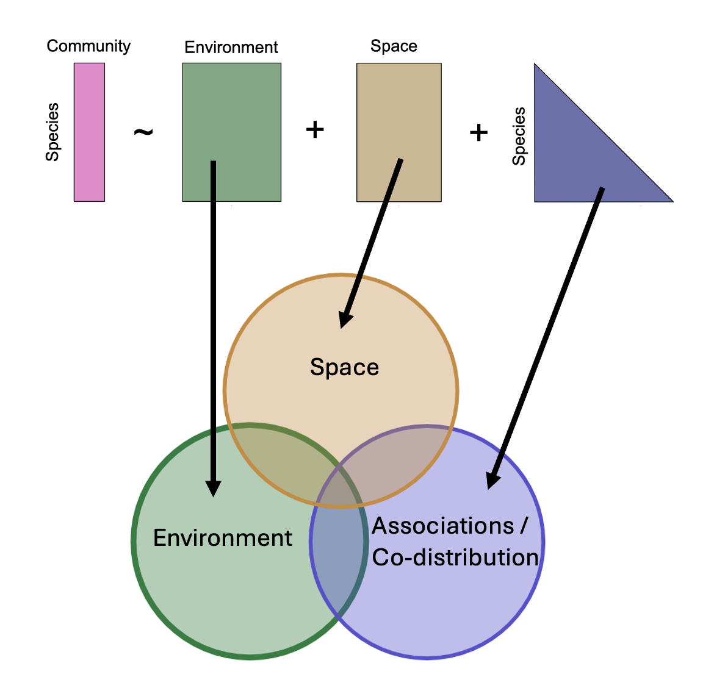

<!-- README.md is generated from README.Rmd. Please edit that file -->

[](http://www.repostatus.org/#active)
[](https://www.gnu.org/licenses/gpl-3.0)
[](https://cran.r-project.org/package=sjSDM)

[](https://www.doi.org/10.1111/2041-210X.13687)

# s-jSDM - Fast and accurate Joint Species Distribution Modeling

## About sjSDM

The sjSDM package is an R package for estimating so-called joint species
distribution models. A jSDM is a GLMM that models a multivariate (i.e. a
many-species) response to the environment, space and a covariance term
that models conditional (on the other terms) correlations between the
outputs (i.e. species).

<figure>

<figcaption aria-hidden="true">image</figcaption>
</figure>

A big challenge in jSDM implementation is computational speed. The goal
of the sjSDM (which stands for “scalable joint species distribution
models”) is to make jSDM computations fast and scalable. Unlike many
other packages, which use a latent-variable approximation to make
estimating jSDMs faster, sjSDM fits a full covariance matrix in the
likelihood, which is, however, numerically approximated via simulations.
The method is described in Pichler & Hartig (2021) A new joint species
distribution model for faster and more accurate inference of species
associations from big community data,
<https://www.doi.org/10.1111/2041-210X.13687>.

The core code of sjSDM is implemented in Python / PyTorch, which is then
wrapped into an R package. In principle, you can also use it stand-alone
under Python (see instructions below). Note: for both the R and the
python package, python \>= 3.7 and pytorch must be installed (more
details below). However, for most users, it will be more convenient to
use sjSDM via the sjSDM R package, which also provides a large number of
downstream functionalities.

To get citation info for sjSDM when you use it for your reseach, type

``` r
citation("sjSDM")
```

## Installing the R package

sjSDM is distributed via
[CRAN](https://cran.rstudio.com/web/packages/sjSDM/index.html). For most
users, it will be best to install the package from CRAN

``` r
install.packages("sjSDM")
```

Depencies for the package can be installed before or after installing
the package. Detailed explanations of the dependencies are provided in
vignette(“Dependencies”, package = “sjSDM”), source code
[here](https://github.com/TheoreticalEcology/s-jSDM/blob/master/sjSDM/vignettes/Dependencies.Rmd).
Very briefly, the dependencies can be automatically installed from
within R:

``` r
sjSDM::install_sjSDM(version = "gpu") # or
sjSDM::install_sjSDM(version = "cpu")
```

For advanced users: if you want to install the current (development)
version from this repository, run

``` r
devtools::install_github("https://github.com/TheoreticalEcology/s-jSDM", subdir = "sjSDM", ref = "master")
```

dependencies should be installed as above. If the installation fails,
check out the help of ?install_sjSDM, ?installation_help, and
vignette(“Dependencies”, package = “sjSDM”).

1.  Try install_sjSDM()
2.  New session, if no ‘PyTorch not found’ appears it should work,
    otherwise see ?installation_help
3.  If do not get the pkg to run, create an issue [issue
    tracker](https://github.com/TheoreticalEcology/s-jSDM/issues) or
    write an email to maximilian.pichler at ur.de

## Basic Workflow

Load the package

``` r
library(sjSDM)
```

Simulate some community data

``` r
set.seed(42)
community <- simulate_SDM(sites = 100, species = 10, env = 3, se = TRUE)
Env <- community$env_weights
Occ <- community$response
SP <- matrix(rnorm(200, 0, 0.3), 100, 2) # spatial coordinates (no effect on species occurences)
```

This fits the standard SDM with environmental, spatial and covariance
terms

``` r
model <- sjSDM(Y = Occ, env = linear(data = Env, formula = ~X1+X2+X3), spatial = linear(data = SP, formula = ~0+X1:X2), se = TRUE, family=binomial("probit"), sampling = 100L)
summary(model)
```

    ## Family:  binomial 
    ## 
    ## LogLik:  -505.3381 
    ## Regularization loss:  0 
    ## 
    ## Species-species correlation matrix: 
    ## 
    ##  sp1  1.0000                                 
    ##  sp2 -0.3700  1.0000                             
    ##  sp3 -0.1980 -0.4260  1.0000                         
    ##  sp4 -0.1670 -0.3830  0.8330  1.0000                     
    ##  sp5  0.6670 -0.3620 -0.1330 -0.1040  1.0000                 
    ##  sp6 -0.2910  0.4780  0.1730  0.1860 -0.1020  1.0000             
    ##  sp7  0.5740 -0.1110  0.1270  0.1790  0.5370  0.2740  1.0000         
    ##  sp8  0.2870  0.2150 -0.5160 -0.5250  0.2000 -0.0060  0.1100  1.0000     
    ##  sp9 -0.0610 -0.0560  0.0510  0.0580 -0.3950 -0.3590 -0.2320 -0.1310  1.0000 
    ##  sp10     0.2050  0.5050 -0.7150 -0.6640  0.2550  0.1480  0.1380  0.4670 -0.2610  1.0000
    ## 
    ## 
    ## 
    ## Spatial: 
    ##           sp1       sp2      sp3       sp4      sp5       sp6      sp7      sp8
    ## X1:X2 2.10835 -4.061844 3.446407 0.4750176 2.757261 0.9577486 3.384753 2.053963
    ##            sp9     sp10
    ## X1:X2 1.003981 1.293781
    ## 
    ## 
    ## 
    ##                  Estimate Std.Err Z value Pr(>|z|)    
    ## sp1 (Intercept)   -0.1038  0.2614   -0.40  0.69129    
    ## sp1 X1             1.3685  0.4894    2.80  0.00517 ** 
    ## sp1 X2            -2.5386  0.4626   -5.49  4.1e-08 ***
    ## sp1 X3            -0.2941  0.4331   -0.68  0.49713    
    ## sp2 (Intercept)   -0.0106  0.2760   -0.04  0.96949    
    ## sp2 X1             1.2541  0.5173    2.42  0.01534 *  
    ## sp2 X2             0.2723  0.5312    0.51  0.60824    
    ## sp2 X3             0.7237  0.4605    1.57  0.11603    
    ## sp3 (Intercept)   -0.5153  0.2854   -1.81  0.07100 .  
    ## sp3 X1             1.5114  0.5174    2.92  0.00349 ** 
    ## sp3 X2            -0.4924  0.5080   -0.97  0.33235    
    ## sp3 X3            -1.0819  0.4862   -2.23  0.02606 *  
    ## sp4 (Intercept)   -0.0771  0.2559   -0.30  0.76318    
    ## sp4 X1            -1.5116  0.4940   -3.06  0.00222 ** 
    ## sp4 X2            -1.9738  0.4985   -3.96  7.5e-05 ***
    ## sp4 X3            -0.3837  0.4295   -0.89  0.37164    
    ## sp5 (Intercept)   -0.2368  0.2424   -0.98  0.32864    
    ## sp5 X1             0.7438  0.4670    1.59  0.11121    
    ## sp5 X2             0.5777  0.4317    1.34  0.18081    
    ## sp5 X3            -0.7728  0.3984   -1.94  0.05244 .  
    ## sp6 (Intercept)    0.3047  0.2753    1.11  0.26847    
    ## sp6 X1             2.5735  0.6142    4.19  2.8e-05 ***
    ## sp6 X2            -1.0934  0.5190   -2.11  0.03513 *  
    ## sp6 X3             0.1742  0.4538    0.38  0.70103    
    ## sp7 (Intercept)   -0.0224  0.2574   -0.09  0.93054    
    ## sp7 X1            -0.3184  0.5029   -0.63  0.52667    
    ## sp7 X2             0.3480  0.4616    0.75  0.45090    
    ## sp7 X3            -1.5991  0.4387   -3.64  0.00027 ***
    ## sp8 (Intercept)    0.1415  0.1673    0.85  0.39759    
    ## sp8 X1             0.3254  0.3263    1.00  0.31864    
    ## sp8 X2             0.3401  0.3154    1.08  0.28092    
    ## sp8 X3            -1.2411  0.2907   -4.27  2.0e-05 ***
    ## sp9 (Intercept)    0.0200  0.1955    0.10  0.91852    
    ## sp9 X1             1.3218  0.3775    3.50  0.00046 ***
    ## sp9 X2            -1.0367  0.3700   -2.80  0.00508 ** 
    ## sp9 X3             0.7911  0.3337    2.37  0.01775 *  
    ## sp10 (Intercept)  -0.0983  0.2091   -0.47  0.63821    
    ## sp10 X1           -0.5550  0.3861   -1.44  0.15064    
    ## sp10 X2           -1.2310  0.3852   -3.20  0.00139 ** 
    ## sp10 X3           -0.5567  0.3514   -1.58  0.11315    
    ## ---
    ## Signif. codes:  0 '***' 0.001 '**' 0.01 '*' 0.05 '.' 0.1 ' ' 1

We can also plot the nich estimates, i.e the estimates in the
environmental component

    ## Family:  binomial 
    ## 
    ## LogLik:  -505.3381 
    ## Regularization loss:  0 
    ## 
    ## Species-species correlation matrix: 
    ## 
    ##  sp1  1.0000                                 
    ##  sp2 -0.3700  1.0000                             
    ##  sp3 -0.1980 -0.4260  1.0000                         
    ##  sp4 -0.1670 -0.3830  0.8330  1.0000                     
    ##  sp5  0.6670 -0.3620 -0.1330 -0.1040  1.0000                 
    ##  sp6 -0.2910  0.4780  0.1730  0.1860 -0.1020  1.0000             
    ##  sp7  0.5740 -0.1110  0.1270  0.1790  0.5370  0.2740  1.0000         
    ##  sp8  0.2870  0.2150 -0.5160 -0.5250  0.2000 -0.0060  0.1100  1.0000     
    ##  sp9 -0.0610 -0.0560  0.0510  0.0580 -0.3950 -0.3590 -0.2320 -0.1310  1.0000 
    ##  sp10     0.2050  0.5050 -0.7150 -0.6640  0.2550  0.1480  0.1380  0.4670 -0.2610  1.0000
    ## 
    ## 
    ## 
    ## Spatial: 
    ##           sp1       sp2      sp3       sp4      sp5       sp6      sp7      sp8
    ## X1:X2 2.10835 -4.061844 3.446407 0.4750176 2.757261 0.9577486 3.384753 2.053963
    ##            sp9     sp10
    ## X1:X2 1.003981 1.293781
    ## 
    ## 
    ## 
    ##                  Estimate Std.Err Z value Pr(>|z|)    
    ## sp1 (Intercept)   -0.1038  0.2614   -0.40  0.69129    
    ## sp1 X1             1.3685  0.4894    2.80  0.00517 ** 
    ## sp1 X2            -2.5386  0.4626   -5.49  4.1e-08 ***
    ## sp1 X3            -0.2941  0.4331   -0.68  0.49713    
    ## sp2 (Intercept)   -0.0106  0.2760   -0.04  0.96949    
    ## sp2 X1             1.2541  0.5173    2.42  0.01534 *  
    ## sp2 X2             0.2723  0.5312    0.51  0.60824    
    ## sp2 X3             0.7237  0.4605    1.57  0.11603    
    ## sp3 (Intercept)   -0.5153  0.2854   -1.81  0.07100 .  
    ## sp3 X1             1.5114  0.5174    2.92  0.00349 ** 
    ## sp3 X2            -0.4924  0.5080   -0.97  0.33235    
    ## sp3 X3            -1.0819  0.4862   -2.23  0.02606 *  
    ## sp4 (Intercept)   -0.0771  0.2559   -0.30  0.76318    
    ## sp4 X1            -1.5116  0.4940   -3.06  0.00222 ** 
    ## sp4 X2            -1.9738  0.4985   -3.96  7.5e-05 ***
    ## sp4 X3            -0.3837  0.4295   -0.89  0.37164    
    ## sp5 (Intercept)   -0.2368  0.2424   -0.98  0.32864    
    ## sp5 X1             0.7438  0.4670    1.59  0.11121    
    ## sp5 X2             0.5777  0.4317    1.34  0.18081    
    ## sp5 X3            -0.7728  0.3984   -1.94  0.05244 .  
    ## sp6 (Intercept)    0.3047  0.2753    1.11  0.26847    
    ## sp6 X1             2.5735  0.6142    4.19  2.8e-05 ***
    ## sp6 X2            -1.0934  0.5190   -2.11  0.03513 *  
    ## sp6 X3             0.1742  0.4538    0.38  0.70103    
    ## sp7 (Intercept)   -0.0224  0.2574   -0.09  0.93054    
    ## sp7 X1            -0.3184  0.5029   -0.63  0.52667    
    ## sp7 X2             0.3480  0.4616    0.75  0.45090    
    ## sp7 X3            -1.5991  0.4387   -3.64  0.00027 ***
    ## sp8 (Intercept)    0.1415  0.1673    0.85  0.39759    
    ## sp8 X1             0.3254  0.3263    1.00  0.31864    
    ## sp8 X2             0.3401  0.3154    1.08  0.28092    
    ## sp8 X3            -1.2411  0.2907   -4.27  2.0e-05 ***
    ## sp9 (Intercept)    0.0200  0.1955    0.10  0.91852    
    ## sp9 X1             1.3218  0.3775    3.50  0.00046 ***
    ## sp9 X2            -1.0367  0.3700   -2.80  0.00508 ** 
    ## sp9 X3             0.7911  0.3337    2.37  0.01775 *  
    ## sp10 (Intercept)  -0.0983  0.2091   -0.47  0.63821    
    ## sp10 X1           -0.5550  0.3861   -1.44  0.15064    
    ## sp10 X2           -1.2310  0.3852   -3.20  0.00139 ** 
    ## sp10 X3           -0.5567  0.3514   -1.58  0.11315    
    ## ---
    ## Signif. codes:  0 '***' 0.001 '**' 0.01 '*' 0.05 '.' 0.1 ' ' 1

<!-- -->

We can also visualize the species-species association matrix

``` r
image(getCor(model))
```

<!-- -->

### Anova / Variation partitioning

As in other models, it can be interesting to analyze how much variation
is explained by which parts of hte model.

 For the Env, Spatial,
Covariance terms, this is implemented in

``` r
an = anova(model)
print(an)
```

    ## Analysis of Deviance Table
    ## 
    ##           Deviance Residual deviance R2 Nagelkerke R2 McFadden
    ## Abiotic 1.9347e+02        1.0452e+03    8.5554e-01      0.1413
    ## Biotic  2.0839e+02        1.0303e+03    8.7556e-01      0.1522
    ## Spatial 9.6113e+00        1.2291e+03    9.1639e-02      0.0070
    ## Full    3.6694e+02        8.7175e+02    9.7451e-01      0.2680

``` r
plot(an)
```

<!-- -->

The anova shows the relative changes in the R<sup>2</sup> of the groups
and their intersections.

### Internal metacommunity structure

Following [Leibold et al., 2022](https://doi.org/10.1111/oik.08618) we
can calculate and visualize the internal metacommunity structure
(=partitioning of the three components for species and sites). The
internal structure is already calculated by the ANOVA and we can
visualize it with the plot method:

``` r
results = plotInternalStructure(an) # or plot(an, internal = TRUE)
```

    ## Registered S3 methods overwritten by 'ggtern':
    ##   method           from   
    ##   grid.draw.ggplot ggplot2
    ##   plot.ggplot      ggplot2
    ##   print.ggplot     ggplot2

<!-- -->

The plot function returns the results for the internal metacommunity
structure:

``` r
print(results$data$Species)
```

    ##           env         spa     codist        r2
    ## 1  0.19116596 0.000000000 0.15781899 0.3308529
    ## 2  0.10087801 0.014995113 0.20387047 0.2706637
    ## 3  0.14629446 0.016001186 0.25851625 0.3240496
    ## 4  0.19067561 0.002588795 0.17070044 0.3312707
    ## 5  0.09878869 0.000000000 0.19709887 0.2317703
    ## 6  0.18667429 0.006040971 0.12480417 0.3027200
    ## 7  0.12154125 0.007215252 0.14308883 0.2395096
    ## 8  0.11602783 0.006021371 0.05402848 0.1866853
    ## 9  0.14240696 0.016904452 0.04469078 0.2249502
    ## 10 0.11681332 0.008436236 0.17090677 0.2372738

### Python Package

``` bash
pip install sjSDM_py
```

Python example

``` python
import sjSDM_py as fa
import numpy as np
import torch
Env = np.random.randn(100, 5)
Occ = np.random.binomial(1, 0.5, [100, 10])

model = fa.Model_sjSDM(device=torch.device("cpu"), dtype=torch.float32)
model.add_env(5, 10)
model.build(5, optimizer=fa.optimizer_adamax(0.001),scheduler=False)
model.fit(Env, Occ, batch_size = 20, epochs = 10)
# print(model.weights)
# print(model.covariance)
```

    ## Iter: 0/10   0%|          | [00:00, ?it/s]Iter: 0/10   0%|          | [00:00, ?it/s, loss=7.162]Iter: 0/10   0%|          | [00:00, ?it/s, loss=7.151]Iter: 0/10   0%|          | [00:00, ?it/s, loss=7.152]Iter: 0/10   0%|          | [00:00, ?it/s, loss=7.158]Iter: 0/10   0%|          | [00:00, ?it/s, loss=7.146]Iter: 0/10   0%|          | [00:00, ?it/s, loss=7.139]Iter: 0/10   0%|          | [00:00, ?it/s, loss=7.148]Iter: 0/10   0%|          | [00:00, ?it/s, loss=7.127]Iter: 8/10  80%|########  | [00:00, 78.42it/s, loss=7.127]Iter: 8/10  80%|########  | [00:00, 78.42it/s, loss=7.114]Iter: 8/10  80%|########  | [00:00, 78.42it/s, loss=7.138]Iter: 10/10 100%|##########| [00:00, 78.65it/s, loss=7.138]

Calculate Importance:

``` python
Beta = np.transpose(model.env_weights[0])
Sigma = ( model.sigma @ model.sigma.t() + torch.diag(torch.ones([1])) ).data.cpu().numpy()
covX = fa.covariance( torch.tensor(Env).t() ).data.cpu().numpy()

fa.importance(beta=Beta, covX=covX, sigma=Sigma)
```

    ## {'env': array([[ 7.98111968e-03,  1.13930255e-02,  1.57148903e-03,
    ##          1.94198191e-02,  1.04639726e-03],
    ##        [ 1.18241680e-03,  5.13114082e-03,  4.19588014e-03,
    ##          1.49956578e-02,  1.00601939e-02],
    ##        [ 1.30655477e-02,  3.98503980e-05,  9.63684451e-03,
    ##          1.64120211e-04,  4.73391265e-03],
    ##        [ 6.42327068e-04,  9.29863378e-03,  2.36115797e-04,
    ##          3.75465327e-03,  1.57004467e-03],
    ##        [ 3.10221454e-03,  1.19799370e-04,  2.72720726e-03,
    ##          9.55119822e-03,  1.01295421e-02],
    ##        [ 2.23755743e-03,  1.17474922e-03,  5.54808835e-03,
    ##          2.66983203e-04,  1.72002669e-02],
    ##        [ 1.64179280e-02,  1.61731802e-02,  8.98935087e-03,
    ##          4.06762323e-04,  2.52083852e-03],
    ##        [ 6.37685647e-03, -1.96362438e-04,  9.27473884e-03,
    ##          8.93264223e-05,  1.40198926e-03],
    ##        [ 1.06887252e-03,  1.00843166e-03,  1.96674443e-03,
    ##          1.43694794e-02,  3.84828472e-03],
    ##        [ 3.29102017e-03,  5.51448902e-03,  6.90532179e-05,
    ##          5.58465905e-03,  4.97359270e-03]], dtype=float32), 'biotic': array([0.9585881 , 0.96443474, 0.9723598 , 0.98449826, 0.97437006,
    ##        0.9735723 , 0.95549196, 0.98305345, 0.9777382 , 0.98056716],
    ##       dtype=float32)}
