# Pichler and Hartig, A new method for faster and more accurate inference of species associations from novel community data

This subfolder contains the code to reproduce the results in Pichler and Hartig, A new method for faster and more accurate inference of species associations from novel community data

-   Prerequisities

    -   [Prerequisites](#pre)
    -   [Data availability](#ava)

-   Methods

    -   [Runtime benchmark](#bench)
    -   [Inference](#inf)
    -   [Case Study - eDNA](#eDNA)
    -   [Simulation from a process-based model](#process)
    -   [Simulation from LVM-JSDMs](#lvm)

-   Results

    -   [Figure 1](#fig1)
    -   [Figure 2](#fig2)
    -   [Figure 3](#fig3)
    -   [Figure 4](#fig4)
    -   [Figure 5](#fig5)
    -   [Figure S1](#figS1)
    -   [Figure S2](#figS2)
    -   [Figure S3](#figS3)
    -   [Figure S4](#figS4)
    -   [Figure S5](#figS5)
    -   [Figure S6](#figS6)
    -   [Figure S7](#figS7)
    -   [Figure S8](#figS8)
    -   [Figure S9](#figS9) 
    -   [Figure S10](#figS10)
    
## Prerequisites <a name="pre"></a>

Most of the results are based on sjSDM version 0.0.7.9000 which can be downloaded from [here](https://github.com/TheoreticalEcology/s-jSDM/releases/tag/v0.0.7.9000).

```r
install.packages("<path_to/>sjSDM_0.0.7.9000.tar.gz", repos = NULL, type="source")
```

Don't use the install_sjSDM() function since it may install the newest pytorch version which is **not compatible** with sjSDM version 0.0.7.9000 which works only at most with PyTorch 1.8. Manual install instructions for pytorch 1.8:

```
conda create -n r-reticulate python=3.6
conda activate r-reticulate
conda install -n r-reticulate  pytorch==1.8.0 torchvision==0.9.0 torchaudio==0.8.0 cudatoolkit=10.2 -c pytorch
python -m pip install tqdm torch_optimizer pyro-ppl==1.6.0
```

### How to run sjSDM scripts with latest sjSDM version:

Replace the link argument in *sjSDM(...,link="logit")* by *sjSDM(...,family=binomial("probit"))*. The old 'logit' link approximates a probit link (the old naming was confusing).


## Data availability <a name="ava"></a>
The compiled datasets for runtime benchmarking (case study 1) are available as supporting information for Wilkinson et al. 2019. The eDNA dataset is available at (https://github.com/tobiasgf/man_vs_machine)[https://github.com/tobiasgf/man_vs_machine]. The analysis and the R package sjSDM is available at (https://github.com/TheoreticalEcology/s-jSDM)[https://github.com/TheoreticalEcology/s-jSDM]. 


## Runtime benchmark <a name="bench"></a>

### All models, different simulation scenarios

Generate data:

```r
source("./analysis/scripts/1_generate_data.R")
```

Benchmark models:

```r
# dense associations
source("analysis/scripts/1_cpu_sjSDM.R") # for s-jSDM on the CPU
source("analysis/scripts/1_gpu_sjSDM.R") # for s-jSDM on the GPU
source("analysis/scripts/1_gllvm.R) # GLLVM package
source("analysis/scripts/1_BayesCommDiag.R") # BayesComm package
source("analysis/scripts/1_hmscDiag.R") # Hmsc package
```

For each model and scenario, the following is calculated:

-   Species-species covariance matrix: accuracy, rmse
-   Beta (species-env response): accuracy, rmse

### s-jSDM on large scale data

```r
source("analysis/scripts/2_large_scale.R")
```

### s-jSDM on Wilkinson et al 2019 datasets:

```r
source("analysis/scripts/4_case_study_1.R")
```

## Inference <a name="inf"></a>

### Non sparse species species associations

Results are taken from the runtime benchmark (see above)

### Covariance behaviour (for Appendix)

```r
source("analysis/scripts/3_covariance_behaviour.R")
```

### Sparse species-species assocations

Generate data:

```r
source("analysis/scripts/6_generate_data.R")
```

Run models:
```r
source("analysis/scripts/6_sparse_gpu_sjSDM.R") # for s-jSDM on the GPU
source("analysis/scripts/6_sparse_gllvm.R) # GLLVM package
source("analysis/scripts/6_sparse_bc.R") # BayesComm package
source("analysis/scripts/6_sparse_hmsc.R") # Hmsc package
```

## Case study - eDNA Fungi Dataset <a name="eDNA"></a>

Tune covariance regularization

```r
source("analysis/scripts/5_Fungi_eDNA_tuning.R")
source("analysis/scripts/5_Fungi_models.R")
```

## Process-based simulation <a name="process"></a>

*Requires actual sjSDM version*

We used the process-based simulation model from [Leibold et al., 2020](https://www.biorxiv.org/content/10.1101/2020.07.04.187955v1). See supplementary information for more details.

1.  clone the corresponding github repo into the working directory:

```
git clone https://github.com/javirudolph/testingHMSC
```

2.  Simulate

```r
source("analysis/scripts/7_simulate_from_process_based_model.R")
```

3.  Fit JSDM

```r
source("analysis/scripts/7_process_based_models_A.R")
source("analysis/scripts/7_process_based_models_B.R")
```

## Simulate from LVM-sjSDM <a name="lvm"></a>

*Requires actual sjSDM version*

Simulate from LVM and fit sjSDM, Hmsc and gllvm to simulated data:

```r
source("analysis/scripts/8_LVM_simulation.R")
```

## Results

### Figure 1 <a name="fig1"></a>

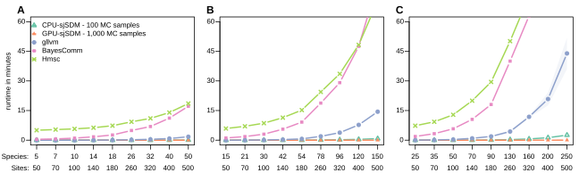 
<figcaption>Figure 1: Runtime benchmarks for GPU-sjSDM, CPU-sjSDM, gllvm, BayesComm, and Hmsc fitted to simulated data with 50 to 500 sites (dense species-species association matrices) and the number of species set to A) 0.1, B) 0.3 and C) 0.5 times the number of sites. All values are averages from 5 simulated datasets. To estimate the inference error of the Monte-Carlo approximation, GPU-sjSDM was fitted with 1,000 and CPU-sjSDM with 100 MC-samples for each species.</figcaption>

### Figure 2 <a name="fig2"></a>

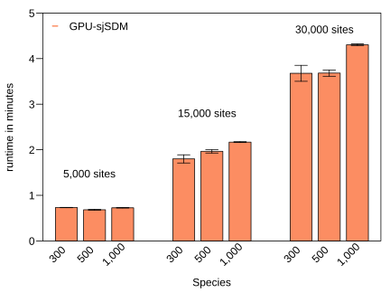
<figcaption>Figure 2: Benchmark results for sjSDM on big community data. We simulated communities with 5,000, 15,000, and 30,000 sites and for each set of 300, 500, and 1,000 species. </figcaption>

### Figure 3 <a name="fig3"></a>

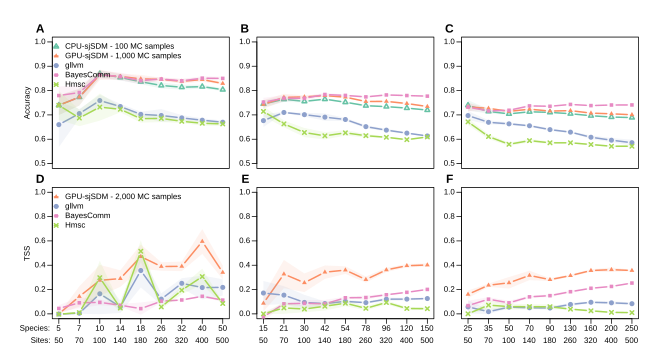
<figcaption>Figure 3: Inference performance of the inferred sparse and non-sparse species-species associations. Models were fitted to simulated data with 50 to 500 sites. All values are averages from 5 simulated datasets. A - C) The upper row shows the accuracies of matching signs (positive or negative covariance) for the estimated and true dense species-species association matrix. D - F) The lower row shows the accuracy of inferring non-zero species associations for sparse association matrices (95% sparsity), measured by the true skill statistic (absolute associations smaller than 0.01 were assigned the class ‘0’ and absolute associations greater than 0.01 were assigned the class ‘1’). The number of species for were set to 0.1 (A, D), 0.3 (B, E) and 0.5 (C, F) times the number of sites. To estimate the inference error of the Monte-Carlo (MC) approximation, GPU-sjSDM was fitted with 1,000 and CPU-sjSDM with 100 MC-samples for each species.</figcaption>

### Figure 4 <a name="fig4"></a>

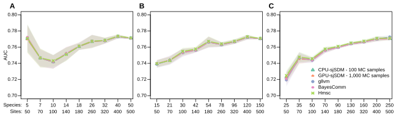
<figcaption>Figure 4: Predictive performance in simulated species distributions for GPU-sjSDM and CPU-sjSDM with gllvm, BayesComm, and Hmsc as references. Species distribution scenarios with A) 50 to 500 sites and 10%, B) 30%, and C) 50% species were simulated, on which the models were fitted (training). Models predicted species distributions for additional 50 to 500 sites (testing). Area under the curve (AUC) was used to evaluate predictive performance on holdout.</figcaption>

### Figure 5 <a name="fig5"></a>


<figcaption>Figure 5:  Inferred OTU associations and environmental preferences for the eDNA community data. The left column (panel A-C) shows OTU-OTU associations for A) no regularization and B) tuned regularization, with the 3,649 OTU sorted according to their summed abundance over 125 sites. The large panel C) shows the covariance structure of B), but with OTU sorted after their most important environmental coefficients (largest absolute environmental effect size; the outer ring shows the environmental effect distribution for the OTU within the group).</figcaption>


### Figure S1 <a name="figS1"></a>

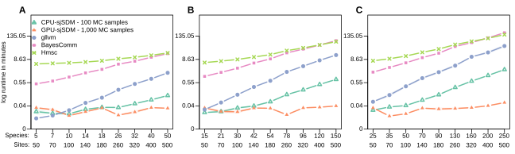
<figcaption>Figure S1: Results for computational log runtime benchmarking of GPU-sjSDM, CPU-sjSDM, gllvm, BayesComm, and Hmsc JSDM implementations. Models were fitted to different simulated SDM scenarios: 50 to 500 sites with A) 10%, B) 30%,  and C) 50% number of species (e.g. for 100 sites and 10% we get 10 species). For each scenario, ten simulations were sampled, and results were averaged. Due to high runtimes, runs for BayesComm, gllvm and Hmsc were aborted at specific points.</figcaption>


### Figure S2 <a name="figS2"></a>

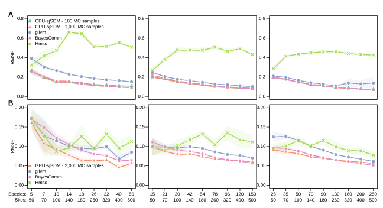
<figcaption>Figure S2: Root mean squared error of the inferred A) non-sparse and B) sparse species-species associations. Models were fitted to simulated data with 50 to 500 sites and the number of species set to 0.1, 0.3 and 0.5 times the number of sites. All values are averages from 5 simulated datasets. </figcaption>


### Figure S3 <a name="figS3"></a>

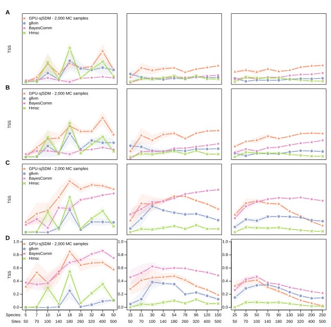
<figcaption>Figure S3: True skill statistic (TSS) for sparse absolute species-species associations with different thresholds: A) 0.005, B) 0.01, C) 0.05, and D) 0.1. Models were fitted to simulated data with 50 to 500 sites and the number of species set to 0.1, 0.3 and 0.5 times the number of sites. All values are averages from 5 simulated datasets. </figcaption>


### Figure S4 <a name="figS4"></a>


<figcaption>Figure S4: Results for inferential benchmarking of G-sjSDM with gllvm, BayesComm, and Hmsc as references. Models were fitted to different simulated SDM scenarios: 50 to 500 sites with 10% (first column), 30% (second column) and 50% (third column) number of species to site proportions (e.g., for 100 sites and 10% we get 10 species). For each scenario, 5 simulations were sampled, and results were averaged. A) and B) show the environmental coefficient accuracy (matching signs) and the corresponding RMSE with full species-species association matrices. C) and D) show the environmental coefficient accuracy (matching signs) and the corresponding RMSE with sparse (50% sparsity) species-species association matrices. </figcaption>


### Figure S5 <a name="figS5"></a>

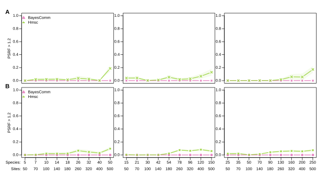
<figcaption>Figure S5: Rate of weights in percent with potential scale reduction factor > 1.2 with non-sparse and sparse association matrices in simulation scenarios for A) Hmsc (for factor loadings and beta estimates) and B) BayesComm (covariance and beta estimates).</figcaption>


### Figure S6 <a name="figS6"></a>


<figcaption>Figure S6: Results for examining the ability to recover the covariance structure as a function of the sites for GPU-sjSDM, BC, gllvm, and Hmsc. In the simulated species distribution scenarios, the number of species were constantly set to 50, but the number of sites were changed from 50 to 330 sites. A) Performance was measured by the accuracy of matching sings between estimated covariances matrices and true covariance matrices. B) Moreover, the root mean squared error for the environmental effects with the true coefficients were calculated. </figcaption>


### Figure S7 <a name="figS7"></a>

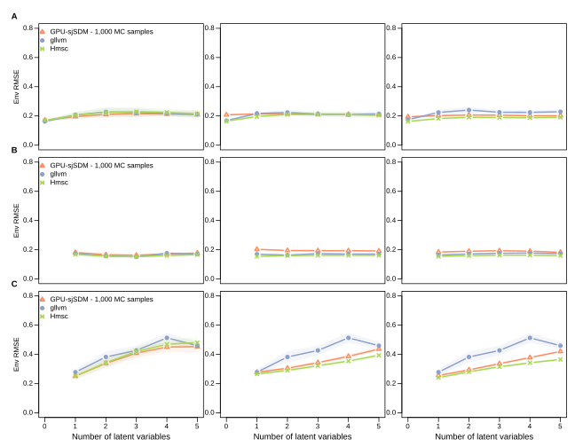
<figcaption>Figure S7: Results for communities simulated by the latent variable model. Models were fitted to different simulation scenarios: 10, 50 and 100 species with 1 - 5 latent variables. Number of environmental coefficients were set to two. For each scenario, the RMSE error between true and estimated environmental coefficients over the five repetitions were averaged. A) shows the results for equal weighting B) for 5:1 (environment to latent) weighting and C) for 1:5 (environment to latent) weighting between the environmental and latent coefficients in the simulation.</figcaption>


### Figure S8 <a name="figS8"></a>

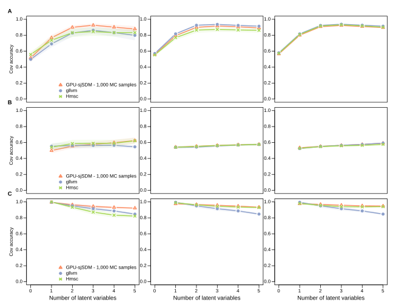
<figcaption>Figure S8: Results for communities simulated by the latent variable model. Models were fitted to different simulation scenarios: 10, 50 and 100 species with 1 - 5 latent variables. Number of environmental coefficients were set to two. For each scenario, the accuracy of matching signs of the covariances in the association matrix between true and estimated covariance matrix over the five repetitions were averaged. A) shows the results for equal weighting B) for 5:1 weighting and C) for 1:5 weighting between the environmental and latent coefficients in the simulation.</figcaption>


### Figure S9 <a name="figS9"></a>

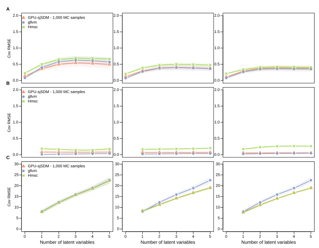
<figcaption>Figure S9: Results for communities simulated by the latent variable model. Models were fitted to different simulation scenarios: 10, 50 and 100 species with 1 - 5 latent variables. Number of environmental coefficients were set to two. For each scenario, the RMSE between the true and estimated covariance matrix (normalized to correlation matrices) over the five repetitions were averaged. A) shows the results for equal weighting B) for 5:1 weighting and C) for 1:5 weighting between the environmental and latent coefficients in the simulation.</figcaption>


### Figure S10 <a name="figS10"></a>

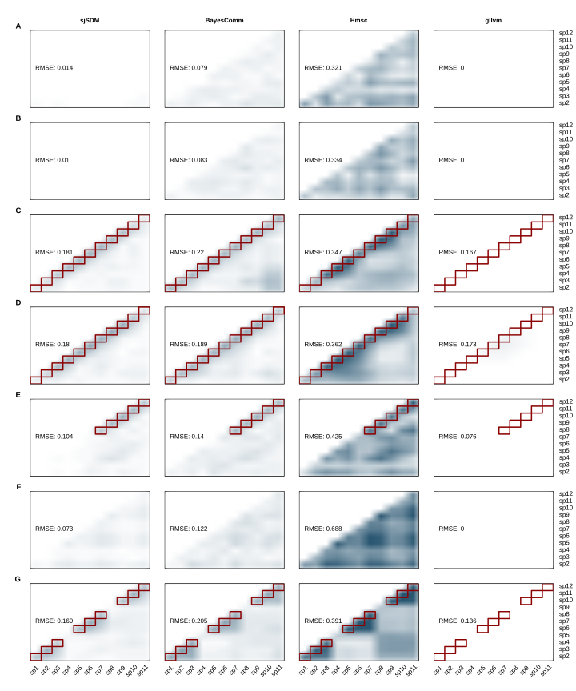
<figcaption>Figure S10: Results for simulations by the process-based community model from Leibold et al. 2020. Following Leibold et al. 2020, we tested 7 different scenarios with different niche widths (A-D), with and without interactions (A, B, and F without interactions), and different dispersal rates (F and G). Red rectangles show the true association matrices. For each scenario, 5 communities were temporally sequentially sampled and each of the JSDM were fit to all 5 realizations. Afterwards, the normalized ([-1,1]) covariance matrices were averaged over their absolute values and the root mean squared errors to the true association matrices were calculated.</figcaption>