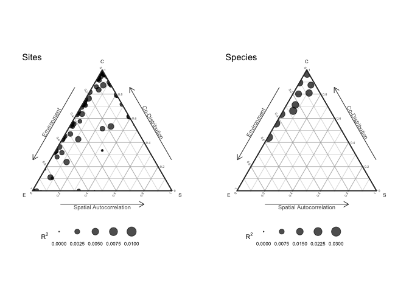

<!-- README.md is generated from README.Rmd. Please edit that file -->

# sjSDM - Fast and accurate Joint Species Distribution Modeling

[](https://www.gnu.org/licenses/gpl-3.0)

[](https://doi.org/10.1111/2041-210X.13687)

## Overview

A scalable method to estimates joint Species Distribution Models (jSDMs)
based on the multivariate probit model through Monte-Carlo approximation
of the joint likelihood. The numerical approximation is based on
‘PyTorch’ and ‘reticulate’, and can be calculated on CPUs and GPUs
alike.

The method is described in [Pichler & Hartig
(2021)](https://doi.org/10.1111/2041-210X.13687)
A new joint species distribution model for faster and more accurate
inference of species associations from big community data.

The package includes options to fit various different (j)SDM models:

-   jSDMs with Binomial, Poisson and Normal distributed responses
-   jSDMs based on deep neural networks
-   Spatial auto-correlation can be accounted for by spatial
    eigenvectors or trend surface polynomials

To get more information, install the package and run

``` r
library(sjSDM)
?sjSDM
vignette("sjSDM", package="sjSDM")
```

## Installation

**sjSDM** is based on ‘PyTorch’, a ‘python’ library, and thus requires
‘python’ dependencies. The ‘python’ dependencies can be automatically
installed by running:

``` r
library(sjSDM)
install_sjSDM()
```

If this didn’t work, please check the troubleshooting guide:

``` r
library(sjSDM)
?installation_help
```

## Usage

Let’s first simulate a community data set:

``` r
library(sjSDM)
## ── Attaching sjSDM ──────────────────────────────────────────────────── 1.0.1 ──
## ✓ torch <environment> 
## ✓ torch_optimizer  
## ✓ pyro  
## ✓ madgrad
set.seed(42)
community <- simulate_SDM(sites = 100, species = 10, env = 3, se = TRUE)
Env <- community$env_weights
Occ <- community$response
SP <- matrix(rnorm(200, 0, 0.3), 100, 2) # spatial coordinates (no effect on species occurences)
```

Estimate jSDM:

``` r
model <- sjSDM(Y = Occ, env = linear(data = Env, formula = ~X1), spatial = linear(data = SP, formula = ~0+X1:X2), se = TRUE, family=binomial("probit"), sampling = 100L)
summary(model)
## LogLik:  -569.5459 
## Regularization loss:  0 
## 
## Species-species correlation matrix: 
## 
##  sp1  1.0000                                 
##  sp2 -0.3380  1.0000                             
##  sp3 -0.0310 -0.3640  1.0000                         
##  sp4  0.0890 -0.2770  0.6670  1.0000                     
##  sp5  0.4590 -0.3710 -0.0140 -0.0960  1.0000                 
##  sp6 -0.1190  0.3690  0.1730  0.1980 -0.0770  1.0000             
##  sp7  0.4290 -0.1860  0.1700  0.1470  0.5150  0.2420  1.0000         
##  sp8  0.2490  0.0510 -0.3270 -0.3430  0.3090 -0.0230  0.2280  1.0000     
##  sp9  0.0450 -0.0290  0.0060  0.1660 -0.3590 -0.2000 -0.3070 -0.1840  1.0000 
##  sp10     0.2910  0.3150 -0.5000 -0.3540  0.1800  0.1080  0.1860  0.3410 -0.0710  1.0000
## 
## 
## 
## Spatial: 
##             sp1        sp2       sp3        sp4       sp5       sp6       sp7
## X1:X2 0.1362036 -0.4616366 0.3906074 -0.1906729 0.4108464 0.1651098 0.4153814
##             sp8       sp9        sp10
## X1:X2 0.2773075 0.2295802 -0.02492988
## 
## 
## 
##                  Estimate Std.Err Z value Pr(>|z|)    
## sp1 (Intercept)   -0.0405  0.1998   -0.20  0.83921    
## sp1 X1             0.6836  0.3973    1.72  0.08527 .  
## sp2 (Intercept)   -0.0101  0.2120   -0.05  0.96207    
## sp2 X1             0.9244  0.4110    2.25  0.02450 *  
## sp3 (Intercept)   -0.2737  0.2150   -1.27  0.20302    
## sp3 X1             0.9865  0.4143    2.38  0.01726 *  
## sp4 (Intercept)   -0.0560  0.2111   -0.27  0.79074    
## sp4 X1            -1.1353  0.4182   -2.71  0.00663 ** 
## sp5 (Intercept)   -0.1702  0.1978   -0.86  0.38964    
## sp5 X1             0.4623  0.3792    1.22  0.22281    
## sp6 (Intercept)    0.2006  0.1902    1.05  0.29152    
## sp6 X1             1.5796  0.3863    4.09  4.3e-05 ***
## sp7 (Intercept)    0.0180  0.1775    0.10  0.91941    
## sp7 X1            -0.3499  0.3488   -1.00  0.31576    
## sp8 (Intercept)    0.1588  0.1412    1.12  0.26069    
## sp8 X1             0.1323  0.2627    0.50  0.61452    
## sp9 (Intercept)    0.0264  0.1703    0.15  0.87699    
## sp9 X1             1.1001  0.3269    3.36  0.00077 ***
## sp10 (Intercept)  -0.0525  0.1735   -0.30  0.76199    
## sp10 X1           -0.5166  0.3234   -1.60  0.11022    
## ---
## Signif. codes:  0 '***' 0.001 '**' 0.01 '*' 0.05 '.' 0.1 ' ' 1
```

Update model (change main effects to quadratic effects):

``` r
model2 <- update(model, env_formula = ~I(X1^2))
summary(model2)
## LogLik:  -600.4297 
## Regularization loss:  0 
## 
## Species-species correlation matrix: 
## 
##  sp1  1.0000                                 
##  sp2 -0.2870  1.0000                             
##  sp3 -0.0050 -0.2600  1.0000                         
##  sp4  0.0600 -0.3630  0.5690  1.0000                     
##  sp5  0.4710 -0.3350 -0.0270 -0.0520  1.0000                 
##  sp6 -0.0310  0.4350  0.2190  0.0140 -0.0410  1.0000             
##  sp7  0.4280 -0.2050  0.1700  0.0730  0.5290  0.2020  1.0000         
##  sp8  0.2530  0.0580 -0.2890 -0.3710  0.3270  0.0220  0.2400  1.0000     
##  sp9  0.0550  0.1120  0.0980  0.1210 -0.3220  0.0230 -0.2450 -0.1590  1.0000 
##  sp10     0.2720  0.2180 -0.4960 -0.3520  0.2270  0.0360  0.1420  0.3030 -0.1140  1.0000
## 
## 
## 
## Spatial: 
##             sp1       sp2       sp3        sp4       sp5       sp6       sp7
## X1:X2 0.1946324 -0.462581 0.4739597 -0.1982521 0.4937007 0.1960442 0.4032983
##             sp8       sp9         sp10
## X1:X2 0.2994181 0.2302684 -0.006441596
## 
## 
## 
##                  Estimate Std.Err Z value Pr(>|z|)
## sp1 (Intercept)   -0.1307  0.2899   -0.45     0.65
## sp1 I(X1^2)        0.4196  0.7427    0.56     0.57
## sp2 (Intercept)   -0.2218  0.3048   -0.73     0.47
## sp2 I(X1^2)        0.6981  0.7684    0.91     0.36
## sp3 (Intercept)   -0.3121  0.2963   -1.05     0.29
## sp3 I(X1^2)        0.1102  0.7289    0.15     0.88
## sp4 (Intercept)   -0.2547  0.2787   -0.91     0.36
## sp4 I(X1^2)        0.7601  0.6738    1.13     0.26
## sp5 (Intercept)   -0.1277  0.2489   -0.51     0.61
## sp5 I(X1^2)        0.2279  0.6497    0.35     0.73
## sp6 (Intercept)    0.1619  0.2606    0.62     0.53
## sp6 I(X1^2)       -0.0363  0.6880   -0.05     0.96
## sp7 (Intercept)    0.0430  0.2347    0.18     0.85
## sp7 I(X1^2)       -0.0318  0.6161   -0.05     0.96
## sp8 (Intercept)   -0.0196  0.2080   -0.09     0.93
## sp8 I(X1^2)        0.7520  0.5211    1.44     0.15
## sp9 (Intercept)    0.2057  0.2406    0.85     0.39
## sp9 I(X1^2)       -0.6158  0.5886   -1.05     0.30
## sp10 (Intercept)  -0.1004  0.2440   -0.41     0.68
## sp10 I(X1^2)       0.2091  0.5959    0.35     0.73
```

Estimate and visualize meta-community structure:

``` r
anv <- anova(model)
plot(anv, internal=TRUE)
## Registered S3 methods overwritten by 'ggtern':
##   method           from   
##   grid.draw.ggplot ggplot2
##   plot.ggplot      ggplot2
##   print.ggplot     ggplot2
```

<!-- -->

Change linear part of model to a deep neural network:

``` r
DNN <- sjSDM(Y = Occ, env = DNN(data = Env, formula = ~.), spatial = linear(data = SP, formula = ~0+X1:X2), se = TRUE, family=binomial("probit"), sampling = 100L)
summary(DNN)
## LogLik:  -507.1421 
## Regularization loss:  0 
## 
## Species-species correlation matrix: 
## 
##  sp1  1.0000                                 
##  sp2 -0.4000  1.0000                             
##  sp3 -0.1060 -0.3570  1.0000                         
##  sp4 -0.0650 -0.3470  0.7530  1.0000                     
##  sp5  0.5770 -0.3450 -0.1110 -0.0710  1.0000                 
##  sp6 -0.2720  0.3630  0.2170  0.2060 -0.0600  1.0000             
##  sp7  0.4220 -0.1520  0.1560  0.1970  0.4780  0.2430  1.0000         
##  sp8  0.2150  0.1140 -0.4060 -0.4120  0.2190 -0.0540  0.0890  1.0000     
##  sp9 -0.0390 -0.0630  0.0980  0.0970 -0.3440 -0.2930 -0.1830 -0.1220  1.0000 
##  sp10     0.1270  0.3730 -0.6080 -0.5760  0.2280  0.0620  0.0820  0.3760 -0.2510  1.0000
## 
## 
## 
## Spatial: 
##             sp1        sp2       sp3        sp4       sp5       sp6      sp7
## X1:X2 0.1791221 -0.5187001 0.5328111 -0.1147005 0.3768144 0.2153512 0.528778
##             sp8       sp9      sp10
## X1:X2 0.4690367 0.2996197 0.2277844
## 
## 
## 
## Env architecture:
## ===================================
## Layer_1:  (4, 10)
## Layer_2:  ReLU
## Layer_3:  (10, 10)
## Layer_4:  ReLU
## Layer_5:  (10, 10)
## Layer_6:  ReLU
## Layer_7:  (10, 10)
## ===================================
## Weights :     340
```
