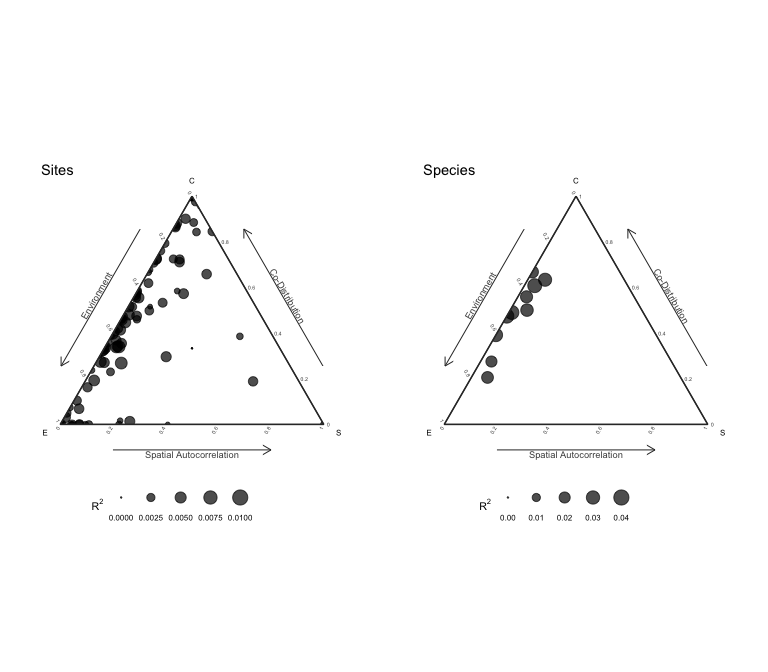

# sjSDM - Fast and accurate Joint Species Distribution Modeling

[](https://www.gnu.org/licenses/gpl-3.0)

[](https://besjournals.onlinelibrary.wiley.com/doi/abs/10.1111/2041-210X.13687)

## Overview

A scalable method to estimates joint Species Distribution Models (jSDMs)
based on the multivariate probit model through Monte-Carlo approximation
of the joint likelihood. The numerical approximation is based on
‘PyTorch’ and ‘reticulate’, and can be calculated on CPUs and GPUs
alike.

The method is described in [Pichler & Hartig
(2021)](https://besjournals.onlinelibrary.wiley.com/doi/abs/10.1111/2041-210X.13687)
A new joint species distribution model for faster and more accurate
inference of species associations from big community data.

The package includes options to fit various different (j)SDM models:

- jSDMs with Binomial, Poisson, negative Binomial, and Normal
  distributed responses
- jSDMs based on deep neural networks
- Spatial auto-correlation can be accounted for by spatial eigenvectors
  or trend surface polynomials

To get more information, install the package and run

``` r
library(sjSDM)
?sjSDM
vignette("sjSDM", package="sjSDM")
```

## Installation

**sjSDM** is based on ‘PyTorch’, a ‘python’ library, and thus requires
‘python’ dependencies. The ‘python’ dependencies can be automatically
installed by running:

``` r
library(sjSDM)
install_sjSDM()
```

If this didn’t work, please check the troubleshooting guide:

``` r
library(sjSDM)
?installation_help
```

## Usage

## Workflow

Simulate a community and fit a sjSDM model:

``` r
library(sjSDM)
## ── Attaching sjSDM ──────────────────────────────────────────────────── 1.0.4 ──
## ✔ torch <environment> 
## ✔ torch_optimizer  
## ✔ pyro  
## ✔ madgrad
set.seed(42)
community <- simulate_SDM(sites = 100, species = 10, env = 3, se = TRUE)
Env <- community$env_weights
Occ <- community$response
SP <- matrix(rnorm(200, 0, 0.3), 100, 2) # spatial coordinates (no effect on species occurences)

model <- sjSDM(Y = Occ, env = linear(data = Env, formula = ~X1+X2+X3), spatial = linear(data = SP, formula = ~0+X1:X2), se = TRUE, family=binomial("probit"), sampling = 100L)
summary(model)
## Family:  binomial 
## 
## LogLik:  -509.6956 
## Regularization loss:  0 
## 
## Species-species correlation matrix: 
## 
##  sp1  1.0000                                 
##  sp2 -0.3930  1.0000                             
##  sp3 -0.1940 -0.4060  1.0000                         
##  sp4 -0.1740 -0.3650  0.8380  1.0000                     
##  sp5  0.6900 -0.3870 -0.1400 -0.1110  1.0000                 
##  sp6 -0.3050  0.4630  0.1950  0.1920 -0.1090  1.0000             
##  sp7  0.5530 -0.1240  0.1400  0.1680  0.5450  0.2670  1.0000         
##  sp8  0.2850  0.1850 -0.5200 -0.5230  0.2190 -0.0510  0.0990  1.0000     
##  sp9 -0.0580 -0.0460  0.0730  0.0800 -0.3680 -0.3680 -0.2190 -0.1270  1.0000 
##  sp10     0.1800  0.4780 -0.7110 -0.6490  0.2570  0.1280  0.1110  0.4390 -0.2780  1.0000
## 
## 
## 
## Spatial: 
##            sp1      sp2      sp3        sp4      sp5     sp6      sp7      sp8
## X1:X2 1.833657 -3.73803 3.201508 -0.1534014 2.708719 1.09901 3.024099 2.103048
##             sp9     sp10
## X1:X2 0.9000567 1.426787
## 
## 
## 
##                  Estimate Std.Err Z value Pr(>|z|)    
## sp1 (Intercept)   -0.0706  0.2782   -0.25  0.79958    
## sp1 X1             1.3255  0.5602    2.37  0.01798 *  
## sp1 X2            -2.4545  0.5184   -4.73  2.2e-06 ***
## sp1 X3            -0.2627  0.4853   -0.54  0.58832    
## sp2 (Intercept)   -0.0733  0.2806   -0.26  0.79391    
## sp2 X1             1.3378  0.5145    2.60  0.00931 ** 
## sp2 X2             0.3304  0.5013    0.66  0.50981    
## sp2 X3             0.6804  0.4804    1.42  0.15668    
## sp3 (Intercept)   -0.4891  0.2821   -1.73  0.08297 .  
## sp3 X1             1.5414  0.5193    2.97  0.00300 ** 
## sp3 X2            -0.5027  0.4952   -1.02  0.31007    
## sp3 X3            -1.1854  0.4833   -2.45  0.01419 *  
## sp4 (Intercept)   -0.0496  0.2620   -0.19  0.84980    
## sp4 X1            -1.5563  0.5031   -3.09  0.00198 ** 
## sp4 X2            -1.9729  0.4955   -3.98  6.8e-05 ***
## sp4 X3            -0.4153  0.4421   -0.94  0.34756    
## sp5 (Intercept)   -0.1866  0.2352   -0.79  0.42761    
## sp5 X1             0.7291  0.4514    1.62  0.10630    
## sp5 X2             0.5314  0.4339    1.22  0.22075    
## sp5 X3            -0.7454  0.4092   -1.82  0.06849 .  
## sp6 (Intercept)    0.2982  0.2519    1.18  0.23656    
## sp6 X1             2.5441  0.5265    4.83  1.4e-06 ***
## sp6 X2            -1.0125  0.4828   -2.10  0.03598 *  
## sp6 X3             0.1574  0.4254    0.37  0.71131    
## sp7 (Intercept)    0.0219  0.2421    0.09  0.92799    
## sp7 X1            -0.2934  0.4891   -0.60  0.54853    
## sp7 X2             0.3331  0.4308    0.77  0.43929    
## sp7 X3            -1.4939  0.4089   -3.65  0.00026 ***
## sp8 (Intercept)    0.1282  0.1600    0.80  0.42272    
## sp8 X1             0.3470  0.3034    1.14  0.25286    
## sp8 X2             0.3094  0.3015    1.03  0.30489    
## sp8 X3            -1.2074  0.2848   -4.24  2.2e-05 ***
## sp9 (Intercept)    0.0147  0.1923    0.08  0.93926    
## sp9 X1             1.4044  0.3659    3.84  0.00012 ***
## sp9 X2            -1.0778  0.3644   -2.96  0.00310 ** 
## sp9 X3             0.8353  0.3157    2.65  0.00814 ** 
## sp10 (Intercept)  -0.1249  0.2082   -0.60  0.54871    
## sp10 X1           -0.5152  0.3799   -1.36  0.17509    
## sp10 X2           -1.2256  0.3901   -3.14  0.00168 ** 
## sp10 X3           -0.5568  0.3492   -1.59  0.11076    
## ---
## Signif. codes:  0 '***' 0.001 '**' 0.01 '*' 0.05 '.' 0.1 ' ' 1
plot(model)
## Family:  binomial 
## 
## LogLik:  -509.6956 
## Regularization loss:  0 
## 
## Species-species correlation matrix: 
## 
##  sp1  1.0000                                 
##  sp2 -0.3930  1.0000                             
##  sp3 -0.1940 -0.4060  1.0000                         
##  sp4 -0.1740 -0.3650  0.8380  1.0000                     
##  sp5  0.6900 -0.3870 -0.1400 -0.1110  1.0000                 
##  sp6 -0.3050  0.4630  0.1950  0.1920 -0.1090  1.0000             
##  sp7  0.5530 -0.1240  0.1400  0.1680  0.5450  0.2670  1.0000         
##  sp8  0.2850  0.1850 -0.5200 -0.5230  0.2190 -0.0510  0.0990  1.0000     
##  sp9 -0.0580 -0.0460  0.0730  0.0800 -0.3680 -0.3680 -0.2190 -0.1270  1.0000 
##  sp10     0.1800  0.4780 -0.7110 -0.6490  0.2570  0.1280  0.1110  0.4390 -0.2780  1.0000
## 
## 
## 
## Spatial: 
##            sp1      sp2      sp3        sp4      sp5     sp6      sp7      sp8
## X1:X2 1.833657 -3.73803 3.201508 -0.1534014 2.708719 1.09901 3.024099 2.103048
##             sp9     sp10
## X1:X2 0.9000567 1.426787
## 
## 
## 
##                  Estimate Std.Err Z value Pr(>|z|)    
## sp1 (Intercept)   -0.0706  0.2782   -0.25  0.79958    
## sp1 X1             1.3255  0.5602    2.37  0.01798 *  
## sp1 X2            -2.4545  0.5184   -4.73  2.2e-06 ***
## sp1 X3            -0.2627  0.4853   -0.54  0.58832    
## sp2 (Intercept)   -0.0733  0.2806   -0.26  0.79391    
## sp2 X1             1.3378  0.5145    2.60  0.00931 ** 
## sp2 X2             0.3304  0.5013    0.66  0.50981    
## sp2 X3             0.6804  0.4804    1.42  0.15668    
## sp3 (Intercept)   -0.4891  0.2821   -1.73  0.08297 .  
## sp3 X1             1.5414  0.5193    2.97  0.00300 ** 
## sp3 X2            -0.5027  0.4952   -1.02  0.31007    
## sp3 X3            -1.1854  0.4833   -2.45  0.01419 *  
## sp4 (Intercept)   -0.0496  0.2620   -0.19  0.84980    
## sp4 X1            -1.5563  0.5031   -3.09  0.00198 ** 
## sp4 X2            -1.9729  0.4955   -3.98  6.8e-05 ***
## sp4 X3            -0.4153  0.4421   -0.94  0.34756    
## sp5 (Intercept)   -0.1866  0.2352   -0.79  0.42761    
## sp5 X1             0.7291  0.4514    1.62  0.10630    
## sp5 X2             0.5314  0.4339    1.22  0.22075    
## sp5 X3            -0.7454  0.4092   -1.82  0.06849 .  
## sp6 (Intercept)    0.2982  0.2519    1.18  0.23656    
## sp6 X1             2.5441  0.5265    4.83  1.4e-06 ***
## sp6 X2            -1.0125  0.4828   -2.10  0.03598 *  
## sp6 X3             0.1574  0.4254    0.37  0.71131    
## sp7 (Intercept)    0.0219  0.2421    0.09  0.92799    
## sp7 X1            -0.2934  0.4891   -0.60  0.54853    
## sp7 X2             0.3331  0.4308    0.77  0.43929    
## sp7 X3            -1.4939  0.4089   -3.65  0.00026 ***
## sp8 (Intercept)    0.1282  0.1600    0.80  0.42272    
## sp8 X1             0.3470  0.3034    1.14  0.25286    
## sp8 X2             0.3094  0.3015    1.03  0.30489    
## sp8 X3            -1.2074  0.2848   -4.24  2.2e-05 ***
## sp9 (Intercept)    0.0147  0.1923    0.08  0.93926    
## sp9 X1             1.4044  0.3659    3.84  0.00012 ***
## sp9 X2            -1.0778  0.3644   -2.96  0.00310 ** 
## sp9 X3             0.8353  0.3157    2.65  0.00814 ** 
## sp10 (Intercept)  -0.1249  0.2082   -0.60  0.54871    
## sp10 X1           -0.5152  0.3799   -1.36  0.17509    
## sp10 X2           -1.2256  0.3901   -3.14  0.00168 ** 
## sp10 X3           -0.5568  0.3492   -1.59  0.11076    
## ---
## Signif. codes:  0 '***' 0.001 '**' 0.01 '*' 0.05 '.' 0.1 ' ' 1
```


We support other distributions:

- Count data with Poisson:

  ``` r
  model <- sjSDM(Y = Occ, env = linear(data = Env, formula = ~X1+X2+X3), spatial = linear(data = SP, formula = ~0+X1:X2), se = TRUE, family=poisson("log"))
  ```

- Count data with negative Binomial (which is still experimental, if you
  run into errors/problems, please let us know):

  ``` r
  model <- sjSDM(Y = Occ, env = linear(data = Env, formula = ~X1+X2+X3), spatial = linear(data = SP, formula = ~0+X1:X2), se = TRUE, family="nbinom")
  ```

- Gaussian (normal):

  ``` r
  model <- sjSDM(Y = Occ, env = linear(data = Env, formula = ~X1+X2+X3), spatial = linear(data = SP, formula = ~0+X1:X2), se = TRUE, family=gaussian("identity"))
  ```

### Anova

ANOVA can be used to partition the three components (abiotic, biotic,
and spatial):

``` r
an = anova(model)
print(an)
## Analysis of Deviance Table
## 
## Terms added sequentially:
## 
##           Deviance Residual deviance R2 Nagelkerke R2 McFadden
## Abiotic  158.50193        1176.49491       0.79506      0.1143
## Biotic   174.34114        1160.65570       0.82508      0.1258
## Spatial   17.36284        1317.63400       0.15939      0.0125
## Full     385.12477         949.87207       0.97875      0.2778
plot(an)
```


The anova shows the relative changes in the R<sup>2</sup> of the groups
and their intersections.

### Internal metacommunity structure

Following [Leibold et al., 2022](https://doi.org/10.1111/oik.08618) we
can calculate and visualize the internal metacommunity structure
(=partitioning of the three components for species and sites). The
internal structure is already calculated by the ANOVA and we can
visualize it with the plot method:

``` r
results = plotInternalStructure(an) # or plot(an, internal = TRUE)
## Registered S3 methods overwritten by 'ggtern':
##   method           from   
##   grid.draw.ggplot ggplot2
##   plot.ggplot      ggplot2
##   print.ggplot     ggplot2
```



The plot function returns the results for the internal metacommunity
structure:

``` r
print(results$data$Species)
##           env         spa     codist         r2
## 1  0.18381956 0.000000000 0.16184106 0.03359793
## 2  0.08049680 0.015325191 0.18769590 0.02835179
## 3  0.12306175 0.012617623 0.20203961 0.03377190
## 4  0.16288248 0.000000000 0.16668514 0.03255768
## 5  0.08457549 0.000000000 0.17337110 0.02531043
## 6  0.18565760 0.004841876 0.11575091 0.03062504
## 7  0.11334253 0.010650320 0.13173792 0.02557308
## 8  0.14376540 0.006795306 0.05034753 0.02009082
## 9  0.18090652 0.010146785 0.03867189 0.02297252
## 10 0.09057520 0.015687265 0.14331360 0.02495761
```

## Deep neural networks

Change linear part of model to a deep neural network:

``` r
DNN <- sjSDM(Y = Occ, env = DNN(data = Env, formula = ~.), spatial = linear(data = SP, formula = ~0+X1:X2), se = TRUE, family=binomial("probit"), sampling = 100L)
summary(DNN)
## Family:  binomial 
## 
## LogLik:  -443.0081 
## Regularization loss:  0 
## 
## Species-species correlation matrix: 
## 
##  sp1  1.0000                                 
##  sp2 -0.4170  1.0000                             
##  sp3 -0.1710 -0.3400  1.0000                         
##  sp4 -0.1160 -0.3210  0.8380  1.0000                     
##  sp5  0.6680 -0.3110 -0.1710 -0.1170  1.0000                 
##  sp6 -0.3400  0.4420  0.3300  0.2690 -0.0850  1.0000             
##  sp7  0.5450 -0.0990  0.2080  0.2620  0.5510  0.3160  1.0000         
##  sp8  0.2690  0.1310 -0.4920 -0.5560  0.1820 -0.0880  0.0220  1.0000     
##  sp9 -0.0890  0.0200 -0.0060  0.0470 -0.4760 -0.3910 -0.3010 -0.1100  1.0000 
##  sp10     0.1410  0.4550 -0.7060 -0.6590  0.3200  0.0420  0.0700  0.3950 -0.2650  1.0000
## 
## 
## 
## Spatial: 
##            sp1       sp2      sp3        sp4      sp5       sp6      sp7
## X1:X2 2.412297 -4.510677 3.553956 0.05744403 3.329331 0.9933778 3.430914
##           sp8       sp9     sp10
## X1:X2 2.75222 0.9355341 1.115383
## 
## 
## 
## Env architecture:
## ===================================
## Layer_1:  (4, 10)
## Layer_2:  SELU
## Layer_3:  (10, 10)
## Layer_4:  SELU
## Layer_5:  (10, 10)
## Layer_6:  SELU
## Layer_7:  (10, 10)
## ===================================
## Weights :     340
```
