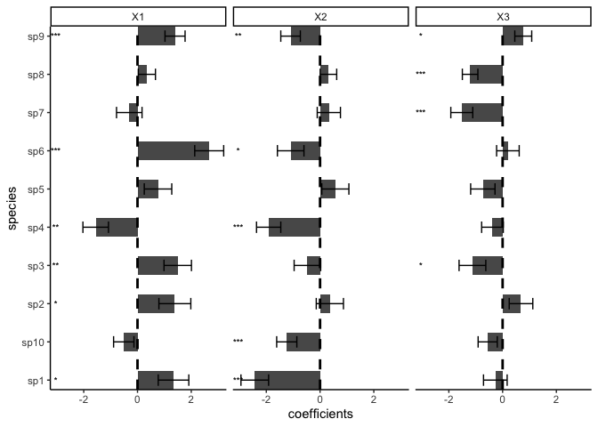

<!-- README.md is generated from README.Rmd. Please edit that file -->

# sjSDM - Fast and accurate Joint Species Distribution Modeling

[](https://www.gnu.org/licenses/gpl-3.0)

[](https://besjournals.onlinelibrary.wiley.com/doi/abs/10.1111/2041-210X.13687)

## Overview

A scalable method to estimates joint Species Distribution Models (jSDMs)
based on the multivariate probit model through Monte-Carlo approximation
of the joint likelihood. The numerical approximation is based on
‘PyTorch’ and ‘reticulate’, and can be calculated on CPUs and GPUs
alike.

The method is described in [Pichler & Hartig
(2021)](https://besjournals.onlinelibrary.wiley.com/doi/abs/10.1111/2041-210X.13687)
A new joint species distribution model for faster and more accurate
inference of species associations from big community data.

The package includes options to fit various different (j)SDM models:

- jSDMs with Binomial, Poisson, negative Binomial, and Normal
  distributed responses
- jSDMs based on deep neural networks
- Spatial auto-correlation can be accounted for by spatial eigenvectors
  or trend surface polynomials

To get more information, install the package and run

``` r
library(sjSDM)
?sjSDM
vignette("sjSDM", package="sjSDM")
```

## Installation

**sjSDM** is based on ‘PyTorch’, a ‘python’ library, and thus requires
‘python’ dependencies. The ‘python’ dependencies can be automatically
installed by running:

``` r
library(sjSDM)
install_sjSDM()
```

If this didn’t work, please check the troubleshooting guide:

``` r
library(sjSDM)
?installation_help
```

## Usage

## Workflow

Simulate a community and fit a sjSDM model:

``` r
library(sjSDM)
## ── Attaching sjSDM ──────────────────────────────────────────────────── 1.0.4 ──
## ✔ torch <environment> 
## ✔ torch_optimizer  
## ✔ pyro  
## ✔ madgrad
set.seed(42)
community <- simulate_SDM(sites = 100, species = 10, env = 3, se = TRUE)
Env <- community$env_weights
Occ <- community$response
SP <- matrix(rnorm(200, 0, 0.3), 100, 2) # spatial coordinates (no effect on species occurences)

model <- sjSDM(Y = Occ, env = linear(data = Env, formula = ~X1+X2+X3), spatial = linear(data = SP, formula = ~0+X1:X2), se = TRUE, family=binomial("probit"), sampling = 100L)
summary(model)
## Family:  binomial 
## 
## LogLik:  -508.7274 
## Regularization loss:  0 
## 
## Species-species correlation matrix: 
## 
##  sp1  1.0000                                 
##  sp2 -0.3650  1.0000                             
##  sp3 -0.1910 -0.4300  1.0000                         
##  sp4 -0.1800 -0.3670  0.8280  1.0000                     
##  sp5  0.6860 -0.3800 -0.1050 -0.0890  1.0000                 
##  sp6 -0.2860  0.4900  0.1730  0.1960 -0.0970  1.0000             
##  sp7  0.5640 -0.1080  0.1310  0.1630  0.5580  0.2810  1.0000         
##  sp8  0.2920  0.1920 -0.5070 -0.5220  0.2050 -0.0380  0.1150  1.0000     
##  sp9 -0.0670 -0.0540  0.0480  0.0560 -0.3910 -0.3570 -0.2350 -0.1250  1.0000 
##  sp10     0.2110  0.4840 -0.7090 -0.6490  0.2550  0.1420  0.1330  0.4510 -0.2690  1.0000
## 
## 
## 
## Spatial: 
##            sp1       sp2      sp3       sp4      sp5     sp6      sp7      sp8
## X1:X2 1.807111 -3.891649 3.616006 0.2416204 2.371867 1.23862 3.087861 1.890661
##            sp9     sp10
## X1:X2 1.237618 1.302866
## 
## 
## 
##                  Estimate  Std.Err Z value Pr(>|z|)    
## sp1 (Intercept)  -0.05573  0.27360   -0.20  0.83858    
## sp1 X1            1.34006  0.56886    2.36  0.01849 *  
## sp1 X2           -2.42857  0.51421   -4.72  2.3e-06 ***
## sp1 X3           -0.27071  0.43979   -0.62  0.53819    
## sp2 (Intercept)   0.00232  0.27897    0.01  0.99336    
## sp2 X1            1.38987  0.59367    2.34  0.01922 *  
## sp2 X2            0.36444  0.50596    0.72  0.47135    
## sp2 X3            0.68465  0.43890    1.56  0.11878    
## sp3 (Intercept)  -0.55909  0.27776   -2.01  0.04413 *  
## sp3 X1            1.49674  0.51045    2.93  0.00337 ** 
## sp3 X2           -0.47064  0.49361   -0.95  0.34036    
## sp3 X3           -1.12252  0.49705   -2.26  0.02392 *  
## sp4 (Intercept)  -0.09188  0.23848   -0.39  0.70003    
## sp4 X1           -1.55543  0.47517   -3.27  0.00106 ** 
## sp4 X2           -1.91234  0.45110   -4.24  2.2e-05 ***
## sp4 X3           -0.37758  0.40194   -0.94  0.34752    
## sp5 (Intercept)  -0.22248  0.26192   -0.85  0.39564    
## sp5 X1            0.76319  0.51134    1.49  0.13556    
## sp5 X2            0.56888  0.50411    1.13  0.25911    
## sp5 X3           -0.73548  0.45295   -1.62  0.10443    
## sp6 (Intercept)   0.30172  0.26113    1.16  0.24792    
## sp6 X1            2.66774  0.53908    4.95  7.5e-07 ***
## sp6 X2           -1.09261  0.49401   -2.21  0.02699 *  
## sp6 X3            0.19688  0.42018    0.47  0.63938    
## sp7 (Intercept)  -0.02088  0.23800   -0.09  0.93009    
## sp7 X1           -0.30568  0.47481   -0.64  0.51970    
## sp7 X2            0.32681  0.43209    0.76  0.44945    
## sp7 X3           -1.51884  0.40833   -3.72  0.00020 ***
## sp8 (Intercept)   0.16312  0.16370    1.00  0.31905    
## sp8 X1            0.34875  0.31925    1.09  0.27466    
## sp8 X2            0.31206  0.30730    1.02  0.30988    
## sp8 X3           -1.20898  0.28881   -4.19  2.8e-05 ***
## sp9 (Intercept)   0.02942  0.19061    0.15  0.87733    
## sp9 X1            1.39647  0.37376    3.74  0.00019 ***
## sp9 X2           -1.09693  0.36395   -3.01  0.00258 ** 
## sp9 X3            0.76818  0.31463    2.44  0.01463 *  
## sp10 (Intercept) -0.10078  0.20713   -0.49  0.62656    
## sp10 X1          -0.51072  0.37896   -1.35  0.17776    
## sp10 X2          -1.23867  0.37494   -3.30  0.00095 ***
## sp10 X3          -0.55472  0.35597   -1.56  0.11916    
## ---
## Signif. codes:  0 '***' 0.001 '**' 0.01 '*' 0.05 '.' 0.1 ' ' 1
plot(model)
## Family:  binomial 
## 
## LogLik:  -508.7274 
## Regularization loss:  0 
## 
## Species-species correlation matrix: 
## 
##  sp1  1.0000                                 
##  sp2 -0.3650  1.0000                             
##  sp3 -0.1910 -0.4300  1.0000                         
##  sp4 -0.1800 -0.3670  0.8280  1.0000                     
##  sp5  0.6860 -0.3800 -0.1050 -0.0890  1.0000                 
##  sp6 -0.2860  0.4900  0.1730  0.1960 -0.0970  1.0000             
##  sp7  0.5640 -0.1080  0.1310  0.1630  0.5580  0.2810  1.0000         
##  sp8  0.2920  0.1920 -0.5070 -0.5220  0.2050 -0.0380  0.1150  1.0000     
##  sp9 -0.0670 -0.0540  0.0480  0.0560 -0.3910 -0.3570 -0.2350 -0.1250  1.0000 
##  sp10     0.2110  0.4840 -0.7090 -0.6490  0.2550  0.1420  0.1330  0.4510 -0.2690  1.0000
## 
## 
## 
## Spatial: 
##            sp1       sp2      sp3       sp4      sp5     sp6      sp7      sp8
## X1:X2 1.807111 -3.891649 3.616006 0.2416204 2.371867 1.23862 3.087861 1.890661
##            sp9     sp10
## X1:X2 1.237618 1.302866
## 
## 
## 
##                  Estimate  Std.Err Z value Pr(>|z|)    
## sp1 (Intercept)  -0.05573  0.27360   -0.20  0.83858    
## sp1 X1            1.34006  0.56886    2.36  0.01849 *  
## sp1 X2           -2.42857  0.51421   -4.72  2.3e-06 ***
## sp1 X3           -0.27071  0.43979   -0.62  0.53819    
## sp2 (Intercept)   0.00232  0.27897    0.01  0.99336    
## sp2 X1            1.38987  0.59367    2.34  0.01922 *  
## sp2 X2            0.36444  0.50596    0.72  0.47135    
## sp2 X3            0.68465  0.43890    1.56  0.11878    
## sp3 (Intercept)  -0.55909  0.27776   -2.01  0.04413 *  
## sp3 X1            1.49674  0.51045    2.93  0.00337 ** 
## sp3 X2           -0.47064  0.49361   -0.95  0.34036    
## sp3 X3           -1.12252  0.49705   -2.26  0.02392 *  
## sp4 (Intercept)  -0.09188  0.23848   -0.39  0.70003    
## sp4 X1           -1.55543  0.47517   -3.27  0.00106 ** 
## sp4 X2           -1.91234  0.45110   -4.24  2.2e-05 ***
## sp4 X3           -0.37758  0.40194   -0.94  0.34752    
## sp5 (Intercept)  -0.22248  0.26192   -0.85  0.39564    
## sp5 X1            0.76319  0.51134    1.49  0.13556    
## sp5 X2            0.56888  0.50411    1.13  0.25911    
## sp5 X3           -0.73548  0.45295   -1.62  0.10443    
## sp6 (Intercept)   0.30172  0.26113    1.16  0.24792    
## sp6 X1            2.66774  0.53908    4.95  7.5e-07 ***
## sp6 X2           -1.09261  0.49401   -2.21  0.02699 *  
## sp6 X3            0.19688  0.42018    0.47  0.63938    
## sp7 (Intercept)  -0.02088  0.23800   -0.09  0.93009    
## sp7 X1           -0.30568  0.47481   -0.64  0.51970    
## sp7 X2            0.32681  0.43209    0.76  0.44945    
## sp7 X3           -1.51884  0.40833   -3.72  0.00020 ***
## sp8 (Intercept)   0.16312  0.16370    1.00  0.31905    
## sp8 X1            0.34875  0.31925    1.09  0.27466    
## sp8 X2            0.31206  0.30730    1.02  0.30988    
## sp8 X3           -1.20898  0.28881   -4.19  2.8e-05 ***
## sp9 (Intercept)   0.02942  0.19061    0.15  0.87733    
## sp9 X1            1.39647  0.37376    3.74  0.00019 ***
## sp9 X2           -1.09693  0.36395   -3.01  0.00258 ** 
## sp9 X3            0.76818  0.31463    2.44  0.01463 *  
## sp10 (Intercept) -0.10078  0.20713   -0.49  0.62656    
## sp10 X1          -0.51072  0.37896   -1.35  0.17776    
## sp10 X2          -1.23867  0.37494   -3.30  0.00095 ***
## sp10 X3          -0.55472  0.35597   -1.56  0.11916    
## ---
## Signif. codes:  0 '***' 0.001 '**' 0.01 '*' 0.05 '.' 0.1 ' ' 1
```

<!-- -->

We support other distributions:

- Count data with Poisson:

  ``` r
  model <- sjSDM(Y = Occ, env = linear(data = Env, formula = ~X1+X2+X3), spatial = linear(data = SP, formula = ~0+X1:X2), se = TRUE, family=poisson("log"))
  ```

- Count data with negative Binomial (which is still experimental, if you
  run into errors/problems, please let us know):

  ``` r
  model <- sjSDM(Y = Occ, env = linear(data = Env, formula = ~X1+X2+X3), spatial = linear(data = SP, formula = ~0+X1:X2), se = TRUE, family="nbinom")
  ```

- Gaussian (normal):

  ``` r
  model <- sjSDM(Y = Occ, env = linear(data = Env, formula = ~X1+X2+X3), spatial = linear(data = SP, formula = ~0+X1:X2), se = TRUE, family=gaussian("identity"))
  ```

### Anova

ANOVA can be used to partition the three components (abiotic, biotic,
and spatial):

``` r
an = anova(model)
print(an)
## Analysis of Deviance Table
## 
## Terms added sequentially:
## 
##           Deviance Residual deviance R2 Nagelkerke R2 McFadden
## Abiotic  157.92268        1177.37216       0.79387      0.1139
## Biotic   175.40897        1159.88588       0.82694      0.1265
## Spatial   16.28744        1319.00741       0.15030      0.0117
## Full     387.13884         948.15601       0.97917      0.2793
plot(an)
```

<!-- -->

The anova shows the relative changes in the R<sup>2</sup> of the groups
and their intersections.

### Internal metacommunity structure

Following [Leibold et al., 2022](https://doi.org/10.1111/oik.08618) we
can calculate and visualize the internal metacommunity structure
(=partitioning of the three components for species and sites). The
internal structure is already calculated by the ANOVA and we can
visualize it with the plot method:

``` r
results = plotInternalStructure(an) # or plot(an, internal = TRUE)
## Registered S3 methods overwritten by 'ggtern':
##   method           from   
##   grid.draw.ggplot ggplot2
##   plot.ggplot      ggplot2
##   print.ggplot     ggplot2
```

<!-- -->

The plot function returns the results for the internal metacommunity
structure:

``` r
print(results$data$Species)
##           env         spa     codist         r2
## 1  0.18030741 0.000000000 0.16283743 0.03411591
## 2  0.08715478 0.019089232 0.18394478 0.02901888
## 3  0.11717770 0.013074584 0.20191543 0.03321677
## 4  0.16619488 0.003832403 0.16366855 0.03336958
## 5  0.08432392 0.000000000 0.16981670 0.02522153
## 6  0.18586884 0.000000000 0.11975589 0.03054916
## 7  0.11465238 0.016740799 0.13184580 0.02632390
## 8  0.13783609 0.008329915 0.05558837 0.02017544
## 9  0.16799688 0.014057668 0.04716048 0.02292150
## 10 0.09935810 0.007978024 0.13615356 0.02434897
```

## Deep neural networks

Change linear part of model to a deep neural network:

``` r
DNN <- sjSDM(Y = Occ, env = DNN(data = Env, formula = ~.), spatial = linear(data = SP, formula = ~0+X1:X2), se = TRUE, family=binomial("probit"), sampling = 100L)
summary(DNN)
## Family:  binomial 
## 
## LogLik:  -466.828 
## Regularization loss:  0 
## 
## Species-species correlation matrix: 
## 
##  sp1  1.0000                                 
##  sp2 -0.4510  1.0000                             
##  sp3 -0.1620 -0.3370  1.0000                         
##  sp4 -0.0730 -0.4010  0.8670  1.0000                     
##  sp5  0.6450 -0.3200 -0.1800 -0.1180  1.0000                 
##  sp6 -0.3620  0.4120  0.3070  0.1980 -0.0680  1.0000             
##  sp7  0.5680 -0.0980  0.1680  0.2080  0.5430  0.2750  1.0000         
##  sp8  0.2310  0.1720 -0.5000 -0.5500  0.1380 -0.0170  0.0480  1.0000     
##  sp9 -0.0190  0.0530  0.0130  0.0650 -0.4540 -0.4090 -0.2020 -0.0820  1.0000 
##  sp10     0.1290  0.4600 -0.7080 -0.7200  0.3200  0.0790  0.1160  0.4290 -0.2620  1.0000
## 
## 
## 
## Spatial: 
##            sp1       sp2      sp3       sp4      sp5      sp6      sp7      sp8
## X1:X2 1.763654 -3.796902 3.750247 0.6460114 3.022765 1.352927 3.291612 2.691203
##            sp9     sp10
## X1:X2 1.119004 1.262632
## 
## 
## 
## Env architecture:
## ===================================
## Layer_1:  (4, 10)
## Layer_2:  SELU
## Layer_3:  (10, 10)
## Layer_4:  SELU
## Layer_5:  (10, 10)
## Layer_6:  SELU
## Layer_7:  (10, 10)
## ===================================
## Weights :     340
```
