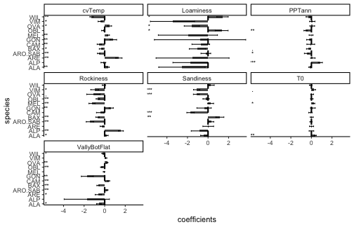
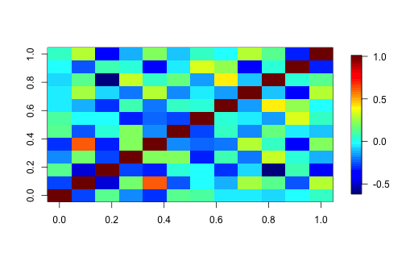
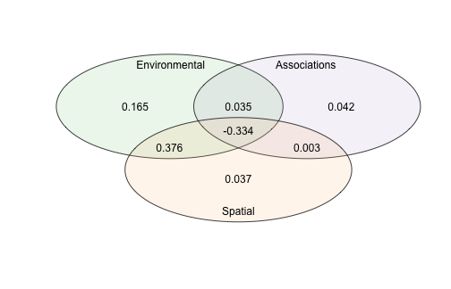
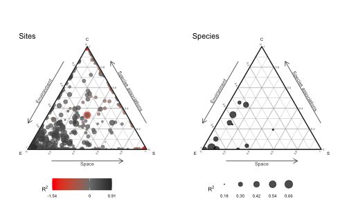
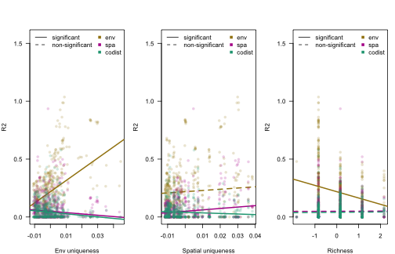

# Getting started

## About sjSDM

The sjSDM package is an R package for estimating so-called joint species distribution models. A jSDM is a GLMM that models a multivariate (i.e. a many-species) response to the environment, space and a covariance term that models conditional (on the other terms) correlations between the outputs (i.e. species).

![Figure 1: jSDM structure. jSDM uses a community matrix as response (rows = number of observations, columns = number of species) and tries to explain the occurrences in the community matrix as a function of environment and space. Moreover, compared to classical SDM, jSDM have an additional component, the biotic associations, that tries to account for unobservable species-species interactions. More precisely, the biotic association matrix is a variance-covariance matrix that accounts for co-occurrence patterns not explainable by environment and space.](jSDM-structure.png)

A big challenge in jSDM implementation is computational speed. The goal of the sjSDM (which stands for "scalable joint species distribution models") is to make jSDM computations fast and scalable. Unlike many other packages, which use a latent-variable approximation to make estimating jSDMs faster, sjSDM fits a full covariance matrix in the likelihood, which is, however, numerically approximated via simulations. The method is described in Pichler & Hartig (2021) A new joint species distribution model for faster and more accurate inference of species associations from big community data, <https://www.doi.org/10.1111/2041-210X.13687>.

The core code of sjSDM is implemented in Python / PyTorch, which is then wrapped into an R package. In principle, you can also use it stand-alone under Python (see instructions below). Note: for both the R and the python package, python \>= 3.9 and pytorch must be installed (more details below). However, for most users, it will be more convenient to use sjSDM via the sjSDM R package, which also provides a large number of downstream functionalities.

To get citation info for sjSDM when you use it for your reseach, type


``` r
citation("sjSDM")
To cite sjSDM in publications use:

  Pichler, M. and Hartig, F. (2021), A new joint species distribution model for faster and more accurate inference of species associations from big
  community data. Methods in Ecology and Evolution. Accepted Author Manuscript. https://doi.org/10.1111/2041-210X.13687

A BibTeX entry for LaTeX users is

  @Article{,
    title = {A new joint species distribution model for faster and more accurate inference of species associations from big community data},
    author = {Maximilian Pichler and Florian Hartig},
    journal = {Methods in Ecology and Evolution},
    year = {2021},
    doi = {10.1111/2041-210X.13687},
  }
```

## Installing the R package

sjSDM is distributed via [CRAN](https://cran.rstudio.com/web/packages/sjSDM/index.html). For most users, it will be best to install the package from CRAN


``` r
install.packages("sjSDM")
```

Depencies for the package can be installed before or after installing the package. Detailed explanations of the dependencies are provided in vignette("Dependencies", package = "sjSDM"), source code [here](https://github.com/TheoreticalEcology/s-jSDM/blob/master/sjSDM/vignettes/Dependencies.Rmd). Very briefly, the dependencies can be automatically installed from within R:


``` r
sjSDM::install_sjSDM(version = "gpu") # or
sjSDM::install_sjSDM(version = "cpu")
```

For advanced users: if you want to install the current (development) version from this repository, run


``` r
devtools::install_github("https://github.com/TheoreticalEcology/s-jSDM", subdir = "sjSDM", ref = "master")
```

dependencies should be installed as above. If the installation fails, check out the help of `?install_sjSDM`, ?installation_help, and `vignette("Dependencies", package = "sjSDM")`.

1.  Try `install_sjSDM()`
2.  New session, if no 'PyTorch not found' appears it should work, otherwise see `?installation_help`
3.  If do not get the pkg to run, create an issue [issue tracker](https://github.com/TheoreticalEcology/s-jSDM/issues) or write an email to maximilian.pichler at ur.de

# Working with sjSDM

We start with a dataset about eucalypt communities ([the dataset is from Pollock et a., 2014](https://doi.org/10.1111/2041-210x.12180))


``` r
library(sjSDM)
set.seed(42)
Env = eucalypts$env # environment
PA = eucalypts$PA # presence absence
Coords = eucalypts$lat_lon # coordinates
```

Prepare data:

-   scale numerical predictors/covariates


``` r
Env$Rockiness = scale(Env$Rockiness)
Env$PPTann = scale(Env$PPTann)
Env$cvTemp = scale(Env$cvTemp)
Env$T0 = scale(Env$T0)

Coords = scale(Coords)
```

## Fit model

The model is fit by the function `sjSDM()`. You have to provide predictors (can be also a data.frame) and response as matrices. For p-values, you have to set `se = TRUE` (however this can fail for underpowered data). The spatial model account for spatial autocorrelation and spatial trends/effects (trend surface model)


``` r
model <- sjSDM(Y = PA, 
               env = linear(data = Env, formula = ~.), 
               spatial = linear(data = Coords, formula = ~0+latitude*longitude), 
               family=binomial("probit"),
               se = TRUE)

Iter: 0/100   0%|          | [00:00, ?it/s]
Iter: 0/100   0%|          | [00:00, ?it/s, loss=6.226]
Iter: 1/100   1%|          | [00:00,  8.59it/s, loss=6.226]
Iter: 1/100   1%|          | [00:00,  8.59it/s, loss=4.362]
Iter: 1/100   1%|          | [00:00,  8.59it/s, loss=4.027]
Iter: 1/100   1%|          | [00:00,  8.59it/s, loss=3.781]
Iter: 1/100   1%|          | [00:00,  8.59it/s, loss=3.67] 
Iter: 1/100   1%|          | [00:00,  8.59it/s, loss=3.542]
Iter: 1/100   1%|          | [00:00,  8.59it/s, loss=3.51] 
Iter: 1/100   1%|          | [00:00,  8.59it/s, loss=3.445]
Iter: 8/100   8%|▊         | [00:00, 38.92it/s, loss=3.445]
Iter: 8/100   8%|▊         | [00:00, 38.92it/s, loss=3.39] 
Iter: 8/100   8%|▊         | [00:00, 38.92it/s, loss=3.361]
Iter: 8/100   8%|▊         | [00:00, 38.92it/s, loss=3.358]
Iter: 8/100   8%|▊         | [00:00, 38.92it/s, loss=3.336]
Iter: 8/100   8%|▊         | [00:00, 38.92it/s, loss=3.319]
Iter: 8/100   8%|▊         | [00:00, 38.92it/s, loss=3.28] 
Iter: 14/100  14%|█▍        | [00:00, 47.53it/s, loss=3.28]
Iter: 14/100  14%|█▍        | [00:00, 47.53it/s, loss=3.273]
Iter: 14/100  14%|█▍        | [00:00, 47.53it/s, loss=3.258]
Iter: 14/100  14%|█▍        | [00:00, 47.53it/s, loss=3.242]
Iter: 14/100  14%|█▍        | [00:00, 47.53it/s, loss=3.231]
Iter: 14/100  14%|█▍        | [00:00, 47.53it/s, loss=3.211]
Iter: 14/100  14%|█▍        | [00:00, 47.53it/s, loss=3.241]
Iter: 20/100  20%|██        | [00:00, 51.35it/s, loss=3.241]
Iter: 20/100  20%|██        | [00:00, 51.35it/s, loss=3.199]
Iter: 20/100  20%|██        | [00:00, 51.35it/s, loss=3.214]
Iter: 20/100  20%|██        | [00:00, 51.35it/s, loss=3.21] 
Iter: 20/100  20%|██        | [00:00, 51.35it/s, loss=3.195]
Iter: 20/100  20%|██        | [00:00, 51.35it/s, loss=3.193]
Iter: 20/100  20%|██        | [00:00, 51.35it/s, loss=3.204]
Iter: 26/100  26%|██▌       | [00:00, 53.31it/s, loss=3.204]
Iter: 26/100  26%|██▌       | [00:00, 53.31it/s, loss=3.186]
Iter: 26/100  26%|██▌       | [00:00, 53.31it/s, loss=3.177]
Iter: 26/100  26%|██▌       | [00:00, 53.31it/s, loss=3.179]
Iter: 26/100  26%|██▌       | [00:00, 53.31it/s, loss=3.165]
Iter: 26/100  26%|██▌       | [00:00, 53.31it/s, loss=3.153]
Iter: 26/100  26%|██▌       | [00:00, 53.31it/s, loss=3.166]
Iter: 26/100  26%|██▌       | [00:00, 53.31it/s, loss=3.152]
Iter: 33/100  33%|███▎      | [00:00, 55.92it/s, loss=3.152]
Iter: 33/100  33%|███▎      | [00:00, 55.92it/s, loss=3.153]
Iter: 33/100  33%|███▎      | [00:00, 55.92it/s, loss=3.149]
Iter: 33/100  33%|███▎      | [00:00, 55.92it/s, loss=3.147]
Iter: 33/100  33%|███▎      | [00:00, 55.92it/s, loss=3.136]
Iter: 33/100  33%|███▎      | [00:00, 55.92it/s, loss=3.123]
Iter: 33/100  33%|███▎      | [00:00, 55.92it/s, loss=3.125]
Iter: 33/100  33%|███▎      | [00:00, 55.92it/s, loss=3.127]
Iter: 40/100  40%|████      | [00:00, 57.49it/s, loss=3.127]
Iter: 40/100  40%|████      | [00:00, 57.49it/s, loss=3.116]
Iter: 40/100  40%|████      | [00:00, 57.49it/s, loss=3.116]
Iter: 40/100  40%|████      | [00:00, 57.49it/s, loss=3.139]
Iter: 40/100  40%|████      | [00:00, 57.49it/s, loss=3.123]
Iter: 40/100  40%|████      | [00:00, 57.49it/s, loss=3.099]
Iter: 40/100  40%|████      | [00:00, 57.49it/s, loss=3.114]
Iter: 40/100  40%|████      | [00:00, 57.49it/s, loss=3.109]
Iter: 47/100  47%|████▋     | [00:00, 58.37it/s, loss=3.109]
Iter: 47/100  47%|████▋     | [00:00, 58.37it/s, loss=3.099]
Iter: 47/100  47%|████▋     | [00:00, 58.37it/s, loss=3.095]
Iter: 47/100  47%|████▋     | [00:00, 58.37it/s, loss=3.105]
Iter: 47/100  47%|████▋     | [00:00, 58.37it/s, loss=3.101]
Iter: 47/100  47%|████▋     | [00:01, 58.37it/s, loss=3.101]
Iter: 47/100  47%|████▋     | [00:01, 58.37it/s, loss=3.104]
Iter: 53/100  53%|█████▎    | [00:01, 52.85it/s, loss=3.104]
Iter: 53/100  53%|█████▎    | [00:01, 52.85it/s, loss=3.074]
Iter: 53/100  53%|█████▎    | [00:01, 52.85it/s, loss=3.092]
Iter: 53/100  53%|█████▎    | [00:01, 52.85it/s, loss=3.099]
Iter: 53/100  53%|█████▎    | [00:01, 52.85it/s, loss=3.098]
Iter: 53/100  53%|█████▎    | [00:01, 52.85it/s, loss=3.106]
Iter: 53/100  53%|█████▎    | [00:01, 52.85it/s, loss=3.105]
Iter: 59/100  59%|█████▉    | [00:01, 43.14it/s, loss=3.105]
Iter: 59/100  59%|█████▉    | [00:01, 43.14it/s, loss=3.114]
Iter: 59/100  59%|█████▉    | [00:01, 43.14it/s, loss=3.086]
Iter: 59/100  59%|█████▉    | [00:01, 43.14it/s, loss=3.109]
Iter: 59/100  59%|█████▉    | [00:01, 43.14it/s, loss=3.094]
Iter: 59/100  59%|█████▉    | [00:01, 43.14it/s, loss=3.106]
Iter: 64/100  64%|██████▍   | [00:01, 43.35it/s, loss=3.106]
Iter: 64/100  64%|██████▍   | [00:01, 43.35it/s, loss=3.068]
Iter: 64/100  64%|██████▍   | [00:01, 43.35it/s, loss=3.088]
Iter: 64/100  64%|██████▍   | [00:01, 43.35it/s, loss=3.092]
Iter: 64/100  64%|██████▍   | [00:01, 43.35it/s, loss=3.084]
Iter: 64/100  64%|██████▍   | [00:01, 43.35it/s, loss=3.1]  
Iter: 64/100  64%|██████▍   | [00:01, 43.35it/s, loss=3.064]
Iter: 70/100  70%|███████   | [00:01, 46.92it/s, loss=3.064]
Iter: 70/100  70%|███████   | [00:01, 46.92it/s, loss=3.112]
Iter: 70/100  70%|███████   | [00:01, 46.92it/s, loss=3.072]
Iter: 70/100  70%|███████   | [00:01, 46.92it/s, loss=3.055]
Iter: 70/100  70%|███████   | [00:01, 46.92it/s, loss=3.072]
Iter: 70/100  70%|███████   | [00:01, 46.92it/s, loss=3.08] 
Iter: 70/100  70%|███████   | [00:01, 46.92it/s, loss=3.077]
Iter: 76/100  76%|███████▌  | [00:01, 48.99it/s, loss=3.077]
Iter: 76/100  76%|███████▌  | [00:01, 48.99it/s, loss=3.089]
Iter: 76/100  76%|███████▌  | [00:01, 48.99it/s, loss=3.088]
Iter: 76/100  76%|███████▌  | [00:01, 48.99it/s, loss=3.07] 
Iter: 76/100  76%|███████▌  | [00:01, 48.99it/s, loss=3.058]
Iter: 76/100  76%|███████▌  | [00:01, 48.99it/s, loss=3.073]
Iter: 76/100  76%|███████▌  | [00:01, 48.99it/s, loss=3.065]
Iter: 82/100  82%|████████▏ | [00:01, 51.49it/s, loss=3.065]
Iter: 82/100  82%|████████▏ | [00:01, 51.49it/s, loss=3.083]
Iter: 82/100  82%|████████▏ | [00:01, 51.49it/s, loss=3.085]
Iter: 82/100  82%|████████▏ | [00:01, 51.49it/s, loss=3.092]
Iter: 82/100  82%|████████▏ | [00:01, 51.49it/s, loss=3.063]
Iter: 82/100  82%|████████▏ | [00:01, 51.49it/s, loss=3.049]
Iter: 82/100  82%|████████▏ | [00:01, 51.49it/s, loss=3.067]
Iter: 88/100  88%|████████▊ | [00:01, 53.59it/s, loss=3.067]
Iter: 88/100  88%|████████▊ | [00:01, 53.59it/s, loss=3.079]
Iter: 88/100  88%|████████▊ | [00:01, 53.59it/s, loss=3.096]
Iter: 88/100  88%|████████▊ | [00:01, 53.59it/s, loss=3.065]
Iter: 88/100  88%|████████▊ | [00:01, 53.59it/s, loss=3.07] 
Iter: 88/100  88%|████████▊ | [00:01, 53.59it/s, loss=3.061]
Iter: 88/100  88%|████████▊ | [00:01, 53.59it/s, loss=3.063]
Iter: 94/100  94%|█████████▍| [00:01, 55.31it/s, loss=3.063]
Iter: 94/100  94%|█████████▍| [00:01, 55.31it/s, loss=3.071]
Iter: 94/100  94%|█████████▍| [00:01, 55.31it/s, loss=3.058]
Iter: 94/100  94%|█████████▍| [00:01, 55.31it/s, loss=3.063]
Iter: 94/100  94%|█████████▍| [00:01, 55.31it/s, loss=3.054]
Iter: 94/100  94%|█████████▍| [00:01, 55.31it/s, loss=3.067]
Iter: 94/100  94%|█████████▍| [00:01, 55.31it/s, loss=3.045]
Iter: 100/100 100%|██████████| [00:01, 50.99it/s, loss=3.045]

Calculating standard errors...

Species: 0/12   0%|          | [00:00, ?it/s]
Species: 1/12   8%|▊         | [00:00,  7.81it/s]
Species: 2/12  17%|█▋        | [00:00,  8.84it/s]
Species: 4/12  33%|███▎      | [00:00, 10.00it/s]
Species: 6/12  50%|█████     | [00:00, 10.74it/s]
Species: 8/12  67%|██████▋   | [00:00, 11.03it/s]
Species: 10/12  83%|████████▎ | [00:00, 11.31it/s]
Species: 12/12 100%|██████████| [00:01, 10.97it/s]
Species: 12/12 100%|██████████| [00:01, 10.69it/s]
```

The linear means that you essentially fit a linear regression structure for the respective component. Alternatively, you could also fit a neural network (see later).

## Interpreting the estimated model coefficients

To get an overall summary of the model, type


``` r
summary(model)
Family:  binomial 

LogLik:  -1394.891 
Regularization loss:  0 

Species-species correlation matrix: 

	sp1	 1.0000											
	sp2	-0.2740	 1.0000										
	sp3	 0.1330	-0.4790	 1.0000									
	sp4	-0.1620	 0.1780	-0.2770	 1.0000								
	sp5	-0.2950	 0.6210	-0.3150	 0.2050	 1.0000							
	sp6	 0.1330	-0.2510	 0.0340	 0.2050	-0.1810	 1.0000						
	sp7	 0.1060	-0.0190	-0.0160	-0.3230	-0.2230	-0.2800	 1.0000					
	sp8	-0.0380	-0.1120	-0.2940	 0.0770	-0.1880	 0.0640	 0.0350	 1.0000				
	sp9	-0.0370	 0.2680	-0.0820	-0.2090	 0.2920	-0.1690	-0.0390	-0.1510	 1.0000			
	sp10	-0.0800	 0.1430	-0.6070	 0.3150	 0.0570	 0.1500	-0.1410	 0.4190	-0.0900	 1.0000		
	sp11	-0.0260	-0.2410	 0.0780	 0.0380	-0.3510	-0.0500	 0.3470	 0.2410	-0.3750	 0.0380	 1.0000	
	sp12	 0.0500	 0.2880	-0.3400	-0.1210	 0.2210	-0.0860	 0.0490	-0.0320	 0.2990	 0.1310	-0.3290	 1.0000


Spatial: 
                         sp1        sp2        sp3        sp4        sp5        sp6        sp7        sp8         sp9       sp10        sp11        sp12
latitude           0.1045909  0.8915144 -0.3467518  0.8673676  0.7860679  0.1019043 -0.4080255 -0.4361924 -0.70473599 -0.5908230 -0.06284096  0.07929443
longitude          0.4617608 -0.4040607  0.3929421 -0.7604427 -0.4817654 -0.9102288  0.5284709  0.1939299 -0.02483648  0.2608599  0.20276192 -0.13515131
latitude:longitude 0.5083164  0.7249806  0.3570059  0.4717226 -0.1352622  0.3124597  0.4323097 -0.3636582 -0.91096187  0.2246874 -0.60641086  0.18292226

                     Estimate  Std.Err Z value Pr(>|z|)    
ALA (Intercept)      -1.15760  0.29059   -3.98  6.8e-05 ***
ALA Rockiness         0.22835  0.11247    2.03  0.04233 *  
ALA Sandiness        -0.40405  0.31999   -1.26  0.20670    
ALA VallyBotFlat     -0.55968  0.22030   -2.54  0.01107 *  
ALA PPTann           -0.13146  0.12223   -1.08  0.28218    
ALA Loaminess        -2.53861  2.25891   -1.12  0.26109    
ALA cvTemp            0.32890  0.11681    2.82  0.00487 ** 
ALA T0                0.36244  0.11370    3.19  0.00143 ** 
ARE (Intercept)      -3.24135  0.59700   -5.43  5.7e-08 ***
ARE Rockiness        -0.25860  0.18625   -1.39  0.16499    
ARE Sandiness         0.02145  0.52418    0.04  0.96735    
ARE VallyBotFlat     -0.62288  0.29996   -2.08  0.03784 *  
ARE PPTann            0.14008  0.21966    0.64  0.52366    
ARE Loaminess        -1.50508  3.55123   -0.42  0.67170    
ARE cvTemp            1.38435  0.30544    4.53  5.8e-06 ***
ARE T0                0.01347  0.20154    0.07  0.94669    
BAX (Intercept)      -1.07139  0.36307   -2.95  0.00317 ** 
BAX Rockiness        -0.69165  0.17002   -4.07  4.7e-05 ***
BAX Sandiness         1.15070  0.38971    2.95  0.00315 ** 
BAX VallyBotFlat     -0.64280  0.11630   -5.53  3.3e-08 ***
BAX PPTann           -0.31065  0.17011   -1.83  0.06782 .  
BAX Loaminess        -1.01967  0.80531   -1.27  0.20545    
BAX cvTemp           -0.35754  0.16479   -2.17  0.03004 *  
BAX T0                0.03465  0.14547    0.24  0.81172    
CAM (Intercept)      -2.26979  0.33259   -6.82  8.8e-12 ***
CAM Rockiness        -0.43910  0.35867   -1.22  0.22086    
CAM Sandiness        -1.69981  0.36403   -4.67  3.0e-06 ***
CAM VallyBotFlat      0.39707  0.09181    4.32  1.5e-05 ***
CAM PPTann           -0.06300  0.38111   -0.17  0.86869    
CAM Loaminess        -0.70423  0.86024   -0.82  0.41299    
CAM cvTemp           -0.52787  0.20225   -2.61  0.00905 ** 
CAM T0               -0.09638  0.16465   -0.59  0.55832    
GON (Intercept)      -2.74869  0.71707   -3.83  0.00013 ***
GON Rockiness         0.63659  0.20633    3.09  0.00203 ** 
GON Sandiness        -0.38489  0.69814   -0.55  0.58142    
GON VallyBotFlat     -1.68847  0.58223   -2.90  0.00373 ** 
GON PPTann           -0.23704  0.23370   -1.01  0.31044    
GON Loaminess        -0.77643  4.44385   -0.17  0.86130    
GON cvTemp            0.84726  0.31933    2.65  0.00797 ** 
GON T0                0.14374  0.23266    0.62  0.53670    
MEL (Intercept)      -2.44139  0.31884   -7.66  1.9e-14 ***
MEL Rockiness        -1.22870  0.30475   -4.03  5.5e-05 ***
MEL Sandiness         0.25285  0.29103    0.87  0.38496    
MEL VallyBotFlat     -0.06452  0.07277   -0.89  0.37526    
MEL PPTann           -0.03330  0.19244   -0.17  0.86262    
MEL Loaminess        -1.95971  2.87703   -0.68  0.49577    
MEL cvTemp            0.35211  0.11384    3.09  0.00198 ** 
MEL T0                0.22410  0.10682    2.10  0.03591 *  
OBL (Intercept)      -0.90341  0.29370   -3.08  0.00210 ** 
OBL Rockiness        -0.66414  0.16756   -3.96  7.4e-05 ***
OBL Sandiness        -0.18964  0.30534   -0.62  0.53455    
OBL VallyBotFlat     -0.31323  0.08670   -3.61  0.00030 ***
OBL PPTann           -0.55753  0.17143   -3.25  0.00115 ** 
OBL Loaminess         1.32625  0.62683    2.12  0.03436 *  
OBL cvTemp           -0.15851  0.13544   -1.17  0.24187    
OBL T0                0.03666  0.12069    0.30  0.76130    
OVA (Intercept)      -2.10679  0.44504   -4.73  2.2e-06 ***
OVA Rockiness        -1.09464  0.64800   -1.69  0.09117 .  
OVA Sandiness        -1.13978  0.28472   -4.00  6.3e-05 ***
OVA VallyBotFlat      0.24350  0.07671    3.17  0.00150 ** 
OVA PPTann            0.08137  0.22926    0.35  0.72265    
OVA Loaminess        -1.57856  0.73848   -2.14  0.03255 *  
OVA cvTemp            0.47576  0.19891    2.39  0.01676 *  
OVA T0                0.06925  0.13800    0.50  0.61577    
WIL (Intercept)      -2.12240  0.31981   -6.64  3.2e-11 ***
WIL Rockiness        -0.07615  0.15732   -0.48  0.62834    
WIL Sandiness         0.28500  0.31692    0.90  0.36850    
WIL VallyBotFlat     -0.18069  0.09101   -1.99  0.04709 *  
WIL PPTann           -0.31941  0.19611   -1.63  0.10337    
WIL Loaminess         1.40584  0.55343    2.54  0.01108 *  
WIL cvTemp           -1.27393  0.16031   -7.95  1.9e-15 ***
WIL T0               -0.06892  0.12561   -0.55  0.58325    
ALP (Intercept)      -2.55773  0.70064   -3.65  0.00026 ***
ALP Rockiness         1.58397  0.23687    6.69  2.3e-11 ***
ALP Sandiness        -0.82330  0.81183   -1.01  0.31052    
ALP VallyBotFlat     -1.73824  2.20134   -0.79  0.42975    
ALP PPTann            0.86970  0.19939    4.36  1.3e-05 ***
ALP Loaminess        -1.72623  1.69044   -1.02  0.30717    
ALP cvTemp           -0.12588  0.23428   -0.54  0.59106    
ALP T0                0.00167  0.22633    0.01  0.99410    
VIM (Intercept)      -1.97624  0.33101   -5.97  2.4e-09 ***
VIM Rockiness        -0.96607  0.38538   -2.51  0.01218 *  
VIM Sandiness        -1.10469  0.30759   -3.59  0.00033 ***
VIM VallyBotFlat      0.12876  0.08485    1.52  0.12915    
VIM PPTann            0.08245  0.26524    0.31  0.75592    
VIM Loaminess        -3.46140  2.15140   -1.61  0.10764    
VIM cvTemp           -0.43917  0.20456   -2.15  0.03180 *  
VIM T0                0.25178  0.14622    1.72  0.08509 .  
ARO.SAB (Intercept)  -2.27320  0.31964   -7.11  1.1e-12 ***
ARO.SAB Rockiness    -1.43493  0.36157   -3.97  7.2e-05 ***
ARO.SAB Sandiness     0.32622  0.23412    1.39  0.16351    
ARO.SAB VallyBotFlat  0.26545  0.06130    4.33  1.5e-05 ***
ARO.SAB PPTann       -0.46420  0.21983   -2.11  0.03472 *  
ARO.SAB Loaminess    -0.21306  0.47427   -0.45  0.65327    
ARO.SAB cvTemp       -0.57797  0.12518   -4.62  3.9e-06 ***
ARO.SAB T0           -0.04561  0.10269   -0.44  0.65695    
---
Signif. codes:  0 '***' 0.001 '**' 0.01 '*' 0.05 '.' 0.1 ' ' 1
```

This output will show you the fitted environmental, spatial and covariance parameters (provided that those components were specified). Implemented S3 functions for a model object include


``` r
# coef(model)
# residuals(model)
Rsquared(model)

Iter: 0/100   0%|          | [00:00, ?it/s]
Iter: 0/100   0%|          | [00:00, ?it/s, loss=6.395]
Iter: 0/100   0%|          | [00:00, ?it/s, loss=5.297]
Iter: 0/100   0%|          | [00:00, ?it/s, loss=4.903]
Iter: 0/100   0%|          | [00:00, ?it/s, loss=4.72] 
Iter: 0/100   0%|          | [00:00, ?it/s, loss=4.606]
Iter: 0/100   0%|          | [00:00, ?it/s, loss=4.498]
Iter: 6/100   6%|▌         | [00:00, 52.64it/s, loss=4.498]
Iter: 6/100   6%|▌         | [00:00, 52.64it/s, loss=4.444]
Iter: 6/100   6%|▌         | [00:00, 52.64it/s, loss=4.408]
Iter: 6/100   6%|▌         | [00:00, 52.64it/s, loss=4.342]
Iter: 6/100   6%|▌         | [00:00, 52.64it/s, loss=4.291]
Iter: 6/100   6%|▌         | [00:00, 52.64it/s, loss=4.305]
Iter: 6/100   6%|▌         | [00:00, 52.64it/s, loss=4.278]
Iter: 12/100  12%|█▏        | [00:00, 53.68it/s, loss=4.278]
Iter: 12/100  12%|█▏        | [00:00, 53.68it/s, loss=4.236]
Iter: 12/100  12%|█▏        | [00:00, 53.68it/s, loss=4.21] 
Iter: 12/100  12%|█▏        | [00:00, 53.68it/s, loss=4.222]
Iter: 12/100  12%|█▏        | [00:00, 53.68it/s, loss=4.169]
Iter: 12/100  12%|█▏        | [00:00, 53.68it/s, loss=4.187]
Iter: 12/100  12%|█▏        | [00:00, 53.68it/s, loss=4.175]
Iter: 18/100  18%|█▊        | [00:00, 53.74it/s, loss=4.175]
Iter: 18/100  18%|█▊        | [00:00, 53.74it/s, loss=4.195]
Iter: 18/100  18%|█▊        | [00:00, 53.74it/s, loss=4.177]
Iter: 18/100  18%|█▊        | [00:00, 53.74it/s, loss=4.152]
Iter: 18/100  18%|█▊        | [00:00, 53.74it/s, loss=4.157]
Iter: 18/100  18%|█▊        | [00:00, 53.74it/s, loss=4.136]
Iter: 18/100  18%|█▊        | [00:00, 53.74it/s, loss=4.112]
Iter: 24/100  24%|██▍       | [00:00, 53.57it/s, loss=4.112]
Iter: 24/100  24%|██▍       | [00:00, 53.57it/s, loss=4.159]
Iter: 24/100  24%|██▍       | [00:00, 53.57it/s, loss=4.145]
Iter: 24/100  24%|██▍       | [00:00, 53.57it/s, loss=4.167]
Iter: 24/100  24%|██▍       | [00:00, 53.57it/s, loss=4.164]
Iter: 24/100  24%|██▍       | [00:00, 53.57it/s, loss=4.144]
Iter: 24/100  24%|██▍       | [00:00, 53.57it/s, loss=4.115]
Iter: 30/100  30%|███       | [00:00, 53.57it/s, loss=4.115]
Iter: 30/100  30%|███       | [00:00, 53.57it/s, loss=4.12] 
Iter: 30/100  30%|███       | [00:00, 53.57it/s, loss=4.13]
Iter: 30/100  30%|███       | [00:00, 53.57it/s, loss=4.142]
Iter: 30/100  30%|███       | [00:00, 53.57it/s, loss=4.12] 
Iter: 30/100  30%|███       | [00:00, 53.57it/s, loss=4.144]
Iter: 30/100  30%|███       | [00:00, 53.57it/s, loss=4.134]
Iter: 36/100  36%|███▌      | [00:00, 51.66it/s, loss=4.134]
Iter: 36/100  36%|███▌      | [00:00, 51.66it/s, loss=4.126]
Iter: 36/100  36%|███▌      | [00:00, 51.66it/s, loss=4.126]
Iter: 36/100  36%|███▌      | [00:00, 51.66it/s, loss=4.118]
Iter: 36/100  36%|███▌      | [00:00, 51.66it/s, loss=4.14] 
Iter: 36/100  36%|███▌      | [00:00, 51.66it/s, loss=4.163]
Iter: 36/100  36%|███▌      | [00:00, 51.66it/s, loss=4.153]
Iter: 42/100  42%|████▏     | [00:00, 52.50it/s, loss=4.153]
Iter: 42/100  42%|████▏     | [00:00, 52.50it/s, loss=4.135]
Iter: 42/100  42%|████▏     | [00:00, 52.50it/s, loss=4.114]
Iter: 42/100  42%|████▏     | [00:00, 52.50it/s, loss=4.119]
Iter: 42/100  42%|████▏     | [00:00, 52.50it/s, loss=4.123]
Iter: 42/100  42%|████▏     | [00:00, 52.50it/s, loss=4.156]
Iter: 42/100  42%|████▏     | [00:00, 52.50it/s, loss=4.138]
Iter: 48/100  48%|████▊     | [00:00, 52.99it/s, loss=4.138]
Iter: 48/100  48%|████▊     | [00:00, 52.99it/s, loss=4.136]
Iter: 48/100  48%|████▊     | [00:00, 52.99it/s, loss=4.11] 
Iter: 48/100  48%|████▊     | [00:00, 52.99it/s, loss=4.124]
Iter: 48/100  48%|████▊     | [00:00, 52.99it/s, loss=4.15] 
Iter: 48/100  48%|████▊     | [00:00, 52.99it/s, loss=4.112]
Iter: 48/100  48%|████▊     | [00:01, 52.99it/s, loss=4.115]
Iter: 54/100  54%|█████▍    | [00:01, 53.05it/s, loss=4.115]
Iter: 54/100  54%|█████▍    | [00:01, 53.05it/s, loss=4.134]
Iter: 54/100  54%|█████▍    | [00:01, 53.05it/s, loss=4.1]  
Iter: 54/100  54%|█████▍    | [00:01, 53.05it/s, loss=4.131]
Iter: 54/100  54%|█████▍    | [00:01, 53.05it/s, loss=4.116]
Iter: 54/100  54%|█████▍    | [00:01, 53.05it/s, loss=4.109]
Iter: 54/100  54%|█████▍    | [00:01, 53.05it/s, loss=4.104]
Iter: 60/100  60%|██████    | [00:01, 53.38it/s, loss=4.104]
Iter: 60/100  60%|██████    | [00:01, 53.38it/s, loss=4.125]
Iter: 60/100  60%|██████    | [00:01, 53.38it/s, loss=4.122]
Iter: 60/100  60%|██████    | [00:01, 53.38it/s, loss=4.113]
Iter: 60/100  60%|██████    | [00:01, 53.38it/s, loss=4.13] 
Iter: 60/100  60%|██████    | [00:01, 53.38it/s, loss=4.131]
Iter: 60/100  60%|██████    | [00:01, 53.38it/s, loss=4.124]
Iter: 66/100  66%|██████▌   | [00:01, 53.59it/s, loss=4.124]
Iter: 66/100  66%|██████▌   | [00:01, 53.59it/s, loss=4.117]
Iter: 66/100  66%|██████▌   | [00:01, 53.59it/s, loss=4.126]
Iter: 66/100  66%|██████▌   | [00:01, 53.59it/s, loss=4.118]
Iter: 66/100  66%|██████▌   | [00:01, 53.59it/s, loss=4.15] 
Iter: 66/100  66%|██████▌   | [00:01, 53.59it/s, loss=4.111]
Iter: 66/100  66%|██████▌   | [00:01, 53.59it/s, loss=4.125]
Iter: 72/100  72%|███████▏  | [00:01, 53.91it/s, loss=4.125]
Iter: 72/100  72%|███████▏  | [00:01, 53.91it/s, loss=4.099]
Iter: 72/100  72%|███████▏  | [00:01, 53.91it/s, loss=4.133]
Iter: 72/100  72%|███████▏  | [00:01, 53.91it/s, loss=4.106]
Iter: 72/100  72%|███████▏  | [00:01, 53.91it/s, loss=4.136]
Iter: 72/100  72%|███████▏  | [00:01, 53.91it/s, loss=4.129]
Iter: 72/100  72%|███████▏  | [00:01, 53.91it/s, loss=4.1]  
Iter: 78/100  78%|███████▊  | [00:01, 52.16it/s, loss=4.1]
Iter: 78/100  78%|███████▊  | [00:01, 52.16it/s, loss=4.135]
Iter: 78/100  78%|███████▊  | [00:01, 52.16it/s, loss=4.121]
Iter: 78/100  78%|███████▊  | [00:01, 52.16it/s, loss=4.121]
Iter: 78/100  78%|███████▊  | [00:01, 52.16it/s, loss=4.112]
Iter: 78/100  78%|███████▊  | [00:01, 52.16it/s, loss=4.106]
Iter: 78/100  78%|███████▊  | [00:01, 52.16it/s, loss=4.126]
Iter: 84/100  84%|████████▍ | [00:01, 52.29it/s, loss=4.126]
Iter: 84/100  84%|████████▍ | [00:01, 52.29it/s, loss=4.135]
Iter: 84/100  84%|████████▍ | [00:01, 52.29it/s, loss=4.142]
Iter: 84/100  84%|████████▍ | [00:01, 52.29it/s, loss=4.108]
Iter: 84/100  84%|████████▍ | [00:01, 52.29it/s, loss=4.122]
Iter: 84/100  84%|████████▍ | [00:01, 52.29it/s, loss=4.152]
Iter: 84/100  84%|████████▍ | [00:01, 52.29it/s, loss=4.114]
Iter: 90/100  90%|█████████ | [00:01, 53.01it/s, loss=4.114]
Iter: 90/100  90%|█████████ | [00:01, 53.01it/s, loss=4.147]
Iter: 90/100  90%|█████████ | [00:01, 53.01it/s, loss=4.108]
Iter: 90/100  90%|█████████ | [00:01, 53.01it/s, loss=4.127]
Iter: 90/100  90%|█████████ | [00:01, 53.01it/s, loss=4.128]
Iter: 90/100  90%|█████████ | [00:01, 53.01it/s, loss=4.123]
Iter: 90/100  90%|█████████ | [00:01, 53.01it/s, loss=4.113]
Iter: 96/100  96%|█████████▌| [00:01, 53.58it/s, loss=4.113]
Iter: 96/100  96%|█████████▌| [00:01, 53.58it/s, loss=4.115]
Iter: 96/100  96%|█████████▌| [00:01, 53.58it/s, loss=4.136]
Iter: 96/100  96%|█████████▌| [00:01, 53.58it/s, loss=4.119]
Iter: 96/100  96%|█████████▌| [00:01, 53.58it/s, loss=4.122]
Iter: 100/100 100%|██████████| [00:01, 53.18it/s, loss=4.122]
[1] 0.3192844
```

### Environmental effects

The environmental effects are displayed in the summary() table. To get a visual plot, you can use


``` r
plot(model)
```

<div class="figure" style="text-align: center">

<p class="caption">plot of chunk unnamed-chunk-12</p>
</div>

### Spatial effects

The spatial effects are displayed in the `summary()` table. Currently, there are not additional options implemented to visualize the spatial effects

### Species-species covariance (associations)

The species-species associations are displayed in the `summary()` table. You can extract them as follows:


``` r
association = getCor(model)
sp = x = 1:ncol(PA)
fields::image.plot(association)
```

<div class="figure" style="text-align: center">

<p class="caption">plot of chunk unnamed-chunk-13</p>
</div>

## ANOVA and variation partitioning

### Global ANOVA

{width=70%}

ANOVA (Type II) will calculate the amount of variation explained by the three components (environment, associations, and space):


``` r
an = anova(model)
```

Amount of variance explained is measured by


``` r
plot(an)
```

<div class="figure" style="text-align: center">

<p class="caption">plot of chunk unnamed-chunk-15</p>
</div>

``` r
summary(an)
Analysis of Deviance Table

                                       Deviance Residual deviance R2 Nagelkerke R2 McFadden
Abiotic                              6.7326e+02        3.0030e+03    7.7008e-01      0.1654
Associations                         1.6914e+02        3.5071e+03    3.0878e-01      0.0416
Spatial                              1.5096e+02        3.5253e+03    2.8080e-01      0.0371
Shared Abiotic+Associations          1.4249e+02        3.5337e+03    2.6736e-01      0.0350
Shared Abiotic+Spatial               1.5318e+03        2.1444e+03    9.6472e-01      0.3763
Shared Spatial+Associations          1.1244e+01        3.6650e+03    2.4251e-02      0.0028
Shared Abiotic+Associations+Spatial -1.3613e+03        5.0376e+03   -1.8538e+01     -0.3345
Full                                 1.3175e+03        2.3587e+03    9.4368e-01      0.3237
```

Environmental explains the most variance in the data, followed by the biotic association component. But we expect that these three processes differ in importance for species and sites.

### Variation partitioning - Internal metacommunity structure 

We can further partition the R^2^ for sites and species. We call this the internal metacommunity structure (only for models with space):


``` r
results = internalStructure(an)
plot(results)
```

<div class="figure" style="text-align: center">

<p class="caption">plot of chunk unnamed-chunk-16</p>
</div>

The ternary plots report the relative importance of the components for sites and species. Leaning to one of the corners means that this corner is mot important (e.g. here Species and Sites lean more to the environmental corner).

## Revealing assembly processes

To reveal and explain assembly patterns in the internal metacommunity structure, we can regress the partial R^2^ against environmental and spatial distinctiveness, and richness:


``` r
plotAssemblyEffects(results)
```

<div class="figure" style="text-align: center">

<p class="caption">Environmental filtering increases for more distinct (extreme) environmental sites (first figure). Moreover, environmental filtering is less important for sites with high species richness (third figure).</p>
</div>

## Predictions 

We can also make predictions with our model:


``` r
pred = predict(model, newdata = Env, SP = Coords)
```

Moreover, we can make conditional predictions for new sites. We use focal species (species with known occurrences) to condition our other species on them:


``` r
New_PA = PA
New_PA[, 1:6] = NA
head(New_PA)
     ALA ARE BAX CAM GON MEL OBL OVA WIL ALP VIM ARO.SAB
[1,]  NA  NA  NA  NA  NA  NA   0   0   1   1   0       0
[2,]  NA  NA  NA  NA  NA  NA   1   0   1   1   0       0
[3,]  NA  NA  NA  NA  NA  NA   0   0   1   1   0       0
[4,]  NA  NA  NA  NA  NA  NA   0   0   1   0   0       0
[5,]  NA  NA  NA  NA  NA  NA   1   0   0   0   0       0
[6,]  NA  NA  NA  NA  NA  NA   0   0   1   1   0       0
```

We predict occurrences for the first 6 species and we will use species 7:12 as focal species:


``` r
pred = predict(model, newdata = Env, SP = Coords, Y = New_PA)
head(pred)
           [,1]         [,2]      [,3]         [,4]         [,5]         [,6]
[1,] 0.06919944 0.0009476454 0.1910016 0.0018830845 0.0128012986 0.0024387540
[2,] 0.11315205 0.0009214627 0.1472398 0.0002079792 0.0072220917 0.0003615931
[3,] 0.04488569 0.0006793901 0.2183437 0.0011189724 0.0177170272 0.0009390992
[4,] 0.03075939 0.0009504842 0.6358478 0.0013088808 0.0062728132 0.0042722422
[5,] 0.03657351 0.0002785175 0.7242049 0.0016383204 0.0003361725 0.0132508888
[6,] 0.06529714 0.0008642081 0.2183884 0.0005441465 0.0231352807 0.0005368481
```

The predict function returns only predictions for species with NA in Y

# Advanced topics

## Fitting other distributions (e.g. species frequencies)

sjSDM supports other responses than presence-absence data: Simulate non-presence-absence data:


``` r
com = simulate_SDM(env = 3L, species = 5L, sites = 100L,
                   link = "identical", response = "count") 
X = com$env_weights
Y = com$response
```

### Poisson


``` r
model = sjSDM(Y, env = linear(X, ~.), se = TRUE, 
              iter = 50L, family = poisson("log"))

Iter: 0/50   0%|          | [00:00, ?it/s]
Iter: 0/50   0%|          | [00:00, ?it/s, loss=8.146]
Iter: 0/50   0%|          | [00:00, ?it/s, loss=7.404]
Iter: 0/50   0%|          | [00:00, ?it/s, loss=7.162]
Iter: 0/50   0%|          | [00:00, ?it/s, loss=7.08] 
Iter: 0/50   0%|          | [00:00, ?it/s, loss=6.926]
Iter: 0/50   0%|          | [00:00, ?it/s, loss=6.877]
Iter: 0/50   0%|          | [00:00, ?it/s, loss=6.89] 
Iter: 0/50   0%|          | [00:00, ?it/s, loss=6.846]
Iter: 0/50   0%|          | [00:00, ?it/s, loss=6.8]  
Iter: 0/50   0%|          | [00:00, ?it/s, loss=6.718]
Iter: 0/50   0%|          | [00:00, ?it/s, loss=6.677]
Iter: 0/50   0%|          | [00:00, ?it/s, loss=6.677]
Iter: 0/50   0%|          | [00:00, ?it/s, loss=6.724]
Iter: 0/50   0%|          | [00:00, ?it/s, loss=6.637]
Iter: 14/50  28%|██▊       | [00:00, 133.46it/s, loss=6.637]
Iter: 14/50  28%|██▊       | [00:00, 133.46it/s, loss=6.684]
Iter: 14/50  28%|██▊       | [00:00, 133.46it/s, loss=6.637]
Iter: 14/50  28%|██▊       | [00:00, 133.46it/s, loss=6.697]
Iter: 14/50  28%|██▊       | [00:00, 133.46it/s, loss=6.685]
Iter: 14/50  28%|██▊       | [00:00, 133.46it/s, loss=6.721]
Iter: 14/50  28%|██▊       | [00:00, 133.46it/s, loss=6.638]
Iter: 14/50  28%|██▊       | [00:00, 133.46it/s, loss=6.661]
Iter: 14/50  28%|██▊       | [00:00, 133.46it/s, loss=6.635]
Iter: 14/50  28%|██▊       | [00:00, 133.46it/s, loss=6.607]
Iter: 14/50  28%|██▊       | [00:00, 133.46it/s, loss=6.648]
Iter: 14/50  28%|██▊       | [00:00, 133.46it/s, loss=6.702]
Iter: 14/50  28%|██▊       | [00:00, 133.46it/s, loss=6.632]
Iter: 14/50  28%|██▊       | [00:00, 133.46it/s, loss=6.623]
Iter: 14/50  28%|██▊       | [00:00, 133.46it/s, loss=6.661]
Iter: 14/50  28%|██▊       | [00:00, 133.46it/s, loss=6.664]
Iter: 14/50  28%|██▊       | [00:00, 133.46it/s, loss=6.606]
Iter: 30/50  60%|██████    | [00:00, 146.21it/s, loss=6.606]
Iter: 30/50  60%|██████    | [00:00, 146.21it/s, loss=6.67] 
Iter: 30/50  60%|██████    | [00:00, 146.21it/s, loss=6.624]
Iter: 30/50  60%|██████    | [00:00, 146.21it/s, loss=6.674]
Iter: 30/50  60%|██████    | [00:00, 146.21it/s, loss=6.668]
Iter: 30/50  60%|██████    | [00:00, 146.21it/s, loss=6.706]
Iter: 30/50  60%|██████    | [00:00, 146.21it/s, loss=6.652]
Iter: 30/50  60%|██████    | [00:00, 146.21it/s, loss=6.683]
Iter: 30/50  60%|██████    | [00:00, 146.21it/s, loss=6.659]
Iter: 30/50  60%|██████    | [00:00, 146.21it/s, loss=6.715]
Iter: 30/50  60%|██████    | [00:00, 146.21it/s, loss=6.642]
Iter: 30/50  60%|██████    | [00:00, 146.21it/s, loss=6.658]
Iter: 30/50  60%|██████    | [00:00, 146.21it/s, loss=6.629]
Iter: 30/50  60%|██████    | [00:00, 146.21it/s, loss=6.65] 
Iter: 30/50  60%|██████    | [00:00, 146.21it/s, loss=6.605]
Iter: 30/50  60%|██████    | [00:00, 146.21it/s, loss=6.638]
Iter: 30/50  60%|██████    | [00:00, 146.21it/s, loss=6.705]
Iter: 46/50  92%|█████████▏| [00:00, 151.34it/s, loss=6.705]
Iter: 46/50  92%|█████████▏| [00:00, 151.34it/s, loss=6.63] 
Iter: 46/50  92%|█████████▏| [00:00, 151.34it/s, loss=6.651]
Iter: 46/50  92%|█████████▏| [00:00, 151.34it/s, loss=6.637]
Iter: 46/50  92%|█████████▏| [00:00, 151.34it/s, loss=6.724]
Iter: 50/50 100%|██████████| [00:00, 149.26it/s, loss=6.724]

Calculating standard errors...

Species: 0/5   0%|          | [00:00, ?it/s]
Species: 5/5 100%|██████████| [00:00, 59.24it/s]
```

``` r
summary(model)
Family:  poisson 

LogLik:  -663.1635 
Regularization loss:  0 

Species-species correlation matrix: 

	sp1	 1.0000				
	sp2	-0.3800	 1.0000			
	sp3	 0.4050	-0.6020	 1.0000		
	sp4	-0.0590	 0.4100	-0.3450	 1.0000	
	sp5	 0.3200	-0.5860	 0.5350	-0.3860	 1.0000

                Estimate Std.Err Z value Pr(>|z|)    
sp1 (Intercept)  -0.2061  0.1373   -1.50  0.13333    
sp1 X1           -0.1139  0.2395   -0.48  0.63446    
sp1 X2           -0.5375  0.2200   -2.44  0.01456 *  
sp1 X3           -0.3320  0.2569   -1.29  0.19629    
sp2 (Intercept)  -0.9609  0.1440   -6.67  2.5e-11 ***
sp2 X1            0.8798  0.2646    3.32  0.00089 ***
sp2 X2           -1.0279  0.2397   -4.29  1.8e-05 ***
sp2 X3           -0.0856  0.2705   -0.32  0.75170    
sp3 (Intercept)  -0.3052  0.1292   -2.36  0.01819 *  
sp3 X1            0.5877  0.1637    3.59  0.00033 ***
sp3 X2           -1.0511  0.1858   -5.66  1.5e-08 ***
sp3 X3           -1.0857  0.1811   -6.00  2.0e-09 ***
sp4 (Intercept)  -0.4376  0.1271   -3.44  0.00057 ***
sp4 X1           -0.0803  0.2296   -0.35  0.72649    
sp4 X2            0.5830  0.2142    2.72  0.00649 ** 
sp4 X3           -0.0183  0.2051   -0.09  0.92905    
sp5 (Intercept)  -0.4757  0.1394   -3.41  0.00065 ***
sp5 X1           -0.7599  0.1984   -3.83  0.00013 ***
sp5 X2           -1.1195  0.2461   -4.55  5.4e-06 ***
sp5 X3            0.8633  0.1898    4.55  5.4e-06 ***
---
Signif. codes:  0 '***' 0.001 '**' 0.01 '*' 0.05 '.' 0.1 ' ' 1
```


### Negative Binomial


``` r
model = sjSDM(Y, env = linear(X, ~.), se = TRUE, iter = 50L, family = "nbinom")

Iter: 0/50   0%|          | [00:00, ?it/s]
Iter: 0/50   0%|          | [00:00, ?it/s, loss=7.761]
Iter: 0/50   0%|          | [00:00, ?it/s, loss=7.326]
Iter: 0/50   0%|          | [00:00, ?it/s, loss=7.174]
Iter: 0/50   0%|          | [00:00, ?it/s, loss=7.073]
Iter: 0/50   0%|          | [00:00, ?it/s, loss=6.974]
Iter: 0/50   0%|          | [00:00, ?it/s, loss=6.963]
Iter: 0/50   0%|          | [00:00, ?it/s, loss=6.915]
Iter: 7/50  14%|█▍        | [00:00, 66.43it/s, loss=6.915]
Iter: 7/50  14%|█▍        | [00:00, 66.43it/s, loss=6.888]
Iter: 7/50  14%|█▍        | [00:00, 66.43it/s, loss=6.862]
Iter: 7/50  14%|█▍        | [00:00, 66.43it/s, loss=6.843]
Iter: 7/50  14%|█▍        | [00:00, 66.43it/s, loss=6.806]
Iter: 7/50  14%|█▍        | [00:00, 66.43it/s, loss=6.811]
Iter: 7/50  14%|█▍        | [00:00, 66.43it/s, loss=6.8]  
Iter: 7/50  14%|█▍        | [00:00, 66.43it/s, loss=6.77]
Iter: 7/50  14%|█▍        | [00:00, 66.43it/s, loss=6.775]
Iter: 15/50  30%|███       | [00:00, 71.88it/s, loss=6.775]
Iter: 15/50  30%|███       | [00:00, 71.88it/s, loss=6.741]
Iter: 15/50  30%|███       | [00:00, 71.88it/s, loss=6.756]
Iter: 15/50  30%|███       | [00:00, 71.88it/s, loss=6.749]
Iter: 15/50  30%|███       | [00:00, 71.88it/s, loss=6.755]
Iter: 15/50  30%|███       | [00:00, 71.88it/s, loss=6.692]
Iter: 15/50  30%|███       | [00:00, 71.88it/s, loss=6.728]
Iter: 15/50  30%|███       | [00:00, 71.88it/s, loss=6.692]
Iter: 15/50  30%|███       | [00:00, 71.88it/s, loss=6.667]
Iter: 23/50  46%|████▌     | [00:00, 74.22it/s, loss=6.667]
Iter: 23/50  46%|████▌     | [00:00, 74.22it/s, loss=6.676]
Iter: 23/50  46%|████▌     | [00:00, 74.22it/s, loss=6.713]
Iter: 23/50  46%|████▌     | [00:00, 74.22it/s, loss=6.689]
Iter: 23/50  46%|████▌     | [00:00, 74.22it/s, loss=6.663]
Iter: 23/50  46%|████▌     | [00:00, 74.22it/s, loss=6.7]  
Iter: 23/50  46%|████▌     | [00:00, 74.22it/s, loss=6.687]
Iter: 23/50  46%|████▌     | [00:00, 74.22it/s, loss=6.659]
Iter: 23/50  46%|████▌     | [00:00, 74.22it/s, loss=6.703]
Iter: 31/50  62%|██████▏   | [00:00, 71.95it/s, loss=6.703]
Iter: 31/50  62%|██████▏   | [00:00, 71.95it/s, loss=6.667]
Iter: 31/50  62%|██████▏   | [00:00, 71.95it/s, loss=6.694]
Iter: 31/50  62%|██████▏   | [00:00, 71.95it/s, loss=6.688]
Iter: 31/50  62%|██████▏   | [00:00, 71.95it/s, loss=6.715]
Iter: 31/50  62%|██████▏   | [00:00, 71.95it/s, loss=6.691]
Iter: 31/50  62%|██████▏   | [00:00, 71.95it/s, loss=6.674]
Iter: 31/50  62%|██████▏   | [00:00, 71.95it/s, loss=6.654]
Iter: 31/50  62%|██████▏   | [00:00, 71.95it/s, loss=6.684]
Iter: 39/50  78%|███████▊  | [00:00, 72.84it/s, loss=6.684]
Iter: 39/50  78%|███████▊  | [00:00, 72.84it/s, loss=6.662]
Iter: 39/50  78%|███████▊  | [00:00, 72.84it/s, loss=6.662]
Iter: 39/50  78%|███████▊  | [00:00, 72.84it/s, loss=6.643]
Iter: 39/50  78%|███████▊  | [00:00, 72.84it/s, loss=6.659]
Iter: 39/50  78%|███████▊  | [00:00, 72.84it/s, loss=6.624]
Iter: 39/50  78%|███████▊  | [00:00, 72.84it/s, loss=6.681]
Iter: 39/50  78%|███████▊  | [00:00, 72.84it/s, loss=6.733]
Iter: 39/50  78%|███████▊  | [00:00, 72.84it/s, loss=6.654]
Iter: 47/50  94%|█████████▍| [00:00, 73.67it/s, loss=6.654]
Iter: 47/50  94%|█████████▍| [00:00, 73.67it/s, loss=6.68] 
Iter: 47/50  94%|█████████▍| [00:00, 73.67it/s, loss=6.647]
Iter: 47/50  94%|█████████▍| [00:00, 73.67it/s, loss=6.67] 
Iter: 50/50 100%|██████████| [00:00, 73.18it/s, loss=6.67]

Calculating standard errors...

Species: 0/5   0%|          | [00:00, ?it/s]
Species: 4/5  80%|████████  | [00:00, 34.11it/s]
Species: 5/5 100%|██████████| [00:00, 34.21it/s]
```

``` r
summary(model)
Family:  nbinom 

LogLik:  -663.1874 
Regularization loss:  0 

Dispersion parameters for nbinom 1.351382 1.061603 1.124358 1.229374 1.103623 

Species-species correlation matrix: 

	sp1	 1.0000				
	sp2	-0.4020	 1.0000			
	sp3	 0.4190	-0.5990	 1.0000		
	sp4	-0.1380	 0.4090	-0.3470	 1.0000	
	sp5	 0.3520	-0.5840	 0.5420	-0.3840	 1.0000

                Estimate  Std.Err Z value Pr(>|z|)    
sp1 (Intercept) -0.07013  0.13414   -0.52  0.60110    
sp1 X1          -0.07431  0.23366   -0.32  0.75045    
sp1 X2          -0.57942  0.22052   -2.63  0.00860 ** 
sp1 X3          -0.37634  0.21745   -1.73  0.08350 .  
sp2 (Intercept) -0.93777  0.15465   -6.06  1.3e-09 ***
sp2 X1           0.84128  0.28863    2.91  0.00356 ** 
sp2 X2          -0.98435  0.26227   -3.75  0.00017 ***
sp2 X3          -0.03296  0.28270   -0.12  0.90719    
sp3 (Intercept) -0.33121  0.14001   -2.37  0.01800 *  
sp3 X1           0.59481  0.21082    2.82  0.00478 ** 
sp3 X2          -1.10700  0.21041   -5.26  1.4e-07 ***
sp3 X3          -1.18413  0.21494   -5.51  3.6e-08 ***
sp4 (Intercept) -0.35191  0.13607   -2.59  0.00970 ** 
sp4 X1          -0.10015  0.24891   -0.40  0.68743    
sp4 X2           0.60840  0.23486    2.59  0.00958 ** 
sp4 X3           0.00762  0.22025    0.03  0.97239    
sp5 (Intercept) -0.48061  0.14680   -3.27  0.00106 ** 
sp5 X1          -0.72878  0.23315   -3.13  0.00177 ** 
sp5 X2          -1.15390  0.25805   -4.47  7.8e-06 ***
sp5 X3           0.82242  0.22029    3.73  0.00019 ***
---
Signif. codes:  0 '***' 0.001 '**' 0.01 '*' 0.05 '.' 0.1 ' ' 1
```

### Normal (gaussian)


``` r
model = sjSDM(log(Y+0.01), env = linear(X, ~.), se = TRUE, 
              iter = 50L, family = gaussian("identity"))

Iter: 0/50   0%|          | [00:00, ?it/s]
Iter: 0/50   0%|          | [00:00, ?it/s, loss=18.052]
Iter: 0/50   0%|          | [00:00, ?it/s, loss=14.945]
Iter: 0/50   0%|          | [00:00, ?it/s, loss=13.983]
Iter: 0/50   0%|          | [00:00, ?it/s, loss=13.132]
Iter: 0/50   0%|          | [00:00, ?it/s, loss=12.565]
Iter: 0/50   0%|          | [00:00, ?it/s, loss=12.242]
Iter: 0/50   0%|          | [00:00, ?it/s, loss=12.035]
Iter: 0/50   0%|          | [00:00, ?it/s, loss=11.895]
Iter: 0/50   0%|          | [00:00, ?it/s, loss=11.787]
Iter: 0/50   0%|          | [00:00, ?it/s, loss=11.704]
Iter: 0/50   0%|          | [00:00, ?it/s, loss=11.633]
Iter: 0/50   0%|          | [00:00, ?it/s, loss=11.571]
Iter: 0/50   0%|          | [00:00, ?it/s, loss=11.517]
Iter: 0/50   0%|          | [00:00, ?it/s, loss=11.471]
Iter: 14/50  28%|██▊       | [00:00, 133.85it/s, loss=11.471]
Iter: 14/50  28%|██▊       | [00:00, 133.85it/s, loss=11.425]
Iter: 14/50  28%|██▊       | [00:00, 133.85it/s, loss=11.387]
Iter: 14/50  28%|██▊       | [00:00, 133.85it/s, loss=11.353]
Iter: 14/50  28%|██▊       | [00:00, 133.85it/s, loss=11.322]
Iter: 14/50  28%|██▊       | [00:00, 133.85it/s, loss=11.293]
Iter: 14/50  28%|██▊       | [00:00, 133.85it/s, loss=11.268]
Iter: 14/50  28%|██▊       | [00:00, 133.85it/s, loss=11.239]
Iter: 14/50  28%|██▊       | [00:00, 133.85it/s, loss=11.22] 
Iter: 14/50  28%|██▊       | [00:00, 133.85it/s, loss=11.203]
Iter: 14/50  28%|██▊       | [00:00, 133.85it/s, loss=11.182]
Iter: 14/50  28%|██▊       | [00:00, 133.85it/s, loss=11.168]
Iter: 14/50  28%|██▊       | [00:00, 133.85it/s, loss=11.16] 
Iter: 14/50  28%|██▊       | [00:00, 133.85it/s, loss=11.146]
Iter: 14/50  28%|██▊       | [00:00, 133.85it/s, loss=11.14] 
Iter: 14/50  28%|██▊       | [00:00, 133.85it/s, loss=11.13]
Iter: 29/50  58%|█████▊    | [00:00, 138.59it/s, loss=11.13]
Iter: 29/50  58%|█████▊    | [00:00, 138.59it/s, loss=11.123]
Iter: 29/50  58%|█████▊    | [00:00, 138.59it/s, loss=11.121]
Iter: 29/50  58%|█████▊    | [00:00, 138.59it/s, loss=11.118]
Iter: 29/50  58%|█████▊    | [00:00, 138.59it/s, loss=11.11] 
Iter: 29/50  58%|█████▊    | [00:00, 138.59it/s, loss=11.106]
Iter: 29/50  58%|█████▊    | [00:00, 138.59it/s, loss=11.106]
Iter: 29/50  58%|█████▊    | [00:00, 138.59it/s, loss=11.105]
Iter: 29/50  58%|█████▊    | [00:00, 138.59it/s, loss=11.1]  
Iter: 29/50  58%|█████▊    | [00:00, 138.59it/s, loss=11.1]
Iter: 29/50  58%|█████▊    | [00:00, 138.59it/s, loss=11.1]
Iter: 29/50  58%|█████▊    | [00:00, 138.59it/s, loss=11.096]
Iter: 29/50  58%|█████▊    | [00:00, 138.59it/s, loss=11.098]
Iter: 29/50  58%|█████▊    | [00:00, 138.59it/s, loss=11.1]  
Iter: 29/50  58%|█████▊    | [00:00, 138.59it/s, loss=11.1]
Iter: 29/50  58%|█████▊    | [00:00, 138.59it/s, loss=11.099]
Iter: 44/50  88%|████████▊ | [00:00, 142.80it/s, loss=11.099]
Iter: 44/50  88%|████████▊ | [00:00, 142.80it/s, loss=11.095]
Iter: 44/50  88%|████████▊ | [00:00, 142.80it/s, loss=11.096]
Iter: 44/50  88%|████████▊ | [00:00, 142.80it/s, loss=11.098]
Iter: 44/50  88%|████████▊ | [00:00, 142.80it/s, loss=11.095]
Iter: 44/50  88%|████████▊ | [00:00, 142.80it/s, loss=11.093]
Iter: 44/50  88%|████████▊ | [00:00, 142.80it/s, loss=11.095]
Iter: 50/50 100%|██████████| [00:00, 141.72it/s, loss=11.095]

Calculating standard errors...

Species: 0/5   0%|          | [00:00, ?it/s]
Species: 5/5 100%|██████████| [00:00, 97.05it/s]
```

``` r
summary(model)
Family:  gaussian 

LogLik:  -1106.913 
Regularization loss:  0 

Species-species correlation matrix: 

	sp1	 1.0000				
	sp2	-0.3480	 1.0000			
	sp3	 0.2700	-0.4000	 1.0000		
	sp4	 0.0720	 0.2990	-0.0500	 1.0000	
	sp5	 0.0490	-0.5030	 0.3920	-0.1480	 1.0000

                Estimate Std.Err Z value Pr(>|z|)    
sp1 (Intercept)  -1.6264  0.2236   -7.27  3.5e-13 ***
sp1 X1           -0.0605  0.4173   -0.14  0.88481    
sp1 X2           -1.3252  0.3908   -3.39  0.00070 ***
sp1 X3           -0.5284  0.3760   -1.41  0.15993    
sp2 (Intercept)  -2.2971  0.1836  -12.51  < 2e-16 ***
sp2 X1            0.8380  0.3427    2.45  0.01448 *  
sp2 X2           -1.5348  0.3209   -4.78  1.7e-06 ***
sp2 X3           -0.2088  0.3088   -0.68  0.49898    
sp3 (Intercept)  -1.6597  0.2122   -7.82  5.2e-15 ***
sp3 X1            0.9079  0.3960    2.29  0.02187 *  
sp3 X2           -1.4033  0.3708   -3.78  0.00015 ***
sp3 X3           -1.6391  0.3568   -4.59  4.4e-06 ***
sp4 (Intercept)  -1.9488  0.2351   -8.29  < 2e-16 ***
sp4 X1            0.0227  0.4387    0.05  0.95876    
sp4 X2            0.8003  0.4108    1.95  0.05141 .  
sp4 X3            0.0601  0.3953    0.15  0.87917    
sp5 (Intercept)  -1.8024  0.1912   -9.43  < 2e-16 ***
sp5 X1           -0.8059  0.3567   -2.26  0.02387 *  
sp5 X2           -1.6555  0.3340   -4.96  7.2e-07 ***
sp5 X3            1.4071  0.3214    4.38  1.2e-05 ***
---
Signif. codes:  0 '***' 0.001 '**' 0.01 '*' 0.05 '.' 0.1 ' ' 1
```

## Modifying the spatial component

jSDMs account for correlation between species within communities (sites), in real datasets, however, communities (sites) are often also correlated (== spatial autocorrelation). Usually conditional autoregressive (CAR) models are used to account for the spatial autocorrelation in the residuals, which we, however, do not support yet. A similar approach is to condition the model on space, which we can do by using space as predictors.

Let's first simulate test data:

1)  Simulate jSDM without a link (normal response)


``` r

com = simulate_SDM(env = 3L, species = 5L, sites = 100L, 
                   link = "identical", response = "identical")
X = com$env_weights
Y = com$response
```

2)  add spatial residuals (create coordinates and use spatial distance matrix to draw autocorrelated residuals for each species)


``` r
XYcoords = matrix(rnorm(200), 100, 2)+2
WW = as.matrix(dist(XYcoords))
spatialResiduals = mvtnorm::rmvnorm( 5L, sigma = exp(-WW))
```

3)  Finish test data


``` r
Ysp = Y + t(spatialResiduals)
Y = ifelse(Ysp < 0, 0, 1) # multivariate probit model
```

There are three options to condition our model on space:

### Using Moran's eigenvector map predictors


``` r
SPeigen = generateSpatialEV(XYcoords)

model = sjSDM(Y, env = linear(X, ~.), 
              spatial = linear(SPeigen, ~0+.), iter = 100L)

Iter: 0/100   0%|          | [00:00, ?it/s]
Iter: 0/100   0%|          | [00:00, ?it/s, loss=3.514]
Iter: 0/100   0%|          | [00:00, ?it/s, loss=3.068]
Iter: 0/100   0%|          | [00:00, ?it/s, loss=2.901]
Iter: 0/100   0%|          | [00:00, ?it/s, loss=2.796]
Iter: 0/100   0%|          | [00:00, ?it/s, loss=2.701]
Iter: 0/100   0%|          | [00:00, ?it/s, loss=2.642]
Iter: 0/100   0%|          | [00:00, ?it/s, loss=2.596]
Iter: 0/100   0%|          | [00:00, ?it/s, loss=2.563]
Iter: 0/100   0%|          | [00:00, ?it/s, loss=2.517]
Iter: 0/100   0%|          | [00:00, ?it/s, loss=2.477]
Iter: 0/100   0%|          | [00:00, ?it/s, loss=2.469]
Iter: 0/100   0%|          | [00:00, ?it/s, loss=2.427]
Iter: 0/100   0%|          | [00:00, ?it/s, loss=2.401]
Iter: 0/100   0%|          | [00:00, ?it/s, loss=2.392]
Iter: 14/100  14%|█▍        | [00:00, 137.02it/s, loss=2.392]
Iter: 14/100  14%|█▍        | [00:00, 137.02it/s, loss=2.38] 
Iter: 14/100  14%|█▍        | [00:00, 137.02it/s, loss=2.331]
Iter: 14/100  14%|█▍        | [00:00, 137.02it/s, loss=2.335]
Iter: 14/100  14%|█▍        | [00:00, 137.02it/s, loss=2.318]
Iter: 14/100  14%|█▍        | [00:00, 137.02it/s, loss=2.291]
Iter: 14/100  14%|█▍        | [00:00, 137.02it/s, loss=2.273]
Iter: 14/100  14%|█▍        | [00:00, 137.02it/s, loss=2.262]
Iter: 14/100  14%|█▍        | [00:00, 137.02it/s, loss=2.256]
Iter: 14/100  14%|█▍        | [00:00, 137.02it/s, loss=2.228]
Iter: 14/100  14%|█▍        | [00:00, 137.02it/s, loss=2.23] 
Iter: 14/100  14%|█▍        | [00:00, 137.02it/s, loss=2.209]
Iter: 14/100  14%|█▍        | [00:00, 137.02it/s, loss=2.202]
Iter: 14/100  14%|█▍        | [00:00, 137.02it/s, loss=2.196]
Iter: 14/100  14%|█▍        | [00:00, 137.02it/s, loss=2.176]
Iter: 14/100  14%|█▍        | [00:00, 137.02it/s, loss=2.18] 
Iter: 29/100  29%|██▉       | [00:00, 140.34it/s, loss=2.18]
Iter: 29/100  29%|██▉       | [00:00, 140.34it/s, loss=2.161]
Iter: 29/100  29%|██▉       | [00:00, 140.34it/s, loss=2.157]
Iter: 29/100  29%|██▉       | [00:00, 140.34it/s, loss=2.143]
Iter: 29/100  29%|██▉       | [00:00, 140.34it/s, loss=2.161]
Iter: 29/100  29%|██▉       | [00:00, 140.34it/s, loss=2.128]
Iter: 29/100  29%|██▉       | [00:00, 140.34it/s, loss=2.131]
Iter: 29/100  29%|██▉       | [00:00, 140.34it/s, loss=2.116]
Iter: 29/100  29%|██▉       | [00:00, 140.34it/s, loss=2.105]
Iter: 29/100  29%|██▉       | [00:00, 140.34it/s, loss=2.101]
Iter: 29/100  29%|██▉       | [00:00, 140.34it/s, loss=2.11] 
Iter: 29/100  29%|██▉       | [00:00, 140.34it/s, loss=2.113]
Iter: 29/100  29%|██▉       | [00:00, 140.34it/s, loss=2.094]
Iter: 29/100  29%|██▉       | [00:00, 140.34it/s, loss=2.091]
Iter: 29/100  29%|██▉       | [00:00, 140.34it/s, loss=2.093]
Iter: 29/100  29%|██▉       | [00:00, 140.34it/s, loss=2.084]
Iter: 44/100  44%|████▍     | [00:00, 140.37it/s, loss=2.084]
Iter: 44/100  44%|████▍     | [00:00, 140.37it/s, loss=2.08] 
Iter: 44/100  44%|████▍     | [00:00, 140.37it/s, loss=2.072]
Iter: 44/100  44%|████▍     | [00:00, 140.37it/s, loss=2.054]
Iter: 44/100  44%|████▍     | [00:00, 140.37it/s, loss=2.053]
Iter: 44/100  44%|████▍     | [00:00, 140.37it/s, loss=2.059]
Iter: 44/100  44%|████▍     | [00:00, 140.37it/s, loss=2.048]
Iter: 44/100  44%|████▍     | [00:00, 140.37it/s, loss=2.039]
Iter: 44/100  44%|████▍     | [00:00, 140.37it/s, loss=2.054]
Iter: 44/100  44%|████▍     | [00:00, 140.37it/s, loss=2.026]
Iter: 44/100  44%|████▍     | [00:00, 140.37it/s, loss=2.016]
Iter: 44/100  44%|████▍     | [00:00, 140.37it/s, loss=2.03] 
Iter: 44/100  44%|████▍     | [00:00, 140.37it/s, loss=2.024]
Iter: 44/100  44%|████▍     | [00:00, 140.37it/s, loss=2.027]
Iter: 44/100  44%|████▍     | [00:00, 140.37it/s, loss=2.02] 
Iter: 44/100  44%|████▍     | [00:00, 140.37it/s, loss=2.02]
Iter: 59/100  59%|█████▉    | [00:00, 134.28it/s, loss=2.02]
Iter: 59/100  59%|█████▉    | [00:00, 134.28it/s, loss=2.012]
Iter: 59/100  59%|█████▉    | [00:00, 134.28it/s, loss=2.003]
Iter: 59/100  59%|█████▉    | [00:00, 134.28it/s, loss=2.007]
Iter: 59/100  59%|█████▉    | [00:00, 134.28it/s, loss=1.996]
Iter: 59/100  59%|█████▉    | [00:00, 134.28it/s, loss=1.99] 
Iter: 59/100  59%|█████▉    | [00:00, 134.28it/s, loss=1.991]
Iter: 59/100  59%|█████▉    | [00:00, 134.28it/s, loss=1.995]
Iter: 59/100  59%|█████▉    | [00:00, 134.28it/s, loss=1.983]
Iter: 59/100  59%|█████▉    | [00:00, 134.28it/s, loss=1.982]
Iter: 59/100  59%|█████▉    | [00:00, 134.28it/s, loss=1.982]
Iter: 59/100  59%|█████▉    | [00:00, 134.28it/s, loss=1.971]
Iter: 59/100  59%|█████▉    | [00:00, 134.28it/s, loss=1.986]
Iter: 59/100  59%|█████▉    | [00:00, 134.28it/s, loss=1.979]
Iter: 59/100  59%|█████▉    | [00:00, 134.28it/s, loss=1.97] 
Iter: 59/100  59%|█████▉    | [00:00, 134.28it/s, loss=1.972]
Iter: 74/100  74%|███████▍  | [00:00, 137.35it/s, loss=1.972]
Iter: 74/100  74%|███████▍  | [00:00, 137.35it/s, loss=1.978]
Iter: 74/100  74%|███████▍  | [00:00, 137.35it/s, loss=1.959]
Iter: 74/100  74%|███████▍  | [00:00, 137.35it/s, loss=1.963]
Iter: 74/100  74%|███████▍  | [00:00, 137.35it/s, loss=1.952]
Iter: 74/100  74%|███████▍  | [00:00, 137.35it/s, loss=1.953]
Iter: 74/100  74%|███████▍  | [00:00, 137.35it/s, loss=1.949]
Iter: 74/100  74%|███████▍  | [00:00, 137.35it/s, loss=1.955]
Iter: 74/100  74%|███████▍  | [00:00, 137.35it/s, loss=1.943]
Iter: 74/100  74%|███████▍  | [00:00, 137.35it/s, loss=1.948]
Iter: 74/100  74%|███████▍  | [00:00, 137.35it/s, loss=1.943]
Iter: 74/100  74%|███████▍  | [00:00, 137.35it/s, loss=1.942]
Iter: 74/100  74%|███████▍  | [00:00, 137.35it/s, loss=1.952]
Iter: 74/100  74%|███████▍  | [00:00, 137.35it/s, loss=1.938]
Iter: 74/100  74%|███████▍  | [00:00, 137.35it/s, loss=1.93] 
Iter: 74/100  74%|███████▍  | [00:00, 137.35it/s, loss=1.948]
Iter: 89/100  89%|████████▉ | [00:00, 139.70it/s, loss=1.948]
Iter: 89/100  89%|████████▉ | [00:00, 139.70it/s, loss=1.945]
Iter: 89/100  89%|████████▉ | [00:00, 139.70it/s, loss=1.933]
Iter: 89/100  89%|████████▉ | [00:00, 139.70it/s, loss=1.936]
Iter: 89/100  89%|████████▉ | [00:00, 139.70it/s, loss=1.919]
Iter: 89/100  89%|████████▉ | [00:00, 139.70it/s, loss=1.923]
Iter: 89/100  89%|████████▉ | [00:00, 139.70it/s, loss=1.919]
Iter: 89/100  89%|████████▉ | [00:00, 139.70it/s, loss=1.913]
Iter: 89/100  89%|████████▉ | [00:00, 139.70it/s, loss=1.935]
Iter: 89/100  89%|████████▉ | [00:00, 139.70it/s, loss=1.944]
Iter: 89/100  89%|████████▉ | [00:00, 139.70it/s, loss=1.924]
Iter: 89/100  89%|████████▉ | [00:00, 139.70it/s, loss=1.927]
Iter: 100/100 100%|██████████| [00:00, 139.07it/s, loss=1.927]
```

``` r
summary(model)
Family:  binomial 

LogLik:  -188.7007 
Regularization loss:  0 

Species-species correlation matrix: 

	sp1	 1.0000				
	sp2	-0.3430	 1.0000			
	sp3	 0.1040	-0.0600	 1.0000		
	sp4	 0.2540	-0.2950	 0.0490	 1.0000	
	sp5	 0.0230	-0.0840	-0.2200	 0.0590	 1.0000


Spatial: 
             sp1        sp2         sp3          sp4        sp5
SE_1   1.7827208  3.4158099  0.22523110 -0.262790889 -3.8153419
SE_2  -0.5159082 -3.4030631 -2.47491479 -1.109657407  1.0507956
SE_3   2.1969454  0.7907657 -4.59589052  4.457321644  3.6929951
SE_4  -4.3041215  1.8376371 -0.07709319  1.100802898 -1.2396214
SE_5  -5.5870848  0.5568174 -1.17892027 -1.470491171 -0.7061454
SE_6   1.8957434  4.1496692 -0.81983441  1.275789261  0.7320985
SE_7   0.8670276 -2.0606904  0.65995377  1.451574326 -2.6792367
SE_8  -0.2807715 -0.5681230 -1.03194010  3.587555647 -3.2295656
SE_9  -2.0770805  1.1821873 -2.09723091 -3.601666689  1.8142157
SE_10  0.2059185  0.3956845  0.40920576 -0.627064943  2.2289059
SE_11 -4.5447268  1.2893456  2.80752301 -0.669255078  0.5017710
SE_12  2.7707057 -2.8380492  1.21118164  0.596666396 -3.0254011
SE_13  1.0656825 -0.9482246  1.05730462 -1.090180039  0.9524733
SE_14 -1.5530128  1.5570377  1.86537874 -0.405917674 -0.8730600
SE_15 -1.0782825  0.3113751 -0.99520099  1.980980396 -1.5119576
SE_16 -1.1042241  0.2051736  1.69235742 -0.122111477 -4.3303194
SE_17 -3.0086718 -2.1408908 -1.00135005  1.047754884  0.3357252
SE_18 -0.0493161  0.3377873 -1.82675755  2.518990755 -0.2139289
SE_19  0.4238483 -2.8314822 -0.89889449 -0.794217050 -0.9344864
SE_20  0.3422971 -1.9604557 -1.11316311 -1.014426470 -0.9976760
SE_21  2.0428562  0.6037723 -0.71208441 -0.234055176  0.7040455
SE_22 -0.0824764  2.7053330 -0.66099888 -0.799830019 -0.7736439
SE_23 -1.0405028 -1.2633339  0.98466277 -0.206033871  0.6173565
SE_24 -0.6065573 -1.0760489 -0.78446496  0.006234446 -0.6453976
SE_25 -0.9419141 -1.7299466 -2.41156173  1.079039812  1.2619536
SE_26  0.9802166 -0.4982118 -3.46573114 -3.276078939  0.3369728
SE_27  3.1347451  0.5934583  2.41419888 -2.246681690 -1.3232327
SE_28 -0.4200532  1.3795748 -0.53612721  5.402238369 -3.0572531
SE_29  1.7149601 -0.4465227  0.35386977 -0.143005431  1.3094846


Coefficients (beta): 

                   sp1         sp2         sp3        sp4        sp5
(Intercept)  0.5648986  0.32968611 -0.02077401 -0.7770374 0.03467774
X1           1.1844457 -0.11004093 -0.57753932  0.4441624 1.31896424
X2          -0.5901567 -0.03154055  0.45983571 -1.3194478 0.93090343
X3          -1.2595783  0.78418040 -0.39142281 -1.1429988 1.08822823
```

### Trend surface model - linear

The idea of the trend surface model is to use the spatial coordinates within a polynom:


``` r
colnames(XYcoords) = c("XX", "YY")
model = sjSDM(Y, 
              env = linear(X, ~.), 
              spatial = linear(XYcoords, ~0+XX+YY+XX:YY+I(XX^2)+I(YY^2)), 
              iter = 100L)
summary(model)
```

### Trend surface model - DNN

Sometimes a linear model and a polynom is not flexible enough to account for space. We can use a "simple" DNN for space to condition our linear environmental model on the space:


``` r
colnames(XYcoords) = c("XX", "YY")
model = sjSDM(Y, 
              env = linear(X, ~.), 
              spatial = DNN(XYcoords, ~0+.), 
              iter = 100L)

Iter: 0/100   0%|          | [00:00, ?it/s]
Iter: 0/100   0%|          | [00:00, ?it/s, loss=3.761]
Iter: 0/100   0%|          | [00:00, ?it/s, loss=3.149]
Iter: 0/100   0%|          | [00:00, ?it/s, loss=3.016]
Iter: 0/100   0%|          | [00:00, ?it/s, loss=2.936]
Iter: 0/100   0%|          | [00:00, ?it/s, loss=2.943]
Iter: 0/100   0%|          | [00:00, ?it/s, loss=2.867]
Iter: 0/100   0%|          | [00:00, ?it/s, loss=2.845]
Iter: 0/100   0%|          | [00:00, ?it/s, loss=2.846]
Iter: 0/100   0%|          | [00:00, ?it/s, loss=2.826]
Iter: 0/100   0%|          | [00:00, ?it/s, loss=2.777]
Iter: 0/100   0%|          | [00:00, ?it/s, loss=2.772]
Iter: 11/100  11%|█         | [00:00, 97.32it/s, loss=2.772]
Iter: 11/100  11%|█         | [00:00, 97.32it/s, loss=2.778]
Iter: 11/100  11%|█         | [00:00, 97.32it/s, loss=2.763]
Iter: 11/100  11%|█         | [00:00, 97.32it/s, loss=2.741]
Iter: 11/100  11%|█         | [00:00, 97.32it/s, loss=2.741]
Iter: 11/100  11%|█         | [00:00, 97.32it/s, loss=2.702]
Iter: 11/100  11%|█         | [00:00, 97.32it/s, loss=2.694]
Iter: 11/100  11%|█         | [00:00, 97.32it/s, loss=2.721]
Iter: 11/100  11%|█         | [00:00, 97.32it/s, loss=2.698]
Iter: 11/100  11%|█         | [00:00, 97.32it/s, loss=2.691]
Iter: 11/100  11%|█         | [00:00, 97.32it/s, loss=2.689]
Iter: 11/100  11%|█         | [00:00, 97.32it/s, loss=2.696]
Iter: 22/100  22%|██▏       | [00:00, 104.38it/s, loss=2.696]
Iter: 22/100  22%|██▏       | [00:00, 104.38it/s, loss=2.696]
Iter: 22/100  22%|██▏       | [00:00, 104.38it/s, loss=2.682]
Iter: 22/100  22%|██▏       | [00:00, 104.38it/s, loss=2.685]
Iter: 22/100  22%|██▏       | [00:00, 104.38it/s, loss=2.646]
Iter: 22/100  22%|██▏       | [00:00, 104.38it/s, loss=2.686]
Iter: 22/100  22%|██▏       | [00:00, 104.38it/s, loss=2.617]
Iter: 22/100  22%|██▏       | [00:00, 104.38it/s, loss=2.614]
Iter: 22/100  22%|██▏       | [00:00, 104.38it/s, loss=2.682]
Iter: 22/100  22%|██▏       | [00:00, 104.38it/s, loss=2.658]
Iter: 22/100  22%|██▏       | [00:00, 104.38it/s, loss=2.608]
Iter: 22/100  22%|██▏       | [00:00, 104.38it/s, loss=2.643]
Iter: 33/100  33%|███▎      | [00:00, 105.52it/s, loss=2.643]
Iter: 33/100  33%|███▎      | [00:00, 105.52it/s, loss=2.71] 
Iter: 33/100  33%|███▎      | [00:00, 105.52it/s, loss=2.652]
Iter: 33/100  33%|███▎      | [00:00, 105.52it/s, loss=2.646]
Iter: 33/100  33%|███▎      | [00:00, 105.52it/s, loss=2.607]
Iter: 33/100  33%|███▎      | [00:00, 105.52it/s, loss=2.611]
Iter: 33/100  33%|███▎      | [00:00, 105.52it/s, loss=2.611]
Iter: 33/100  33%|███▎      | [00:00, 105.52it/s, loss=2.638]
Iter: 33/100  33%|███▎      | [00:00, 105.52it/s, loss=2.669]
Iter: 33/100  33%|███▎      | [00:00, 105.52it/s, loss=2.644]
Iter: 33/100  33%|███▎      | [00:00, 105.52it/s, loss=2.675]
Iter: 33/100  33%|███▎      | [00:00, 105.52it/s, loss=2.608]
Iter: 33/100  33%|███▎      | [00:00, 105.52it/s, loss=2.586]
Iter: 45/100  45%|████▌     | [00:00, 107.62it/s, loss=2.586]
Iter: 45/100  45%|████▌     | [00:00, 107.62it/s, loss=2.599]
Iter: 45/100  45%|████▌     | [00:00, 107.62it/s, loss=2.611]
Iter: 45/100  45%|████▌     | [00:00, 107.62it/s, loss=2.566]
Iter: 45/100  45%|████▌     | [00:00, 107.62it/s, loss=2.559]
Iter: 45/100  45%|████▌     | [00:00, 107.62it/s, loss=2.583]
Iter: 45/100  45%|████▌     | [00:00, 107.62it/s, loss=2.603]
Iter: 45/100  45%|████▌     | [00:00, 107.62it/s, loss=2.588]
Iter: 45/100  45%|████▌     | [00:00, 107.62it/s, loss=2.599]
Iter: 45/100  45%|████▌     | [00:00, 107.62it/s, loss=2.554]
Iter: 45/100  45%|████▌     | [00:00, 107.62it/s, loss=2.619]
Iter: 45/100  45%|████▌     | [00:00, 107.62it/s, loss=2.557]
Iter: 45/100  45%|████▌     | [00:00, 107.62it/s, loss=2.584]
Iter: 57/100  57%|█████▋    | [00:00, 109.30it/s, loss=2.584]
Iter: 57/100  57%|█████▋    | [00:00, 109.30it/s, loss=2.598]
Iter: 57/100  57%|█████▋    | [00:00, 109.30it/s, loss=2.596]
Iter: 57/100  57%|█████▋    | [00:00, 109.30it/s, loss=2.554]
Iter: 57/100  57%|█████▋    | [00:00, 109.30it/s, loss=2.604]
Iter: 57/100  57%|█████▋    | [00:00, 109.30it/s, loss=2.524]
Iter: 57/100  57%|█████▋    | [00:00, 109.30it/s, loss=2.551]
Iter: 57/100  57%|█████▋    | [00:00, 109.30it/s, loss=2.542]
Iter: 57/100  57%|█████▋    | [00:00, 109.30it/s, loss=2.527]
Iter: 57/100  57%|█████▋    | [00:00, 109.30it/s, loss=2.51] 
Iter: 57/100  57%|█████▋    | [00:00, 109.30it/s, loss=2.581]
Iter: 57/100  57%|█████▋    | [00:00, 109.30it/s, loss=2.522]
Iter: 57/100  57%|█████▋    | [00:00, 109.30it/s, loss=2.547]
Iter: 69/100  69%|██████▉   | [00:00, 110.19it/s, loss=2.547]
Iter: 69/100  69%|██████▉   | [00:00, 110.19it/s, loss=2.533]
Iter: 69/100  69%|██████▉   | [00:00, 110.19it/s, loss=2.545]
Iter: 69/100  69%|██████▉   | [00:00, 110.19it/s, loss=2.493]
Iter: 69/100  69%|██████▉   | [00:00, 110.19it/s, loss=2.534]
Iter: 69/100  69%|██████▉   | [00:00, 110.19it/s, loss=2.538]
Iter: 69/100  69%|██████▉   | [00:00, 110.19it/s, loss=2.515]
Iter: 69/100  69%|██████▉   | [00:00, 110.19it/s, loss=2.544]
Iter: 69/100  69%|██████▉   | [00:00, 110.19it/s, loss=2.534]
Iter: 69/100  69%|██████▉   | [00:00, 110.19it/s, loss=2.554]
Iter: 69/100  69%|██████▉   | [00:00, 110.19it/s, loss=2.533]
Iter: 69/100  69%|██████▉   | [00:00, 110.19it/s, loss=2.542]
Iter: 69/100  69%|██████▉   | [00:00, 110.19it/s, loss=2.579]
Iter: 81/100  81%|████████  | [00:00, 110.82it/s, loss=2.579]
Iter: 81/100  81%|████████  | [00:00, 110.82it/s, loss=2.549]
Iter: 81/100  81%|████████  | [00:00, 110.82it/s, loss=2.53] 
Iter: 81/100  81%|████████  | [00:00, 110.82it/s, loss=2.532]
Iter: 81/100  81%|████████  | [00:00, 110.82it/s, loss=2.52] 
Iter: 81/100  81%|████████  | [00:00, 110.82it/s, loss=2.522]
Iter: 81/100  81%|████████  | [00:00, 110.82it/s, loss=2.509]
Iter: 81/100  81%|████████  | [00:00, 110.82it/s, loss=2.57] 
Iter: 81/100  81%|████████  | [00:00, 110.82it/s, loss=2.504]
Iter: 81/100  81%|████████  | [00:00, 110.82it/s, loss=2.501]
Iter: 81/100  81%|████████  | [00:00, 110.82it/s, loss=2.478]
Iter: 81/100  81%|████████  | [00:00, 110.82it/s, loss=2.536]
Iter: 81/100  81%|████████  | [00:00, 110.82it/s, loss=2.569]
Iter: 93/100  93%|█████████▎| [00:00, 110.52it/s, loss=2.569]
Iter: 93/100  93%|█████████▎| [00:00, 110.52it/s, loss=2.452]
Iter: 93/100  93%|█████████▎| [00:00, 110.52it/s, loss=2.47] 
Iter: 93/100  93%|█████████▎| [00:00, 110.52it/s, loss=2.476]
Iter: 93/100  93%|█████████▎| [00:00, 110.52it/s, loss=2.459]
Iter: 93/100  93%|█████████▎| [00:00, 110.52it/s, loss=2.524]
Iter: 93/100  93%|█████████▎| [00:00, 110.52it/s, loss=2.502]
Iter: 93/100  93%|█████████▎| [00:00, 110.52it/s, loss=2.58] 
Iter: 100/100 100%|██████████| [00:00, 108.59it/s, loss=2.58]
```

``` r
summary(model)
Family:  binomial 

LogLik:  -244.5144 
Regularization loss:  0 

Species-species correlation matrix: 

	sp1	 1.0000				
	sp2	-0.4930	 1.0000			
	sp3	 0.4450	-0.1170	 1.0000		
	sp4	 0.3960	-0.3340	-0.0770	 1.0000	
	sp5	-0.4070	-0.1190	-0.5200	-0.1900	 1.0000


Spatial architecture:
===================================
Layer_1:	 (2, 10)
Layer_2:	 SELU
Layer_3:	 (10, 10)
Layer_4:	 SELU
Layer_5:	 (10, 10)
Layer_6:	 SELU
Layer_7:	 (10, 5)
===================================
Weights :	 270


Coefficients (beta): 

                   sp1         sp2        sp3        sp4        sp5
(Intercept) -0.3154419  0.06747403 -0.1604093 -0.2876260 0.01379016
X1           1.3096346 -0.59532934 -0.9312215  0.8345383 1.58027756
X2          -0.7311036  0.06042491  0.6743726 -1.3614950 1.27544105
X3          -1.9293571  0.98029751 -0.1938758 -1.2946079 1.03714550
```


## Adjusting regularization parameters

### Regularization on abiotic coefficients

sjSDM supports l1 (lasso) and l2 (ridge) regularization: \* alpha is the weighting between lasso and ridge \* alpha = 0.0 corresponds to pure lasso \* alpha = 1.0 corresponds to pure ridge


``` r
model = sjSDM(Y = com$response, 
              env = linear(data = com$env_weights, 
                           formula = ~0+ I(X1^2),
                           lambda = 0.5), 
              iter = 50L)

Iter: 0/50   0%|          | [00:00, ?it/s]
Iter: 0/50   0%|          | [00:00, ?it/s, loss=-2.638]
Iter: 0/50   0%|          | [00:00, ?it/s, loss=-8.378]
Iter: 0/50   0%|          | [00:00, ?it/s, loss=-10.894]
Iter: 0/50   0%|          | [00:00, ?it/s, loss=-12.124]
Iter: 0/50   0%|          | [00:00, ?it/s, loss=-13.658]
Iter: 0/50   0%|          | [00:00, ?it/s, loss=-16.295]
Iter: 0/50   0%|          | [00:00, ?it/s, loss=-17.227]
Iter: 0/50   0%|          | [00:00, ?it/s, loss=-17.843]
Iter: 0/50   0%|          | [00:00, ?it/s, loss=-18.245]
Iter: 0/50   0%|          | [00:00, ?it/s, loss=-20.828]
Iter: 0/50   0%|          | [00:00, ?it/s, loss=-20.644]
Iter: 11/50  22%|██▏       | [00:00, 108.81it/s, loss=-20.644]
Iter: 11/50  22%|██▏       | [00:00, 108.81it/s, loss=-20.699]
Iter: 11/50  22%|██▏       | [00:00, 108.81it/s, loss=-20.942]
Iter: 11/50  22%|██▏       | [00:00, 108.81it/s, loss=-22.111]
Iter: 11/50  22%|██▏       | [00:00, 108.81it/s, loss=-22.196]
Iter: 11/50  22%|██▏       | [00:00, 108.81it/s, loss=-23.183]
Iter: 11/50  22%|██▏       | [00:00, 108.81it/s, loss=-23.156]
Iter: 11/50  22%|██▏       | [00:00, 108.81it/s, loss=-22.766]
Iter: 11/50  22%|██▏       | [00:00, 108.81it/s, loss=-24.331]
Iter: 11/50  22%|██▏       | [00:00, 108.81it/s, loss=-24.472]
Iter: 11/50  22%|██▏       | [00:00, 108.81it/s, loss=-25.258]
Iter: 11/50  22%|██▏       | [00:00, 108.81it/s, loss=-24.782]
Iter: 11/50  22%|██▏       | [00:00, 108.81it/s, loss=-25.172]
Iter: 11/50  22%|██▏       | [00:00, 108.81it/s, loss=-25.271]
Iter: 11/50  22%|██▏       | [00:00, 108.81it/s, loss=-25.376]
Iter: 25/50  50%|█████     | [00:00, 124.08it/s, loss=-25.376]
Iter: 25/50  50%|█████     | [00:00, 124.08it/s, loss=-25.572]
Iter: 25/50  50%|█████     | [00:00, 124.08it/s, loss=-25.54] 
Iter: 25/50  50%|█████     | [00:00, 124.08it/s, loss=-25.882]
Iter: 25/50  50%|█████     | [00:00, 124.08it/s, loss=-25.988]
Iter: 25/50  50%|█████     | [00:00, 124.08it/s, loss=-26.454]
Iter: 25/50  50%|█████     | [00:00, 124.08it/s, loss=-26.751]
Iter: 25/50  50%|█████     | [00:00, 124.08it/s, loss=-27.119]
Iter: 25/50  50%|█████     | [00:00, 124.08it/s, loss=-27.266]
Iter: 25/50  50%|█████     | [00:00, 124.08it/s, loss=-26.996]
Iter: 25/50  50%|█████     | [00:00, 124.08it/s, loss=-28.101]
Iter: 25/50  50%|█████     | [00:00, 124.08it/s, loss=-27.428]
Iter: 25/50  50%|█████     | [00:00, 124.08it/s, loss=-27.527]
Iter: 25/50  50%|█████     | [00:00, 124.08it/s, loss=-27.297]
Iter: 25/50  50%|█████     | [00:00, 124.08it/s, loss=-27.831]
Iter: 39/50  78%|███████▊  | [00:00, 128.25it/s, loss=-27.831]
Iter: 39/50  78%|███████▊  | [00:00, 128.25it/s, loss=-28.112]
Iter: 39/50  78%|███████▊  | [00:00, 128.25it/s, loss=-27.629]
Iter: 39/50  78%|███████▊  | [00:00, 128.25it/s, loss=-27.844]
Iter: 39/50  78%|███████▊  | [00:00, 128.25it/s, loss=-27.896]
Iter: 39/50  78%|███████▊  | [00:00, 128.25it/s, loss=-28.243]
Iter: 39/50  78%|███████▊  | [00:00, 128.25it/s, loss=-28.233]
Iter: 39/50  78%|███████▊  | [00:00, 128.25it/s, loss=-29.157]
Iter: 39/50  78%|███████▊  | [00:00, 128.25it/s, loss=-28.782]
Iter: 39/50  78%|███████▊  | [00:00, 128.25it/s, loss=-29.425]
Iter: 39/50  78%|███████▊  | [00:00, 128.25it/s, loss=-28.72] 
Iter: 39/50  78%|███████▊  | [00:00, 128.25it/s, loss=-29.242]
Iter: 50/50 100%|██████████| [00:00, 127.70it/s, loss=-29.242]
```

``` r
summary(model)
Family:  binomial 

LogLik:  2924.229 
Regularization loss:  0.005792233 

Species-species correlation matrix: 

	sp1	 1.0000				
	sp2	-0.4150	 1.0000			
	sp3	 0.3290	-0.0600	 1.0000		
	sp4	 0.7570	-0.5090	-0.1960	 1.0000	
	sp5	-0.2240	 0.2640	-0.2450	-0.0410	 1.0000


Coefficients (beta): 

               sp1          sp2          sp3         sp4          sp5
I(X1^2) 0.00299754 -0.005399636 -0.008082276 0.004401531 -0.002160445
```


### Regularization on species-species associations

We can do the same for the species associations:


``` r
model = sjSDM(Y = com$response, 
              env = linear(data = com$env_weights, 
                           formula = ~0+ I(X1^2),
                           lambda = 0.5),
              biotic = bioticStruct(lambda =0.1),
              iter = 50L)

Iter: 0/50   0%|          | [00:00, ?it/s]
Iter: 0/50   0%|          | [00:00, ?it/s, loss=-1.924]
Iter: 0/50   0%|          | [00:00, ?it/s, loss=-6.942]
Iter: 0/50   0%|          | [00:00, ?it/s, loss=-9.218]
Iter: 0/50   0%|          | [00:00, ?it/s, loss=-10.164]
Iter: 0/50   0%|          | [00:00, ?it/s, loss=-11.557]
Iter: 0/50   0%|          | [00:00, ?it/s, loss=-12.275]
Iter: 6/50  12%|█▏        | [00:00, 57.63it/s, loss=-12.275]
Iter: 6/50  12%|█▏        | [00:00, 57.63it/s, loss=-13.575]
Iter: 6/50  12%|█▏        | [00:00, 57.63it/s, loss=-14.661]
Iter: 6/50  12%|█▏        | [00:00, 57.63it/s, loss=-15.6]  
Iter: 6/50  12%|█▏        | [00:00, 57.63it/s, loss=-17.13]
Iter: 6/50  12%|█▏        | [00:00, 57.63it/s, loss=-17.108]
Iter: 6/50  12%|█▏        | [00:00, 57.63it/s, loss=-16.877]
Iter: 6/50  12%|█▏        | [00:00, 57.63it/s, loss=-18.713]
Iter: 6/50  12%|█▏        | [00:00, 57.63it/s, loss=-18.775]
Iter: 6/50  12%|█▏        | [00:00, 57.63it/s, loss=-18.739]
Iter: 6/50  12%|█▏        | [00:00, 57.63it/s, loss=-19.177]
Iter: 6/50  12%|█▏        | [00:00, 57.63it/s, loss=-19.724]
Iter: 17/50  34%|███▍      | [00:00, 84.60it/s, loss=-19.724]
Iter: 17/50  34%|███▍      | [00:00, 84.60it/s, loss=-19.197]
Iter: 17/50  34%|███▍      | [00:00, 84.60it/s, loss=-20.551]
Iter: 17/50  34%|███▍      | [00:00, 84.60it/s, loss=-20.846]
Iter: 17/50  34%|███▍      | [00:00, 84.60it/s, loss=-21.51] 
Iter: 17/50  34%|███▍      | [00:00, 84.60it/s, loss=-22.412]
Iter: 17/50  34%|███▍      | [00:00, 84.60it/s, loss=-21.929]
Iter: 17/50  34%|███▍      | [00:00, 84.60it/s, loss=-21.958]
Iter: 17/50  34%|███▍      | [00:00, 84.60it/s, loss=-22.82] 
Iter: 17/50  34%|███▍      | [00:00, 84.60it/s, loss=-23.02]
Iter: 17/50  34%|███▍      | [00:00, 84.60it/s, loss=-23.261]
Iter: 17/50  34%|███▍      | [00:00, 84.60it/s, loss=-23.059]
Iter: 28/50  56%|█████▌    | [00:00, 92.13it/s, loss=-23.059]
Iter: 28/50  56%|█████▌    | [00:00, 92.13it/s, loss=-22.341]
Iter: 28/50  56%|█████▌    | [00:00, 92.13it/s, loss=-23.116]
Iter: 28/50  56%|█████▌    | [00:00, 92.13it/s, loss=-23.838]
Iter: 28/50  56%|█████▌    | [00:00, 92.13it/s, loss=-23.694]
Iter: 28/50  56%|█████▌    | [00:00, 92.13it/s, loss=-23.544]
Iter: 28/50  56%|█████▌    | [00:00, 92.13it/s, loss=-23.844]
Iter: 28/50  56%|█████▌    | [00:00, 92.13it/s, loss=-24.46] 
Iter: 28/50  56%|█████▌    | [00:00, 92.13it/s, loss=-23.52]
Iter: 28/50  56%|█████▌    | [00:00, 92.13it/s, loss=-25.344]
Iter: 28/50  56%|█████▌    | [00:00, 92.13it/s, loss=-24.788]
Iter: 28/50  56%|█████▌    | [00:00, 92.13it/s, loss=-25.202]
Iter: 39/50  78%|███████▊  | [00:00, 96.60it/s, loss=-25.202]
Iter: 39/50  78%|███████▊  | [00:00, 96.60it/s, loss=-25.569]
Iter: 39/50  78%|███████▊  | [00:00, 96.60it/s, loss=-24.97] 
Iter: 39/50  78%|███████▊  | [00:00, 96.60it/s, loss=-25.555]
Iter: 39/50  78%|███████▊  | [00:00, 96.60it/s, loss=-25.618]
Iter: 39/50  78%|███████▊  | [00:00, 96.60it/s, loss=-25.303]
Iter: 39/50  78%|███████▊  | [00:00, 96.60it/s, loss=-26.318]
Iter: 39/50  78%|███████▊  | [00:00, 96.60it/s, loss=-25.956]
Iter: 39/50  78%|███████▊  | [00:00, 96.60it/s, loss=-25.933]
Iter: 39/50  78%|███████▊  | [00:00, 96.60it/s, loss=-26.419]
Iter: 39/50  78%|███████▊  | [00:00, 96.60it/s, loss=-26.257]
Iter: 39/50  78%|███████▊  | [00:00, 96.60it/s, loss=-26.855]
Iter: 50/50 100%|██████████| [00:00, 99.67it/s, loss=-26.855]
Iter: 50/50 100%|██████████| [00:00, 94.18it/s, loss=-26.855]
```

``` r
summary(model)
Family:  binomial 

LogLik:  2655.227 
Regularization loss:  0.1117999 

Species-species correlation matrix: 

	sp1	 1.0000				
	sp2	 0.0000	 1.0000			
	sp3	-0.0010	-0.0020	 1.0000		
	sp4	 0.0020	 0.0030	 0.0000	 1.0000	
	sp5	 0.0020	-0.0010	-0.0050	 0.0010	 1.0000


Coefficients (beta): 

                sp1         sp2          sp3         sp4         sp5
I(X1^2) 0.000856352 0.002448335 -0.008232317 -0.01849882 -0.01911847
```


### Regularization on the spatial model:


``` r

model = sjSDM(Y, 
              env = linear(X, ~X1+X2), 
              spatial = linear(XYcoords, ~0+XX:YY, lambda = 0.4))

Iter: 0/100   0%|          | [00:00, ?it/s]
Iter: 0/100   0%|          | [00:00, ?it/s, loss=6.323]
Iter: 0/100   0%|          | [00:00, ?it/s, loss=4.041]
Iter: 0/100   0%|          | [00:00, ?it/s, loss=3.577]
Iter: 0/100   0%|          | [00:00, ?it/s, loss=3.358]
Iter: 0/100   0%|          | [00:00, ?it/s, loss=3.252]
Iter: 0/100   0%|          | [00:00, ?it/s, loss=3.18] 
Iter: 0/100   0%|          | [00:00, ?it/s, loss=3.127]
Iter: 0/100   0%|          | [00:00, ?it/s, loss=3.129]
Iter: 0/100   0%|          | [00:00, ?it/s, loss=3.082]
Iter: 0/100   0%|          | [00:00, ?it/s, loss=3.095]
Iter: 0/100   0%|          | [00:00, ?it/s, loss=3.075]
Iter: 0/100   0%|          | [00:00, ?it/s, loss=3.063]
Iter: 12/100  12%|█▏        | [00:00, 118.67it/s, loss=3.063]
Iter: 12/100  12%|█▏        | [00:00, 118.67it/s, loss=3.06] 
Iter: 12/100  12%|█▏        | [00:00, 118.67it/s, loss=3.016]
Iter: 12/100  12%|█▏        | [00:00, 118.67it/s, loss=3.038]
Iter: 12/100  12%|█▏        | [00:00, 118.67it/s, loss=3.011]
Iter: 12/100  12%|█▏        | [00:00, 118.67it/s, loss=3.034]
Iter: 12/100  12%|█▏        | [00:00, 118.67it/s, loss=3.038]
Iter: 12/100  12%|█▏        | [00:00, 118.67it/s, loss=3.034]
Iter: 12/100  12%|█▏        | [00:00, 118.67it/s, loss=3.039]
Iter: 12/100  12%|█▏        | [00:00, 118.67it/s, loss=3.02] 
Iter: 12/100  12%|█▏        | [00:00, 118.67it/s, loss=3.048]
Iter: 12/100  12%|█▏        | [00:00, 118.67it/s, loss=3.085]
Iter: 12/100  12%|█▏        | [00:00, 118.67it/s, loss=3.05] 
Iter: 12/100  12%|█▏        | [00:00, 118.67it/s, loss=3.035]
Iter: 25/100  25%|██▌       | [00:00, 124.00it/s, loss=3.035]
Iter: 25/100  25%|██▌       | [00:00, 124.00it/s, loss=3.031]
Iter: 25/100  25%|██▌       | [00:00, 124.00it/s, loss=2.996]
Iter: 25/100  25%|██▌       | [00:00, 124.00it/s, loss=3.048]
Iter: 25/100  25%|██▌       | [00:00, 124.00it/s, loss=3.003]
Iter: 25/100  25%|██▌       | [00:00, 124.00it/s, loss=2.982]
Iter: 25/100  25%|██▌       | [00:00, 124.00it/s, loss=3.017]
Iter: 25/100  25%|██▌       | [00:00, 124.00it/s, loss=3.027]
Iter: 25/100  25%|██▌       | [00:00, 124.00it/s, loss=3.035]
Iter: 25/100  25%|██▌       | [00:00, 124.00it/s, loss=3.038]
Iter: 25/100  25%|██▌       | [00:00, 124.00it/s, loss=3.011]
Iter: 25/100  25%|██▌       | [00:00, 124.00it/s, loss=3.034]
Iter: 25/100  25%|██▌       | [00:00, 124.00it/s, loss=3.014]
Iter: 25/100  25%|██▌       | [00:00, 124.00it/s, loss=3.017]
Iter: 38/100  38%|███▊      | [00:00, 125.83it/s, loss=3.017]
Iter: 38/100  38%|███▊      | [00:00, 125.83it/s, loss=3.029]
Iter: 38/100  38%|███▊      | [00:00, 125.83it/s, loss=3.072]
Iter: 38/100  38%|███▊      | [00:00, 125.83it/s, loss=3.047]
Iter: 38/100  38%|███▊      | [00:00, 125.83it/s, loss=3.057]
Iter: 38/100  38%|███▊      | [00:00, 125.83it/s, loss=3.005]
Iter: 38/100  38%|███▊      | [00:00, 125.83it/s, loss=3.025]
Iter: 38/100  38%|███▊      | [00:00, 125.83it/s, loss=3.005]
Iter: 38/100  38%|███▊      | [00:00, 125.83it/s, loss=3.035]
Iter: 38/100  38%|███▊      | [00:00, 125.83it/s, loss=2.99] 
Iter: 38/100  38%|███▊      | [00:00, 125.83it/s, loss=3.016]
Iter: 38/100  38%|███▊      | [00:00, 125.83it/s, loss=3.0]  
Iter: 38/100  38%|███▊      | [00:00, 125.83it/s, loss=3.038]
Iter: 38/100  38%|███▊      | [00:00, 125.83it/s, loss=3.063]
Iter: 51/100  51%|█████     | [00:00, 126.37it/s, loss=3.063]
Iter: 51/100  51%|█████     | [00:00, 126.37it/s, loss=3.021]
Iter: 51/100  51%|█████     | [00:00, 126.37it/s, loss=3.011]
Iter: 51/100  51%|█████     | [00:00, 126.37it/s, loss=3.016]
Iter: 51/100  51%|█████     | [00:00, 126.37it/s, loss=3.041]
Iter: 51/100  51%|█████     | [00:00, 126.37it/s, loss=3.042]
Iter: 51/100  51%|█████     | [00:00, 126.37it/s, loss=3.021]
Iter: 51/100  51%|█████     | [00:00, 126.37it/s, loss=3.029]
Iter: 51/100  51%|█████     | [00:00, 126.37it/s, loss=3.066]
Iter: 51/100  51%|█████     | [00:00, 126.37it/s, loss=3.025]
Iter: 51/100  51%|█████     | [00:00, 126.37it/s, loss=3.013]
Iter: 51/100  51%|█████     | [00:00, 126.37it/s, loss=3.015]
Iter: 51/100  51%|█████     | [00:00, 126.37it/s, loss=3.045]
Iter: 51/100  51%|█████     | [00:00, 126.37it/s, loss=3.01] 
Iter: 64/100  64%|██████▍   | [00:00, 126.58it/s, loss=3.01]
Iter: 64/100  64%|██████▍   | [00:00, 126.58it/s, loss=3.006]
Iter: 64/100  64%|██████▍   | [00:00, 126.58it/s, loss=3.0]  
Iter: 64/100  64%|██████▍   | [00:00, 126.58it/s, loss=3.042]
Iter: 64/100  64%|██████▍   | [00:00, 126.58it/s, loss=3.07] 
Iter: 64/100  64%|██████▍   | [00:00, 126.58it/s, loss=3.034]
Iter: 64/100  64%|██████▍   | [00:00, 126.58it/s, loss=3.004]
Iter: 64/100  64%|██████▍   | [00:00, 126.58it/s, loss=3.024]
Iter: 64/100  64%|██████▍   | [00:00, 126.58it/s, loss=3.058]
Iter: 64/100  64%|██████▍   | [00:00, 126.58it/s, loss=2.992]
Iter: 64/100  64%|██████▍   | [00:00, 126.58it/s, loss=3.051]
Iter: 64/100  64%|██████▍   | [00:00, 126.58it/s, loss=3.039]
Iter: 64/100  64%|██████▍   | [00:00, 126.58it/s, loss=3.029]
Iter: 64/100  64%|██████▍   | [00:00, 126.58it/s, loss=2.967]
Iter: 77/100  77%|███████▋  | [00:00, 118.92it/s, loss=2.967]
Iter: 77/100  77%|███████▋  | [00:00, 118.92it/s, loss=3.028]
Iter: 77/100  77%|███████▋  | [00:00, 118.92it/s, loss=3.012]
Iter: 77/100  77%|███████▋  | [00:00, 118.92it/s, loss=3.028]
Iter: 77/100  77%|███████▋  | [00:00, 118.92it/s, loss=3.02] 
Iter: 77/100  77%|███████▋  | [00:00, 118.92it/s, loss=3.027]
Iter: 77/100  77%|███████▋  | [00:00, 118.92it/s, loss=3.034]
Iter: 77/100  77%|███████▋  | [00:00, 118.92it/s, loss=3.014]
Iter: 77/100  77%|███████▋  | [00:00, 118.92it/s, loss=3.043]
Iter: 77/100  77%|███████▋  | [00:00, 118.92it/s, loss=3.045]
Iter: 77/100  77%|███████▋  | [00:00, 118.92it/s, loss=3.039]
Iter: 77/100  77%|███████▋  | [00:00, 118.92it/s, loss=3.009]
Iter: 77/100  77%|███████▋  | [00:00, 118.92it/s, loss=3.004]
Iter: 89/100  89%|████████▉ | [00:00, 119.16it/s, loss=3.004]
Iter: 89/100  89%|████████▉ | [00:00, 119.16it/s, loss=3.035]
Iter: 89/100  89%|████████▉ | [00:00, 119.16it/s, loss=3.005]
Iter: 89/100  89%|████████▉ | [00:00, 119.16it/s, loss=3.043]
Iter: 89/100  89%|████████▉ | [00:00, 119.16it/s, loss=3.026]
Iter: 89/100  89%|████████▉ | [00:00, 119.16it/s, loss=3.023]
Iter: 89/100  89%|████████▉ | [00:00, 119.16it/s, loss=3.029]
Iter: 89/100  89%|████████▉ | [00:00, 119.16it/s, loss=3.015]
Iter: 89/100  89%|████████▉ | [00:00, 119.16it/s, loss=3.034]
Iter: 89/100  89%|████████▉ | [00:00, 119.16it/s, loss=3.06] 
Iter: 89/100  89%|████████▉ | [00:00, 119.16it/s, loss=3.025]
Iter: 89/100  89%|████████▉ | [00:00, 119.16it/s, loss=3.016]
Iter: 100/100 100%|██████████| [00:00, 122.23it/s, loss=3.016]
```

``` r
summary(model)
Family:  binomial 

LogLik:  -295.5422 
Regularization loss:  0.02254974 

Species-species correlation matrix: 

	sp1	 1.0000				
	sp2	-0.5010	 1.0000			
	sp3	 0.1910	-0.0130	 1.0000		
	sp4	 0.4230	-0.3000	-0.0910	 1.0000	
	sp5	-0.2260	-0.1310	-0.4950	-0.2670	 1.0000


Spatial: 
              sp1        sp2         sp3        sp4          sp5
XX:YY -0.05268926 0.02630333 0.006932002 0.02138835 -0.001460083


Coefficients (beta): 

                   sp1        sp2        sp3        sp4        sp5
(Intercept)  0.7519839  0.1538299 -0.1010870 -0.7953252 0.07776036
X1           0.8489044 -0.3100958 -0.7137466  0.8995706 1.50632370
X2          -0.2569549 -0.2288671  0.5183171 -1.1422781 1.39167106
```


## Using deep neural networks


``` r
com = simulate_SDM(env = 3L, species = 5L, sites = 100L)
X = com$env_weights
Y = com$response

# three fully connected layers with relu as activation function
model = sjSDM(Y = Y, 
              env = DNN(data = X, 
                        formula = ~., 
                        hidden = c(10L, 10L, 10L), 
                        activation = "relu"), 
              iter = 50L, se = TRUE)

Iter: 0/50   0%|          | [00:00, ?it/s]
Iter: 0/50   0%|          | [00:00, ?it/s, loss=3.358]
Iter: 0/50   0%|          | [00:00, ?it/s, loss=3.276]
Iter: 0/50   0%|          | [00:00, ?it/s, loss=3.232]
Iter: 0/50   0%|          | [00:00, ?it/s, loss=3.175]
Iter: 0/50   0%|          | [00:00, ?it/s, loss=3.122]
Iter: 0/50   0%|          | [00:00, ?it/s, loss=3.134]
Iter: 0/50   0%|          | [00:00, ?it/s, loss=3.08] 
Iter: 0/50   0%|          | [00:00, ?it/s, loss=3.108]
Iter: 0/50   0%|          | [00:00, ?it/s, loss=3.081]
Iter: 0/50   0%|          | [00:00, ?it/s, loss=3.13] 
Iter: 0/50   0%|          | [00:00, ?it/s, loss=3.083]
Iter: 0/50   0%|          | [00:00, ?it/s, loss=3.055]
Iter: 12/50  24%|██▍       | [00:00, 114.59it/s, loss=3.055]
Iter: 12/50  24%|██▍       | [00:00, 114.59it/s, loss=3.103]
Iter: 12/50  24%|██▍       | [00:00, 114.59it/s, loss=3.088]
Iter: 12/50  24%|██▍       | [00:00, 114.59it/s, loss=3.067]
Iter: 12/50  24%|██▍       | [00:00, 114.59it/s, loss=3.045]
Iter: 12/50  24%|██▍       | [00:00, 114.59it/s, loss=3.069]
Iter: 12/50  24%|██▍       | [00:00, 114.59it/s, loss=3.07] 
Iter: 12/50  24%|██▍       | [00:00, 114.59it/s, loss=3.064]
Iter: 12/50  24%|██▍       | [00:00, 114.59it/s, loss=3.0]  
Iter: 12/50  24%|██▍       | [00:00, 114.59it/s, loss=3.038]
Iter: 12/50  24%|██▍       | [00:00, 114.59it/s, loss=3.098]
Iter: 12/50  24%|██▍       | [00:00, 114.59it/s, loss=3.062]
Iter: 12/50  24%|██▍       | [00:00, 114.59it/s, loss=3.042]
Iter: 24/50  48%|████▊     | [00:00, 117.12it/s, loss=3.042]
Iter: 24/50  48%|████▊     | [00:00, 117.12it/s, loss=3.02] 
Iter: 24/50  48%|████▊     | [00:00, 117.12it/s, loss=3.056]
Iter: 24/50  48%|████▊     | [00:00, 117.12it/s, loss=3.028]
Iter: 24/50  48%|████▊     | [00:00, 117.12it/s, loss=3.034]
Iter: 24/50  48%|████▊     | [00:00, 117.12it/s, loss=3.017]
Iter: 24/50  48%|████▊     | [00:00, 117.12it/s, loss=3.061]
Iter: 24/50  48%|████▊     | [00:00, 117.12it/s, loss=3.02] 
Iter: 24/50  48%|████▊     | [00:00, 117.12it/s, loss=3.056]
Iter: 24/50  48%|████▊     | [00:00, 117.12it/s, loss=3.024]
Iter: 24/50  48%|████▊     | [00:00, 117.12it/s, loss=3.02] 
Iter: 24/50  48%|████▊     | [00:00, 117.12it/s, loss=3.021]
Iter: 24/50  48%|████▊     | [00:00, 117.12it/s, loss=3.023]
Iter: 24/50  48%|████▊     | [00:00, 117.12it/s, loss=3.019]
Iter: 37/50  74%|███████▍  | [00:00, 118.66it/s, loss=3.019]
Iter: 37/50  74%|███████▍  | [00:00, 118.66it/s, loss=3.031]
Iter: 37/50  74%|███████▍  | [00:00, 118.66it/s, loss=3.033]
Iter: 37/50  74%|███████▍  | [00:00, 118.66it/s, loss=3.032]
Iter: 37/50  74%|███████▍  | [00:00, 118.66it/s, loss=3.05] 
Iter: 37/50  74%|███████▍  | [00:00, 118.66it/s, loss=3.025]
Iter: 37/50  74%|███████▍  | [00:00, 118.66it/s, loss=2.98] 
Iter: 37/50  74%|███████▍  | [00:00, 118.66it/s, loss=2.989]
Iter: 37/50  74%|███████▍  | [00:00, 118.66it/s, loss=2.959]
Iter: 37/50  74%|███████▍  | [00:00, 118.66it/s, loss=3.007]
Iter: 37/50  74%|███████▍  | [00:00, 118.66it/s, loss=3.02] 
Iter: 37/50  74%|███████▍  | [00:00, 118.66it/s, loss=3.0] 
Iter: 37/50  74%|███████▍  | [00:00, 118.66it/s, loss=2.989]
Iter: 49/50  98%|█████████▊| [00:00, 119.15it/s, loss=2.989]
Iter: 49/50  98%|█████████▊| [00:00, 119.15it/s, loss=2.982]
Iter: 50/50 100%|██████████| [00:00, 118.48it/s, loss=2.982]
```

``` r
summary(model)
Family:  binomial 

LogLik:  -296.5361 
Regularization loss:  0 

Species-species correlation matrix: 

	sp1	 1.0000				
	sp2	-0.5140	 1.0000			
	sp3	-0.3740	-0.1910	 1.0000		
	sp4	-0.3010	 0.5830	-0.0970	 1.0000	
	sp5	-0.0700	-0.1600	 0.4930	 0.1480	 1.0000


Env architecture:
===================================
Layer_1:	 (4, 10)
Layer_2:	 ReLU
Layer_3:	 (10, 10)
Layer_4:	 ReLU
Layer_5:	 (10, 10)
Layer_6:	 ReLU
Layer_7:	 (10, 5)
===================================
Weights :	 290
```


The methods for sjSDM() work also for the non-linear model:


``` r
association = getCor(model) # species association matrix
pred = predict(model) # predict on fitted data
pred = predict(model, newdata = X) # predict on new data
```

Extract and set weights of model:


``` r
weights = getWeights(model) # get layer weights and sigma
setWeights(model, weights)
```

Plot the training history:


``` r
plot(model)
```

# Installation problems

The `r sjSDM::install_sjSDM()` function can install automatically all necessary 'python' dependencies but it can fail sometimes because of individual system settings or if other 'python'/'conda' installations get into the way.

## PyTorch Installation - Before you start:

A few notes before you start with the installation (skip this point if you do not know conda):

-   existing 'conda' installations: make sure you have the latest 'conda' or 'miniconda' version and remove unnecessary 'conda' installations.
-   existing 'conda' or 'virtualenv' environments (skip this point if you do not know 'conda'): we currently enforce the usage of a specific environment called 'r-sjsdm',so if you want use a custom environment it should be named 'r-sjsdm'

## Windows - automatic installation:

Sometimes the automatic 'miniconda' installation (via `r sjSDM::install_sjSDM()` ).doesn't work because of white spaces in the user's name. But you can easily download and install 'conda' on your own:

Download and install the latest ['conda' version](https://www.anaconda.com/download/)

Afterwards run:


``` r
install_sjSDM(version = c("gpu")) # or "cpu" if you do not have a proper gpu device
```

Reload the package and run the example, if this doesn't work:

-   Restart RStudio
-   Install manually pytorch, see the following section

## Windows - manual installation:

Download and install the latest ['conda' version](https://www.anaconda.com/download/)

Open the command window (cmd.exe - hit windows key + r and write cmd)

Run in cmd.exe:


``` bash
conda create --name r-sjsdm python=3.10
conda activate r-sjsdm
conda install pytorch torchvision torchaudio cpuonly -c pytorch # cpu
conda install pytorch torchvision torchaudio pytorch-cuda=12.1 -c pytorch -c nvidia #gpu
python -m pip install pyro-ppl torch_optimizer madgrad
```

Restart R, try the example, and if it does not work:

-   Restart RStudio
-   See the 'Help and bugs' section

## Linux - automatic installation:

Run in R:


``` r
install_sjSDM(version = c("gpu")) # or "cpu" if you do not have a proper gpu device
```

Restart R try to run the example, if this doesn't work:

-   Restart RStudio
-   Install manually 'PyTorch', see the following section

## Linux - manual installation:

We strongly advise to use a 'conda' environment but a virtual environment should also work. The only requirement is that it is named 'r-sjsdm'

Download and install the latest ['conda' version](https://www.anaconda.com/download/)

Open your terminal and run:


``` bash
conda create --name r-sjsdm python=3.10
conda activate r-sjsdm
conda install pytorch torchvision torchaudio cpuonly -c pytorch # cpu
conda install pytorch torchvision torchaudio pytorch-cuda=12.1 -c pytorch -c nvidia #gpu
python -m pip install pyro-ppl torch_optimizer madgrad
```

Restart R try to run the example, if this doesn't work:

-   Restart RStudio
-   See the 'Help and bugs' section

## MacOS - automatic installation:

Run in R:


``` r
install_sjSDM()
```

Restart R try to run the example, if this doesn't work:

-   Restart RStudio
-   Install manually 'PyTorch', see the following section

## MacOS - manual installation:

We strongly advise to use a 'conda' environment but a virtual environment should also work. The only requirement is that it is named 'r-sjsdm'

Download and install the latest conda [conda version](https://www.anaconda.com/download/)

Open your terminal and run:


``` bash
conda create --name r-sjsdm python=3.10
conda activate r-sjsdm
conda install pytorch::pytorch torchvision torchaudio -c pytorch
python -m pip install pyro-ppl torch_optimizer madgrad
```

Restart R, try the example, if it does not work:

-   Restart RStudio
-   See the 'Help and bugs' section

## Help and bugs

-   ask for help via the [issue tracker](https://github.com/TheoreticalEcology/s-jSDM/issues). Please post the output of `r sjSDM::install_diagnostic()`as a quote.
-   report bugs with a [reproducible example](https://stackoverflow.com/questions/5963269/how-to-make-a-great-r-reproducible-emple) via the [issue tracker](https://github.com/TheoreticalEcology/s-jSDM/issues)
