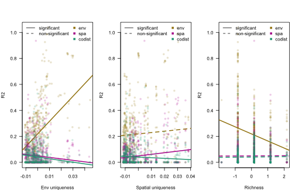

# Getting started

## About sjSDM

The sjSDM package provides R functions for estimating so-called joint species distribution models.

A jSDM is a GLMM that models a multivariate (i.e. a many-species) response to the environment, space and a covariance term that models conditional (on the other terms) correlations between the outputs (i.e. species). In other research domains, the covariance component is also known as the multivariate probit model.

![Figure 1: jSDM structure. jSDM uses a community matrix as response (rows = number of observations, columns = number of species) and tries to explain the occurrences in the community matrix as a function of environment and space. Moreover, compared to classical SDM, jSDM have an additional component, the biotic associations, that tries to account for unobservable species-species interactions. More precisely, the biotic association matrix is a variance-covariance matrix that accounts for co-occurrence patterns not explainable by environment and space.](jSDM-structure.png)

A big challenge in jSDM implementation is computational speed. The goal of the sjSDM (which stands for "scalable joint species distribution models") is to make jSDM computations fast and scalable. Unlike many other packages, which use a latent-variable approximation to make estimating jSDMs faster, sjSDM fits a full covariance matrix in the likelihood, which is, however, numerically approximated via simulations. The method is described in Pichler & Hartig (2021) A new joint species distribution model for faster and more accurate inference of species associations from big community data, <https://www.doi.org/10.1111/2041-210X.13687>.

The core code of sjSDM is implemented in Python / PyTorch, which is then wrapped into an R package. In principle, you can also use it stand-alone under Python (see instructions below). Note: for both the R and the python package, python \>= 3.9 and pytorch must be installed (more details below). However, for most users, it will be more convenient to use sjSDM via the sjSDM R package, which also provides a large number of downstream functionalities.

To get citation info for sjSDM when you use it for your reseach, type


``` r
citation("sjSDM")
To cite sjSDM in publications use:

  Pichler, M. and Hartig, F. (2021), A new joint species distribution model for faster and more accurate inference of species associations from big community data. Methods in Ecology
  and Evolution. Accepted Author Manuscript. https://doi.org/10.1111/2041-210X.13687

A BibTeX entry for LaTeX users is

  @Article{,
    title = {A new joint species distribution model for faster and more accurate inference of species associations from big community data},
    author = {Maximilian Pichler and Florian Hartig},
    journal = {Methods in Ecology and Evolution},
    year = {2021},
    doi = {10.1111/2041-210X.13687},
  }
```

## Installing the R package

sjSDM is distributed via [CRAN](https://cran.rstudio.com/web/packages/sjSDM/index.html). For most users, it will be best to install the package from CRAN


``` r
install.packages("sjSDM")
```

Depencies for the package can be installed before or after installing the package. Detailed explanations of the dependencies are provided in vignette("Dependencies", package = "sjSDM"), source code [here](https://github.com/TheoreticalEcology/s-jSDM/blob/master/sjSDM/vignettes/Dependencies.Rmd). Very briefly, the dependencies can be automatically installed from within R:


``` r
sjSDM::install_sjSDM(version = "gpu") # or
sjSDM::install_sjSDM(version = "cpu")
```

For advanced users: if you want to install the current (development) version from this repository, run


``` r
devtools::install_github("https://github.com/TheoreticalEcology/s-jSDM", subdir = "sjSDM", ref = "master")
```

dependencies should be installed as above. If the installation fails, check out the help of `?install_sjSDM`, ?installation_help, and `vignette("Dependencies", package = "sjSDM")`.

1.  Try `install_sjSDM()`
2.  New session, if no 'PyTorch not found' appears it should work, otherwise see `?installation_help`
3.  If do not get the pkg to run, create an issue [issue tracker](https://github.com/TheoreticalEcology/s-jSDM/issues) or write an email to maximilian.pichler at ur.de

# Working with sjSDM

We start with a dataset about eucalypt communities ([the dataset is from Pollock et a., 2014](https://doi.org/10.1111/2041-210x.12180))


``` r
library(sjSDM)
set.seed(42)
Env = eucalypts$env # environment
PA = eucalypts$PA # presence absence
Coords = eucalypts$lat_lon # coordinates
```

Prepare data:

-   scale numerical predictors/covariates


``` r
Env$Rockiness = scale(Env$Rockiness)
Env$PPTann = scale(Env$PPTann)
Env$cvTemp = scale(Env$cvTemp)
Env$T0 = scale(Env$T0)

Coords = scale(Coords)
```

## Fit a basic jSDM

The model is fit by the function `sjSDM()`. You have to provide all predictors and response as matrices or data frames. Here, we specify all three predictor components of an SDM:

1.  An environmental component, which essentially fits an SDM for each species. The "." tells the model to use all predictors that are not otherwise used
2.  A spatial model account for spatial autocorrelation and spatial trends/effects (trend surface model)
3.  The covariance component is automatically added. If you don't want this, you can set `biotic = bioticStruct(diag = TRUE)`, which would result in a standard MSDM.


``` r
model <- sjSDM(Y = PA, 
               env = linear(data = Env, formula = ~.), 
               spatial = linear(data = Coords, formula = ~0+latitude*longitude), 
               family=binomial("probit"),
               se = TRUE,
               verbose = FALSE)

Calculating standard errors...
```

The "linear" expression used in the environmental and spatial component means that you essentially fit a linear regression structure for the respective component. Alternatively, you could also fit a neural network (see later).

The option `se = TRUE` tells the model to calculate CIs and p-values. Note that these are approximated based on Wald CIs, which may have a certain amount of error for small data and if regularization is applied.

## Interpreting the estimated model coefficients

To get an overall summary of the model, type


``` r
summary(model)
Family:  binomial 

LogLik:  -1394.891 
Regularization loss:  0 

Species-species correlation matrix: 

	sp1	 1.0000											
	sp2	-0.2740	 1.0000										
	sp3	 0.1330	-0.4790	 1.0000									
	sp4	-0.1620	 0.1780	-0.2770	 1.0000								
	sp5	-0.2950	 0.6210	-0.3150	 0.2050	 1.0000							
	sp6	 0.1330	-0.2510	 0.0340	 0.2050	-0.1810	 1.0000						
	sp7	 0.1060	-0.0190	-0.0160	-0.3230	-0.2230	-0.2800	 1.0000					
	sp8	-0.0380	-0.1120	-0.2940	 0.0770	-0.1880	 0.0640	 0.0350	 1.0000				
	sp9	-0.0370	 0.2680	-0.0820	-0.2090	 0.2920	-0.1690	-0.0390	-0.1510	 1.0000			
	sp10	-0.0800	 0.1430	-0.6070	 0.3150	 0.0570	 0.1500	-0.1410	 0.4190	-0.0900	 1.0000		
	sp11	-0.0260	-0.2410	 0.0780	 0.0380	-0.3510	-0.0500	 0.3470	 0.2410	-0.3750	 0.0380	 1.0000	
	sp12	 0.0500	 0.2880	-0.3400	-0.1210	 0.2210	-0.0860	 0.0490	-0.0320	 0.2990	 0.1310	-0.3290	 1.0000


Spatial: 
                         sp1        sp2        sp3        sp4        sp5        sp6        sp7        sp8         sp9       sp10        sp11       sp12
latitude           0.1045909  0.8915145 -0.3467516  0.8673674  0.7860680  0.1019043 -0.4080255 -0.4361924 -0.70473593 -0.5908229 -0.06284088  0.0792945
longitude          0.4617607 -0.4040609  0.3929420 -0.7604427 -0.4817655 -0.9102288  0.5284709  0.1939298 -0.02483651  0.2608598  0.20276193 -0.1351513
latitude:longitude 0.5083163  0.7249809  0.3570058  0.4717228 -0.1352621  0.3124596  0.4323097 -0.3636581 -0.91096205  0.2246874 -0.60641092  0.1829222

                     Estimate  Std.Err Z value Pr(>|z|)    
ALA (Intercept)      -1.15760  0.29059   -3.98  6.8e-05 ***
ALA Rockiness         0.22835  0.11247    2.03  0.04233 *  
ALA Sandiness        -0.40405  0.31999   -1.26  0.20670    
ALA VallyBotFlat     -0.55968  0.22030   -2.54  0.01107 *  
ALA PPTann           -0.13146  0.12223   -1.08  0.28218    
ALA Loaminess        -2.53861  2.25891   -1.12  0.26109    
ALA cvTemp            0.32890  0.11681    2.82  0.00487 ** 
ALA T0                0.36244  0.11370    3.19  0.00143 ** 
ARE (Intercept)      -3.24135  0.59700   -5.43  5.7e-08 ***
ARE Rockiness        -0.25860  0.18625   -1.39  0.16499    
ARE Sandiness         0.02145  0.52418    0.04  0.96735    
ARE VallyBotFlat     -0.62288  0.29996   -2.08  0.03784 *  
ARE PPTann            0.14008  0.21966    0.64  0.52366    
ARE Loaminess        -1.50508  3.55123   -0.42  0.67170    
ARE cvTemp            1.38435  0.30544    4.53  5.8e-06 ***
ARE T0                0.01347  0.20154    0.07  0.94669    
BAX (Intercept)      -1.07139  0.36307   -2.95  0.00317 ** 
BAX Rockiness        -0.69165  0.17002   -4.07  4.7e-05 ***
BAX Sandiness         1.15070  0.38971    2.95  0.00315 ** 
BAX VallyBotFlat     -0.64280  0.11630   -5.53  3.3e-08 ***
BAX PPTann           -0.31065  0.17011   -1.83  0.06782 .  
BAX Loaminess        -1.01967  0.80531   -1.27  0.20545    
BAX cvTemp           -0.35754  0.16479   -2.17  0.03004 *  
BAX T0                0.03465  0.14547    0.24  0.81172    
CAM (Intercept)      -2.26979  0.33259   -6.82  8.8e-12 ***
CAM Rockiness        -0.43910  0.35867   -1.22  0.22086    
CAM Sandiness        -1.69981  0.36403   -4.67  3.0e-06 ***
CAM VallyBotFlat      0.39707  0.09181    4.32  1.5e-05 ***
CAM PPTann           -0.06300  0.38111   -0.17  0.86869    
CAM Loaminess        -0.70423  0.86024   -0.82  0.41299    
CAM cvTemp           -0.52787  0.20225   -2.61  0.00905 ** 
CAM T0               -0.09638  0.16465   -0.59  0.55832    
GON (Intercept)      -2.74869  0.71707   -3.83  0.00013 ***
GON Rockiness         0.63659  0.20633    3.09  0.00203 ** 
GON Sandiness        -0.38489  0.69814   -0.55  0.58142    
GON VallyBotFlat     -1.68847  0.58223   -2.90  0.00373 ** 
GON PPTann           -0.23704  0.23370   -1.01  0.31044    
GON Loaminess        -0.77643  4.44385   -0.17  0.86130    
GON cvTemp            0.84726  0.31933    2.65  0.00797 ** 
GON T0                0.14374  0.23266    0.62  0.53670    
MEL (Intercept)      -2.44139  0.31884   -7.66  1.9e-14 ***
MEL Rockiness        -1.22870  0.30475   -4.03  5.5e-05 ***
MEL Sandiness         0.25285  0.29103    0.87  0.38496    
MEL VallyBotFlat     -0.06452  0.07277   -0.89  0.37526    
MEL PPTann           -0.03330  0.19244   -0.17  0.86262    
MEL Loaminess        -1.95971  2.87703   -0.68  0.49577    
MEL cvTemp            0.35211  0.11384    3.09  0.00198 ** 
MEL T0                0.22410  0.10682    2.10  0.03591 *  
OBL (Intercept)      -0.90340  0.29370   -3.08  0.00210 ** 
OBL Rockiness        -0.66414  0.16756   -3.96  7.4e-05 ***
OBL Sandiness        -0.18964  0.30534   -0.62  0.53455    
OBL VallyBotFlat     -0.31323  0.08670   -3.61  0.00030 ***
OBL PPTann           -0.55753  0.17143   -3.25  0.00115 ** 
OBL Loaminess         1.32625  0.62683    2.12  0.03436 *  
OBL cvTemp           -0.15851  0.13544   -1.17  0.24187    
OBL T0                0.03666  0.12069    0.30  0.76130    
OVA (Intercept)      -2.10679  0.44504   -4.73  2.2e-06 ***
OVA Rockiness        -1.09464  0.64800   -1.69  0.09117 .  
OVA Sandiness        -1.13978  0.28472   -4.00  6.3e-05 ***
OVA VallyBotFlat      0.24350  0.07671    3.17  0.00150 ** 
OVA PPTann            0.08137  0.22926    0.35  0.72265    
OVA Loaminess        -1.57856  0.73848   -2.14  0.03255 *  
OVA cvTemp            0.47576  0.19891    2.39  0.01676 *  
OVA T0                0.06925  0.13800    0.50  0.61577    
WIL (Intercept)      -2.12240  0.31981   -6.64  3.2e-11 ***
WIL Rockiness        -0.07615  0.15732   -0.48  0.62834    
WIL Sandiness         0.28500  0.31692    0.90  0.36850    
WIL VallyBotFlat     -0.18069  0.09101   -1.99  0.04709 *  
WIL PPTann           -0.31941  0.19611   -1.63  0.10337    
WIL Loaminess         1.40584  0.55343    2.54  0.01108 *  
WIL cvTemp           -1.27394  0.16031   -7.95  1.9e-15 ***
WIL T0               -0.06892  0.12561   -0.55  0.58325    
ALP (Intercept)      -2.55773  0.70064   -3.65  0.00026 ***
ALP Rockiness         1.58397  0.23687    6.69  2.3e-11 ***
ALP Sandiness        -0.82330  0.81183   -1.01  0.31052    
ALP VallyBotFlat     -1.73824  2.20134   -0.79  0.42975    
ALP PPTann            0.86970  0.19939    4.36  1.3e-05 ***
ALP Loaminess        -1.72623  1.69044   -1.02  0.30717    
ALP cvTemp           -0.12588  0.23428   -0.54  0.59106    
ALP T0                0.00167  0.22633    0.01  0.99410    
VIM (Intercept)      -1.97624  0.33101   -5.97  2.4e-09 ***
VIM Rockiness        -0.96607  0.38538   -2.51  0.01218 *  
VIM Sandiness        -1.10469  0.30759   -3.59  0.00033 ***
VIM VallyBotFlat      0.12876  0.08485    1.52  0.12915    
VIM PPTann            0.08245  0.26524    0.31  0.75592    
VIM Loaminess        -3.46140  2.15140   -1.61  0.10764    
VIM cvTemp           -0.43917  0.20456   -2.15  0.03180 *  
VIM T0                0.25178  0.14622    1.72  0.08509 .  
ARO.SAB (Intercept)  -2.27320  0.31964   -7.11  1.1e-12 ***
ARO.SAB Rockiness    -1.43493  0.36157   -3.97  7.2e-05 ***
ARO.SAB Sandiness     0.32622  0.23412    1.39  0.16351    
ARO.SAB VallyBotFlat  0.26545  0.06130    4.33  1.5e-05 ***
ARO.SAB PPTann       -0.46420  0.21983   -2.11  0.03472 *  
ARO.SAB Loaminess    -0.21306  0.47427   -0.45  0.65327    
ARO.SAB cvTemp       -0.57797  0.12518   -4.62  3.9e-06 ***
ARO.SAB T0           -0.04561  0.10269   -0.44  0.65695    
---
Signif. codes:  0 '***' 0.001 '**' 0.01 '*' 0.05 '.' 0.1 ' ' 1
```

This output will show you the fitted environmental, spatial and covariance parameters (provided that those components were specified). Implemented S3 functions for a model object include


``` r
coef(model)
residuals(model)
Rsquared(model, verbose = FALSE)
```

### Interpreting the environmental component

The environmental effects are displayed in the summary() table. To get a visual plot, you can use


``` r
plot(model)
```

<div class="figure" style="text-align: center">

<p class="caption">plot of chunk unnamed-chunk-12</p>
</div>

### Interpreting the spatial component

The spatial effects are displayed in the `summary()` table. Currently, there are not additional options implemented to visualize the spatial effects

### Interpreting the species-species covariance (associations) component

The species-species associations are displayed in the `summary()` table. You can extract and visualize them as follows:


``` r
association = getCor(model)
sp = x = 1:ncol(PA)
fields::image.plot(association)
```

<div class="figure" style="text-align: center">

<p class="caption">plot of chunk unnamed-chunk-13</p>
</div>

Note that these associations are to be interpreted as correlations in species presence or abundance after accounting for environmental and spatial effects.

## ANOVA and variation partitioning

ANOVA or variation partitioning means that we want to calculate how much variation (=signal) is explained by the different model components.

{width="70%"}

The sjSDM package includes several functions for this purpose.

### Global ANOVA

The first option is a global ANOVA, which will calculate the amount of variation explained by the three components (environment, associations, and space):


``` r
an = anova(model, verbose = FALSE)
```

The resulting object is of class sjSDManova, and you can use the standard summary and plot function on this object:


``` r
plot(an)
```

<div class="figure" style="text-align: center">

<p class="caption">plot of chunk unnamed-chunk-15</p>
</div>

``` r
summary(an)
Analysis of Deviance Table

                                       Deviance Residual deviance R2 Nagelkerke R2 McFadden
Abiotic                               673.26304        3002.96075       0.77008      0.1654
Associations                          169.13782        3507.08597       0.30878      0.0416
Spatial                               150.96228        3525.26151       0.28080      0.0371
Shared Abiotic+Associations           142.48582        3533.73797       0.26736      0.0350
Shared Abiotic+Spatial               1531.78234        2144.44145       0.96472      0.3763
Shared Spatial+Associations            11.24359        3664.98020       0.02425      0.0028
Shared Abiotic+Associations+Spatial -1361.34035        5037.56415     -18.53795     -0.3345
Full                                 1317.53455        2358.68924       0.94368      0.3237
```

We see that the environmental component explains the most variance in the data, followed by the biotic association component. As in any ANOVA, there are unique and shared fractions for each component. The shared fractions depict variation that can be explained from either of the components (e.g. due to collinearity).

Different ANOVA strategies deal differently with these shared fractions. For example, in type II/III ANOVA, the shared fractions are usually discarded. The default here is to display all fractions. Alternatively (more on this see `?summary.sjSDManova`):

-   `summary(an, fractions = "discard")` discards shared fractions, as in a type II/III ANOVA
-   `summary(an, fractions = "proportional")` distributes shared fractions to the unique fractions proportional to the unique fractions
-   `summary(an, fractions = "equal")` distributes shared fractions evenly to the unique fractions

Note that in VP, some fractions can get negative. For more discussion on this and how to interpret it see [here](https://besjournals.onlinelibrary.wiley.com/doi/10.1111/2041-210X.13800) and [here](https://r.qcbs.ca/workshop10/book-en/index.html).

### Calculating the internal metacommunity structure

An interesting feature of jSDMs is that we can further partition the global VP discussed just before to sites and species. This idea was first presented in

Leibold, M. A., Rudolph, F. J., Blanchet, F. G., De Meester, L., Gravel, D., Hartig, F., \... & Chase, J. M. (2022). The internal structure of metacommunities. *Oikos*, *2022*(1).

We have implemented this feature call the calculation for this "internal metacommunity structure" via


``` r
results = internalStructure(an)
```

The resulting object contains R2 values for each of the three components (Env, Space, Associations) for each species and site. Note the comments in `?internalStructure`, especially about how to deal with negative values.

The results can be plotted via


``` r
plot(results)
```

<div class="figure" style="text-align: center">

<p class="caption">plot of chunk unnamed-chunk-17</p>
</div>

The ternary plots report the relative importance of the components for sites and species. Leaning to one of the corners means that this corner is mot important (e.g. here Species and Sites lean more to the environmental corner).

### Testing for predictors of the assembly processes

A attractive feature of the internal metacommunity structure calculations is that we can now regress the partial R^2^ of sites and species against predictors, to see how the strength of the three assembly components (Environment, Space, Associations) changes with these predictors.

The default plot will plot the assembly processes per plot against environmental and spatial distinctiveness, and richness:


``` r
plotAssemblyEffects(results)
```

<div class="figure" style="text-align: center">

<p class="caption">Environmental filtering increases for more distinct (extreme) environmental sites (first figure). Moreover, environmental filtering is less important for sites with high species richness (third figure).</p>
</div>

However, you can use your own predictors, and also switch between looking at sites or species as a response. For more on this, see `?plotAssemblyEffects`.

## Predictions

To predict with an sjSDM object, use


``` r
pred = predict(model, newdata = Env, SP = Coords)
```

The standard predictions are marginal, i.e. assume that we have no information about what species exist on a site we predict to.

As jSDMs fit correlations between species, predictions of jSDM improve if we can provide information for some of the species on a new site. This is known as a conditional prediction. As an example, let's assume that the first 6 species in this data are unknown, whereas the P/A of the rest is known to us.


``` r
New_PA = PA
New_PA[, 1:6] = NA
head(New_PA)
     ALA ARE BAX CAM GON MEL OBL OVA WIL ALP VIM ARO.SAB
[1,]  NA  NA  NA  NA  NA  NA   0   0   1   1   0       0
[2,]  NA  NA  NA  NA  NA  NA   1   0   1   1   0       0
[3,]  NA  NA  NA  NA  NA  NA   0   0   1   1   0       0
[4,]  NA  NA  NA  NA  NA  NA   0   0   1   0   0       0
[5,]  NA  NA  NA  NA  NA  NA   1   0   0   0   0       0
[6,]  NA  NA  NA  NA  NA  NA   0   0   1   1   0       0
```

We can then predict occurrences for the first 6 species, conditioning on the rest of the species (7:12):


``` r
pred = predict(model, newdata = Env, SP = Coords, Y = New_PA)
head(pred)
           [,1]         [,2]      [,3]         [,4]         [,5]         [,6]
[1,] 0.06919945 0.0009476454 0.1910016 0.0018830881 0.0128013078 0.0024387540
[2,] 0.11315208 0.0009214621 0.1472399 0.0002079794 0.0072220865 0.0003615931
[3,] 0.04488569 0.0006793896 0.2183437 0.0011189727 0.0177170230 0.0009391013
[4,] 0.03075938 0.0009504823 0.6358477 0.0013088832 0.0062728245 0.0042722428
[5,] 0.03657349 0.0002785174 0.7242049 0.0016383200 0.0003361727 0.0132508982
[6,] 0.06529714 0.0008642071 0.2183885 0.0005441471 0.0231352945 0.0005368480
```

Note that the predict function returns only predictions for species with NA in Y

# Advanced topics

## Fitting other distributions (e.g. species frequencies)

sjSDM supports other responses than presence-absence data: Simulate non-presence-absence data:


``` r
com = simulate_SDM(env = 3L, species = 5L, sites = 100L,
                   link = "identical", response = "count", verbose = FALSE) 
Error in simulate_SDM(env = 3L, species = 5L, sites = 100L, link = "identical", : unused argument (verbose = FALSE)
```

``` r
X = com$env_weights
Y = com$response
```

### Poisson


``` r
model = sjSDM(Y, env = linear(X, ~.), se = TRUE, 
              iter = 50L, family = poisson("log"), verbose = FALSE)

Calculating standard errors...

Species: 0/5   0%|          | [00:00, ?it/s]
Species: 5/5 100%|██████████| [00:00, 70.24it/s]
```

``` r
summary(model)
Family:  poisson 

LogLik:  -368.7662 
Regularization loss:  0 

Species-species correlation matrix: 

	sp1	 1.0000				
	sp2	 0.0020	 1.0000			
	sp3	-0.0040	-0.0010	 1.0000		
	sp4	 0.0030	 0.0010	-0.0020	 1.0000	
	sp5	 0.0010	 0.0010	 0.0000	 0.0010	 1.0000

                Estimate Std.Err Z value Pr(>|z|)    
sp1 (Intercept)  -0.8046  0.1611   -5.00  5.9e-07 ***
sp1 X1            0.0852  0.2492    0.34   0.7324    
sp1 X2           -0.7491  0.2931   -2.56   0.0106 *  
sp1 X3           -0.1113  0.2312   -0.48   0.6300    
sp2 (Intercept)  -0.8801  0.1642   -5.36  8.3e-08 ***
sp2 X1            0.6187  0.2927    2.11   0.0346 *  
sp2 X2            0.4340  0.3154    1.38   0.1688    
sp2 X3            0.7462  0.2713    2.75   0.0059 ** 
sp3 (Intercept)  -0.8675  0.1613   -5.38  7.6e-08 ***
sp3 X1            0.3770  0.2948    1.28   0.2010    
sp3 X2            0.6420  0.3136    2.05   0.0406 *  
sp3 X3            0.6501  0.2663    2.44   0.0146 *  
sp4 (Intercept)  -0.8497  0.1637   -5.19  2.1e-07 ***
sp4 X1            0.5685  0.2791    2.04   0.0417 *  
sp4 X2            0.0195  0.3056    0.06   0.9492    
sp4 X3            0.7657  0.2640    2.90   0.0037 ** 
sp5 (Intercept)  -1.0916  0.1928   -5.66  1.5e-08 ***
sp5 X1            0.6370  0.2868    2.22   0.0263 *  
sp5 X2           -0.8418  0.3484   -2.42   0.0157 *  
sp5 X3            0.3583  0.2642    1.36   0.1751    
---
Signif. codes:  0 '***' 0.001 '**' 0.01 '*' 0.05 '.' 0.1 ' ' 1
```

### Negative Binomial


``` r
model = sjSDM(Y, env = linear(X, ~.), se = TRUE, iter = 50L, family = "nbinom", verbose = FALSE)

Calculating standard errors...

Species: 0/5   0%|          | [00:00, ?it/s]
Species: 4/5  80%|████████  | [00:00, 35.63it/s]
Species: 5/5 100%|██████████| [00:00, 35.67it/s]
```

``` r
summary(model)
Family:  nbinom 

LogLik:  -371.5943 
Regularization loss:  0 

Dispersion parameters for nbinom 1.03781 1.055736 1.040243 1.039678 1.050878 

Species-species correlation matrix: 

	sp1	 1.0000				
	sp2	 0.0020	 1.0000			
	sp3	-0.0040	-0.0010	 1.0000		
	sp4	 0.0030	 0.0010	-0.0030	 1.0000	
	sp5	 0.0010	 0.0010	 0.0000	 0.0010	 1.0000

                Estimate Std.Err Z value Pr(>|z|)    
sp1 (Intercept)  -0.8102  0.1634   -4.96  7.1e-07 ***
sp1 X1            0.0855  0.2536    0.34   0.7361    
sp1 X2           -0.7516  0.2977   -2.52   0.0116 *  
sp1 X3           -0.1123  0.2346   -0.48   0.6322    
sp2 (Intercept)  -0.8851  0.1669   -5.30  1.1e-07 ***
sp2 X1            0.6242  0.2984    2.09   0.0365 *  
sp2 X2            0.4413  0.3213    1.37   0.1696    
sp2 X3            0.7549  0.2766    2.73   0.0063 ** 
sp3 (Intercept)  -0.8733  0.1638   -5.33  9.7e-08 ***
sp3 X1            0.3792  0.2999    1.26   0.2062    
sp3 X2            0.6445  0.3187    2.02   0.0432 *  
sp3 X3            0.6531  0.2706    2.41   0.0158 *  
sp4 (Intercept)  -0.8561  0.1662   -5.15  2.6e-07 ***
sp4 X1            0.5776  0.2843    2.03   0.0422 *  
sp4 X2            0.0207  0.3106    0.07   0.9469    
sp4 X3            0.7734  0.2685    2.88   0.0040 ** 
sp5 (Intercept)  -1.0985  0.1957   -5.61  2.0e-08 ***
sp5 X1            0.6408  0.2919    2.20   0.0281 *  
sp5 X2           -0.8485  0.3545   -2.39   0.0167 *  
sp5 X3            0.3608  0.2692    1.34   0.1802    
---
Signif. codes:  0 '***' 0.001 '**' 0.01 '*' 0.05 '.' 0.1 ' ' 1
```

### Normal (gaussian)


``` r
model = sjSDM(log(Y+0.01), env = linear(X, ~.), se = TRUE, 
              iter = 50L, family = gaussian("identity"), verbose = FALSE)

Calculating standard errors...

Species: 0/5   0%|          | [00:00, ?it/s]
Species: 5/5 100%|██████████| [00:00, 103.79it/s]
```

``` r
summary(model)
Family:  gaussian 

LogLik:  -1031.476 
Regularization loss:  0 

Species-species correlation matrix: 

	sp1	 1.0000				
	sp2	 0.0240	 1.0000			
	sp3	-0.3620	-0.3180	 1.0000		
	sp4	 0.2700	-0.1480	-0.2190	 1.0000	
	sp5	 0.0860	 0.2210	-0.0820	-0.2060	 1.0000

                Estimate Std.Err Z value Pr(>|z|)    
sp1 (Intercept)  -2.2882  0.2013  -11.37  < 2e-16 ***
sp1 X1            0.2534  0.3616    0.70  0.48346    
sp1 X2           -1.5035  0.3823   -3.93  8.4e-05 ***
sp1 X3           -0.2466  0.3225   -0.76  0.44454    
sp2 (Intercept)  -2.3393  0.1888  -12.39  < 2e-16 ***
sp2 X1            1.1487  0.3393    3.39  0.00071 ***
sp2 X2            0.7966  0.3587    2.22  0.02635 *  
sp2 X3            1.3576  0.3027    4.49  7.3e-06 ***
sp3 (Intercept)  -2.4885  0.1852  -13.43  < 2e-16 ***
sp3 X1            0.5887  0.3328    1.77  0.07694 .  
sp3 X2            1.0992  0.3518    3.12  0.00178 ** 
sp3 X3            1.2315  0.2969    4.15  3.3e-05 ***
sp4 (Intercept)  -2.2236  0.1834  -12.12  < 2e-16 ***
sp4 X1            1.1910  0.3296    3.61  0.00030 ***
sp4 X2            0.0393  0.3484    0.11  0.91012    
sp4 X3            1.5121  0.2940    5.14  2.7e-07 ***
sp5 (Intercept)  -2.5496  0.1869  -13.64  < 2e-16 ***
sp5 X1            1.2397  0.3359    3.69  0.00022 ***
sp5 X2           -1.3247  0.3551   -3.73  0.00019 ***
sp5 X3            0.6612  0.2996    2.21  0.02731 *  
---
Signif. codes:  0 '***' 0.001 '**' 0.01 '*' 0.05 '.' 0.1 ' ' 1
```

## Modifying the spatial component

jSDMs account for correlation between species within communities (sites), in real datasets, however, communities (sites) are often also correlated (== spatial autocorrelation). Usually conditional autoregressive (CAR) models are used to account for the spatial autocorrelation in the residuals, which we, however, do not support yet. A similar approach is to condition the model on space, which we can do by using space as predictors.

Let's first simulate test data:

1)  Simulate jSDM without a link (normal response)


``` r

com = simulate_SDM(env = 3L, species = 5L, sites = 100L, 
                   link = "identical", response = "identical")
X = com$env_weights
Y = com$response
```

2)  add spatial residuals (create coordinates and use spatial distance matrix to draw autocorrelated residuals for each species)


``` r
XYcoords = matrix(rnorm(200), 100, 2)+2
WW = as.matrix(dist(XYcoords))
spatialResiduals = mvtnorm::rmvnorm( 5L, sigma = exp(-WW))
```

3)  Finish test data


``` r
Ysp = Y + t(spatialResiduals)
Y = ifelse(Ysp < 0, 0, 1) # multivariate probit model
```

There are three options to condition our model on space:

### Using Moran's eigenvector map predictors


``` r
SPeigen = generateSpatialEV(XYcoords)

model = sjSDM(Y, env = linear(X, ~.), 
              spatial = linear(SPeigen, ~0+.), iter = 100L, verbose=FALSE)
summary(model)
Family:  binomial 

LogLik:  -170.9617 
Regularization loss:  0 

Species-species correlation matrix: 

	sp1	 1.0000				
	sp2	-0.5310	 1.0000			
	sp3	 0.5210	-0.5700	 1.0000		
	sp4	-0.1910	 0.2080	-0.2040	 1.0000	
	sp5	 0.3860	-0.4230	 0.4160	-0.1490	 1.0000


Spatial: 
             sp1        sp2         sp3         sp4         sp5
SE_1  -4.4411097  0.2398765  0.11349639 -4.35878801 -1.78664207
SE_2  -1.4732913  5.8964953 -4.92091799  5.31582737  1.25333178
SE_3  -2.6038342  1.7899166 -2.60532618 -5.57151556  0.11522219
SE_4   2.5325561 -1.7664829  5.04165745  1.63566208 -1.11144578
SE_5   2.0526600 -0.7458525  1.30857646 -0.71087623 -2.14354920
SE_6  -0.2843373 -2.2324333  2.09512329 -2.77461600 -0.49579373
SE_7   0.8783500 -2.0756681  4.11872005 -1.90534294  0.17487316
SE_8  -0.2946169  0.2387699 -0.89181983 -2.31161499 -4.85914087
SE_9  -3.2653632  2.1874349  0.99552125 -2.14123583 -0.50337034
SE_10 -0.9632602  0.5572742  2.75973034  1.02931237 -3.04724121
SE_11 -1.1967828 -3.0866771 -1.67347753  0.99009025 -5.01749897
SE_12 -0.5175238 -1.0478745 -0.86413592  1.13915920  2.37100244
SE_13  2.2773302  0.1374631  3.24874902  4.45349121 -0.27399105
SE_14 -2.6967356 -0.3785884 -0.14672092  1.07716119  0.04112962
SE_15  2.2510786 -0.6338921 -2.15170360  0.54759079  0.93538296
SE_16  0.7422370 -2.4241085  0.04694322  2.36783123 -0.62553078
SE_17 -3.3096752 -0.3276765  0.10921279 -1.55024278 -1.42334247
SE_18  2.2084169  3.3977084  0.49722201  0.81334633 -1.74012887
SE_19  3.0783682  1.1561285  2.46468687  0.62549424 -4.92139626
SE_20 -0.4345038  2.8776319 -0.20088692 -0.02714699  0.74221319
SE_21 -1.7658185 -1.0599208  2.29771256  2.34392834  2.23889446
SE_22 -1.7030019  0.1168390  1.68272197  0.36619020 -0.12755165
SE_23 -2.8030097 -0.3215768  0.41214830 -1.56887102 -0.02315588
SE_24  2.5810921  1.9347582  1.98857450 -0.29431310 -1.67050397
SE_25  0.5036260  0.9622524  0.23745491 -0.72557908  0.80946034
SE_26  2.5012362 -1.0564640  0.47583199 -1.49624801  0.11477218
SE_27  0.8546463 -0.4329039  1.67773497  0.05626399  2.18630886
SE_28  1.4154335  0.2006542  0.31553715 -0.96363121 -1.94358909
SE_29  0.7942757 -2.3573906 -1.12788308  2.71925569 -1.67642283
SE_30  1.6564527  0.2265807  2.81133270  3.16626668  1.33418405
SE_31 -1.0795039 -0.6953437  1.24328220 -0.04711112 -1.26558542
SE_32  1.9809144  3.9649031 -4.21061325  1.20037818 -3.25037241


Coefficients (beta): 

                    sp1        sp2        sp3       sp4        sp5
(Intercept) -0.32609329 -0.3168187 -0.4676386 0.1295823 -0.2565203
X1           0.06609534  0.6765800  0.6074384 0.3943720 -0.4376969
X2          -0.62974656 -0.6760387 -1.0371584 0.2258084 -1.1185338
X3          -0.25558361 -1.0102214 -1.1328297 0.2848279  1.2391785
```

### Trend surface model - linear

The idea of the trend surface model is to use the spatial coordinates within a polynom:


``` r
colnames(XYcoords) = c("XX", "YY")
model = sjSDM(Y, 
              env = linear(X, ~.), 
              spatial = linear(XYcoords, ~0+XX+YY+XX:YY+I(XX^2)+I(YY^2)), 
              iter = 100L, verbose = FALSE)
summary(model)
```

### Trend surface model - DNN

Sometimes a linear model and a polynom is not flexible enough to account for space. We can use a "simple" DNN for space to condition our linear environmental model on the space:


``` r
colnames(XYcoords) = c("XX", "YY")
model = sjSDM(Y, 
              env = linear(X, ~.), 
              spatial = DNN(XYcoords, ~0+.), 
              iter = 100L, verbose = FALSE)
summary(model)
Family:  binomial 

LogLik:  -264.6639 
Regularization loss:  0 

Species-species correlation matrix: 

	sp1	 1.0000				
	sp2	-0.5640	 1.0000			
	sp3	 0.5720	-0.7590	 1.0000		
	sp4	 0.1660	 0.1780	-0.1490	 1.0000	
	sp5	 0.1210	-0.3080	 0.2880	-0.0060	 1.0000


Spatial architecture:
===================================
Layer_1:	 (2, 10)
Layer_2:	 SELU
Layer_3:	 (10, 10)
Layer_4:	 SELU
Layer_5:	 (10, 10)
Layer_6:	 SELU
Layer_7:	 (10, 5)
===================================
Weights :	 270


Coefficients (beta): 

                   sp1        sp2        sp3       sp4        sp5
(Intercept) -0.4099596 -0.4200306 -0.3927654 0.1605587  0.1124609
X1           0.1299781  1.0425494  0.7368057 0.3729179 -0.5967472
X2          -0.9150876 -1.0131743 -1.4604577 0.1831825 -0.7714042
X3          -0.1305014 -0.9790275 -1.0794477 0.2074351  0.7390681
```

## Adjusting regularization parameters

### Regularization on abiotic coefficients

sjSDM supports l1 (lasso) and l2 (ridge) regularization: \* alpha is the weighting between lasso and ridge \* alpha = 0.0 corresponds to pure lasso \* alpha = 1.0 corresponds to pure ridge


``` r
model = sjSDM(Y = com$response, 
              env = linear(data = com$env_weights, 
                           formula = ~0+ I(X1^2),
                           lambda = 0.5), 
              iter = 50L, verbose = FALSE)
summary(model)
Family:  binomial 

LogLik:  2446.148 
Regularization loss:  0.004734271 

Species-species correlation matrix: 

	sp1	 1.0000				
	sp2	 0.0750	 1.0000			
	sp3	 0.7240	-0.2150	 1.0000		
	sp4	 0.2720	 0.9340	-0.0020	 1.0000	
	sp5	 0.4590	-0.1190	 0.5080	-0.0290	 1.0000


Coefficients (beta): 

                 sp1         sp2         sp3         sp4          sp5
I(X1^2) -0.006264385 0.003685245 0.001822939 0.002570815 -0.004510595
```

### Regularization on species-species associations

We can do the same for the species associations:


``` r
model = sjSDM(Y = com$response, 
              env = linear(data = com$env_weights, 
                           formula = ~0+ I(X1^2),
                           lambda = 0.5),
              biotic = bioticStruct(lambda =0.1),
              iter = 50L, verbose = FALSE)
summary(model)
Family:  binomial 

LogLik:  2051.213 
Regularization loss:  0.1000553 

Species-species correlation matrix: 

	sp1	 1.0000				
	sp2	-0.0030	 1.0000			
	sp3	 0.0010	 0.0000	 1.0000		
	sp4	-0.0010	-0.0010	-0.0030	 1.0000	
	sp5	 0.0010	-0.0030	 0.0030	-0.0030	 1.0000


Coefficients (beta): 

                sp1         sp2          sp3         sp4          sp5
I(X1^2) 0.004043286 -0.01592334 0.0009968621 -0.00259049 -0.000491824
```

### Regularization on the spatial model:


``` r

model = sjSDM(Y, 
              env = linear(X, ~X1+X2), 
              spatial = linear(XYcoords, ~0+XX:YY, lambda = 0.4), verbose = FALSE)
summary(model)
Family:  binomial 

LogLik:  -297.4748 
Regularization loss:  0.01556016 

Species-species correlation matrix: 

	sp1	 1.0000				
	sp2	-0.5860	 1.0000			
	sp3	 0.5510	-0.6350	 1.0000		
	sp4	 0.1600	 0.1800	-0.2100	 1.0000	
	sp5	 0.1740	-0.3850	 0.2390	 0.1040	 1.0000


Spatial: 
              sp1         sp2        sp3          sp4          sp5
XX:YY 0.008386143 0.008372252 0.05108354 -0.007122588 3.561159e-05


Coefficients (beta): 

                   sp1        sp2        sp3        sp4        sp5
(Intercept) -0.4359230 -0.2207069 -0.4662346 0.02771078 -0.6987598
X1           0.2522318  0.8311911  0.8095985 0.16383290 -0.7471617
X2          -1.0196984 -0.8113096 -1.1551344 0.32080224 -0.9682363
```

## Using deep neural networks


``` r
com = simulate_SDM(env = 3L, species = 5L, sites = 100L)
X = com$env_weights
Y = com$response

# three fully connected layers with relu as activation function
model = sjSDM(Y = Y, 
              env = DNN(data = X, 
                        formula = ~., 
                        hidden = c(10L, 10L, 10L), 
                        activation = "relu"), 
              iter = 50L, se = TRUE, verbose = FALSE)
summary(model)
Family:  binomial 

LogLik:  -242.1242 
Regularization loss:  0 

Species-species correlation matrix: 

	sp1	 1.0000				
	sp2	-0.0080	 1.0000			
	sp3	-0.5060	-0.4410	 1.0000		
	sp4	 0.4970	-0.2810	-0.4240	 1.0000	
	sp5	 0.0980	 0.4730	-0.1430	-0.4060	 1.0000


Env architecture:
===================================
Layer_1:	 (4, 10)
Layer_2:	 ReLU
Layer_3:	 (10, 10)
Layer_4:	 ReLU
Layer_5:	 (10, 10)
Layer_6:	 ReLU
Layer_7:	 (10, 5)
===================================
Weights :	 290
```

The methods for sjSDM() work also for the non-linear model:


``` r
association = getCor(model) # species association matrix
pred = predict(model) # predict on fitted data
pred = predict(model, newdata = X) # predict on new data
```

Extract and set weights of model:


``` r
weights = getWeights(model) # get layer weights and sigma
setWeights(model, weights)
```

Plot the training history:


``` r
plot(model)
```

# Installation problems

The `r sjSDM::install_sjSDM()` function can install automatically all necessary 'python' dependencies but it can fail sometimes because of individual system settings or if other 'python'/'conda' installations get into the way.

## PyTorch Installation - Before you start:

A few notes before you start with the installation (skip this point if you do not know conda):

-   existing 'conda' installations: make sure you have the latest 'conda' or 'miniconda' version and remove unnecessary 'conda' installations.
-   existing 'conda' or 'virtualenv' environments (skip this point if you do not know 'conda'): we currently enforce the usage of a specific environment called 'r-sjsdm',so if you want use a custom environment it should be named 'r-sjsdm'

## Windows - automatic installation:

Sometimes the automatic 'miniconda' installation (via `r sjSDM::install_sjSDM()` ).doesn't work because of white spaces in the user's name. But you can easily download and install 'conda' on your own:

Download and install the latest ['conda' version](https://www.anaconda.com/download/)

Afterwards run:


``` r
install_sjSDM(version = c("gpu")) # or "cpu" if you do not have a proper gpu device
```

Reload the package and run the example, if this doesn't work:

-   Restart RStudio
-   Install manually pytorch, see the following section

## Windows - manual installation:

Download and install the latest ['conda' version](https://www.anaconda.com/download/)

Open the command window (cmd.exe - hit windows key + r and write cmd)

Run in cmd.exe:


``` bash
conda create --name r-sjsdm python=3.10
conda activate r-sjsdm
conda install pytorch torchvision torchaudio cpuonly -c pytorch # cpu
conda install pytorch torchvision torchaudio pytorch-cuda=12.1 -c pytorch -c nvidia #gpu
python -m pip install pyro-ppl torch_optimizer madgrad
```

Restart R, try the example, and if it does not work:

-   Restart RStudio
-   See the 'Help and bugs' section

## Linux - automatic installation:

Run in R:


``` r
install_sjSDM(version = c("gpu")) # or "cpu" if you do not have a proper gpu device
```

Restart R try to run the example, if this doesn't work:

-   Restart RStudio
-   Install manually 'PyTorch', see the following section

## Linux - manual installation:

We strongly advise to use a 'conda' environment but a virtual environment should also work. The only requirement is that it is named 'r-sjsdm'

Download and install the latest ['conda' version](https://www.anaconda.com/download/)

Open your terminal and run:


``` bash
conda create --name r-sjsdm python=3.10
conda activate r-sjsdm
conda install pytorch torchvision torchaudio cpuonly -c pytorch # cpu
conda install pytorch torchvision torchaudio pytorch-cuda=12.1 -c pytorch -c nvidia #gpu
python -m pip install pyro-ppl torch_optimizer madgrad
```

Restart R try to run the example, if this doesn't work:

-   Restart RStudio
-   See the 'Help and bugs' section

## MacOS - automatic installation:

Run in R:


``` r
install_sjSDM()
```

Restart R try to run the example, if this doesn't work:

-   Restart RStudio
-   Install manually 'PyTorch', see the following section

## MacOS - manual installation:

We strongly advise to use a 'conda' environment but a virtual environment should also work. The only requirement is that it is named 'r-sjsdm'

Download and install the latest conda [conda version](https://www.anaconda.com/download/)

Open your terminal and run:


``` bash
conda create --name r-sjsdm python=3.10
conda activate r-sjsdm
conda install pytorch::pytorch torchvision torchaudio -c pytorch
python -m pip install pyro-ppl torch_optimizer madgrad
```

Restart R, try the example, if it does not work:

-   Restart RStudio
-   See the 'Help and bugs' section

## Help and bugs

-   ask for help via the [issue tracker](https://github.com/TheoreticalEcology/s-jSDM/issues). Please post the output of `r sjSDM::install_diagnostic()`as a quote.
-   report bugs with a [reproducible example](https://stackoverflow.com/questions/5963269/how-to-make-a-great-r-reproducible-emple) via the [issue tracker](https://github.com/TheoreticalEcology/s-jSDM/issues)
