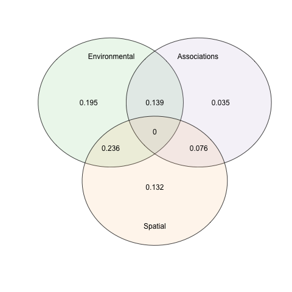
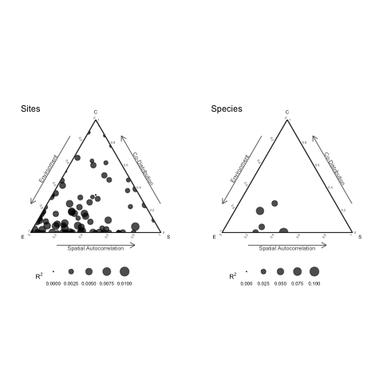
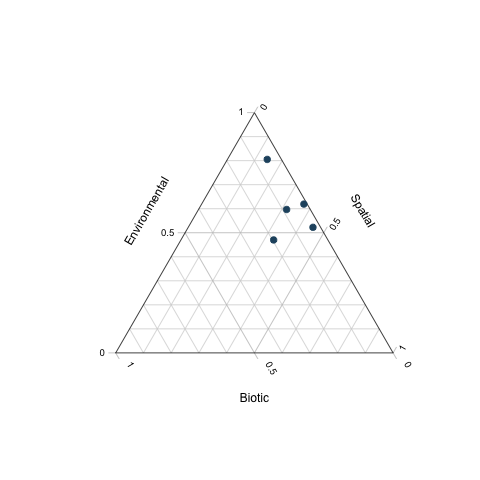

```{r, echo = F, message = F}
set.seed(123)
```

```{r global_options, include=FALSE}
knitr::opts_chunk$set(fig.width=7, fig.height=4.5, fig.align='center', warning=FALSE, message=FALSE, cache = FALSE)
```


```{r, include = FALSE}
knitr::opts_chunk$set(
  collapse = TRUE,
  comment = ""
)
```

# Getting started

Load the package via

```{r,eval=FALSE}
library(sjSDM)
```

```{r,  eval = TRUE,echo = FALSE, results = TRUE}
cat("
── Attaching sjSDM ──────────────────────────────────────── 1.0.4 ──
✔ torch <environment> 
✔ torch_optimizer  
✔ pyro  
✔ madgrad"
)
```

## Installing dependencies

sjSDM depends on Anaconda which will be installed automatically if it is not available.

To install the CPU version, run:

```{r, eval = F, purl=FALSE}
install_sjSDM()
```

For the GPU version (only NVIDIA GPUs are supported), run:

```{r, eval = F, purl=FALSE}
install_sjSDM(method = "gpu")
```

More details on and trouble-shooting for installing the necessary dependencies is explained in the vignette dependencies, call

```{r,eval = F, purl=FALSE}
vignette("Dependencies", package = "sjSDM")
```

## Citing sjSDM

To cite sjSDM in a publication, use

```{r,eval=FALSE}
citation("sjSDM")
```

```{r,  eval = TRUE,echo = FALSE, results = TRUE}
cat("

To cite sjSDM in publications use:

  Pichler, M. and Hartig, F. (2021), A new joint species distribution model for faster and more accurate inference of species associations
  from big community data. Methods in Ecology and Evolution. Accepted Author Manuscript. https://doi.org/10.1111/2041-210X.13687

A BibTeX entry for LaTeX users is

  @Article{,
    title = {A new joint species distribution model for faster and more accurate inference of species associations from big community data},
    author = {Maximilian Pichler and Florian Hartig},
    journal = {Methods in Ecology and Evolution},
    year = {2021},
    doi = {10.1111/2041-210X.13687},
  }

"
)
```

# Working with sjSDM

sjSDM has a function to create test data: We create a dataset with 3 environmental predictors, 5 species and 100 sites.

```{r,eval=FALSE}
com = simulate_SDM(env = 3L, species = 5L, sites = 100L)
```

## Fit model

The model is then fit with the function sjSDM(). You have to provide predictors (can be also a data.frame) and response as matrices.

```{r,eval=FALSE}
model = sjSDM(Y = com$response, env = com$env_weights, iter = 100L, se=TRUE)
```

```{r,  eval = TRUE,echo = FALSE, results = TRUE}
cat("
Iter: 100/100 100%|██████████| [00:01, 55.40it/s, loss=2.845]

Calculating standard errors...
Species: 5/5 100%|██████████| [00:00,  7.02it/s]
"
)
```

## Interpreting model output

Things you can do with the model output

```{r,eval=FALSE}
coef(model)
summary(model)
Rsquared(model)
```

```{r,  eval = TRUE,echo = FALSE, results = TRUE}
cat("
[[1]]
           [,1]       [,2]         [,3]       [,4]
[1,]  0.2123860  0.1510233 -0.921597779 -0.8924292
[2,]  0.1897056  0.9265483 -0.004749471  1.1936187
[3,]  0.1862375 -0.4717873  1.039884210  1.9334294
[4,] -0.2361571  1.3922049  0.119922511 -0.7957588
[5,]  0.1032345  0.4762956  1.235011458 -0.7303844
"
)
```

```{r,  eval = TRUE,echo = FALSE, results = TRUE}
cat("
Family:  binomial 

LogLik:  -283.4419 
Regularization loss:  0 

Species-species correlation matrix: 

	sp1	 1.0000				
	sp2	 0.2110	 1.0000			
	sp3	 0.1020	 0.6660	 1.0000		
	sp4	-0.2530	 0.2630	 0.4920	 1.0000	
	sp5	 0.0130	 0.3430	 0.2780	-0.1490	 1.0000


                Estimate  Std.Err Z value Pr(>|z|)    
sp1 (Intercept)  0.21239  0.19224    1.10  0.26924    
sp1 X1           0.15102  0.35645    0.42  0.67180    
sp1 X2          -0.92160  0.33932   -2.72  0.00661 ** 
sp1 X3          -0.89243  0.32367   -2.76  0.00583 ** 
sp2 (Intercept)  0.18971  0.19152    0.99  0.32191    
sp2 X1           0.92655  0.37360    2.48  0.01314 *  
sp2 X2          -0.00475  0.34082   -0.01  0.98888    
sp2 X3           1.19362  0.32748    3.64  0.00027 ***
sp3 (Intercept)  0.18624  0.25774    0.72  0.46995    
sp3 X1          -0.47179  0.49147   -0.96  0.33707    
sp3 X2           1.03988  0.46161    2.25  0.02428 *  
sp3 X3           1.93343  0.43018    4.49    7e-06 ***
sp4 (Intercept) -0.23616  0.24017   -0.98  0.32547    
sp4 X1           1.39220  0.45671    3.05  0.00230 ** 
sp4 X2           0.11992  0.43325    0.28  0.78193    
sp4 X3          -0.79576  0.39868   -2.00  0.04594 *  
sp5 (Intercept)  0.10323  0.19424    0.53  0.59510    
sp5 X1           0.47630  0.35038    1.36  0.17403    
sp5 X2           1.23501  0.36023    3.43  0.00061 ***
sp5 X3          -0.73038  0.33345   -2.19  0.02850 *  
---
Signif. codes:  0 ‘***’ 0.001 ‘**’ 0.01 ‘*’ 0.05 ‘.’ 0.1 ‘ ’ 1
"
)
```

```{r,  eval = TRUE,echo = FALSE, results = TRUE}
cat("
[1] 0.1833771
"
)
```

### Get species-species association matrix

```{r,eval=FALSE}
association = getCor(model)
print(association)
```

```{r,  eval = TRUE,echo = FALSE, results = TRUE}
cat("
            [,1]      [,2]      [,3]       [,4]        [,5]
[1,]  1.00000000 0.2107329 0.1017986 -0.2527094  0.01321193
[2,]  0.21073294 1.0000000 0.6657167  0.2625644  0.34263917
[3,]  0.10179862 0.6657167 1.0000000  0.4915384  0.27815582
[4,] -0.25270941 0.2625644 0.4915384  1.0000000 -0.14870448
[5,]  0.01321191 0.3426392 0.2781559 -0.1487045  1.00000000
"
)
```

## Adding quadratic predictors and interactions

sjSDM supports the R formula syntax.

E.g. interaction with intercept (if you want/need p-values, you have to set se = TRUE)

```{r,eval=FALSE}
model = sjSDM(Y = com$response, 
              env = linear(data = com$env_weights, formula = ~ X1*X2,), 
              iter = 50L, se = TRUE)
summary(model)
```

```{r,  eval = TRUE,echo = FALSE, results = TRUE}
cat("
Family:  binomial 

LogLik:  -302.3292 
Regularization loss:  0 

Species-species correlation matrix: 

	sp1	 1.0000				
	sp2	 0.0290	 1.0000			
	sp3	-0.0630	 0.7200	 1.0000		
	sp4	-0.1850	 0.1670	 0.3530	 1.0000	
	sp5	 0.0730	 0.2410	 0.1370	-0.1400	 1.0000


                Estimate Std.Err Z value Pr(>|z|)    
sp1 (Intercept)   0.1986  0.1555    1.28  0.20144    
sp1 X1           -0.0040  0.2802   -0.01  0.98861    
sp1 X2           -0.8405  0.2730   -3.08  0.00208 ** 
sp1 X1:X2         0.1894  0.4785    0.40  0.69227    
sp2 (Intercept)   0.2243  0.2261    0.99  0.32113    
sp2 X1            1.0708  0.4270    2.51  0.01215 *  
sp2 X2            0.1217  0.3986    0.31  0.76008    
sp2 X1:X2         0.8206  0.7316    1.12  0.26200    
sp3 (Intercept)   0.1152  0.2414    0.48  0.63333    
sp3 X1           -0.2812  0.4482   -0.63  0.53038    
sp3 X2            1.1449  0.4289    2.67  0.00761 ** 
sp3 X1:X2        -0.1565  0.7788   -0.20  0.84073    
sp4 (Intercept)  -0.1829  0.1686   -1.09  0.27783    
sp4 X1            0.8784  0.3126    2.81  0.00495 ** 
sp4 X2            0.0364  0.2886    0.13  0.89955    
sp4 X1:X2        -0.5055  0.5256   -0.96  0.33618    
sp5 (Intercept)   0.0433  0.1542    0.28  0.77874    
sp5 X1            0.3540  0.2772    1.28  0.20148    
sp5 X2            0.9742  0.2885    3.38  0.00074 ***
sp5 X1:X2        -1.0459  0.5089   -2.06  0.03987 *  
---
Signif. codes:  0 ‘***’ 0.001 ‘**’ 0.01 ‘*’ 0.05 ‘.’ 0.1 ‘ ’ 1
"
)
```

E.g. quadratic effect without intercept:

```{r,eval=FALSE}
model = update(model, env_formula = ~0+ I(X1^2)+X1)
summary(model)
```

```{r,  eval = TRUE,echo = FALSE, results = TRUE}
cat("
Family:  binomial 

LogLik:  -318.0733 
Regularization loss:  0 

Species-species correlation matrix: 

	sp1	 1.0000				
	sp2	-0.0230	 1.0000			
	sp3	-0.1680	 0.7150	 1.0000		
	sp4	-0.1660	 0.1260	 0.3010	 1.0000	
	sp5	-0.1470	 0.2070	 0.2380	-0.0670	 1.0000


            Estimate Std.Err Z value Pr(>|z|)   
sp1 I(X1^2)   0.4843  0.3651    1.33   0.1846   
sp1 X1        0.1387  0.2860    0.49   0.6276   
sp2 I(X1^2)   0.0865  0.5380    0.16   0.8723   
sp2 X1        1.0220  0.4157    2.46   0.0139 * 
sp3 I(X1^2)  -0.3807  0.5516   -0.69   0.4901   
sp3 X1       -0.4502  0.4267   -1.05   0.2915   
sp4 I(X1^2)  -0.2723  0.4015   -0.68   0.4976   
sp4 X1        0.8490  0.3105    2.73   0.0063 **
sp5 I(X1^2)   0.6131  0.3653    1.68   0.0933 . 
sp5 X1        0.1927  0.2886    0.67   0.5044   
---
Signif. codes:  0 ‘***’ 0.001 ‘**’ 0.01 ‘*’ 0.05 ‘.’ 0.1 ‘ ’ 1
"
)
```

## Fitting other distributions (e.g. species frequencies)

sjSDM supports other responses than presence-absence data: Simulate non-presence-absence data:

```{r,eval=FALSE}
com = simulate_SDM(env = 3L, species = 5L, sites = 100L,
                   link = "identical", response = "count") 
X = com$env_weights
Y = com$response
```

## Poisson

```{r,eval=FALSE}
model = sjSDM(Y, env = linear(X, ~.), se = TRUE, 
              iter = 50L, family = poisson("log"))
summary(model)
```

```{r,  eval = TRUE,echo = FALSE, results = TRUE}
cat("
Family:  poisson 

LogLik:  -739.8975 
Regularization loss:  0 

Species-species correlation matrix: 

	sp1	1.0000				
	sp2	0.3980	1.0000			
	sp3	0.5140	0.5410	1.0000		
	sp4	0.5870	0.2950	0.3940	1.0000	
	sp5	0.4230	0.1480	0.2770	0.2350	1.0000


                Estimate Std.Err Z value Pr(>|z|)    
sp1 (Intercept)  -0.0637  0.1158   -0.55  0.58242    
sp1 X1           -0.3360  0.2151   -1.56  0.11826    
sp1 X2            0.4007  0.1993    2.01  0.04439 *  
sp1 X3           -0.8708  0.1808   -4.82  1.5e-06 ***
sp2 (Intercept)  -0.3995  0.1415   -2.82  0.00476 ** 
sp2 X1           -0.3931  0.2148   -1.83  0.06727 .  
sp2 X2           -1.4494  0.2642   -5.49  4.1e-08 ***
sp2 X3            0.1990  0.2003    0.99  0.32043    
sp3 (Intercept)  -0.1918  0.1247   -1.54  0.12398    
sp3 X1            0.2919  0.1591    1.83  0.06653 .  
sp3 X2           -0.4804  0.2181   -2.20  0.02763 *  
sp3 X3           -1.1303  0.2095   -5.40  6.8e-08 ***
sp4 (Intercept)  -0.2586  0.1316   -1.97  0.04937 *  
sp4 X1            0.3534  0.2569    1.38  0.16897    
sp4 X2            1.0142  0.2744    3.70  0.00022 ***
sp4 X3            0.7302  0.2689    2.72  0.00661 ** 
sp5 (Intercept)  -0.1647  0.1400   -1.18  0.23935    
sp5 X1            0.7520  0.2582    2.91  0.00359 ** 
sp5 X2            0.1833  0.2642    0.69  0.48782    
sp5 X3           -0.3034  0.2479   -1.22  0.22111    
---
Signif. codes:  0 ‘***’ 0.001 ‘**’ 0.01 ‘*’ 0.05 ‘.’ 0.1 ‘ ’ 1
"
)
```

## Negative Binomial

```{r,eval=FALSE}
model = sjSDM(Y, env = linear(X, ~.), se = TRUE, iter = 50L, family = "nbinom")
summary(model)
```

```{r,  eval = TRUE,echo = FALSE, results = TRUE}
cat("
Family:  nbinom 

LogLik:  -734.597 
Regularization loss:  0 

Dispersion parameters for nbinom 1.054162 1.14625 1.180084 1.341712 1.415227 

Species-species correlation matrix: 

	sp1	1.0000				
	sp2	0.3840	1.0000			
	sp3	0.4950	0.5360	1.0000		
	sp4	0.5590	0.2760	0.3680	1.0000	
	sp5	0.4290	0.1170	0.2480	0.3030	1.0000


                Estimate Std.Err Z value Pr(>|z|)    
sp1 (Intercept)   -0.165   0.155   -1.06  0.28855    
sp1 X1            -0.463   0.240   -1.93  0.05363 .  
sp1 X2             0.372   0.234    1.59  0.11250    
sp1 X3            -0.937   0.234   -4.01  6.1e-05 ***
sp2 (Intercept)   -0.398   0.152   -2.63  0.00866 ** 
sp2 X1            -0.419   0.248   -1.69  0.09141 .  
sp2 X2            -1.394   0.277   -5.03  4.9e-07 ***
sp2 X3             0.207   0.221    0.93  0.34988    
sp3 (Intercept)   -0.249   0.146   -1.71  0.08716 .  
sp3 X1             0.223   0.227    0.98  0.32581    
sp3 X2            -0.534   0.249   -2.15  0.03178 *  
sp3 X3            -1.240   0.239   -5.19  2.1e-07 ***
sp4 (Intercept)   -0.260   0.157   -1.65  0.09871 .  
sp4 X1             0.250   0.287    0.87  0.38256    
sp4 X2             1.059   0.294    3.61  0.00031 ***
sp4 X3             0.777   0.273    2.85  0.00439 ** 
sp5 (Intercept)   -0.105   0.148   -0.71  0.47897    
sp5 X1             0.768   0.268    2.87  0.00417 ** 
sp5 X2             0.138   0.276    0.50  0.61784    
sp5 X3            -0.353   0.252   -1.40  0.16132    
---
Signif. codes:  0 ‘***’ 0.001 ‘**’ 0.01 ‘*’ 0.05 ‘.’ 0.1 ‘ ’ 1
"
)
```

## Normal (gaussian)

```{r,eval=FALSE}
model = sjSDM(log(Y+0.01), env = linear(X, ~.), se = TRUE, 
              iter = 50L, family = gaussian("identity"))
summary(model)
```

```{r,  eval = TRUE,echo = FALSE, results = TRUE}
cat("
Family:  gaussian 

LogLik:  -1098.451 
Regularization loss:  0 

Species-species correlation matrix: 

	sp1	 1.0000				
	sp2	 0.3020	 1.0000			
	sp3	 0.3840	 0.5210	 1.0000		
	sp4	 0.6160	 0.0820	 0.0650	 1.0000	
	sp5	 0.3620	-0.0350	 0.0970	 0.0370	 1.0000


                Estimate Std.Err Z value Pr(>|z|)    
sp1 (Intercept)   -1.393   0.164   -8.48  < 2e-16 ***
sp1 X1            -0.744   0.304   -2.45  0.01447 *  
sp1 X2             1.137   0.292    3.89  1.0e-04 ***
sp1 X3            -1.090   0.276   -3.95  8.0e-05 ***
sp2 (Intercept)   -1.709   0.200   -8.56  < 2e-16 ***
sp2 X1            -0.489   0.370   -1.32  0.18663    
sp2 X2            -1.952   0.355   -5.50  3.9e-08 ***
sp2 X3             0.778   0.336    2.32  0.02056 *  
sp3 (Intercept)   -1.586   0.203   -7.81  5.9e-15 ***
sp3 X1             0.139   0.376    0.37  0.71251    
sp3 X2            -0.704   0.361   -1.95  0.05109 .  
sp3 X3            -1.539   0.342   -4.50  6.7e-06 ***
sp4 (Intercept)   -1.703   0.190   -8.95  < 2e-16 ***
sp4 X1             0.654   0.353    1.85  0.06371 .  
sp4 X2             1.307   0.338    3.86  0.00011 ***
sp4 X3             1.296   0.320    4.05  5.1e-05 ***
sp5 (Intercept)   -1.784   0.234   -7.61  2.7e-14 ***
sp5 X1             1.412   0.434    3.25  0.00115 ** 
sp5 X2             0.340   0.417    0.82  0.41430    
sp5 X3            -0.511   0.394   -1.30  0.19478    
---
Signif. codes:  0 ‘***’ 0.001 ‘**’ 0.01 ‘*’ 0.05 ‘.’ 0.1 ‘ ’ 1
"
)
```

# Handling spatial autocorrelation

## Simulating spatial data

jSDMs account for correlation between species within communities (sites), in real datasets, however, communities (sites) are often also correlated (== spatial autocorrelation). Usually conditional autoregressive (CAR) models are used to account for the spatial autocorrelation in the residuals, which we, however, do not support yet. A similar approach is to condition the model on space, which we can do by using space as predictors.

Let's first simulate test data:

1)  Simulate jSDM without a link (normal response)

```{r,eval=FALSE}

com = simulate_SDM(env = 3L, species = 5L, sites = 100L, 
                   link = "identical", response = "identical")
X = com$env_weights
Y = com$response
```

2)  add spatial residuals (create coordinates and use spatial distance matrix to draw autocorrelated residuals for each species)

```{r,eval=FALSE}
XYcoords = matrix(rnorm(200), 100, 2)+2
WW = as.matrix(dist(XYcoords))
spatialResiduals = mvtnorm::rmvnorm( 5L, sigma = exp(-WW))
```

3)  Finish test data

```{r,eval=FALSE}
Ysp = Y + t(spatialResiduals)
Y = ifelse(Ysp < 0, 0, 1) # multivariate probit model
```

## Fitting spatial jSDM

There are three options to condition our model on space:

### Using Moran's eigenvector map predictors

```{r,eval=FALSE}
SPeigen = generateSpatialEV(XYcoords)

model = sjSDM(Y, env = linear(X, ~.), 
              spatial = linear(SPeigen, ~0+.), iter = 100L)
summary(model)
```

```{r,  eval = TRUE,echo = FALSE, results = TRUE}
cat("
Family:  binomial 

LogLik:  -149.8222 
Regularization loss:  0 

Species-species correlation matrix: 

	sp1	 1.0000				
	sp2	-0.0010	 1.0000			
	sp3	-0.0030	 0.0060	 1.0000		
	sp4	-0.0040	 0.0060	 0.0090	 1.0000	
	sp5	 0.0010	-0.0060	-0.0030	-0.0030	 1.0000


Spatial: 
              sp1           sp2          sp3        sp4         sp5
SE_1   2.38638926  2.5937938690 -1.442292929 -1.7027093 -6.32177496
SE_2   3.56089687  0.1069787145 -2.357900381 -3.1000090  1.21968138
SE_3   3.33727574  3.6948025227 -0.443507224  0.7071682 -1.99999762
SE_4   4.41160393  3.5757262707 -1.652758241 -1.9360968  1.43769407
SE_5  -0.68742448 -1.0900378227  0.013777545 -2.0127978  2.37215877
SE_6  -1.71774006 -1.8035635948  2.929920435 -2.1059422 -2.59374928
SE_7   2.56886339  0.0006179297 -0.856198847  2.8680654  4.85977745
SE_8  -0.26292410  1.6328101158 -3.327755690  0.5276753 -0.41080785
SE_9  -1.60449564 -0.5995440483 -0.625599205  2.0251775  0.03937552
SE_10  1.27505147  1.9339948893 -1.525249720 -1.0435483 -1.97039020
SE_11  1.16559207  2.7737557888 -1.257388592 -0.6400476  4.42826366
SE_12 -2.24396539  1.0763579607  3.134861708  0.6035565  4.71948004
SE_13 -2.30320644 -3.3523292542  1.545802116 -2.7544699 -1.86491358
SE_14 -1.79449856  0.0990527421 -3.853564024 -2.4198778  2.75543952
SE_15  1.37741494  0.0703115538  2.818559885  0.6189511 -0.27714351
SE_16 -0.92059976 -1.2839322090  3.643914223 -1.4476713 -1.51967800
SE_17  3.60196638  2.9251329899 -0.241982833 -2.5229876 -2.39947033
SE_18 -0.03784461  0.1110916212 -0.794684649  4.1111836 -1.52129221
SE_19  1.84551859 -1.6779400110 -3.759748936 -0.1108366  1.77537143
SE_20 -0.58410239 -2.1487998962 -1.485854745  2.3051410 -0.07883015
SE_21  1.73734176 -0.6361957788 -0.890753627 -0.8290216 -1.56643021
SE_22  1.39977551  0.3389286101  2.873785019 -1.5883439  1.15440071
SE_23  3.48965788 -0.2591717839 -0.001287312 -1.7920226  0.94603634
SE_24  3.60038352  0.9317813516 -0.141704157 -1.7175266  1.13903856
SE_25 -0.64217925  0.3653856218  1.716485977 -1.1566225 -1.51774764
SE_26  0.34295934 -0.4282256067 -0.650101960 -0.1746819  0.06951486
SE_27  2.35058212  2.0903272629  0.199874803  0.9690201 -0.88704813
SE_28 -0.20923692 -1.8343133926 -1.573297977 -1.5372227 -0.01640151
SE_29 -1.88248694  1.3279957771  1.112663269  0.9470313  1.54079032
SE_30  0.66211921  0.2301118076 -2.266136885  2.5833168  0.66425890


Coefficients (beta): 

                   sp1         sp2        sp3        sp4         sp5
(Intercept)  0.4230770 -0.41647881  0.6063710 -1.2460542 -0.17206824
X1          -0.8550248 -0.05640704 -1.1662781 -0.9105143  1.28427637
X2           1.5508552  0.86052102 -0.6224287 -1.4532256  1.25702059
X3          -0.1337588 -0.22025539  0.7049214 -0.6198063  0.09523568
"
)
```

### Trend surface model - linear

The idea of the trend surface model is to use the spatial coordinates within a polynom:

```{r,eval=FALSE}
colnames(XYcoords) = c("XX", "YY")
model = sjSDM(Y, 
              env = linear(X, ~.), 
              spatial = linear(XYcoords, ~0+XX+YY+XX:YY+I(XX^2)+I(YY^2)), 
              iter = 100L)
summary(model)
```

```{r,  eval = TRUE,echo = FALSE, results = TRUE}
cat("
Family:  binomial 

LogLik:  -249.8679 
Regularization loss:  0 

Species-species correlation matrix: 

	sp1	 1.0000				
	sp2	 0.4130	 1.0000			
	sp3	-0.2660	 0.1030	 1.0000		
	sp4	-0.3110	-0.2000	 0.2540	 1.0000	
	sp5	 0.2040	-0.0320	-0.1060	 0.0590	 1.0000


Spatial: 
                sp1         sp2         sp3         sp4          sp5
XX       0.47606543  0.06025439 -0.23099037  0.03438381  0.325071186
YY      -0.20050387 -0.37380567  0.65688038 -1.21957469 -0.148165032
I(XX^2) -0.17813964 -0.11971998  0.03542139 -0.05748598 -0.001835179
I(YY^2)  0.09193532  0.09655374 -0.20153308  0.31681502  0.085483454
XX:YY    0.18274361  0.23728767 -0.03552317 -0.04852530 -0.289997339


Coefficients (beta): 

                   sp1        sp2        sp3        sp4        sp5
(Intercept) -0.4533308 -0.8851423  0.8320261 -0.2053585 -0.1005380
X1          -1.1279716 -0.1818872 -0.7844011 -1.0338252  1.1931677
X2           2.0738156  1.0653158 -0.5916347 -1.4142951  1.1800549
X3          -0.1452578 -0.2992958  0.4864468 -0.5459074  0.1904803
"
)
```

### Trend surface model - DNN

Sometimes a linear model and a polynom is not flexible enough to account for space. We can use a "simple" DNN for space to condition our linear environmental model on the space:

```{r,eval=FALSE}
colnames(XYcoords) = c("XX", "YY")
model = sjSDM(Y, 
              env = linear(X, ~.), 
              spatial = DNN(XYcoords, ~0+.), 
              iter = 100L)
summary(model)
```

```{r,  eval = TRUE,echo = FALSE, results = TRUE}
cat("
Family:  binomial 

LogLik:  -221.5125 
Regularization loss:  0 

Species-species correlation matrix: 

	sp1	 1.0000				
	sp2	 0.4310	 1.0000			
	sp3	-0.2880	 0.1390	 1.0000		
	sp4	-0.3490	-0.3160	 0.2400	 1.0000	
	sp5	 0.2950	 0.0260	-0.2060	-0.0250	 1.0000


Spatial architecture:
===================================
Layer_1:	 (2, 10)
Layer_2:	 SELU
Layer_3:	 (10, 10)
Layer_4:	 SELU
Layer_5:	 (10, 10)
Layer_6:	 SELU
Layer_7:	 (10, 5)
===================================
Weights :	 270


Coefficients (beta): 

                   sp1        sp2        sp3        sp4         sp5
(Intercept)  0.1466708  0.3148144  0.2128077 -0.1163636 -0.14095539
X1          -1.1760172 -0.1682270 -1.0130851 -1.2476457  1.44015896
X2           2.1208446  1.0366764 -0.6902167 -1.7108219  1.39310575
X3          -0.1201278 -0.2378207  0.6429102 -0.7199039  0.08894651
"
)
```

# VENN diagram and community analyses

## Anova

ANOVA (Type II) will separate the three components (environment, associations, and space):

```{r,eval=FALSE}
model = sjSDM(Y, 
              env = linear(X, ~.), 
              spatial = linear(XYcoords, ~0+XX+YY+XX:YY+I(XX^2)+I(YY^2)), 
              iter = 100L)

an = anova(model)
print(an)
plot(an)
```

```{r,  eval = TRUE,echo = FALSE, results = TRUE}
cat("
Iter: 100/100 100%|██████████| [00:01, 64.31it/s, loss=2.819]
Iter: 100/100 100%|██████████| [00:01, 58.37it/s, loss=3.373]
Iter: 100/100 100%|██████████| [00:01, 64.17it/s, loss=3.099]
Iter: 100/100 100%|██████████| [00:01, 56.71it/s, loss=2.731]
Iter: 100/100 100%|██████████| [00:01, 58.89it/s, loss=2.646]
Iter: 100/100 100%|██████████| [00:01, 51.46it/s, loss=2.984]
Iter: 100/100 100%|██████████| [00:02, 48.46it/s, loss=0.121]
"
)
```

```{r,  eval = TRUE,echo = FALSE, results = TRUE}
cat("
Analysis of Deviance Table

         Deviance Residual deviance R2 Nagelkerke R2 McFadden
Abiotic 135.46469         534.13894       0.74196      0.1954
Biotic   24.48839         645.11523       0.21720      0.0353
Spatial  91.44113         578.16250       0.59925      0.1319
Full    187.83630         481.76733       0.84716      0.2710
"
)
```



## Internal metacommunity structure

We can calculate and visualize the internal metacommunity structure for species and sites (only for models with space):

```{r,eval=FALSE}
results = plotInternalStructure(an)
print(results$data$Species)
```



```{r,  eval = TRUE,echo = FALSE, results = TRUE}
cat("
         env        spa     codist         r2
1 0.20700207 0.06585441 0.06470110 0.06751152
2 0.08447389 0.04961366 0.04666684 0.03615088
3 0.12547761 0.05222821 0.00932909 0.03740698
4 0.25344941 0.22698509 0.00000000 0.09249987
5 0.14541311 0.05033103 0.00000000 0.03742124
"
)
```

## Importance

We can also partition the effects of the different components. This function will be deprecated in future. Please use `plot(anova(model), internal = TRUE)`

```{r,eval=FALSE}
imp = importance(model)
plot(imp)
```



# Predictive modeling 

## Regularization on abiotic coefficients

sjSDM supports l1 (lasso) and l2 (ridge) regularization: \* alpha is the weighting between lasso and ridge \* alpha = 0.0 corresponds to pure lasso \* alpha = 1.0 corresponds to pure ridge

```{r,eval=FALSE}
model = sjSDM(Y = com$response, 
              env = linear(data = com$env_weights, 
                           formula = ~0+ I(X1^2),
                           lambda = 0.5), 
              iter = 50L)
summary(model)
```

```{r,  eval = TRUE,echo = FALSE, results = TRUE}
cat("
Family:  binomial 

LogLik:  3005.559 
Regularization loss:  0.008441598 

Species-species correlation matrix: 

	sp1	 1.0000				
	sp2	 0.9270	 1.0000			
	sp3	 0.0550	 0.2600	 1.0000		
	sp4	 0.0980	 0.0590	 0.6110	 1.0000	
	sp5	 0.2510	 0.0910	-0.2470	-0.2280	 1.0000


Coefficients (beta): 

                sp1         sp2         sp3         sp4          sp5
I(X1^2) 0.004259373 -0.01279781 -0.00810579 0.001065778 -0.007236504
"
)
```


## Regularization on species-species associations

We can do the same for the species associations:

```{r,eval=FALSE}
model = sjSDM(Y = com$response, 
              env = linear(data = com$env_weights, 
                           formula = ~0+ I(X1^2),
                           lambda = 0.5),
              biotic = bioticStruct(lambda =0.1),
              iter = 50L)
summary(model)
```

```{r,  eval = TRUE,echo = FALSE, results = TRUE}
cat("
Family:  binomial 

LogLik:  2448.94 
Regularization loss:  0.1322939 

Species-species correlation matrix: 

	sp1	 1.0000				
	sp2	 0.0030	 1.0000			
	sp3	 0.0000	 0.0040	 1.0000		
	sp4	-0.0010	 0.0030	 0.0020	 1.0000	
	sp5	 0.0000	-0.0030	-0.0040	-0.0040	 1.0000


Coefficients (beta): 

                 sp1         sp2          sp3         sp4           sp5
I(X1^2) -0.002930772 -0.01018739 0.0004073409 -0.01492386 -0.0006310232
"
)
```


## Regularization on the spatial model:

```{r,eval=FALSE}

model = sjSDM(Y, 
              env = linear(X, ~X1+X2), 
              spatial = linear(XYcoords, ~0+XX:YY, lambda = 0.4))
summary(model)
```

```{r,  eval = TRUE,echo = FALSE, results = TRUE}
cat("
Family:  binomial 

LogLik:  -271.1669 
Regularization loss:  0.03348127 

Species-species correlation matrix: 

	sp1	 1.0000				
	sp2	 0.4620	 1.0000			
	sp3	-0.2530	-0.0170	 1.0000		
	sp4	-0.1320	-0.0710	 0.0120	 1.0000	
	sp5	 0.1250	-0.0370	-0.1950	 0.0660	 1.0000


Spatial: 
             sp1        sp2        sp3         sp4         sp5
XX:YY 0.06049911 0.02383612 -0.0214822 0.005751625 -0.04873891


Coefficients (beta): 

                   sp1        sp2        sp3        sp4        sp5
(Intercept)  0.1916257 -0.6175303  0.6018637 -1.0122814 0.03363303
X1          -1.0145007 -0.1032497 -0.6249472 -0.6525001 0.89455980
X2           1.8280621  0.7711327 -0.4506337 -1.2445705 0.70294631
"
)
```


## Using deep neural networks

```{r,eval=FALSE}
com = simulate_SDM(env = 3L, species = 5L, sites = 100L)
X = com$env_weights
Y = com$response

# three fully connected layers with relu as activation function
model = sjSDM(Y = Y, 
              env = DNN(data = X, 
                        formula = ~., 
                        hidden = c(10L, 10L, 10L), 
                        activation = "relu"), 
              iter = 50L, se = TRUE)
summary(model)
```

```{r,  eval = TRUE,echo = FALSE, results = TRUE}
cat("
Family:  binomial 

LogLik:  -252.2699 
Regularization loss:  0 

Species-species correlation matrix: 

	sp1	 1.0000				
	sp2	-0.7390	 1.0000			
	sp3	-0.2260	 0.0890	 1.0000		
	sp4	-0.3300	 0.4830	-0.0330	 1.0000	
	sp5	 0.2820	-0.3960	 0.5520	-0.2900	 1.0000


Env architecture:
===================================
Layer_1:	 (4, 10)
Layer_2:	 ReLU
Layer_3:	 (10, 10)
Layer_4:	 ReLU
Layer_5:	 (10, 10)
Layer_6:	 ReLU
Layer_7:	 (10, 5)
===================================
Weights :	 290
"
)
```

The methods for sjSDM() work also for the non-linear model:

```{r,eval=FALSE}
association = getCor(model) # species association matrix
pred = predict(model) # predict on fitted data
pred = predict(model, newdata = X) # predict on new data
```

Extract and set weights of model:

```{r,eval=FALSE}
weights = getWeights(model) # get layer weights and sigma
setWeights(model, weights)
```

Plot the training history:

```{r,eval=FALSE}
plot(model)
```
