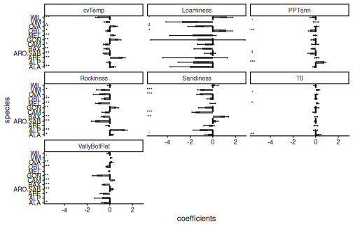
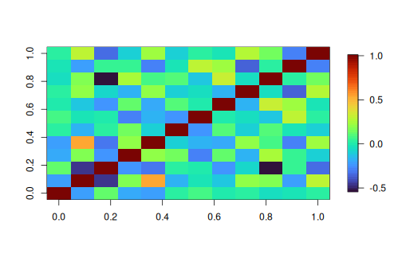
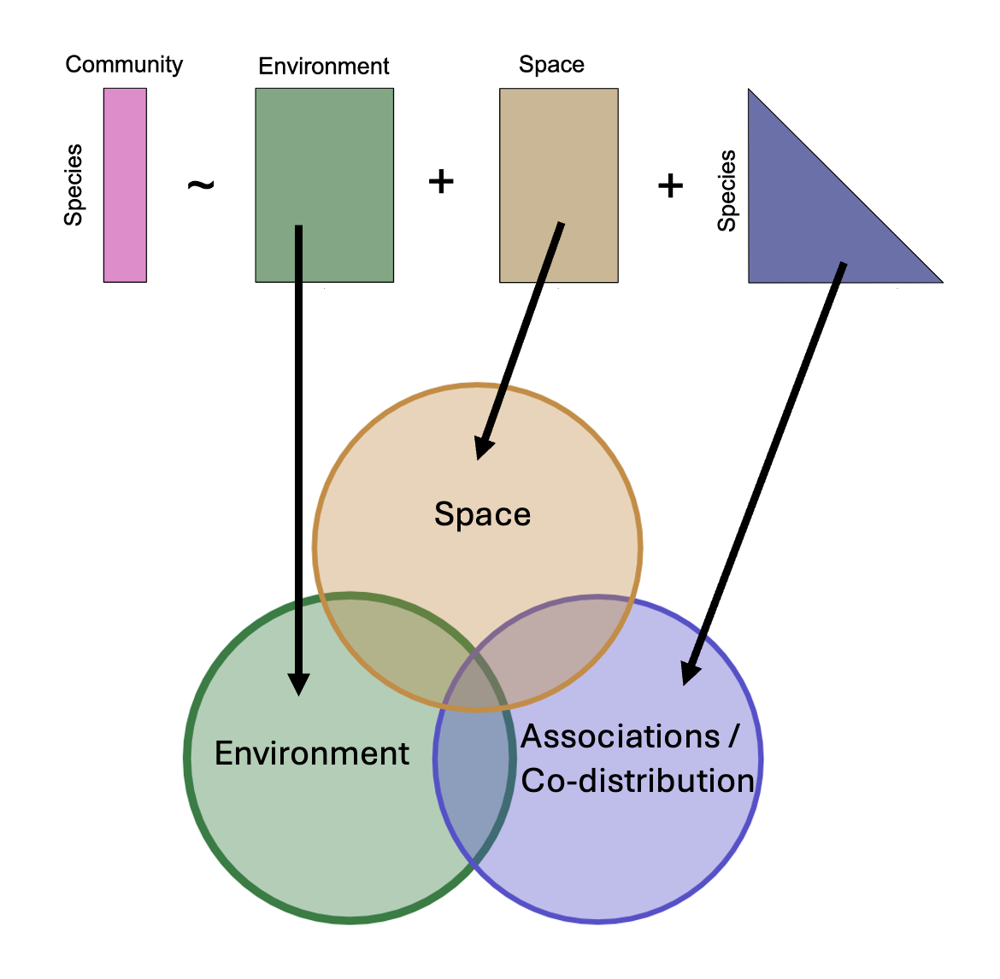
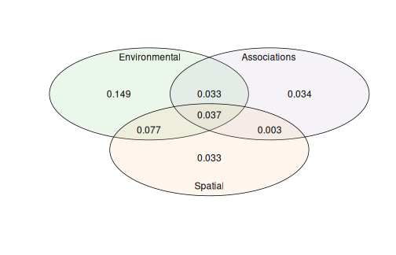
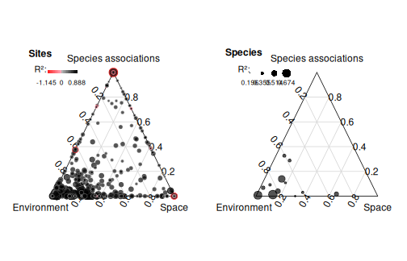
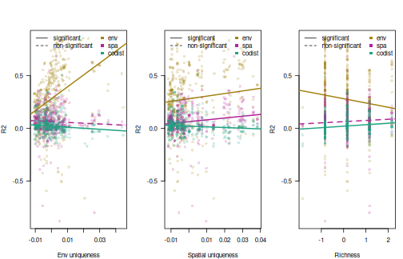

# Getting started

## About sjSDM

The sjSDM package provides R functions for estimating so-called joint species distribution models.

A jSDM is a GLMM that models a multivariate (i.e. a many-species) response to the environment, space and a covariance term that models conditional (on the other terms) correlations between the outputs (i.e. species). In other research domains, the covariance component is also known as the multivariate probit model.

![Figure 1: jSDM structure. jSDM uses a community matrix as response (rows = number of observations, columns = number of species) and tries to explain the occurrences in the community matrix as a function of environment and space. Moreover, compared to classical SDM, jSDM have an additional component, the biotic associations, that tries to account for unobservable species-species interactions. More precisely, the biotic association matrix is a variance-covariance matrix that accounts for co-occurrence patterns not explainable by environment and space.](jSDM-structure.png)

A big challenge in jSDM implementation is computational speed. The goal of the sjSDM (which stands for "scalable joint species distribution models") is to make jSDM computations fast and scalable. Unlike many other packages, which use a latent-variable approximation to make estimating jSDMs faster, sjSDM fits a full covariance matrix in the likelihood, which is, however, numerically approximated via simulations. The method is described in Pichler & Hartig (2021) A new joint species distribution model for faster and more accurate inference of species associations from big community data, <https://doi.org/10.1111/2041-210X.13687>.

Since version 1.1.0 the core code of sjSDM is implemented in R on top of [torch](https://torch.mlverse.org/) (libtorch). Earlier versions wrapped a Python / PyTorch backend through reticulate; that is gone, and with it the need for python, conda and a separate PyTorch installation.

To get citation info for sjSDM when you use it for your reseach, type


``` r
citation("sjSDM")
#> To cite sjSDM in publications use:
#> 
#>   Pichler, M. and Hartig, F. (2021), A new joint species distribution
#>   model for faster and more accurate inference of species associations
#>   from big community data. Methods in Ecology and Evolution, 12(11),
#>   2159-2173. https://doi.org/10.1111/2041-210X.13687
#> 
#> A BibTeX entry for LaTeX users is
#> 
#>   @Article{,
#>     title = {A new joint species distribution model for faster and more accurate inference of species associations from big community data},
#>     author = {Maximilian Pichler and Florian Hartig},
#>     journal = {Methods in Ecology and Evolution},
#>     year = {2021},
#>     volume = {12},
#>     number = {11},
#>     pages = {2159--2173},
#>     doi = {10.1111/2041-210X.13687},
#>   }
```

## Installing the R package

sjSDM is distributed via [CRAN](https://cran.r-project.org/package=sjSDM). For most users, it will be best to install the package from CRAN


``` r
install.packages("sjSDM")
```

Depencies for the package can be installed before or after installing the package. Detailed explanations of the can be found below. Very briefly, the dependencies can be automatically installed from within R:


``` r
sjSDM::install_sjSDM()   # wrapper around torch::install_torch()
```

For advanced users: if you want to install the current (development) version from this repository, run


``` r
devtools::install_github("https://github.com/TheoreticalEcology/s-jSDM", subdir = "sjSDM", ref = "master")
```

If the installation fails, check out the help of `?install_sjSDM` and `?installation_help`.

1.  Run `sjSDM::install_diagnostic()` and check whether libtorch is installed
2.  If not, run `torch::install_torch()` and restart R
3.  If do not get the pkg to run, create an issue [issue tracker](https://github.com/TheoreticalEcology/s-jSDM/issues) or write an email to maximilian.pichler at ur.de

# Working with sjSDM

We start with a dataset about eucalypt communities ([the dataset is from Pollock et a., 2014](https://doi.org/10.1111/2041-210x.12180))


``` r
library(sjSDM)
set.seed(42)
Env = eucalypts$env # environment
PA = eucalypts$PA # presence absence
Coords = eucalypts$lat_lon # coordinates

```

Prepare data:

-   scale numerical predictors/covariates


``` r
Env$Rockiness = scale(Env$Rockiness)
Env$PPTann = scale(Env$PPTann)
Env$cvTemp = scale(Env$cvTemp)
Env$T0 = scale(Env$T0)

Coords = scale(Coords)
```

## Fit a basic jSDM

The model is fit by the function `sjSDM()`. You have to provide all predictors and response as matrices or data frames. Here, we specify all three predictor components of an SDM:

1.  An environmental component, which essentially fits an SDM for each species. The "." tells the model to use all predictors that are not otherwise used
2.  A spatial model account for spatial autocorrelation and spatial trends/effects (trend surface model)
3.  The covariance component is automatically added. If you don't want this, you can set `biotic = bioticStruct(diag = TRUE)`, which would result in a standard MSDM.


``` r
model <- sjSDM(Y = PA, 
               env = linear(data = Env, formula = ~.), 
               spatial = linear(data = Coords, formula = ~0+latitude*longitude), 
               family=binomial("probit"),
               se = TRUE,
               verbose = FALSE)
```

The "linear" expression used in the environmental and spatial component means that you essentially fit a linear regression structure for the respective component. Alternatively, you could also fit a neural network (see later).

The option `se = TRUE` tells the model to calculate CIs and p-values. Note that these are approximated based on Wald CIs, which may have a certain amount of error for small data and if regularization is applied.

## Interpreting the estimated model coefficients

To get an overall summary of the model, type


``` r
summary(model)
#> Family:  binomial 
#> 
#> LogLik:  -1399.976 
#> Regularization loss:  0 
#> 
#> Species-species correlation matrix: 
#> 
#> 	sp1	 1.0000											
#> 	sp2	-0.2130	 1.0000										
#> 	sp3	 0.1250	-0.4610	 1.0000									
#> 	sp4	-0.1820	 0.1630	-0.2350	 1.0000								
#> 	sp5	-0.2210	 0.5450	-0.3140	 0.2010	 1.0000							
#> 	sp6	 0.0390	-0.1610	 0.0260	 0.1460	-0.0980	 1.0000						
#> 	sp7	 0.0830	-0.0170	-0.0050	-0.2900	-0.1760	-0.2420	 1.0000					
#> 	sp8	 0.0070	-0.1270	-0.2500	 0.1150	-0.1890	 0.1110	-0.0040	 1.0000				
#> 	sp9	 0.0280	 0.1940	-0.0660	-0.1650	 0.2040	-0.0850	-0.0550	-0.1590	 1.0000			
#> 	sp10	-0.0570	 0.1680	-0.5320	 0.2380	 0.0880	 0.1030	-0.1080	 0.3230	-0.0410	 1.0000		
#> 	sp11	-0.0290	-0.2110	 0.0530	 0.0530	-0.2880	-0.0250	 0.2910	 0.2200	-0.3580	 0.0180	 1.0000	
#> 	sp12	 0.0300	 0.2860	-0.3280	-0.1050	 0.2170	-0.0850	 0.0330	-0.0310	 0.2780	 0.1560	-0.2880	 1.0000
#> 
#> 
#> 
#> Spatial: 
#>                          sp1        sp2        sp3        sp4        sp5
#> latitude           0.0550581  0.8894947 -0.2655700  0.6785487  0.7012138
#> longitude          0.4199486 -0.3115306  0.3388830 -0.6888013 -0.4000385
#> latitude:longitude 0.4679710  0.6311582  0.2725543  0.3975128 -0.1173211
#>                            sp6        sp7        sp8        sp9       sp10
#> latitude            0.05526007 -0.2550723 -0.4195332 -0.7450333 -0.4467738
#> longitude          -0.77911544  0.4518830  0.1931525  0.0164776  0.2127901
#> latitude:longitude  0.29511198  0.3873773 -0.3350906 -0.8217021  0.1929579
#>                          sp11        sp12
#> latitude           -0.1221871  0.01172013
#> longitude           0.1883986 -0.11705565
#> latitude:longitude -0.5226909  0.19958644
#> 
#> 
#> 
#>                      Estimate  Std.Err Z value Pr(>|z|)    
#> ALA (Intercept)      -1.07333  0.27133   -3.96  7.6e-05 ***
#> ALA Rockiness         0.22852  0.10699    2.14  0.03269 *  
#> ALA Sandiness        -0.40740  0.30150   -1.35  0.17662    
#> ALA VallyBotFlat     -0.53567  0.21058   -2.54  0.01097 *  
#> ALA PPTann           -0.13803  0.11533   -1.20  0.23136    
#> ALA Loaminess        -2.04610  1.71468   -1.19  0.23276    
#> ALA cvTemp            0.37342  0.11119    3.36  0.00078 ***
#> ALA T0                0.34792  0.10825    3.21  0.00131 ** 
#> ARE (Intercept)      -2.47089  0.49740   -4.97  6.8e-07 ***
#> ARE Rockiness        -0.19072  0.16494   -1.16  0.24755    
#> ARE Sandiness        -0.32893  0.46601   -0.71  0.48029    
#> ARE VallyBotFlat     -0.59379  0.26607   -2.23  0.02563 *  
#> ARE PPTann            0.09248  0.19459    0.48  0.63462    
#> ARE Loaminess        -1.56911  2.86339   -0.55  0.58370    
#> ARE cvTemp            1.09568  0.26418    4.15  3.4e-05 ***
#> ARE T0                0.01645  0.17509    0.09  0.92513    
#> BAX (Intercept)      -0.97718  0.32224   -3.03  0.00243 ** 
#> BAX Rockiness        -0.61856  0.15220   -4.06  4.8e-05 ***
#> BAX Sandiness         1.05687  0.34154    3.09  0.00197 ** 
#> BAX VallyBotFlat     -0.57779  0.10179   -5.68  1.4e-08 ***
#> BAX PPTann           -0.26175  0.14658   -1.79  0.07415 .  
#> BAX Loaminess        -0.91962  0.73652   -1.25  0.21181    
#> BAX cvTemp           -0.38661  0.14260   -2.71  0.00671 ** 
#> BAX T0                0.04614  0.12985    0.36  0.72231    
#> CAM (Intercept)      -1.93732  0.28912   -6.70  2.1e-11 ***
#> CAM Rockiness        -0.40554  0.30542   -1.33  0.18424    
#> CAM Sandiness        -1.52409  0.31419   -4.85  1.2e-06 ***
#> CAM VallyBotFlat      0.34897  0.07756    4.50  6.8e-06 ***
#> CAM PPTann           -0.04757  0.31626   -0.15  0.88044    
#> CAM Loaminess        -0.63758  0.73969   -0.86  0.38872    
#> CAM cvTemp           -0.39653  0.17416   -2.28  0.02280 *  
#> CAM T0               -0.09433  0.14394   -0.66  0.51222    
#> GON (Intercept)      -2.10464  0.55134   -3.82  0.00013 ***
#> GON Rockiness         0.57988  0.17979    3.23  0.00126 ** 
#> GON Sandiness        -0.67518  0.55887   -1.21  0.22700    
#> GON VallyBotFlat     -1.13387  0.41292   -2.75  0.00603 ** 
#> GON PPTann           -0.20600  0.20534   -1.00  0.31576    
#> GON Loaminess        -1.31713  4.16833   -0.32  0.75201    
#> GON cvTemp            0.72822  0.26008    2.80  0.00511 ** 
#> GON T0                0.08614  0.19524    0.44  0.65906    
#> MEL (Intercept)      -1.88163  0.26753   -7.03  2.0e-12 ***
#> MEL Rockiness        -1.02585  0.24672   -4.16  3.2e-05 ***
#> MEL Sandiness         0.00158  0.24747    0.01  0.99490    
#> MEL VallyBotFlat     -0.06713  0.06326   -1.06  0.28862    
#> MEL PPTann           -0.04564  0.16351   -0.28  0.78013    
#> MEL Loaminess        -1.76434  2.06438   -0.85  0.39274    
#> MEL cvTemp            0.36409  0.09940    3.66  0.00025 ***
#> MEL T0                0.19448  0.09450    2.06  0.03959 *  
#> OBL (Intercept)      -0.74421  0.25744   -2.89  0.00384 ** 
#> OBL Rockiness        -0.56959  0.15071   -3.78  0.00016 ***
#> OBL Sandiness        -0.25124  0.26825   -0.94  0.34896    
#> OBL VallyBotFlat     -0.27726  0.07685   -3.61  0.00031 ***
#> OBL PPTann           -0.49329  0.15264   -3.23  0.00123 ** 
#> OBL Loaminess         1.17573  0.54700    2.15  0.03160 *  
#> OBL cvTemp           -0.23731  0.12035   -1.97  0.04862 *  
#> OBL T0                0.02012  0.10773    0.19  0.85187    
#> OVA (Intercept)      -1.89595  0.36905   -5.14  2.8e-07 ***
#> OVA Rockiness        -0.94462  0.51445   -1.84  0.06633 .  
#> OVA Sandiness        -1.14675  0.26791   -4.28  1.9e-05 ***
#> OVA VallyBotFlat      0.22043  0.07075    3.12  0.00183 ** 
#> OVA PPTann            0.07401  0.21044    0.35  0.72506    
#> OVA Loaminess        -1.51538  0.68733   -2.20  0.02747 *  
#> OVA cvTemp            0.49461  0.18575    2.66  0.00775 ** 
#> OVA T0                0.06263  0.13000    0.48  0.62996    
#> WIL (Intercept)      -1.97461  0.30304   -6.52  7.2e-11 ***
#> WIL Rockiness        -0.06019  0.14997   -0.40  0.68813    
#> WIL Sandiness         0.21264  0.30074    0.71  0.47954    
#> WIL VallyBotFlat     -0.16957  0.08807   -1.93  0.05419 .  
#> WIL PPTann           -0.33884  0.19543   -1.73  0.08295 .  
#> WIL Loaminess         1.25451  0.53156    2.36  0.01827 *  
#> WIL cvTemp           -1.11546  0.15428   -7.23  4.8e-13 ***
#> WIL T0               -0.05966  0.12017   -0.50  0.61955    
#> ALP (Intercept)      -1.74785  0.48189   -3.63  0.00029 ***
#> ALP Rockiness         1.33287  0.19710    6.76  1.4e-11 ***
#> ALP Sandiness        -1.13570  0.59592   -1.91  0.05668 .  
#> ALP VallyBotFlat     -0.65743  0.69273   -0.95  0.34260    
#> ALP PPTann            0.73294  0.16480    4.45  8.7e-06 ***
#> ALP Loaminess        -1.72359  1.34571   -1.28  0.20026    
#> ALP cvTemp           -0.09721  0.18226   -0.53  0.59377    
#> ALP T0               -0.01753  0.18178   -0.10  0.92318    
#> VIM (Intercept)      -1.78182  0.30581   -5.83  5.7e-09 ***
#> VIM Rockiness        -0.82041  0.36194   -2.27  0.02341 *  
#> VIM Sandiness        -1.09575  0.28513   -3.84  0.00012 ***
#> VIM VallyBotFlat      0.10859  0.07931    1.37  0.17091    
#> VIM PPTann            0.03467  0.23850    0.15  0.88444    
#> VIM Loaminess        -2.72097  1.40615   -1.94  0.05298 .  
#> VIM cvTemp           -0.33851  0.18267   -1.85  0.06386 .  
#> VIM T0                0.23491  0.13617    1.73  0.08450 .  
#> ARO.SAB (Intercept)  -2.14170  0.30149   -7.10  1.2e-12 ***
#> ARO.SAB Rockiness    -1.29499  0.33466   -3.87  0.00011 ***
#> ARO.SAB Sandiness     0.24789  0.22572    1.10  0.27210    
#> ARO.SAB VallyBotFlat  0.25402  0.05780    4.39  1.1e-05 ***
#> ARO.SAB PPTann       -0.48125  0.21117   -2.28  0.02267 *  
#> ARO.SAB Loaminess    -0.25519  0.47353   -0.54  0.58995    
#> ARO.SAB cvTemp       -0.47043  0.12078   -3.90  9.8e-05 ***
#> ARO.SAB T0           -0.03788  0.10036   -0.38  0.70582    
#> ---
#> Signif. codes:  0 '***' 0.001 '**' 0.01 '*' 0.05 '.' 0.1 ' ' 1
```

This output will show you the fitted environmental, spatial and covariance parameters (provided that those components were specified). Implemented S3 functions for a model object include


``` r
coef(model)
residuals(model)
Rsquared(model, verbose = FALSE)
```

### Interpreting the environmental component

The environmental effects are displayed in the summary() table. To get a visual plot, you can use


``` r
plot(model)
```



### Interpreting the spatial component

The spatial effects are displayed in the `summary()` table. Currently, there are not additional options implemented to visualize the spatial effects

### Interpreting the species-species covariance (associations) component

The species-species associations are displayed in the `summary()` table. You can extract and visualize them as follows:


``` r
association = getCor(model)
sp = x = 1:ncol(PA)
fields::image.plot(association)
```



Note that these associations are to be interpreted as correlations in species presence or abundance after accounting for environmental and spatial effects.

## ANOVA and variation partitioning

ANOVA or variation partitioning means that we want to calculate how much variation (=signal) is explained by the different model components.

{width="70%"}

The sjSDM package includes several functions for this purpose.

### Global ANOVA

The first option is a global ANOVA, which will calculate the amount of variation explained by the three components (environment, associations, and space):


``` r
an = anova(model, verbose = FALSE)
```

The resulting object is of class sjSDManova, and you can use the standard summary and plot function on this object:


``` r
plot(an)
```



``` r
summary(an)
#> Analysis of Deviance Table
#> 
#>                Deviance Residual deviance R2 Nagelkerke R2 McFadden
#> Abiotic      1222.63851        3179.41943       0.93071      0.2777
#> Associations  149.84085        4252.21710       0.27903      0.0340
#> Spatial       242.28780        4159.77015       0.41081      0.0550
#> Full         1614.76715        2787.29079       0.97057      0.3668
```

The table has one row per component plus the full model. Here the environment explains most of the explainable deviance, followed by space and then the associations, and the three unique fractions sum to the full model in the deviance and McFadden columns (Nagelkerke's R^2^ is not additive).

Variation that two or three components could explain equally well -- because the predictors are collinear, or because the species associations line up with an environmental gradient -- is *shared* between them, and the default summary has already distributed it over the unique fractions. `summary(an, fractions = "all")` reports those shared fractions as rows of their own instead. That is also where negative values show up: a negative shared fraction means the components together explain *more* than the sum of what each explains alone, so it cannot be read as an amount of variance.

Different ANOVA strategies deal differently with these shared fractions. For example, in type II/III ANOVA, the shared fractions are usually discarded. The default here is `mvp_proportional`, which splits the environmental and spatial fractions within the model without associations, distributes their shared part proportionally, and gives the remainder of the full model to the associations; `"all"` displays every shared fraction explicitly. Alternatively (more on this see `?summary.sjSDManova`):

-   `summary(an, fractions = "discard")` discards shared fractions, as in a type II/III ANOVA
-   `summary(an, fractions = "proportional")` distributes shared fractions to the unique fractions proportional to the unique fractions
-   `summary(an, fractions = "equal")` distributes shared fractions evenly to the unique fractions

Note that in VP, some fractions can get negative. For more discussion on this and how to interpret it see [here](https://besjournals.onlinelibrary.wiley.com/doi/10.1111/2041-210X.13800) and [here](https://r.qcbs.ca/workshop10/book-en/index.html).

### Calculating the internal metacommunity structure

An interesting feature of jSDMs is that we can further partition the global VP discussed just before to sites and species. This idea was first presented in

Leibold, M. A., Rudolph, F. J., Blanchet, F. G., De Meester, L., Gravel, D., Hartig, F., \... & Chase, J. M. (2022). The internal structure of metacommunities. *Oikos*, *2022*(1).

We have implemented this feature call the calculation for this "internal metacommunity structure" via


``` r
results = internalStructure(an)
```

The resulting object contains R2 values for each of the three components (Env, Space, Associations) for each species and site. Note the comments in `?internalStructure`, especially about how to deal with negative values.

The results can be plotted via


``` r
plot(results)
```



The ternary plots report the relative importance of the components for sites and species. Leaning to one of the corners means that this corner is most important (e.g. here Species and Sites lean more to the environmental corner).

### Testing for predictors of the assembly processes

A attractive feature of the internal metacommunity structure calculations is that we can now regress the partial R^2^ of sites and species against predictors, to see how the strength of the three assembly components (Environment, Space, Associations) changes with these predictors.

The default plot will plot the assembly processes per plot against environmental and spatial distinctiveness, and richness:


``` r
plotAssemblyEffects(results)
```

<div class="figure" style="text-align: center">

<p class="caption">Environmental filtering increases for more distinct (extreme) environmental sites (first figure). Moreover, environmental filtering is less important for sites with high species richness (third figure).</p>
</div>

However, you can use your own predictors, and also switch between looking at sites or species as a response. For more on this, see `?plotAssemblyEffects`.

## Predictions

To predict with an sjSDM object, use


``` r
pred = predict(model, newdata = Env, SP = Coords)
```

The standard predictions are marginal, i.e. assume that we have no information about what species exist on a site we predict to.

As jSDMs fit correlations between species, predictions of jSDM improve if we can provide information for some of the species on a new site. This is known as a conditional prediction. As an example, let's assume that the first 6 species in this data are unknown, whereas the P/A of the rest is known to us.


``` r
New_PA = PA
New_PA[, 1:6] = NA
head(New_PA)
#>      ALA ARE BAX CAM GON MEL OBL OVA WIL ALP VIM ARO.SAB
#> [1,]  NA  NA  NA  NA  NA  NA   0   0   1   1   0       0
#> [2,]  NA  NA  NA  NA  NA  NA   1   0   1   1   0       0
#> [3,]  NA  NA  NA  NA  NA  NA   0   0   1   1   0       0
#> [4,]  NA  NA  NA  NA  NA  NA   0   0   1   0   0       0
#> [5,]  NA  NA  NA  NA  NA  NA   1   0   0   0   0       0
#> [6,]  NA  NA  NA  NA  NA  NA   0   0   1   1   0       0
```

We can then predict occurrences for the first 6 species, conditioning on the rest of the species (7:12):


``` r
pred = predict(model, newdata = Env, SP = Coords, Y = New_PA)
head(pred)
#>             ALA          ARE       BAX          CAM          GON          MEL
#> [1,] 0.06905651 0.0012154412 0.2489829 8.927818e-04 0.0135766827 1.459136e-03
#> [2,] 0.11149334 0.0008313929 0.2181379 2.054316e-05 0.0081691938 5.072801e-05
#> [3,] 0.04689207 0.0012771345 0.2383958 6.479259e-04 0.0148245469 3.141727e-04
#> [4,] 0.02596033 0.0005803439 0.6375118 8.000252e-04 0.0035677883 2.987237e-03
#> [5,] 0.02101481 0.0003416643 0.7762521 1.101890e-03 0.0004100669 1.012278e-02
#> [6,] 0.06968782 0.0005486101 0.2543242 1.905323e-04 0.0146277826 1.191086e-04
```

Note that the predict function returns only predictions for species with NA in Y

# Advanced topics

## Fitting other distributions (e.g. species frequencies)

sjSDM supports other responses than presence-absence data: Simulate non-presence-absence data:


``` r
com = simulate_SDM(env = 3L, species = 5L, sites = 100L,
                   link = "identical", response = "count")
X = com$env_weights
Y = com$response
```

### Poisson


``` r
model = sjSDM(Y, env = linear(X, ~.), se = TRUE, 
              iter = 50L, family = poisson("log"), verbose = FALSE)
summary(model)
#> Family:  poisson 
#> 
#> LogLik:  -658.9993 
#> Regularization loss:  0 
#> 
#> Species-species correlation matrix: 
#> 
#> 	sp1	 1.0000				
#> 	sp2	-0.3730	 1.0000			
#> 	sp3	 0.3980	-0.5930	 1.0000		
#> 	sp4	-0.0700	 0.4470	-0.3630	 1.0000	
#> 	sp5	 0.3080	-0.5840	 0.5290	-0.4260	 1.0000
#> 
#> 
#> 
#>                 Estimate Std.Err Z value Pr(>|z|)    
#> sp1 (Intercept)  -0.1749  0.1224   -1.43  0.15305    
#> sp1 X1           -0.0645  0.1960   -0.33  0.74201    
#> sp1 X2           -0.5422  0.1939   -2.80  0.00517 ** 
#> sp1 X3           -0.3057  0.1857   -1.65  0.09972 .  
#> sp2 (Intercept)  -0.9277  0.1426   -6.50  7.8e-11 ***
#> sp2 X1            0.8056  0.2659    3.03  0.00245 ** 
#> sp2 X2           -0.9935  0.2461   -4.04  5.4e-05 ***
#> sp2 X3           -0.1513  0.2509   -0.60  0.54652    
#> sp3 (Intercept)  -0.2395  0.1221   -1.96  0.04980 *  
#> sp3 X1            0.5372  0.1727    3.11  0.00187 ** 
#> sp3 X2           -0.9559  0.1798   -5.32  1.1e-07 ***
#> sp3 X3           -0.9456  0.1804   -5.24  1.6e-07 ***
#> sp4 (Intercept)  -0.4186  0.1295   -3.23  0.00123 ** 
#> sp4 X1           -0.0872  0.2530   -0.34  0.73034    
#> sp4 X2            0.5989  0.2610    2.29  0.02176 *  
#> sp4 X3           -0.0538  0.2131   -0.25  0.80066    
#> sp5 (Intercept)  -0.4040  0.1283   -3.15  0.00164 ** 
#> sp5 X1           -0.8096  0.2129   -3.80  0.00014 ***
#> sp5 X2           -1.0652  0.2052   -5.19  2.1e-07 ***
#> sp5 X3            0.9283  0.1885    4.93  8.4e-07 ***
#> ---
#> Signif. codes:  0 '***' 0.001 '**' 0.01 '*' 0.05 '.' 0.1 ' ' 1
```

### Negative Binomial


``` r
model = sjSDM(Y, env = linear(X, ~.), se = TRUE, iter = 50L, family = "nbinom", verbose = FALSE)
summary(model)
#> Family:  nbinom 
#> 
#> LogLik:  -664.9583 
#> Regularization loss:  0 
#> 
#> Dispersion parameters for nbinom 1.391497 1.156797 1.227611 1.318651 1.211018 
#> 
#> Species-species correlation matrix: 
#> 
#> 	sp1	 1.0000				
#> 	sp2	-0.3640	 1.0000			
#> 	sp3	 0.3670	-0.5770	 1.0000		
#> 	sp4	-0.1250	 0.4020	-0.3390	 1.0000	
#> 	sp5	 0.3290	-0.5720	 0.5210	-0.3640	 1.0000
#> 
#> 
#> 
#>                 Estimate Std.Err Z value Pr(>|z|)    
#> sp1 (Intercept)  -0.0622  0.1341   -0.46  0.64269    
#> sp1 X1           -0.0798  0.2270   -0.35  0.72518    
#> sp1 X2           -0.5392  0.2205   -2.44  0.01450 *  
#> sp1 X3           -0.3523  0.2134   -1.65  0.09872 .  
#> sp2 (Intercept)  -0.8899  0.1613   -5.52  3.4e-08 ***
#> sp2 X1            0.8294  0.3007    2.76  0.00581 ** 
#> sp2 X2           -1.0154  0.2796   -3.63  0.00028 ***
#> sp2 X3           -0.0727  0.2833   -0.26  0.79745    
#> sp3 (Intercept)  -0.2968  0.1438   -2.06  0.03909 *  
#> sp3 X1            0.5728  0.2197    2.61  0.00913 ** 
#> sp3 X2           -1.0428  0.2189   -4.76  1.9e-06 ***
#> sp3 X3           -1.1232  0.2267   -4.96  7.2e-07 ***
#> sp4 (Intercept)  -0.3227  0.1395   -2.31  0.02068 *  
#> sp4 X1           -0.0790  0.2581   -0.31  0.75968    
#> sp4 X2            0.6000  0.2448    2.45  0.01427 *  
#> sp4 X3           -0.0123  0.2278   -0.05  0.95708    
#> sp5 (Intercept)  -0.4439  0.1469   -3.02  0.00251 ** 
#> sp5 X1           -0.7640  0.2483   -3.08  0.00210 ** 
#> sp5 X2           -1.1119  0.2492   -4.46  8.2e-06 ***
#> sp5 X3            0.8892  0.2263    3.93  8.5e-05 ***
#> ---
#> Signif. codes:  0 '***' 0.001 '**' 0.01 '*' 0.05 '.' 0.1 ' ' 1
```

### Normal (gaussian)


``` r
model = sjSDM(log(Y+0.01), env = linear(X, ~.), se = TRUE, 
              iter = 50L, family = gaussian("identity"), verbose = FALSE)
summary(model)
#> Family:  gaussian 
#> 
#> LogLik:  -1123.507 
#> Regularization loss:  0 
#> 
#> Species-species correlation matrix: 
#> 
#> 	sp1	 1.0000				
#> 	sp2	-0.3410	 1.0000			
#> 	sp3	 0.4570	-0.4400	 1.0000		
#> 	sp4	 0.0800	 0.4490	 0.1170	 1.0000	
#> 	sp5	 0.1570	-0.4670	 0.6050	-0.0040	 1.0000
#> 
#> 
#> 
#>                 Estimate  Std.Err Z value Pr(>|z|)    
#> sp1 (Intercept) -1.45111  0.23845   -6.09  1.2e-09 ***
#> sp1 X1          -0.18362  0.44780   -0.41  0.68177    
#> sp1 X2          -1.22164  0.41748   -2.93  0.00343 ** 
#> sp1 X3          -0.36800  0.39461   -0.93  0.35104    
#> sp2 (Intercept) -2.05722  0.20851   -9.87  < 2e-16 ***
#> sp2 X1           0.67224  0.38648    1.74  0.08196 .  
#> sp2 X2          -1.28448  0.36446   -3.52  0.00042 ***
#> sp2 X3          -0.12229  0.35275   -0.35  0.72884    
#> sp3 (Intercept) -1.33820  0.21559   -6.21  5.4e-10 ***
#> sp3 X1           0.73703  0.40169    1.83  0.06653 .  
#> sp3 X2          -1.11992  0.37606   -2.98  0.00290 ** 
#> sp3 X3          -1.37725  0.36291   -3.80  0.00015 ***
#> sp4 (Intercept) -1.35943  0.25036   -5.43  5.6e-08 ***
#> sp4 X1           0.00467  0.46709    0.01  0.99202    
#> sp4 X2           0.93405  0.43714    2.14  0.03262 *  
#> sp4 X3           0.18593  0.41970    0.44  0.65776    
#> sp5 (Intercept) -1.35640  0.21650   -6.27  3.7e-10 ***
#> sp5 X1          -0.80667  0.40359   -2.00  0.04564 *  
#> sp5 X2          -1.26600  0.38055   -3.33  0.00088 ***
#> sp5 X3           1.42462  0.36535    3.90  9.6e-05 ***
#> ---
#> Signif. codes:  0 '***' 0.001 '**' 0.01 '*' 0.05 '.' 0.1 ' ' 1
```

## Modifying the spatial component

jSDMs account for correlation between species within communities (sites), in real datasets, however, communities (sites) are often also correlated (== spatial autocorrelation). Usually conditional autoregressive (CAR) models are used to account for the spatial autocorrelation in the residuals, which we, however, do not support yet. A similar approach is to condition the model on space, which we can do by using space as predictors.

Let's first simulate test data:

1)  Simulate jSDM without a link (normal response)


``` r

com = simulate_SDM(env = 3L, species = 5L, sites = 100L, 
                   link = "identical", response = "identical")
X = com$env_weights
Y = com$response
```

2)  add spatial residuals (create coordinates and use spatial distance matrix to draw autocorrelated residuals for each species)


``` r
XYcoords = matrix(rnorm(200), 100, 2)+2
WW = as.matrix(dist(XYcoords))
spatialResiduals = mvtnorm::rmvnorm( 5L, sigma = exp(-WW))
```

3)  Finish test data


``` r
Ysp = Y + t(spatialResiduals)
Y = ifelse(Ysp < 0, 0, 1) # multivariate probit model
```

There are three options to condition our model on space:

### Using Moran's eigenvector map predictors


``` r
SPeigen = generateSpatialEV(XYcoords)

model = sjSDM(Y, env = linear(X, ~.), 
              spatial = linear(SPeigen, ~0+.), iter = 100L, verbose=FALSE)
summary(model)
#> Family:  binomial 
#> 
#> LogLik:  -192.382 
#> Regularization loss:  0 
#> 
#> Species-species correlation matrix: 
#> 
#> 	sp1	 1.0000				
#> 	sp2	-0.2810	 1.0000			
#> 	sp3	 0.0950	-0.0520	 1.0000		
#> 	sp4	 0.2070	-0.2400	 0.0430	 1.0000	
#> 	sp5	 0.0110	-0.0620	-0.1680	 0.0420	 1.0000
#> 
#> 
#> 
#> Spatial: 
#>               sp1        sp2        sp3         sp4        sp5
#> SE_1   1.71513128  3.0368345  0.1751322 -0.10320619 -3.4006641
#> SE_2  -0.33218133 -3.1532280 -2.2481942 -1.11060131  1.0067434
#> SE_3   1.95381534  0.8028370 -3.9793108  3.80191731  3.0134239
#> SE_4  -3.86614943  1.6983273 -0.1411730  0.90413606 -1.0785843
#> SE_5  -4.83829451  0.4864091 -1.0457072 -1.31592584 -0.7113487
#> SE_6   1.67185295  3.7880912 -0.7525759  1.15440214  0.5480928
#> SE_7   0.80493051 -1.8242644  0.5880355  1.21061766 -2.3177555
#> SE_8  -0.33726692 -0.5658039 -1.0641533  3.19561362 -2.9275868
#> SE_9  -1.90763223  1.0545453 -1.9434391 -3.03165078  1.6058465
#> SE_10  0.24502140  0.3897309  0.3717154 -0.52557510  1.9464787
#> SE_11 -3.98638654  1.1263217  2.5891523 -0.65475196  0.6227757
#> SE_12  2.56202292 -2.5576732  1.1448213  0.57015866 -2.7577653
#> SE_13  0.95294595 -0.8903860  0.9762229 -1.05546176  0.8556914
#> SE_14 -1.43947232  1.4739921  1.7606050 -0.38055408 -0.8012979
#> SE_15 -1.00608337  0.3207466 -0.9409162  1.75457239 -1.4986361
#> SE_16 -0.96411747  0.1676495  1.5886282 -0.09520595 -3.7561910
#> SE_17 -2.76352406 -1.9388348 -0.9774255  0.97900826  0.3138727
#> SE_18 -0.05495833 -0.3598727  1.6368334 -2.22592282  0.1644824
#> SE_19  0.39421728 -2.5898933 -0.8228264 -0.73633087 -0.9409418
#> SE_20  0.39228472 -1.8095164 -1.0098479 -0.87054902 -0.9160625
#> SE_21  1.84578681  0.5282959 -0.6799284 -0.22286625  0.5805551
#> SE_22  0.14303735 -2.3538241  0.5641042  0.56682402  0.7768542
#> SE_23 -1.00389433 -1.1323494  0.9237182 -0.18590952  0.5100862
#> SE_24  0.52803236  1.0109508  0.6837628  0.12692109  0.6008073
#> SE_25 -0.86166799 -1.5183547 -2.2390332  0.80599189  1.1521958
#> SE_26  0.93176168 -0.4148858 -3.1957562 -2.92071223  0.3590584
#> SE_27  2.92584276  0.5715126  2.1637554 -1.97756255 -1.1000996
#> SE_28 -0.37245858  1.3135470 -0.4932080  4.13099718 -2.7956569
#> SE_29  1.59326816 -0.3380255  0.3254614 -0.14959975  0.9890793
#> 
#> 
#> 
#> Coefficients (beta): 
#> 
#>                    sp1         sp2         sp3        sp4        sp5
#> (Intercept)  0.5241433  0.28309736 -0.02641763 -0.7027057 0.04969897
#> X1           1.0974271 -0.12242073 -0.53418022  0.4633672 1.21901202
#> X2          -0.5267248 -0.04839526  0.43433923 -1.2305336 0.87460881
#> X3          -1.1861026  0.72990322 -0.35628030 -1.0718033 0.97897077
```

### Trend surface model - linear

The idea of the trend surface model is to use the spatial coordinates within a polynom:


``` r
colnames(XYcoords) = c("XX", "YY")
model = sjSDM(Y, 
              env = linear(X, ~.), 
              spatial = linear(XYcoords, ~0+XX+YY+XX:YY+I(XX^2)+I(YY^2)), 
              iter = 100L, verbose = FALSE)
summary(model)
```

### Trend surface model - DNN

Sometimes a linear model and a polynom is not flexible enough to account for space. We can use a "simple" DNN for space to condition our linear environmental model on the space:


``` r
colnames(XYcoords) = c("XX", "YY")
model = sjSDM(Y, 
              env = linear(X, ~.), 
              spatial = DNN(XYcoords, ~0+.), 
              iter = 100L, verbose = FALSE)
summary(model)
#> Family:  binomial 
#> 
#> LogLik:  -238.2425 
#> Regularization loss:  0 
#> 
#> Species-species correlation matrix: 
#> 
#> 	sp1	 1.0000				
#> 	sp2	-0.4730	 1.0000			
#> 	sp3	 0.4250	-0.0740	 1.0000		
#> 	sp4	 0.3600	-0.3820	-0.0680	 1.0000	
#> 	sp5	-0.3710	-0.0730	-0.5140	-0.1010	 1.0000
#> 
#> 
#> 
#> Spatial architecture:
#> ===================================
#> Layer_1:	 (2, 10)
#> Layer_2:	 selu
#> Layer_3:	 (10, 10)
#> Layer_4:	 selu
#> Layer_5:	 (10, 10)
#> Layer_6:	 selu
#> Layer_7:	 (10, 5)
#> ===================================
#> Weights :	 270
#> 
#> 
#> 
#> Coefficients (beta): 
#> 
#>                    sp1         sp2        sp3         sp4       sp5
#> (Intercept) -0.4774062  0.01502231 -0.2853524  0.02565002 0.1027806
#> X1           1.2592778 -0.52070832 -0.8504065  0.74654424 1.3250107
#> X2          -0.7229913  0.03933736  0.6109146 -1.20704603 1.0869892
#> X3          -1.8710197  0.88380808 -0.1575624 -1.21480429 0.9174981
```

## Grouping factors (random effects)

Sites are often not independent observations of the environment: several plots share a transect,
several samples come from the same lake, a site is revisited in different years. Whatever these sites
have in common beyond the measured covariates shifts the occurrences of many species at once. If the
model does not know about the grouping, it has only one place to put such a shift: the
species-species associations. The residual correlations then describe the sampling design rather than
the community.

Grouping factors are written into the environmental formula with the same bar syntax as in 'lme4'.
As an example, 240 sites in 30 plots, where each plot has an unmeasured condition that some species
like and others avoid:


``` r
set.seed(42)
n_plots = 30L
J = 10L
X_plot = data.frame(temp = rnorm(n_plots * 8L),
               plot = factor(rep(seq_len(n_plots), each = 8L)))
beta = rnorm(J, 0, 1)
plot_condition = rnorm(n_plots)
response_to_plot = runif(J, 0.5, 1.5) * sample(c(-1, 1), J, replace = TRUE)
eta = outer(X_plot$temp, beta) + outer(plot_condition[X_plot$plot], response_to_plot)
Y_plot = matrix(rbinom(length(eta), 1, pnorm(eta)), ncol = J,
           dimnames = list(NULL, paste0("sp", 1:J)))

model_plot = sjSDM(Y_plot, env = linear(X_plot, ~ temp + (1 | plot)), iter = 100L, verbose = FALSE)
model_noplot = sjSDM(Y_plot, env = linear(X_plot, ~ temp), iter = 100L, verbose = FALSE)
```

`getRE()` returns, per grouping factor, how strongly each species responds to it (the standard
deviation of the group effect on the linear predictor) and the predicted effect of every group:


``` r
plot_effect = getRE(model_plot)$plot
round(cbind(estimated = sqrt(plot_effect$cov[, 1, 1]), simulated = abs(response_to_plot)), 2)
#>       estimated simulated
#>  [1,]      1.52      1.30
#>  [2,]      0.57      0.71
#>  [3,]      0.66      0.55
#>  [4,]      0.60      0.54
#>  [5,]      0.61      0.78
#>  [6,]      0.53      0.85
#>  [7,]      1.24      1.24
#>  [8,]      0.71      0.75
#>  [9,]      1.06      1.02
#> [10,]      1.39      1.26
```

Because species respond to the plots in their own way, the group effect has its own species-species
covariance. `getCov(model, which = "re")` returns it; here it recovers which species react to the plot
condition in the same and which in opposite directions:


``` r
round(cov2cor(getCov(model_plot, which = "re")$plot)[1:4, 1:4], 2)
#>       sp1   sp2   sp3   sp4
#> sp1  1.00 -0.97  0.90  0.84
#> sp2 -0.97  1.00 -0.96 -0.88
#> sp3  0.90 -0.96  1.00  0.93
#> sp4  0.84 -0.88  0.93  1.00
```

Leaving the grouping factor out is not harmless. The plot effect is then absorbed by the residual
associations, which become several times stronger than they are:


``` r
mean_abs_cor = function(R) mean(abs(R[upper.tri(R)]))
c(with_plot = mean_abs_cor(getCor(model_plot)), without_plot = mean_abs_cor(getCor(model_noplot)))
#>    with_plot without_plot 
#>    0.1147855    0.4187821
```

For predictions, a site in a plot the model has seen gets that plot's estimated effect. A site in a new
plot is predicted over all plots the model could expect, which pulls its probabilities towards the
middle:


``` r
new_sites = data.frame(temp = c(0, 0), plot = factor(c("3", "a new plot")))
round(predict(model_plot, newdata = new_sites), 2)
#>      [,1] [,2] [,3] [,4] [,5] [,6] [,7] [,8] [,9] [,10]
#> [1,] 0.99 0.19 0.88 0.87 0.08 0.13 0.01 0.88 0.05  1.00
#> [2,] 0.46 0.54 0.51 0.55 0.45 0.44 0.55 0.54 0.52  0.48
```

Some practical points:

- `(1 | plot)` lets every species respond to a plot differently. `re(1 | plot, loading = "shared")` is
  the classical random intercept, one shift per plot that is the same for all species; use it for
  effects that act on all species alike, such as sampling effort. In the example above the species
  respond in opposite directions, so a shared intercept would estimate a group variance close to zero.
- Random slopes `(temp | plot)`, several bars and nested groups `(1 | transect/plot)` work as in 'lme4'.
- What a grouping factor needs most is several sites per group. With few sites per group the group
  effect and the residual associations are hard to tell apart, and more sites per group helps more
  than more groups.
- The estimated group variance does not reach zero when there is no group effect, so it is not a test
  for whether a group effect exists. Report it together with the
  latent rank `df` (`re(1 | plot, df = 2)`), because a larger `df` gives a larger variance.
- `anova()` of a model with random effects is conditional on the random intercepts: they are part of
  the null model and of every sub-model, so the fractions are the variation explained beyond the
  grouping, and random slopes count towards the environment. With a random intercept on a site or
  plot identifier, covariates that are constant within sites compete with it for the differences
  between sites and keep only part of their fraction (about half in simulations), while covariates
  that vary within sites keep theirs.
- `logLik()` of a model with random effects is conditional on the estimated group effects, so it
  cannot be compared with a model without them.

## Adjusting regularization parameters

### Regularization on abiotic coefficients

sjSDM supports l1 (lasso) and l2 (ridge) regularization: \* alpha is the weighting between lasso and ridge \* alpha = 0.0 corresponds to pure lasso \* alpha = 1.0 corresponds to pure ridge


``` r
model = sjSDM(Y = Y, 
              env = linear(data = X, 
                           formula = ~0+ I(X1^2),
                           lambda = 0.5), 
              iter = 50L, verbose = FALSE)
summary(model)
#> Family:  binomial 
#> 
#> LogLik:  -332.5592 
#> Regularization loss:  0.002335163 
#> 
#> Species-species correlation matrix: 
#> 
#> 	sp1	 1.0000				
#> 	sp2	-0.4010	 1.0000			
#> 	sp3	 0.0660	-0.0030	 1.0000		
#> 	sp4	 0.2530	-0.2440	-0.1580	 1.0000	
#> 	sp5	-0.0790	-0.1580	-0.4160	-0.1740	 1.0000
#> 
#> 
#> 
#> Coefficients (beta): 
#> 
#>                  sp1          sp2           sp3          sp4          sp5
#> I(X1^2) -0.001206841 0.0002775849 -0.0006847162 -0.004665083 -0.002476527
```

### Regularization on species-species associations

We can do the same for the species associations:


``` r
model = sjSDM(Y = Y, 
              env = linear(data = X, 
                           formula = ~0+ I(X1^2),
                           lambda = 0.5),
              biotic = bioticStruct(lambda =0.1),
              iter = 50L, verbose = FALSE)
summary(model)
#> Family:  binomial 
#> 
#> LogLik:  -343.1038 
#> Regularization loss:  0.02541667 
#> 
#> Species-species correlation matrix: 
#> 
#> 	sp1	 1.0000				
#> 	sp2	-0.0650	 1.0000			
#> 	sp3	 0.0030	-0.0010	 1.0000		
#> 	sp4	 0.0070	-0.0110	 0.0000	 1.0000	
#> 	sp5	-0.0010	 0.0020	-0.0910	-0.0030	 1.0000
#> 
#> 
#> 
#> Coefficients (beta): 
#> 
#>                 sp1         sp2          sp3           sp4          sp5
#> I(X1^2) 0.003601105 0.006561417 0.0009354765 -0.0004112938 0.0001495635
```

### Regularization on the spatial model:


``` r

model = sjSDM(Y, 
              env = linear(X, ~X1+X2), 
              spatial = linear(XYcoords, ~0+XX:YY, lambda = 0.4), verbose = FALSE)
summary(model)
#> Family:  binomial 
#> 
#> LogLik:  -297.7447 
#> Regularization loss:  0.01692416 
#> 
#> Species-species correlation matrix: 
#> 
#> 	sp1	 1.0000				
#> 	sp2	-0.4780	 1.0000			
#> 	sp3	 0.2130	-0.0040	 1.0000		
#> 	sp4	 0.4170	-0.2850	-0.0420	 1.0000	
#> 	sp5	-0.2290	-0.1220	-0.4770	-0.2550	 1.0000
#> 
#> 
#> 
#> Spatial: 
#>               sp1        sp2        sp3        sp4           sp5
#> XX:YY -0.02877561 0.01214348 0.01902888 0.02192688 -0.0009267215
#> 
#> 
#> 
#> Coefficients (beta): 
#> 
#>                    sp1        sp2         sp3        sp4        sp5
#> (Intercept)  0.7954789  0.1271210 -0.04479489 -0.6745815 0.08320282
#> X1           0.9009306 -0.3015688 -0.71620190  0.7974021 1.40020752
#> X2          -0.2687813 -0.2006345  0.45736045 -0.9746059 1.30780137
```

## Using deep neural networks


``` r
com = simulate_SDM(env = 3L, species = 5L, sites = 100L)
X = com$env_weights
Y = com$response

# three fully connected layers with relu as activation function
model = sjSDM(Y = Y, 
              env = DNN(data = X, 
                        formula = ~., 
                        hidden = c(10L, 10L, 10L), 
                        activation = "relu"), 
              iter = 50L, se = TRUE, verbose = FALSE)
summary(model)
#> Family:  binomial 
#> 
#> LogLik:  -238.2781 
#> Regularization loss:  0 
#> 
#> Species-species correlation matrix: 
#> 
#> 	sp1	 1.0000				
#> 	sp2	 0.6900	 1.0000			
#> 	sp3	 0.3040	 0.3750	 1.0000		
#> 	sp4	-0.0720	 0.2090	-0.0160	 1.0000	
#> 	sp5	 0.6870	 0.7360	 0.4050	 0.1240	 1.0000
#> 
#> 
#> 
#> Env architecture:
#> ===================================
#> Layer_1:	 (4, 10)
#> Layer_2:	 relu
#> Layer_3:	 (10, 10)
#> Layer_4:	 relu
#> Layer_5:	 (10, 10)
#> Layer_6:	 relu
#> Layer_7:	 (10, 5)
#> ===================================
#> Weights :	 290
```

The methods for sjSDM() work also for the non-linear model:


``` r
association = getCor(model) # species association matrix
pred = predict(model) # predict on fitted data
pred = predict(model, newdata = X) # predict on new data
```

Extract and set weights of model:


``` r
weights = getWeights(model) # get layer weights and sigma
setWeights(model, weights)
```

Plot the training history:


``` r
plot(model)
```

# Installation problems

Since version 1.1.0 sjSDM runs on the R 'torch' package (libtorch) and no longer needs
'python', 'conda', 'reticulate' or 'PyTorch'. Installing sjSDM pulls in 'torch', and
'torch' downloads the libtorch and liblantern binaries on first use. Almost every
installation problem is a problem with that download.

## Check what is missing


``` r
sjSDM::install_diagnostic()
```

If it reports `libtorch installed: FALSE`, get the binaries and restart R:


``` r
torch::install_torch()      # or, equivalently, sjSDM::install_sjSDM()
```

## Behind a proxy or without an internet connection

'torch' can be installed from local files. Download the archives for your platform on a
machine that has access, then point 'torch' at them before loading it:


``` r
Sys.setenv(TORCH_URL = "/path/to/libtorch.zip")
Sys.setenv(LANTERN_URL = "/path/to/liblantern.zip")
torch::install_torch()
```

See `?torch::install_torch` for the current variable names and the download URLs.

## GPU support

There is no separate CPU and GPU build of sjSDM any more, and `install_sjSDM()` has no
`version` argument. Whether the GPU can be used follows from the 'torch' installation:


``` r
torch::cuda_is_available()             # CUDA
torch::backends_mps_is_available()     # Apple silicon
```

Pass `device = "gpu"` (or the CUDA device index, e.g. `device = 0L`) or `device = "mps"`
to `sjSDM()`. The default is the CPU.

## Migrating from sjSDM 1.0.x

The 'r-sjsdm' conda environment is no longer used and can be deleted. Model code runs
unchanged, but results differ from 1.0.x:

- the default optimizer is `Adam()`; `sjSDMControl(optimizer = RMSprop())` restores the old one;
- `predict()` returns marginal predictions that integrate over the latent associations;
  `predict(marginal = FALSE)` gives the 1.0.x behaviour;
- `anova()` and `Rsquared()` results change, because several defects were fixed
  (see `news(package = "sjSDM")`);
- `model$history` is a data.frame, the losses are in `model$history$train_l`;
- the backends use different random number streams, so no result is bit-identical.

## Help and bugs

-   ask for help via the [issue tracker](https://github.com/TheoreticalEcology/s-jSDM/issues). Please post the output of `sjSDM::install_diagnostic()` as a quote.
-   report bugs with a reproducible example via the [issue tracker](https://github.com/TheoreticalEcology/s-jSDM/issues)
