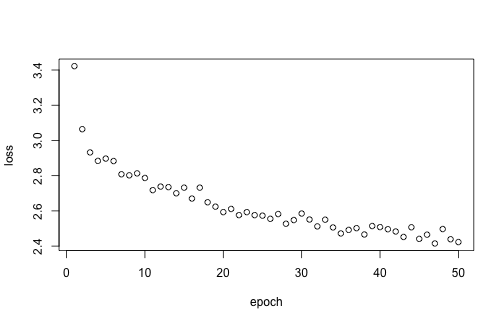

# Getting started

## About sjSDM

The sjSDM package provides R functions for estimating so-called joint species distribution models.

A jSDM is a GLMM that models a multivariate (i.e. a many-species) response to the environment, space and a covariance term that models conditional (on the other terms) correlations between the outputs (i.e. species). In other research domains, the covariance component is also known as the multivariate probit model.

![Figure 1: jSDM structure. jSDM uses a community matrix as response (rows = number of observations, columns = number of species) and tries to explain the occurrences in the community matrix as a function of environment and space. Moreover, compared to classical SDM, jSDM have an additional component, the biotic associations, that tries to account for unobservable species-species interactions. More precisely, the biotic association matrix is a variance-covariance matrix that accounts for co-occurrence patterns not explainable by environment and space.](jSDM-structure.png)

A big challenge in jSDM implementation is computational speed. The goal of the sjSDM (which stands for "scalable joint species distribution models") is to make jSDM computations fast and scalable. Unlike many other packages, which use a latent-variable approximation to make estimating jSDMs faster, sjSDM fits a full covariance matrix in the likelihood, which is, however, numerically approximated via simulations. The method is described in Pichler & Hartig (2021) A new joint species distribution model for faster and more accurate inference of species associations from big community data, <https://www.doi.org/10.1111/2041-210X.13687>.

The core code of sjSDM is implemented in Python / PyTorch, which is then wrapped into an R package. In principle, you can also use it stand-alone under Python (see instructions below). Note: for both the R and the python package, python \>= 3.9 and pytorch must be installed (more details below). However, for most users, it will be more convenient to use sjSDM via the sjSDM R package, which also provides a large number of downstream functionalities.

To get citation info for sjSDM when you use it for your reseach, type


``` r
citation("sjSDM")
#> To cite sjSDM in publications use:
#> 
#>   Pichler, M. and Hartig, F. (2021), A new joint species distribution model for faster and more accurate inference of species associations from big
#>   community data. Methods in Ecology and Evolution. Accepted Author Manuscript. https://doi.org/10.1111/2041-210X.13687
#> 
#> A BibTeX entry for LaTeX users is
#> 
#>   @Article{,
#>     title = {A new joint species distribution model for faster and more accurate inference of species associations from big community data},
#>     author = {Maximilian Pichler and Florian Hartig},
#>     journal = {Methods in Ecology and Evolution},
#>     year = {2021},
#>     doi = {10.1111/2041-210X.13687},
#>   }
```

## Installing the R package

sjSDM is distributed via [CRAN](https://cran.r-project.org/package=sjSDM). For most users, it will be best to install the package from CRAN


``` r
install.packages("sjSDM")
```

Depencies for the package can be installed before or after installing the package. Detailed explanations of the can be found below. Very briefly, the dependencies can be automatically installed from within R:


``` r
sjSDM::install_sjSDM(version = "gpu") # or
sjSDM::install_sjSDM(version = "cpu")
```

For advanced users: if you want to install the current (development) version from this repository, run


``` r
devtools::install_github("https://github.com/TheoreticalEcology/s-jSDM", subdir = "sjSDM", ref = "master")
```

dependencies should be installed as above. If the installation fails, check out the help of `?install_sjSDM`, ?installation_help, and `vignette("Dependencies", package = "sjSDM")`.

1.  Try `install_sjSDM()`
2.  New session, if no 'PyTorch not found' appears it should work, otherwise see `?installation_help`
3.  If do not get the pkg to run, create an issue [issue tracker](https://github.com/TheoreticalEcology/s-jSDM/issues) or write an email to maximilian.pichler at ur.de

# Working with sjSDM

We start with a dataset about eucalypt communities ([the dataset is from Pollock et a., 2014](https://doi.org/10.1111/2041-210x.12180))


``` r
library(sjSDM)
set.seed(42)
Env = eucalypts$env # environment
PA = eucalypts$PA # presence absence
Coords = eucalypts$lat_lon # coordinates
```

Prepare data:

-   scale numerical predictors/covariates


``` r
Env$Rockiness = scale(Env$Rockiness)
Env$PPTann = scale(Env$PPTann)
Env$cvTemp = scale(Env$cvTemp)
Env$T0 = scale(Env$T0)

Coords = scale(Coords)
```

## Fit a basic jSDM

The model is fit by the function `sjSDM()`. You have to provide all predictors and response as matrices or data frames. Here, we specify all three predictor components of an SDM:

1.  An environmental component, which essentially fits an SDM for each species. The "." tells the model to use all predictors that are not otherwise used
2.  A spatial model account for spatial autocorrelation and spatial trends/effects (trend surface model)
3.  The covariance component is automatically added. If you don't want this, you can set `biotic = bioticStruct(diag = TRUE)`, which would result in a standard MSDM.


``` r
model <- sjSDM(Y = PA, 
               env = linear(data = Env, formula = ~.), 
               spatial = linear(data = Coords, formula = ~0+latitude*longitude), 
               family=binomial("probit"),
               se = TRUE,
               verbose = FALSE)
#> Error in eval(expr, envir, enclos): Required version of NumPy not available: incompatible NumPy binary version 33554432 (expecting version 16777225)
```

The "linear" expression used in the environmental and spatial component means that you essentially fit a linear regression structure for the respective component. Alternatively, you could also fit a neural network (see later).

The option `se = TRUE` tells the model to calculate CIs and p-values. Note that these are approximated based on Wald CIs, which may have a certain amount of error for small data and if regularization is applied.

## Interpreting the estimated model coefficients

To get an overall summary of the model, type


``` r
summary(model)
#> Family:  binomial 
#> 
#> LogLik:  -242.1242 
#> Regularization loss:  0
#> Error in eval(expr, envir, enclos): Required version of NumPy not available: incompatible NumPy binary version 33554432 (expecting version 16777225)
```

This output will show you the fitted environmental, spatial and covariance parameters (provided that those components were specified). Implemented S3 functions for a model object include


``` r
coef(model)
residuals(model)
Rsquared(model, verbose = FALSE)
```

### Interpreting the environmental component

The environmental effects are displayed in the summary() table. To get a visual plot, you can use


``` r
plot(model)
```



### Interpreting the spatial component

The spatial effects are displayed in the `summary()` table. Currently, there are not additional options implemented to visualize the spatial effects

### Interpreting the species-species covariance (associations) component

The species-species associations are displayed in the `summary()` table. You can extract and visualize them as follows:


``` r
association = getCor(model)
#> Error in eval(expr, envir, enclos): Required version of NumPy not available: incompatible NumPy binary version 33554432 (expecting version 16777225)
```

``` r
sp = x = 1:ncol(PA)
fields::image.plot(association)
```


Note that these associations are to be interpreted as correlations in species presence or abundance after accounting for environmental and spatial effects.

## ANOVA and variation partitioning

ANOVA or variation partitioning means that we want to calculate how much variation (=signal) is explained by the different model components.

{width="70%"}

The sjSDM package includes several functions for this purpose.

### Global ANOVA

The first option is a global ANOVA, which will calculate the amount of variation explained by the three components (environment, associations, and space):


``` r
an = anova(model, verbose = FALSE)
#> Error in eval(expr, envir, enclos): Required version of NumPy not available: incompatible NumPy binary version 33554432 (expecting version 16777225)
```

The resulting object is of class sjSDManova, and you can use the standard summary and plot function on this object:


``` r
plot(an)
```


``` r
summary(an)
#> Analysis of Deviance Table
#> 
#>                                        Deviance Residual deviance R2 Nagelkerke R2 McFadden
#> Abiotic                               673.26304        3002.96075       0.77008      0.1654
#> Associations                          169.13782        3507.08597       0.30878      0.0416
#> Spatial                               150.96228        3525.26151       0.28080      0.0371
#> Shared Abiotic+Associations           142.48582        3533.73797       0.26736      0.0350
#> Shared Abiotic+Spatial               1531.78234        2144.44145       0.96472      0.3763
#> Shared Spatial+Associations            11.24359        3664.98020       0.02425      0.0028
#> Shared Abiotic+Associations+Spatial -1361.34035        5037.56415     -18.53795     -0.3345
#> Full                                 1317.53455        2358.68924       0.94368      0.3237
```

We see that the environmental component explains the most variance in the data, followed by the biotic association component. As in any ANOVA, there are unique and shared fractions for each component. The shared fractions depict variation that can be explained from either of the components (e.g. due to collinearity).

Different ANOVA strategies deal differently with these shared fractions. For example, in type II/III ANOVA, the shared fractions are usually discarded. The default here is to display all fractions. Alternatively (more on this see `?summary.sjSDManova`):

-   `summary(an, fractions = "discard")` discards shared fractions, as in a type II/III ANOVA
-   `summary(an, fractions = "proportional")` distributes shared fractions to the unique fractions proportional to the unique fractions
-   `summary(an, fractions = "equal")` distributes shared fractions evenly to the unique fractions

Note that in VP, some fractions can get negative. For more discussion on this and how to interpret it see [here](https://besjournals.onlinelibrary.wiley.com/doi/10.1111/2041-210X.13800) and [here](https://r.qcbs.ca/workshop10/book-en/index.html).

### Calculating the internal metacommunity structure

An interesting feature of jSDMs is that we can further partition the global VP discussed just before to sites and species. This idea was first presented in

Leibold, M. A., Rudolph, F. J., Blanchet, F. G., De Meester, L., Gravel, D., Hartig, F., \... & Chase, J. M. (2022). The internal structure of metacommunities. *Oikos*, *2022*(1).

We have implemented this feature call the calculation for this "internal metacommunity structure" via


``` r
results = internalStructure(an)
```

The resulting object contains R2 values for each of the three components (Env, Space, Associations) for each species and site. Note the comments in `?internalStructure`, especially about how to deal with negative values.

The results can be plotted via


``` r
plot(results)
```


The ternary plots report the relative importance of the components for sites and species. Leaning to one of the corners means that this corner is mot important (e.g. here Species and Sites lean more to the environmental corner).

### Testing for predictors of the assembly processes

A attractive feature of the internal metacommunity structure calculations is that we can now regress the partial R^2^ of sites and species against predictors, to see how the strength of the three assembly components (Environment, Space, Associations) changes with these predictors.

The default plot will plot the assembly processes per plot against environmental and spatial distinctiveness, and richness:


``` r
plotAssemblyEffects(results)
```

<div class="figure" style="text-align: center">

<p class="caption">Environmental filtering increases for more distinct (extreme) environmental sites (first figure). Moreover, environmental filtering is less important for sites with high species richness (third figure).</p>
</div>

However, you can use your own predictors, and also switch between looking at sites or species as a response. For more on this, see `?plotAssemblyEffects`.

## Predictions

To predict with an sjSDM object, use


``` r
pred = predict(model, newdata = Env, SP = Coords)
#> Error in eval(expr, envir, enclos): Required version of NumPy not available: incompatible NumPy binary version 33554432 (expecting version 16777225)
```

The standard predictions are marginal, i.e. assume that we have no information about what species exist on a site we predict to.

As jSDMs fit correlations between species, predictions of jSDM improve if we can provide information for some of the species on a new site. This is known as a conditional prediction. As an example, let's assume that the first 6 species in this data are unknown, whereas the P/A of the rest is known to us.


``` r
New_PA = PA
New_PA[, 1:6] = NA
head(New_PA)
#>      ALA ARE BAX CAM GON MEL OBL OVA WIL ALP VIM ARO.SAB
#> [1,]  NA  NA  NA  NA  NA  NA   0   0   1   1   0       0
#> [2,]  NA  NA  NA  NA  NA  NA   1   0   1   1   0       0
#> [3,]  NA  NA  NA  NA  NA  NA   0   0   1   1   0       0
#> [4,]  NA  NA  NA  NA  NA  NA   0   0   1   0   0       0
#> [5,]  NA  NA  NA  NA  NA  NA   1   0   0   0   0       0
#> [6,]  NA  NA  NA  NA  NA  NA   0   0   1   1   0       0
```

We can then predict occurrences for the first 6 species, conditioning on the rest of the species (7:12):


``` r
pred = predict(model, newdata = Env, SP = Coords, Y = New_PA)
#> Error in eval(expr, envir, enclos): Required version of NumPy not available: incompatible NumPy binary version 33554432 (expecting version 16777225)
```

``` r
head(pred)
#>            [,1]         [,2]      [,3]         [,4]         [,5]         [,6]
#> [1,] 0.06919945 0.0009476454 0.1910016 0.0018830881 0.0128013078 0.0024387540
#> [2,] 0.11315208 0.0009214621 0.1472399 0.0002079794 0.0072220865 0.0003615931
#> [3,] 0.04488569 0.0006793896 0.2183437 0.0011189727 0.0177170230 0.0009391013
#> [4,] 0.03075938 0.0009504823 0.6358477 0.0013088832 0.0062728245 0.0042722428
#> [5,] 0.03657349 0.0002785174 0.7242049 0.0016383200 0.0003361727 0.0132508982
#> [6,] 0.06529714 0.0008642071 0.2183885 0.0005441471 0.0231352945 0.0005368480
```

Note that the predict function returns only predictions for species with NA in Y

# Advanced topics

## Fitting other distributions (e.g. species frequencies)

sjSDM supports other responses than presence-absence data: Simulate non-presence-absence data:


``` r
com = simulate_SDM(env = 3L, species = 5L, sites = 100L,
                   link = "identical", response = "count", verbose = FALSE) 
#> Error in simulate_SDM(env = 3L, species = 5L, sites = 100L, link = "identical", : unused argument (verbose = FALSE)
```

``` r
X = com$env_weights
Y = com$response
```

### Poisson


``` r
model = sjSDM(Y, env = linear(X, ~.), se = TRUE, 
              iter = 50L, family = poisson("log"), verbose = FALSE)
#> Error in eval(expr, envir, enclos): Required version of NumPy not available: incompatible NumPy binary version 33554432 (expecting version 16777225)
```

``` r
summary(model)
#> Family:  binomial 
#> 
#> LogLik:  -242.1242 
#> Regularization loss:  0
#> Error in eval(expr, envir, enclos): Required version of NumPy not available: incompatible NumPy binary version 33554432 (expecting version 16777225)
```

### Negative Binomial


``` r
model = sjSDM(Y, env = linear(X, ~.), se = TRUE, iter = 50L, family = "nbinom", verbose = FALSE)
#> Error in eval(expr, envir, enclos): Required version of NumPy not available: incompatible NumPy binary version 33554432 (expecting version 16777225)
```

``` r
summary(model)
#> Family:  binomial 
#> 
#> LogLik:  -242.1242 
#> Regularization loss:  0
#> Error in eval(expr, envir, enclos): Required version of NumPy not available: incompatible NumPy binary version 33554432 (expecting version 16777225)
```

### Normal (gaussian)


``` r
model = sjSDM(log(Y+0.01), env = linear(X, ~.), se = TRUE, 
              iter = 50L, family = gaussian("identity"), verbose = FALSE)
#> Error in eval(expr, envir, enclos): Required version of NumPy not available: incompatible NumPy binary version 33554432 (expecting version 16777225)
```

``` r
summary(model)
#> Family:  binomial 
#> 
#> LogLik:  -242.1242 
#> Regularization loss:  0
#> Error in eval(expr, envir, enclos): Required version of NumPy not available: incompatible NumPy binary version 33554432 (expecting version 16777225)
```

## Modifying the spatial component

jSDMs account for correlation between species within communities (sites), in real datasets, however, communities (sites) are often also correlated (== spatial autocorrelation). Usually conditional autoregressive (CAR) models are used to account for the spatial autocorrelation in the residuals, which we, however, do not support yet. A similar approach is to condition the model on space, which we can do by using space as predictors.

Let's first simulate test data:

1)  Simulate jSDM without a link (normal response)


``` r

com = simulate_SDM(env = 3L, species = 5L, sites = 100L, 
                   link = "identical", response = "identical")
X = com$env_weights
Y = com$response
```

2)  add spatial residuals (create coordinates and use spatial distance matrix to draw autocorrelated residuals for each species)


``` r
XYcoords = matrix(rnorm(200), 100, 2)+2
WW = as.matrix(dist(XYcoords))
spatialResiduals = mvtnorm::rmvnorm( 5L, sigma = exp(-WW))
```

3)  Finish test data


``` r
Ysp = Y + t(spatialResiduals)
Y = ifelse(Ysp < 0, 0, 1) # multivariate probit model
```

There are three options to condition our model on space:

### Using Moran's eigenvector map predictors


``` r
SPeigen = generateSpatialEV(XYcoords)

model = sjSDM(Y, env = linear(X, ~.), 
              spatial = linear(SPeigen, ~0+.), iter = 100L, verbose=FALSE)
#> Error in eval(expr, envir, enclos): Required version of NumPy not available: incompatible NumPy binary version 33554432 (expecting version 16777225)
```

``` r
summary(model)
#> Family:  binomial 
#> 
#> LogLik:  -242.1242 
#> Regularization loss:  0
#> Error in eval(expr, envir, enclos): Required version of NumPy not available: incompatible NumPy binary version 33554432 (expecting version 16777225)
```

### Trend surface model - linear

The idea of the trend surface model is to use the spatial coordinates within a polynom:


``` r
colnames(XYcoords) = c("XX", "YY")
model = sjSDM(Y, 
              env = linear(X, ~.), 
              spatial = linear(XYcoords, ~0+XX+YY+XX:YY+I(XX^2)+I(YY^2)), 
              iter = 100L, verbose = FALSE)
summary(model)
```

### Trend surface model - DNN

Sometimes a linear model and a polynom is not flexible enough to account for space. We can use a "simple" DNN for space to condition our linear environmental model on the space:


``` r
colnames(XYcoords) = c("XX", "YY")
model = sjSDM(Y, 
              env = linear(X, ~.), 
              spatial = DNN(XYcoords, ~0+.), 
              iter = 100L, verbose = FALSE)
#> Error in eval(expr, envir, enclos): Required version of NumPy not available: incompatible NumPy binary version 33554432 (expecting version 16777225)
```

``` r
summary(model)
#> Family:  binomial 
#> 
#> LogLik:  -242.1242 
#> Regularization loss:  0
#> Error in eval(expr, envir, enclos): Required version of NumPy not available: incompatible NumPy binary version 33554432 (expecting version 16777225)
```

## Adjusting regularization parameters

### Regularization on abiotic coefficients

sjSDM supports l1 (lasso) and l2 (ridge) regularization: \* alpha is the weighting between lasso and ridge \* alpha = 0.0 corresponds to pure lasso \* alpha = 1.0 corresponds to pure ridge


``` r
model = sjSDM(Y = com$response, 
              env = linear(data = com$env_weights, 
                           formula = ~0+ I(X1^2),
                           lambda = 0.5), 
              iter = 50L, verbose = FALSE)
#> Error in eval(expr, envir, enclos): Required version of NumPy not available: incompatible NumPy binary version 33554432 (expecting version 16777225)
```

``` r
summary(model)
#> Family:  binomial 
#> 
#> LogLik:  -242.1242 
#> Regularization loss:  0
#> Error in eval(expr, envir, enclos): Required version of NumPy not available: incompatible NumPy binary version 33554432 (expecting version 16777225)
```

### Regularization on species-species associations

We can do the same for the species associations:


``` r
model = sjSDM(Y = com$response, 
              env = linear(data = com$env_weights, 
                           formula = ~0+ I(X1^2),
                           lambda = 0.5),
              biotic = bioticStruct(lambda =0.1),
              iter = 50L, verbose = FALSE)
#> Error in eval(expr, envir, enclos): Required version of NumPy not available: incompatible NumPy binary version 33554432 (expecting version 16777225)
```

``` r
summary(model)
#> Family:  binomial 
#> 
#> LogLik:  -242.1242 
#> Regularization loss:  0
#> Error in eval(expr, envir, enclos): Required version of NumPy not available: incompatible NumPy binary version 33554432 (expecting version 16777225)
```

### Regularization on the spatial model:


``` r

model = sjSDM(Y, 
              env = linear(X, ~X1+X2), 
              spatial = linear(XYcoords, ~0+XX:YY, lambda = 0.4), verbose = FALSE)
#> Error in eval(expr, envir, enclos): Required version of NumPy not available: incompatible NumPy binary version 33554432 (expecting version 16777225)
```

``` r
summary(model)
#> Family:  binomial 
#> 
#> LogLik:  -242.1242 
#> Regularization loss:  0
#> Error in eval(expr, envir, enclos): Required version of NumPy not available: incompatible NumPy binary version 33554432 (expecting version 16777225)
```

## Using deep neural networks


``` r
com = simulate_SDM(env = 3L, species = 5L, sites = 100L)
X = com$env_weights
Y = com$response

# three fully connected layers with relu as activation function
model = sjSDM(Y = Y, 
              env = DNN(data = X, 
                        formula = ~., 
                        hidden = c(10L, 10L, 10L), 
                        activation = "relu"), 
              iter = 50L, se = TRUE, verbose = FALSE)
#> Error in eval(expr, envir, enclos): Required version of NumPy not available: incompatible NumPy binary version 33554432 (expecting version 16777225)
```

``` r
summary(model)
#> Family:  binomial 
#> 
#> LogLik:  -242.1242 
#> Regularization loss:  0
#> Error in eval(expr, envir, enclos): Required version of NumPy not available: incompatible NumPy binary version 33554432 (expecting version 16777225)
```

The methods for sjSDM() work also for the non-linear model:


``` r
association = getCor(model) # species association matrix
pred = predict(model) # predict on fitted data
pred = predict(model, newdata = X) # predict on new data
```

Extract and set weights of model:


``` r
weights = getWeights(model) # get layer weights and sigma
setWeights(model, weights)
```

Plot the training history:


``` r
plot(model)
```

# Installation problems

The `sjSDM::install_sjSDM()` function can install automatically all necessary 'python' dependencies but it can fail sometimes because of individual system settings or if other 'python'/'conda' installations get into the way.

## PyTorch Installation - Before you start:

A few notes before you start with the installation (skip this point if you do not know conda):

-   existing 'conda' installations: make sure you have the latest 'conda' or 'miniconda' version and remove unnecessary 'conda' installations.
-   existing 'conda' or 'virtualenv' environments (skip this point if you do not know 'conda'): we currently enforce the usage of a specific environment called 'r-sjsdm',so if you want use a custom environment it should be named 'r-sjsdm'

## Windows - automatic installation:

Sometimes the automatic 'miniconda' installation (via `sjSDM::install_sjSDM()` ).doesn't work because of white spaces in the user's name. But you can easily download and install 'conda' on your own:

Download and install the latest ['conda' version](https://www.anaconda.com/download/)

Afterwards run:


``` r
install_sjSDM(version = c("gpu")) # or "cpu" if you do not have a proper gpu device
```

Reload the package and run the example, if this doesn't work:

-   Restart RStudio
-   Install manually pytorch, see the following section

## Windows - manual installation:

Download and install the latest ['conda' version](https://www.anaconda.com/download/)

Open the command window (cmd.exe - hit windows key + r and write cmd)

Run in cmd.exe:


``` bash
conda create --name r-sjsdm python=3.10
conda activate r-sjsdm
conda install pytorch torchvision torchaudio cpuonly -c pytorch # cpu
conda install pytorch torchvision torchaudio pytorch-cuda=12.1 -c pytorch -c nvidia #gpu
python -m pip install pyro-ppl torch_optimizer madgrad
```

Restart R, try the example, and if it does not work:

-   Restart RStudio
-   See the 'Help and bugs' section

## Linux - automatic installation:

Run in R:


``` r
install_sjSDM(version = c("gpu")) # or "cpu" if you do not have a proper gpu device
```

Restart R try to run the example, if this doesn't work:

-   Restart RStudio
-   Install manually 'PyTorch', see the following section

## Linux - manual installation:

We strongly advise to use a 'conda' environment but a virtual environment should also work. The only requirement is that it is named 'r-sjsdm'

Download and install the latest ['conda' version](https://www.anaconda.com/download/)

Open your terminal and run:


``` bash
conda create --name r-sjsdm python=3.10
conda activate r-sjsdm
conda install pytorch torchvision torchaudio cpuonly -c pytorch # cpu
conda install pytorch torchvision torchaudio pytorch-cuda=12.1 -c pytorch -c nvidia #gpu
python -m pip install pyro-ppl torch_optimizer madgrad
```

Restart R try to run the example, if this doesn't work:

-   Restart RStudio
-   See the 'Help and bugs' section

## MacOS - automatic installation:

Run in R:


``` r
install_sjSDM()
```

Restart R try to run the example, if this doesn't work:

-   Restart RStudio
-   Install manually 'PyTorch', see the following section

## MacOS - manual installation:

We strongly advise to use a 'conda' environment but a virtual environment should also work. The only requirement is that it is named 'r-sjsdm'

Download and install the latest conda [conda version](https://www.anaconda.com/download/)

Open your terminal and run:


``` bash
conda create --name r-sjsdm python=3.10
conda activate r-sjsdm
conda install pytorch::pytorch torchvision torchaudio -c pytorch
python -m pip install pyro-ppl torch_optimizer madgrad
```

Restart R, try the example, if it does not work:

-   Restart RStudio
-   See the 'Help and bugs' section

## Help and bugs

-   ask for help via the [issue tracker](https://github.com/TheoreticalEcology/s-jSDM/issues). Please post the output of `sjSDM::install_diagnostic()`as a quote.
-   report bugs with a [reproducible example](https://stackoverflow.com/questions/5963269/how-to-make-a-great-r-reproducible-emple) via the [issue tracker](https://github.com/TheoreticalEcology/s-jSDM/issues)
