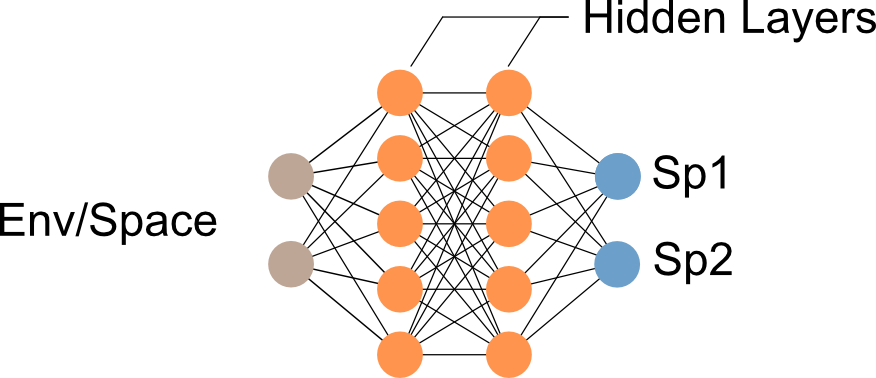
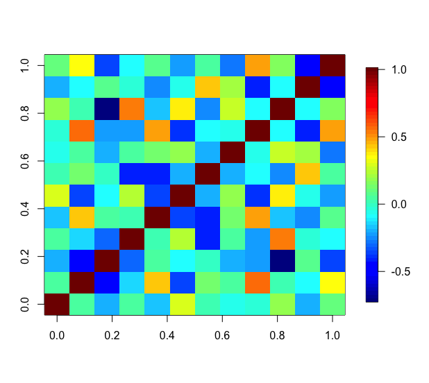
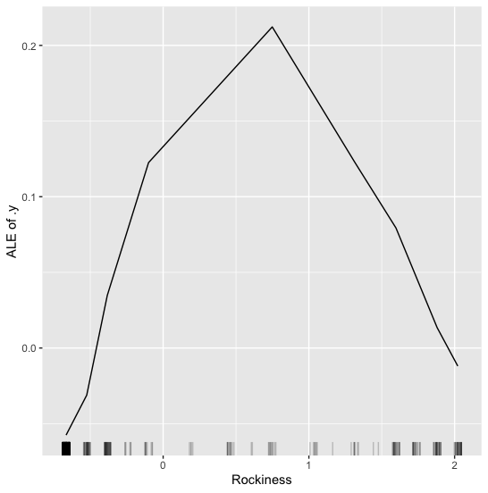

```{r, echo = F, message = F}
set.seed(123)
```

```{r global_options, include=FALSE}
knitr::opts_chunk$set(fig.width=7, fig.height=4.5, fig.align='center', warning=FALSE, message=FALSE, cache = FALSE)
```

```{r, include = FALSE}
knitr::opts_chunk$set(
  collapse = TRUE,
  comment = ""
)
```

## Connection between JSDM and MSDM

JSDMs are essentially MSDMs, but with the addition of the co-occurrence component. The basic idea of JSDMs is to connect individual GLMs, e.g. by a multivariate distributed error. The idea of MSDMs, actually a more modern view of MSDMs, is that a model should directly predict all species, which we can achieve for example by using a deep neural network:

{width="70%"}

Environment (and Space) are used to model several species simultaneously. sjSDM can be used to fit such a model:

## MSDM-DNN

We will use the eucalypts dataset:

```{r,eval=FALSE}
library(sjSDM)
Env = eucalypts$env
PA = eucalypts$PA
head(PA)
```

```{r,  eval = TRUE,echo = FALSE, results = TRUE}
cat("
     ALA ARE BAX CAM GON MEL OBL OVA WIL ALP VIM ARO.SAB
[1,]   0   0   0   0   0   0   0   0   1   1   0       0
[2,]   0   0   0   0   0   0   1   0   1   1   0       0
[3,]   0   0   1   0   0   0   0   0   1   1   0       0
[4,]   0   0   1   0   0   0   0   0   1   0   0       0
[5,]   0   0   1   0   0   0   1   0   0   0   0       0
[6,]   0   0   0   0   0   0   0   0   1   1   0       0"
)
```

We can switch to Deep Neural Network (DNN) in sjSDM by specifying a `DNN(...)` object instead of the `linear(...)` (default) object:

-   The architecture of the DNN (number of layers, nodes in each layer) is defined by a vector (`hidden = c(...)`

-   To turn off the jSDM (the co-occurrence component), we have to set `biotic=bioticStruct(diag=TRUE)`

```{r, eval=FALSE}
dnn = sjSDM(Y = PA, 
            env = DNN(scale(Env), hidden = c(20L, 20L)),
            biotic = bioticStruct(diag = TRUE))
```

```{r,  eval = TRUE,echo = FALSE, results = TRUE}
cat("Iter: 100/100 100%|██████████| [00:03, 27.17it/s, loss=2.642]"
)
```

The `summary(...)` method prints the architecture of the model:

```{r, eval=FALSE}
summary(dnn)
```

```{r,  eval = TRUE,echo = FALSE, results = TRUE}
cat("
Family:  binomial 

LogLik:  -1166.957 
Regularization loss:  0 

Species-species correlation matrix: 

	sp1	1.0000											
	sp2	0.0000	1.0000										
	sp3	0.0000	0.0000	1.0000									
	sp4	0.0000	0.0000	0.0000	1.0000								
	sp5	0.0000	0.0000	0.0000	0.0000	1.0000							
	sp6	0.0000	0.0000	0.0000	0.0000	0.0000	1.0000						
	sp7	0.0000	0.0000	0.0000	0.0000	0.0000	0.0000	1.0000					
	sp8	0.0000	0.0000	0.0000	0.0000	0.0000	0.0000	0.0000	1.0000				
	sp9	0.0000	0.0000	0.0000	0.0000	0.0000	0.0000	0.0000	0.0000	1.0000			
	sp10	0.0000	0.0000	0.0000	0.0000	0.0000	0.0000	0.0000	0.0000	0.0000	1.0000		
	sp11	0.0000	0.0000	0.0000	0.0000	0.0000	0.0000	0.0000	0.0000	0.0000	0.0000	1.0000	
	sp12	0.0000	0.0000	0.0000	0.0000	0.0000	0.0000	0.0000	0.0000	0.0000	0.0000	0.0000	1.0000


Env architecture:
===================================
Layer_1:	 (8, 20)
Layer_2:	 SELU
Layer_3:	 (20, 20)
Layer_4:	 SELU
Layer_5:	 (20, 12)
===================================
Weights :	 800
    "
)

```

Summary:

-   The `DNN(...)` objects support common techniques from Deep Learning such as different activation functions, regularization, and dropout (see `?DNN` )

-   The estimated MSDM-DNN can be used in the same manner as a normal JSDM, for example for predictions via `predict(dnn, newdata = ...)`

We can turn the MSDM-DNN into a JSDM-DNN (or joint-MSDM-DNN) by turning on the co-occurrence component:

## jSDM-DNN

Set the `diag` argument in the `bioticStruct` object to `FALSE` (default):

```{r,eval=FALSE}
jsdm_dnn = sjSDM(Y = PA, 
                 env = DNN(scale(Env), hidden = c(20L, 20L)),
                 biotic = bioticStruct(diag = FALSE))
```

```{r,  eval = TRUE,echo = FALSE, results = TRUE}
cat("Iter: 100/100 100%|██████████| [00:03, 30.99it/s, loss=2.427]"
)
```

Let's check the summary again:

```{r, eval=FALSE}
summary(jsdm_dnn)
```

```{r,  eval = TRUE,echo = FALSE, results = TRUE}
cat("
Family:  binomial 

LogLik:  -1054 
Regularization loss:  0 

Species-species correlation matrix: 

	sp1	 1.0000											
	sp2	 0.0350	 1.0000										
	sp3	-0.1860	-0.4460	 1.0000									
	sp4	 0.0380	-0.1490	-0.3020	 1.0000								
	sp5	-0.1810	 0.4300	 0.0350	 0.0170	 1.0000							
	sp6	 0.2800	-0.3680	-0.0970	 0.2440	-0.3590	 1.0000						
	sp7	 0.0100	 0.1290	-0.0150	-0.4170	-0.4230	-0.1960	 1.0000					
	sp8	-0.0710	 0.0450	-0.1920	 0.0550	 0.1390	 0.1830	-0.2070	 1.0000				
	sp9	-0.0340	 0.5570	-0.2120	-0.2140	 0.4900	-0.3970	-0.0960	-0.0650	 1.0000			
	sp10	 0.1860	 0.0300	-0.7140	 0.5500	-0.1740	 0.3830	-0.2520	 0.2700	-0.0840	 1.0000		
	sp11	-0.2000	-0.1000	 0.0770	-0.0260	-0.2420	-0.0480	 0.4150	 0.2080	-0.4050	-0.0890	 1.0000	
	sp12	 0.1090	 0.3410	-0.3650	-0.0880	 0.0620	-0.2120	 0.0530	-0.2730	 0.4820	 0.1550	-0.4670	 1.0000


Env architecture:
===================================
Layer_1:	 (8, 20)
Layer_2:	 SELU
Layer_3:	 (20, 20)
Layer_4:	 SELU
Layer_5:	 (20, 12)
===================================
Weights :	 800    
    "
)
```

We see now that the co-occurrence matrix was estimated. Let's visualize the matrix:

```{r, eval=FALSE}
association = getCor(jsdm_dnn)
fields::image.plot(association)
```

{width="70%"}

## Interpreting JSDM/MSDM-DNN

A major challenge with DNN is that they are not interpretable anymore, i.e. we don't get effect estimates that connect the occurrence of a species to the environmental (and spatial) covariates. But luckily, the field of ML and DL came up with the idea of explainable AI. To sum it up, the idea is to permute the input and quantify how the output changes, if the change is small the "effect" of a variable is small, if the permutation leads to a large change in the output, the variable has a large "effect" on the response.

Packages such as `iml` have a generic interface for many different xAI methods and we can plugin sjSDM into these xAI frameworks:

The only difference to other ML/DL models is that we have to do it for each species individually. We have to first write a wrapper for our predict function so that only the values for the first species are returned:

```{r, eval=FALSE}
predict_wrapper = function(model, newdata) predict(model, newdata = newdata)[,1]

library(iml)
predictor = 
  Predictor$new(jsdm_dnn, 
                data = as.data.frame(scale(Env)),
                y = PA[,1],# First species
                predict.function = predict_wrapper
                ) # First species
```

Let's visualize the effect of the first environmental covariate (Rockiness) on the occurrence probability using the accumulated local effect plots:

```{r, eval = FALSE}
plot(FeatureEffect$new(predictor, feature = "Rockiness"))
```

{width="60%"}

We see here the niche of Rockiness for the first species.
